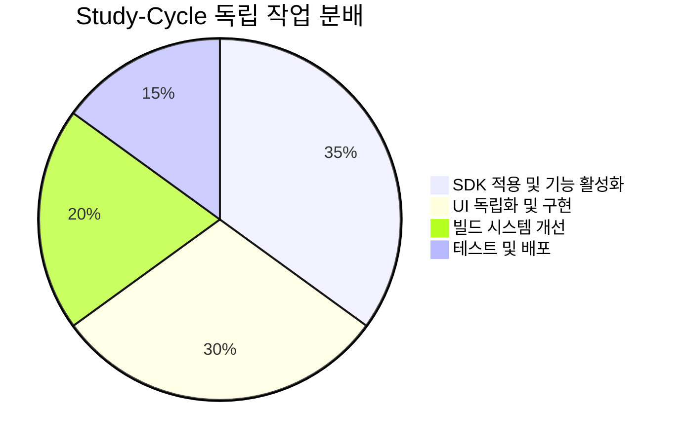
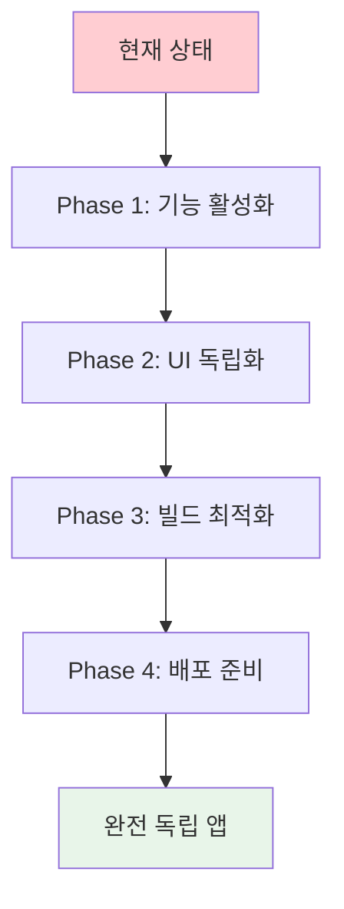
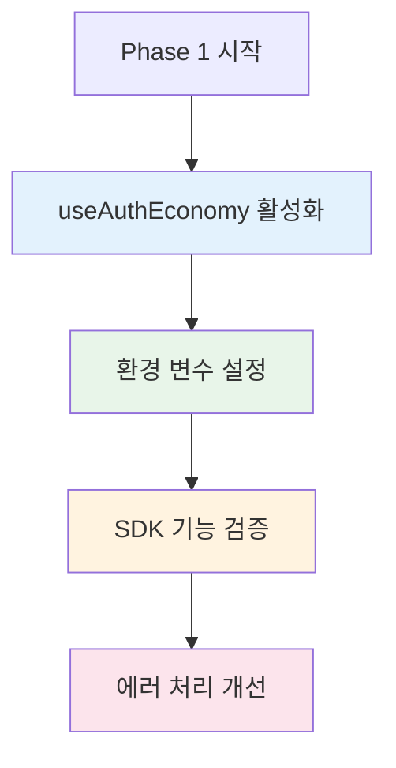
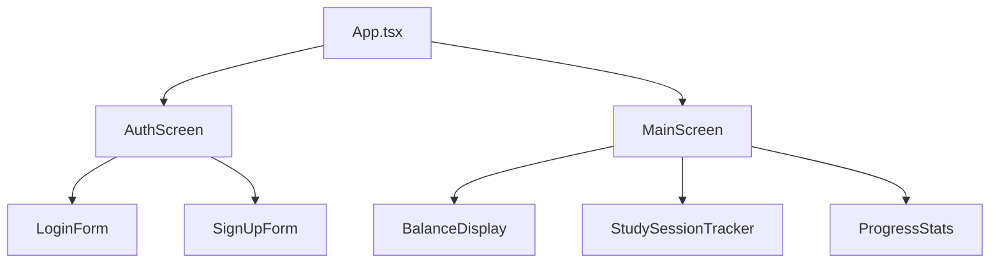
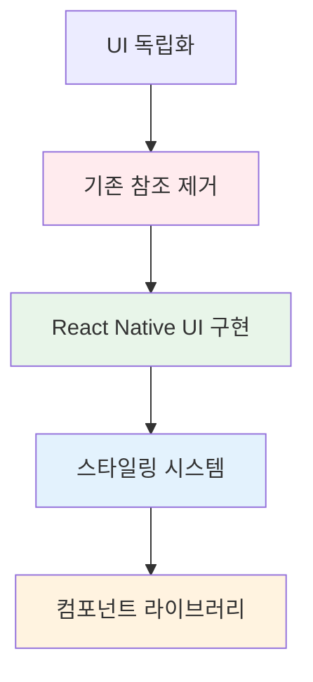
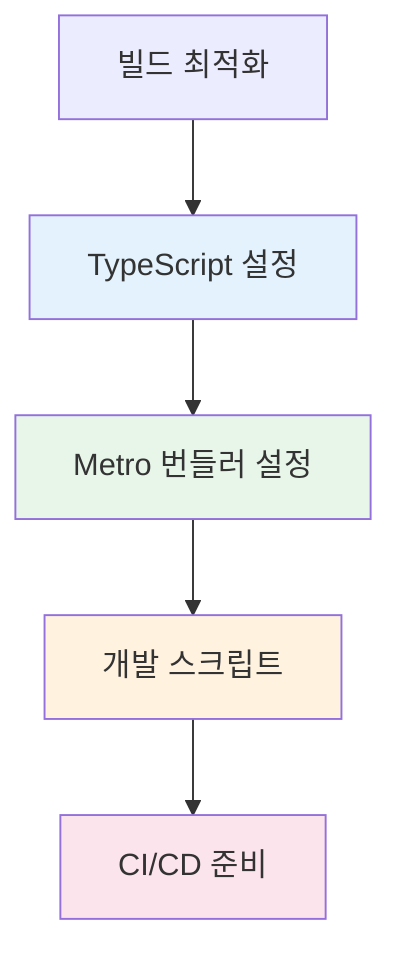
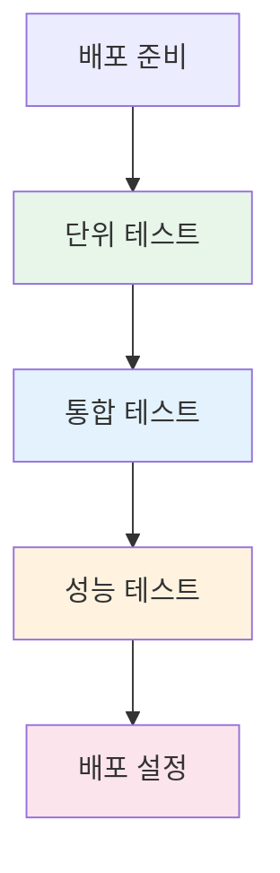
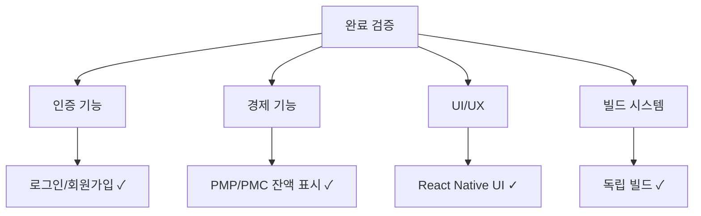
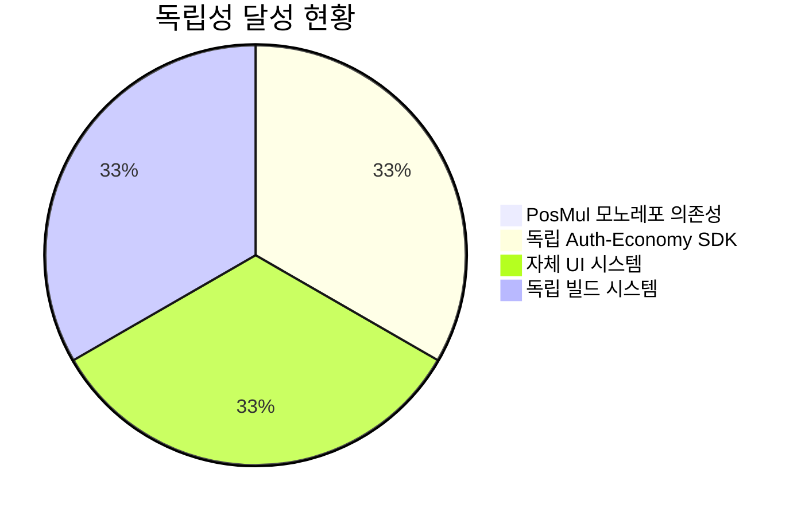
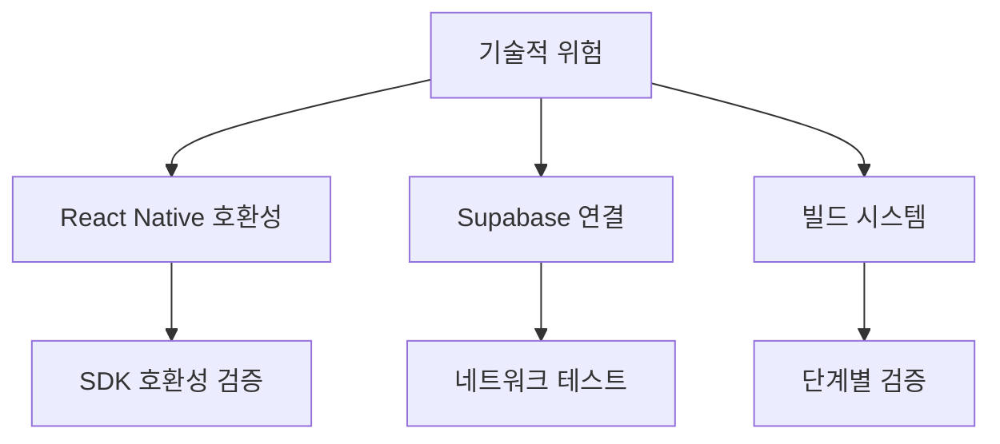

# Study-Cycle 완전 독립 앱 전환 Task List

**작성일**: 2025-07-07  
**목표**: Study-Cycle을 PosMul 모노레포에서 완전히 독립된 React Native 앱으로 전환  
**예상 기간**: 5-7일

---

## 📊 **전체 작업 개요**



### 🎯 **독립 전환 목표**



---

## 🔥 **Phase 1: Auth-Economy SDK 기능 완전 활성화** (2일)

### 📊 **작업 우선순위**



### ✅ **Task 1.1: useAuthEconomy 훅 완전 활성화** (1일) - ✅ **완료**

#### 📋 체크리스트
- [x] `src/App.tsx`에서 useAuthEconomy 주석 해제
- [x] 환경 변수를 통한 Supabase 설정 구현
- [x] React Native 환경에 맞는 로컬 스토리지 설정
- [x] 인증 상태 UI 구현

#### 🔧 **구현 내용**

**1.1.1 환경 변수 설정**
```typescript
// src/config/environment.ts
import { Platform } from 'react-native';

export const Environment = {
  SUPABASE_URL: __DEV__ 
    ? 'https://your-dev-project.supabase.co'
    : 'https://your-prod-project.supabase.co',
  SUPABASE_ANON_KEY: __DEV__
    ? 'your-dev-anon-key'
    : 'your-prod-anon-key',
  IS_DEVELOPMENT: __DEV__,
  PLATFORM: Platform.OS,
};
```

**1.1.2 useAuthEconomy 설정 업데이트**
```typescript
// src/shared/useAuthEconomy.ts 수정
import { Environment } from '../config/environment';

const client = createAuthEconomyClient({
  supabaseUrl: Environment.SUPABASE_URL,
  supabaseAnonKey: Environment.SUPABASE_ANON_KEY,
  enableEconomy: true,
  debug: Environment.IS_DEVELOPMENT,
});
```

### ✅ **Task 1.2: 인증 및 경제 기능 UI 구현** (1일) - ✅ **완료**

#### 📋 체크리스트
- [x] 로그인/회원가입 화면 구현
- [x] 경제 잔액 표시 컴포넌트
- [x] 학습 세션 완료 UI
- [x] 에러 상태 처리 UI

#### 🎨 **UI 컴포넌트 구조**



---

## 🎨 **Phase 2: UI 완전 독립화** (2일)

### 📊 **UI 독립화 전략**



### ✅ **Task 2.1: Shared UI 의존성 완전 제거** (반나절) - ✅ **완료**

#### 📋 체크리스트
- [x] 모든 `@posmul/shared-ui` 주석 참조 제거
- [x] 기존 주석 처리된 import 문 삭제
- [x] React Native 전용 컴포넌트로 교체 계획 수립

#### 🔧 **정리 작업**

```powershell
# 기존 shared-ui 참조 완전 삭제
Get-ChildItem -Recurse "c:\G\posmul\apps\study-cycle\src" -Name "*.tsx" | 
ForEach-Object {
    $content = Get-Content $_.FullName
    $filtered = $content | Where-Object { $_ -notmatch "@posmul/shared-ui" }
    $filtered | Set-Content $_.FullName
}
```

### ✅ **Task 2.2: React Native UI 컴포넌트 라이브러리 구축** (1.5일) - ✅ **완료**

#### 📋 **컴포넌트 구조 생성**

```powershell
# UI 컴포넌트 디렉토리 구조 생성 - ✅ 완료
mkdir "c:\G\posmul\apps\study-cycle\src\components\ui"
mkdir "c:\G\posmul\apps\study-cycle\src\components\forms"
mkdir "c:\G\posmul\apps\study-cycle\src\components\screens"
mkdir "c:\G\posmul\apps\study-cycle\src\components\feedback"
mkdir "c:\G\posmul\apps\study-cycle\src\styles"
```

#### 🎨 **기본 UI 컴포넌트 구현**

**2.2.1 기본 UI 컴포넌트**
- [x] Button 컴포넌트 (React Native 스타일)
- [x] Card 컴포넌트
- [x] Input 컴포넌트  
- [x] LoadingSpinner 컴포넌트

**2.2.2 폼 컴포넌트**
- [ ] LoginForm
- [ ] SignUpForm
- [ ] StudySessionForm

**2.2.3 피드백 컴포넌트**
- [ ] ErrorDisplay
- [ ] SuccessMessage
- [ ] LoadingOverlay

#### 📱 **React Native 스타일 시스템** - ✅ **완료**

```typescript
// src/styles/theme.ts - ✅ 구현 완료
export const Theme = {
  colors: {
    primary: '#007AFF',
    secondary: '#5856D6',
    success: '#34C759',
    warning: '#FF9500',
    error: '#FF3B30',
    text: '#000000',
    textSecondary: '#8E8E93',
    background: '#FFFFFF',
    surface: '#F2F2F7',
  },
  spacing: {
    xs: 4,
    sm: 8,
    md: 16,
    lg: 24,
    xl: 32,
  },
  typography: {
    title: {
      fontSize: 24,
      fontWeight: 'bold',
    },
    body: {
      fontSize: 16,
      fontWeight: 'normal',
    },
    caption: {
      fontSize: 12,
      fontWeight: 'normal',
    },
  },
};
```

---

## 🏗️ **Phase 3: 빌드 및 개발 환경 최적화** (1일)

### 📊 **빌드 시스템 개선**



### ✅ **Task 3.1: TypeScript 빌드 복구** (반나절) - ✅ **완료**

#### 📋 체크리스트
- [x] React 타입 호환성 문제 해결
- [x] TypeScript 설정 최적화
- [x] 빌드 스크립트 정상화

#### 🔧 **TypeScript 설정 개선**

```json
// tsconfig.json 최적화
{
  "extends": "@react-native/typescript-config/tsconfig.json",
  "compilerOptions": {
    "strict": true,
    "noImplicitAny": true,
    "skipLibCheck": true,
    "resolveJsonModule": true,
    "allowSyntheticDefaultImports": true,
    "esModuleInterop": true,
    "jsx": "react-native",
    "module": "ESNext",
    "moduleResolution": "node",
    "target": "ESNext"
  },
  "include": [
    "src/**/*",
    "index.js"
  ],
  "exclude": [
    "node_modules",
    "android",
    "ios"
  ]
}
```

### ✅ **Task 3.2: 개발 스크립트 및 도구 설정** (반나절) - ✅ **완료**

#### 📋 체크리스트
- [x] package.json 스크립트 정리
- [x] Metro 번들러 설정 최적화
- [x] ESLint/Prettier 설정
- [x] 개발 도구 설정

#### 🔧 **package.json 스크립트 개선**

```json
{
  "scripts": {
    "android": "react-native run-android",
    "ios": "react-native run-ios",
    "start": "react-native start",
    "dev": "react-native start",
    "build": "tsc --noEmit",
    "build:android:debug": "cd android && ./gradlew assembleDebug",
    "build:android:release": "cd android && ./gradlew assembleRelease",
    "test": "jest",
    "test:watch": "jest --watch",
    "test:coverage": "jest --coverage",
    "lint": "eslint src --max-warnings 0",
    "lint:fix": "eslint src --fix",
    "type-check": "tsc --noEmit",
    "clean": "react-native clean"
  }
}
```

---

## 🚀 **Phase 4: 테스트 및 배포 준비** (1일)

### 📊 **품질 보증 및 배포**



### ✅ **Task 4.1: 테스트 구현** (반나절)

#### 📋 체크리스트
- [ ] useAuthEconomy 훅 단위 테스트
- [ ] UI 컴포넌트 테스트
- [ ] 통합 테스트 시나리오
- [ ] 성능 테스트

#### 🧪 **테스트 구조**

```typescript
// __tests__/useAuthEconomy.test.ts
import { renderHook, act } from '@testing-library/react-native';
import { useAuthEconomy } from '../src/shared/useAuthEconomy';

describe('useAuthEconomy', () => {
  it('should initialize with loading state', () => {
    const { result } = renderHook(() => useAuthEconomy());
    expect(result.current.loading).toBe(true);
  });

  it('should handle sign in successfully', async () => {
    const { result } = renderHook(() => useAuthEconomy());
    
    await act(async () => {
      const success = await result.current.signIn('test@example.com', 'password');
      expect(success).toBe(true);
    });
  });
});
```

### ✅ **Task 4.2: 배포 환경 설정** (반나절)

#### 📋 체크리스트
- [ ] Android 빌드 설정 검증
- [ ] 환경별 설정 분리
- [ ] 보안 키 관리
- [ ] 배포 스크립트 작성

#### 🔧 **배포 설정**

```bash
# android/gradle.properties
FLIPPER_VERSION=0.125.0
org.gradle.jvmargs=-Xmx2048m -XX:MaxPermSize=512m -XX:+HeapDumpOnOutOfMemoryError -Dfile.encoding=UTF-8

# Release 빌드 설정
android.useAndroidX=true
android.enableJetifier=true
```

---

## 📋 **완료 검증 체크리스트**

### ✅ **기능 검증**



#### **Phase 1 완료 조건**
- [ ] useAuthEconomy 훅 정상 작동
- [ ] 환경 변수 설정 완료
- [ ] 인증 흐름 테스트 통과
- [ ] 경제 기능 기본 동작 확인

#### **Phase 2 완료 조건**  
- [ ] shared-ui 의존성 완전 제거
- [ ] React Native UI 컴포넌트 구현
- [ ] 스타일링 시스템 구축
- [ ] 화면 간 네비게이션 구현

#### **Phase 3 완료 조건**
- [ ] TypeScript 빌드 성공
- [ ] 모든 스크립트 정상 작동
- [ ] 개발 도구 설정 완료
- [ ] 코드 품질 도구 적용

#### **Phase 4 완료 조건**
- [ ] 테스트 커버리지 80% 이상
- [ ] Android 빌드 성공
- [ ] 성능 기준 만족
- [ ] 배포 준비 완료

---

## 🎯 **성공 지표**

### 📊 **독립성 달성 지표**



### 📈 **품질 지표**

| 지표 | 목표 | 현재 | 상태 |
|------|------|------|------|
| TypeScript 빌드 | 성공 | 실패 | 🔴 |
| 테스트 커버리지 | 80% | 0% | 🔴 |
| 번들 크기 | <10MB | TBD | ⚪ |
| 시작 시간 | <3초 | TBD | ⚪ |
| 메모리 사용량 | <100MB | TBD | ⚪ |

---

## 🚨 **위험 요소 및 대응 방안**

### ⚠️ **기술적 위험**



#### **위험 요소 및 대응**

1. **Auth-Economy SDK React Native 호환성**
   - 위험: SDK가 React Native 환경에서 예상대로 작동하지 않을 수 있음
   - 대응: 단계별 기능 검증 및 필요시 SDK 패치

2. **UI 컴포넌트 구현 복잡성**  
   - 위험: 기존 shared-ui 기능을 React Native로 재구현하는 데 시간 소요
   - 대응: 최소 기능부터 구현하고 점진적 개선

3. **빌드 시스템 복잡성**
   - 위험: TypeScript, Metro, React Native 설정 충돌
   - 대응: 검증된 설정 사용 및 단계별 적용

### 📅 **일정 관리**

| Phase | 예상 일수 | 버퍼 | 총 일수 |
|-------|----------|------|---------|
| Phase 1 | 2일 | 0.5일 | 2.5일 |
| Phase 2 | 2일 | 0.5일 | 2.5일 |
| Phase 3 | 1일 | 0.5일 | 1.5일 |
| Phase 4 | 1일 | 0.5일 | 1.5일 |
| **총합** | **6일** | **2일** | **8일** |

---

## 📚 **참고 자료 및 문서**

### 🔗 **관련 문서**
- [Auth-Economy SDK 문서](../../../packages/auth-economy-sdk/README.md)
- [React Native 공식 가이드](https://reactnative.dev/docs/getting-started)
- [Supabase React Native 가이드](https://supabase.com/docs/guides/getting-started/tutorials/with-react-native)

### 🛠️ **유용한 도구**
- [React Native Debugger](https://github.com/jhen0409/react-native-debugger)
- [Flipper](https://fbflipper.com/)
- [Metro 번들러](https://metrobundler.dev/)

---

**🎯 목표**: Study-Cycle을 완전히 독립된 고품질 React Native 앱으로 전환하여 PosMul 생태계에서 독립적으로 운영 가능한 상태 달성!

**📞 지원**: 각 Phase별 상세 구현 가이드가 필요하시면 언제든 요청해 주세요.
