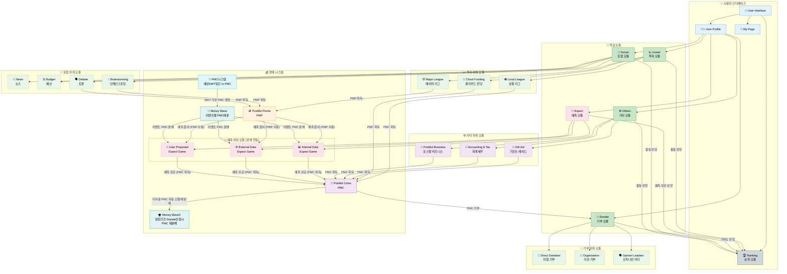

```mermaid
graph TB
    %% === 사용자 인터페이스 (하늘색 계열) ===
    subgraph "👤 사용자 인터페이스"
        direction LR
        UI[📱 User Interface]
        UP[🧑‍💻 User Profile]
        MP[📄 My Page]
        RNK[🏆 Ranking<br/>순위 모듈]
    end
    style UI fill:#e3f2fd,stroke:#90caf9,stroke-width:2px,color:#000
    style UP fill:#e3f2fd,stroke:#90caf9,stroke-width:2px,color:#000
    style MP fill:#e3f2fd,stroke:#90caf9,stroke-width:2px,color:#000
    style RNK fill:#cfd8dc,stroke:#90a4ae,stroke-width:2px,color:#000 

    %% === 핵심 모듈 (녹색 계열, 예측은 분홍색 계열) ===
    subgraph "🧩 핵심 모듈"
        INV[📈 Invest<br/>투자 모듈]
        DON[💝 Donate<br/>기부 모듈]
        FOR[💬 Forum<br/>포럼 모듈]
        ETC[⚙️ Others<br/>기타 모듈]
        EXP[🔮 Expect<br/>예측 모듈]
    end
    style INV fill:#c8e6c9,stroke:#81c784,stroke-width:2px,color:#000
    style DON fill:#c8e6c9,stroke:#81c784,stroke-width:2px,color:#000
    style FOR fill:#c8e6c9,stroke:#81c784,stroke-width:2px,color:#000
    style ETC fill:#c8e6c9,stroke:#81c784,stroke-width:2px,color:#000
    style EXP fill:#fce4ec,stroke:#f8bbd0,stroke-width:2px,color:#000 

    %% === 경제 시스템 (PMP: 주황색 계열, PMC: 보라색 계열, 시스템: 하늘색 계열) ===
    subgraph "💰 경제 시스템"
        PMP[🪙 PosMul Points<br/>PMP]
        PMCSYS[🔄 PMC시스템<br/>예상EBIT일간 to PMC] 
        MWAVE[🌊 Money Wave<br/>이벤트별 PMC배분] 
        MoneyWave2[🌪️ Money Wave2<br/>일정기간 Donate안할시<br/>PMC 재분배]
        PMC[💎 PosMul Coins<br/>PMC]
        subgraph "🔮 예측 하위 모듈 (경제 연동)"
            direction LR
            INT[📊 Internal Data<br/>Expect Game]
            EXT[🌐 External Data<br/>Expect Game]
            USR[🙋 User Proposed<br/>Expect Game]
        end
    end
    style PMP fill:#fff3e0,stroke:#ffcc80,stroke-width:2px,color:#000
    style PMC fill:#f3e5f5,stroke:#ce93d8,stroke-width:2px,color:#000
    style PMCSYS fill:#e0f7fa,stroke:#80deea,stroke-width:2px,color:#000
    style MWAVE fill:#e0f2f1,stroke:#80cbc4,stroke-width:2px,color:#000
    style MoneyWave2 fill:#e0f2f1,stroke:#80cbc4,stroke-width:2px,color:#000
    style INT fill:#fce4ec,stroke:#f8bbd0,stroke-width:1px,color:#000
    style EXT fill:#fce4ec,stroke:#f8bbd0,stroke-width:1px,color:#000
    style USR fill:#fce4ec,stroke:#f8bbd0,stroke-width:1px,color:#000

    %% === 투자 하위 모듈 (상위 모듈 색상 계열) ===
    subgraph "📈 투자 하위 모듈"
        direction LR
        ML[⚾ Major League<br/>메이저 리그]
        LL[⚽ Local League<br/>로컬 리그]
        CF[🤝 Cloud Funding<br/>클라우드 펀딩]
    end
    style ML fill:#e8f5e9,stroke:#a5d6a7,stroke-width:1px,color:#000 
    style LL fill:#e8f5e9,stroke:#a5d6a7,stroke-width:1px,color:#000
    style CF fill:#e8f5e9,stroke:#a5d6a7,stroke-width:1px,color:#000

    %% === 기부 하위 모듈 (상위 모듈 색상 계열) ===
    subgraph "💝 기부 하위 모듈"
        direction LR
        DIR[💸 Direct Donation<br/>직접 기부]
        ORG[🏢 Organization<br/>기관 기부]
        OPL[🗣️ Opinion Leaders<br/>오피니언 리더]
    end
    style DIR fill:#e8f5e9,stroke:#a5d6a7,stroke-width:1px,color:#000 
    style ORG fill:#e8f5e9,stroke:#a5d6a7,stroke-width:1px,color:#000
    style OPL fill:#e8f5e9,stroke:#a5d6a7,stroke-width:1px,color:#000

    %% === 포럼 하위 모듈 (상위 모듈 색상 계열) ===
    subgraph "💬 포럼 하위 모듈"
        direction LR
        NEWS[📰 News<br/>뉴스]
        BUDGET[⚖️ Budget<br/>예산]
        DEBATE[🗣️ Debate<br/>토론]
        BRAIN[💡 Brainstorming<br/>브레인스토밍]
    end
    style NEWS fill:#e8f5e9,stroke:#a5d6a7,stroke-width:1px,color:#000 
    style BUDGET fill:#e8f5e9,stroke:#a5d6a7,stroke-width:1px,color:#000
    style DEBATE fill:#e8f5e9,stroke:#a5d6a7,stroke-width:1px,color:#000
    style BRAIN fill:#e8f5e9,stroke:#a5d6a7,stroke-width:1px,color:#000

    %% === 기타 하위 모듈 (PMC 획득 관련 모듈은 PMC 색상 계열) ===
    subgraph "⚙️ 기타 하위 모듈"
        direction LR
        GIFT[🎁 Gift Aid<br/>기프트 에이드]
        ACCTAX[🧾 Accounting & Tax<br/>회계세무]
        PBUS[🚀 PosMul Business<br/>포스멀 비즈니스]
    end
    style GIFT fill:#f3e5f5,stroke:#ce93d8,stroke-width:1px,color:#000
    style ACCTAX fill:#f3e5f5,stroke:#ce93d8,stroke-width:1px,color:#000
    style PBUS fill:#f3e5f5,stroke:#ce93d8,stroke-width:1px,color:#000


    %% === 연결선 ===
    UI --> UP
    UI --> MP
    UI --> RNK

    UP --> INV
    UP --> DON
    UP --> FOR
    UP --> ETC
    UP --> EXP

    INV --> ML
    INV --> LL
    INV --> CF

    EXP --> INT
    EXP --> EXT
    EXP --> USR

    DON --> DIR
    DON --> ORG
    DON --> OPL

    FOR --> NEWS
    FOR --> DEBATE
    FOR --> BRAIN
    FOR --> BUDGET

    ETC --> GIFT
    ETC --> ACCTAX
    ETC --> PBUS

    %% --- 포인트(PMP) 관련 흐름 ---
    ML -- " PMP 획득 " --> PMP
    BRAIN -- " PMP 획득 " --> PMP
    DEBATE -- " PMP 획득 " --> PMP
    PMP -- " 예측 참여 (PMP 사용) " --> INT
    PMP -- " 예측 참여 (PMP 사용) " --> EXT
    PMP -- " 예측 참여 (PMP 사용) " --> USR

    %% --- 코인(PMC) 관련 흐름 ---
    LL -- " PMC 획득 " --> PMC
    CF -- " PMC 획득 " --> PMC
    GIFT -- " PMC 획득 " --> PMC
    ACCTAX -- " PMC 획득 " --> PMC
    PBUS -- " PMC 획득 " --> PMC
    
    PMCSYS -- " EBIT 기반 PMC 생성 " --> MWAVE 
    MWAVE -- " 이벤트 PMC 분배 " --> INT
    MWAVE -- " 이벤트 PMC 분배 " --> EXT
    MWAVE -- " 이벤트 PMC 분배 " --> USR

    INT -- " 예측 성공 (PMC 획득) " --> PMC
    EXT -- " 예측 성공 (PMC 획득) " --> PMC
    USR -- " 예측 성공 (PMC 획득) " --> PMC

    PMC -- " 미사용 PMC 자동 소멸/재분배 " --> MoneyWave2
    PMC -- " PMC 기부 " --> DON

    %% --- 랭킹 시스템 연결 ---
    INV -- " 활동 반영 " --> RNK
    EXP -- " 예측 성과 반영 " --> RNK
    DON -- " 기여도 반영 " --> RNK
    FOR -- " 활동 반영 " --> RNK
    ETC -- " 활동 반영 " --> RNK

```