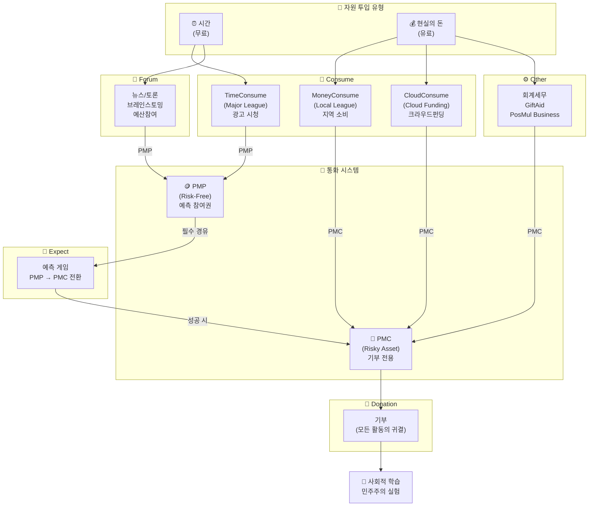
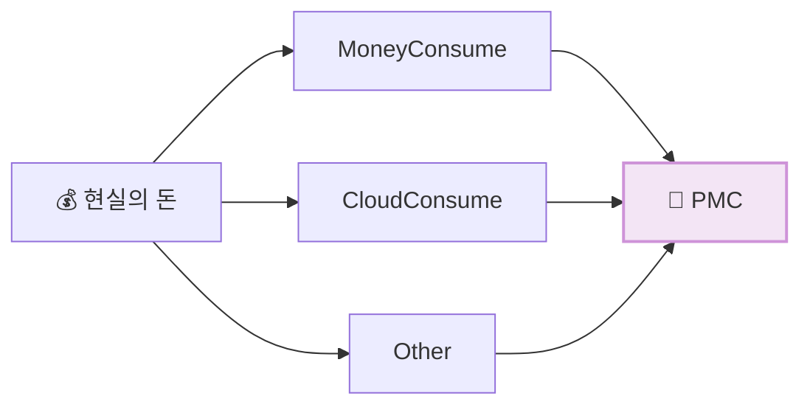
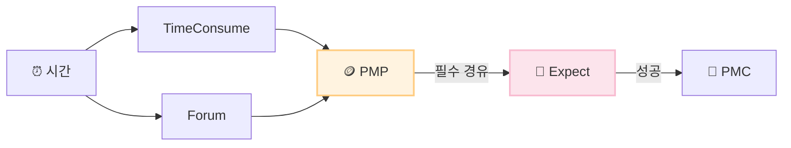
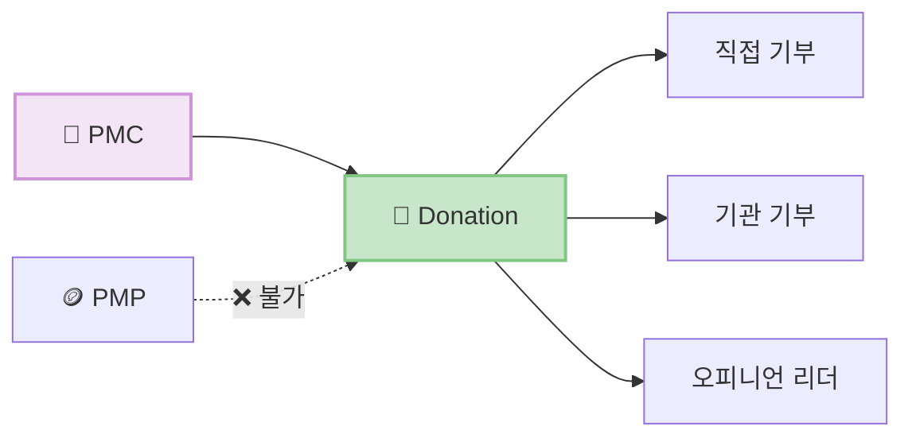
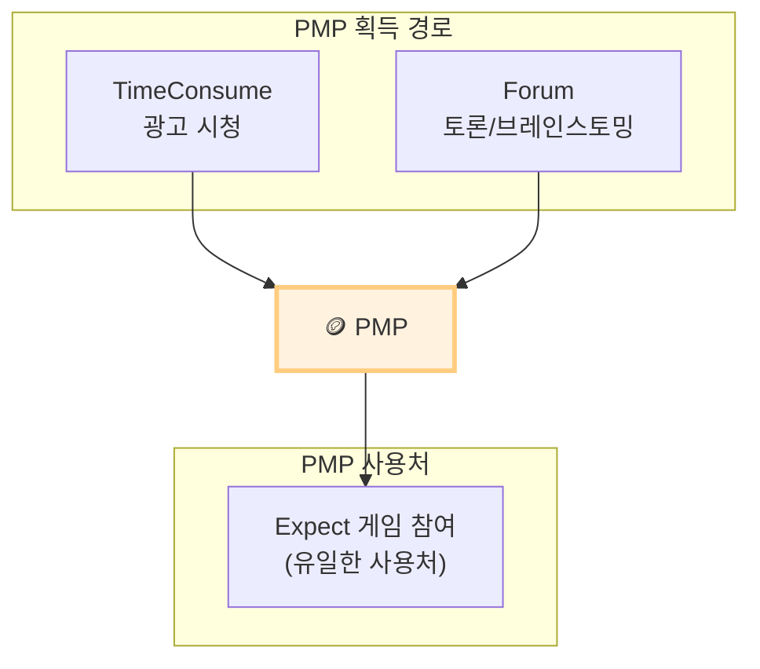
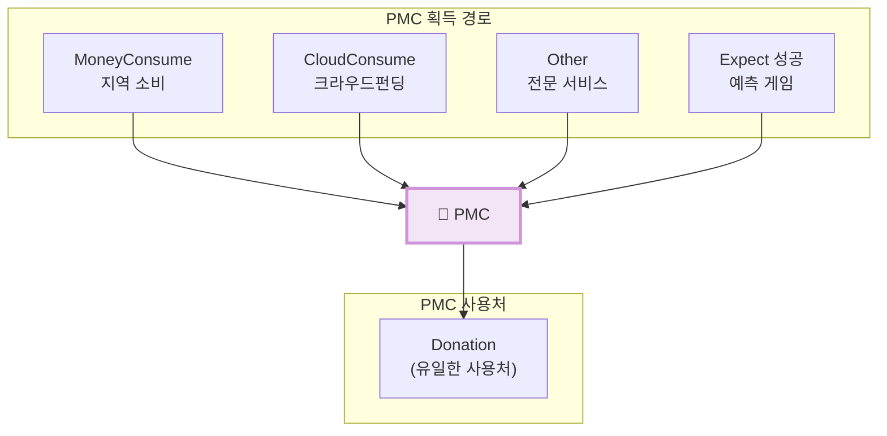
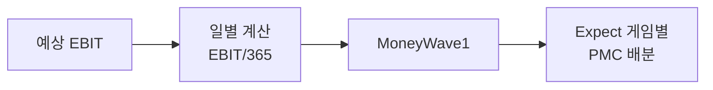
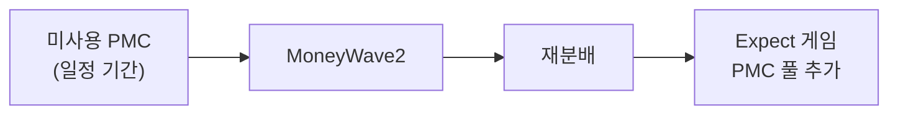
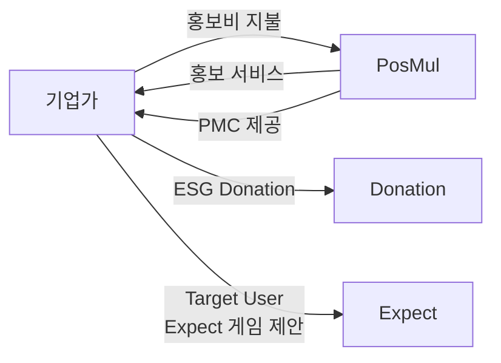
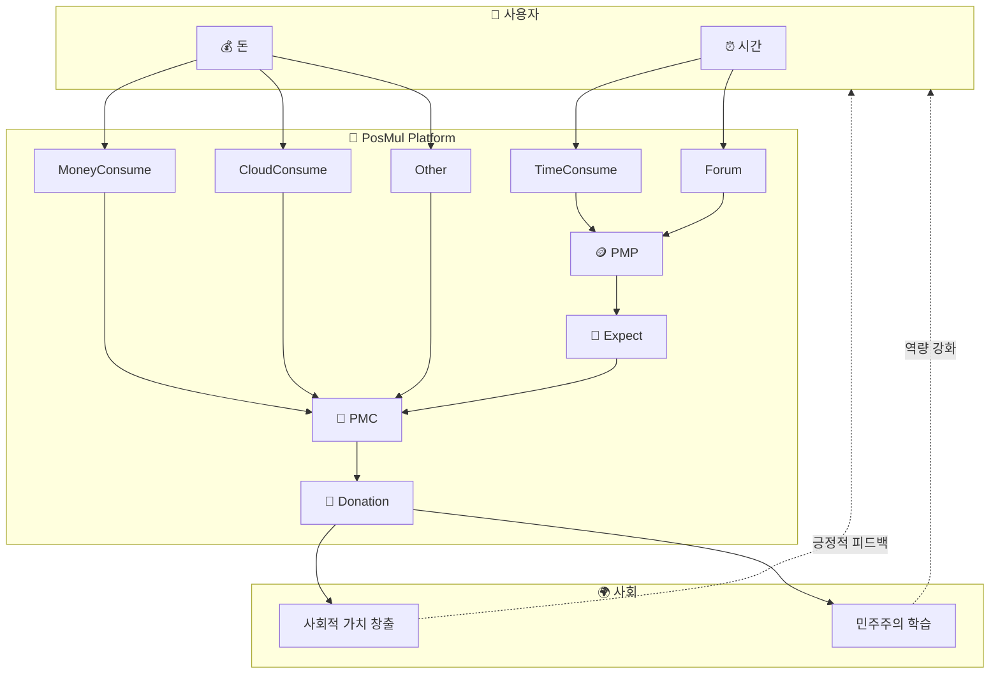

********# PosMul 경제 시스템 아키텍처

> **작성일**: 2025-11-28  
> **버전**: 1.0  
> **목적**: PosMul Platform의 경제 시스템 구조와 통화 흐름 정의

---

## 📊 시스템 개요



---

## 🔑 핵심 원칙

### 원칙 1: 현실의 돈 → PMC 직접 획득



- **MoneyConsume (Local League)**: 지역 소비 → PMC 직접 획득
- **CloudConsume (Cloud Funding)**: 크라우드펀딩 → PMC 직접 획득
- **Other**: 전문 서비스 이용 → PMC 직접 획득

### 원칙 2: 시간 투입 → PMP → Expect 필수



- **TimeConsume (Major League)**: 광고 시청 → PMP 획득 → Expect 필수
- **Forum**: 토론/브레인스토밍 → PMP 획득 → Expect 필수

### 원칙 3: PMC만 Donation 가능



- **PMC는 오직 Donation에만 사용 가능**
- **PMP로는 직접 기부 불가** (반드시 Expect를 통해 PMC로 전환 필요)

---

## 📋 통화 획득 규칙

| 카테고리 | 활동 | 자원 투입 | 획득 통화 | Expect 경유 | 비고 |
|----------|------|:---------:|:---------:|:-----------:|------|
| **Consume** | TimeConsume (Major) | ⏰ 시간 | **PMP** | ✅ 필수 | 광고 시청, 설문 참여 |
| **Consume** | MoneyConsume (Local) | 💰 돈 | **PMC** | ❌ 불필요 | 지역 소비, 소상공인 결제 |
| **Consume** | CloudConsume (Funding) | 💰 돈 | **PMC** | ❌ 불필요 | 크라우드펀딩 |
| **Forum** | 뉴스/토론/브레인스토밍 | ⏰ 시간 | **PMP** | ✅ 필수 | 커뮤니티 참여 |
| **Other** | 회계/세무/GiftAid | 💰 돈 | **PMC** | ❌ 불필요 | 전문 서비스 |
| **Expect** | 예측 게임 | PMP 소모 | **PMC** | - | PMP→PMC 전환 |
| **Donation** | 기부 | PMC 소모 | - | - | 사회적 가치 창출 |

---

## 🏗️ 6대 카테고리 구조

```
📱 PosMul Platform
│
├── 🛒 Consume (자원 소비)
│   ├── TimeConsume (Major League)
│   │   └── 광고 시청, 설문 참여 → PMP 획득
│   ├── MoneyConsume (Local League)
│   │   └── 지역 소비, 소상공인 결제 → PMC 획득
│   └── CloudConsume (Cloud Funding)
│       └── 크라우드펀딩, 프로젝트 후원 → PMC 획득
│
├── 🔮 Expect (예측 게임)
│   ├── Internal Data - 내부 데이터 기반 예측
│   ├── External Data - 외부 데이터 기반 예측
│   └── User Proposed - 사용자 제안 예측
│   └── PMP 소모 → PMC 획득
│
├── 💝 Donation (기부) - PMC 전용
│   ├── Direct (직접 기부)
│   │   └── 의류, 식품, 주거, 의료, 교육
│   ├── Institute (기관 기부)
│   │   └── 유니세프, 세이브더칠드런 등
│   └── Opinion Leader (오피니언 리더)
│       └── 환경, 복지, 과학, 인권, 교육
│
├── 💬 Forum (커뮤니티) → PMP 획득
│   ├── News (뉴스)
│   ├── Debate (토론)
│   ├── Brainstorming (브레인스토밍)
│   └── Budget (예산 참여)
│
├── ⚙️ Other (전문 서비스) → PMC 획득
│   ├── Accounting & Tax (회계/세무)
│   ├── Gift Aid (기프트에이드)
│   └── PosMul Business (포스멀 비즈니스)
│
└── 🏆 Ranking (랭킹)
    ├── Cosmos/Colony/Nation/Region/Local
    └── Invest/Expect/Donate 기준
```

---

## 💰 통화 시스템 상세

### PMP (PosMul Points) - Risk-Free Asset



| 속성 | 설명 |
|------|------|
| **성격** | Risk-Free Asset (CAPM 기준) |
| **획득** | 시간 투입 활동 (TimeConsume, Forum) |
| **사용** | Expect 게임 참여 전용 |
| **가치 변동성** | 0 (플랫폼 고정 교환비) |
| **소멸 조건** | 없음 (활동 지속 시 유지) |

### PMC (PosMul Coins) - Risky Asset



| 속성 | 설명 |
|------|------|
| **성격** | Risky Asset (CAPM 기준) |
| **획득** | 돈 투입 활동 + Expect 성공 |
| **사용** | Donation 전용 (기부만 가능) |
| **가치 변동성** | EBIT 기반 변동 |
| **소멸 조건** | 미사용 시 MoneyWave2 재분배 |

---

## 🌊 MoneyWave 시스템

### MoneyWave1: EBIT 기반 PMC 생성



- **공식**: `일일 PMC 발행량 = 예상EBIT / 365`
- **배분**: 당일 생성된 Expect 게임에 PMC 풀 배분

### MoneyWave2: 미사용 PMC 재분배



- **조건**: 일정 기간 Donation하지 않은 PMC
- **목적**: 사용 유인 증대 (Loss Aversion 활용)

### MoneyWave3: 기업가 생태계



- **기업가 혜택**: 홍보 서비스 + PMC 제공
- **기업가 활용**: ESG 마케팅, 타겟 사용자 데이터 획득

---

## 🔄 전체 경제 순환



---

## 📐 CAPM 기반 경제 모델

### 위험-수익 구조

| 자산 | 역할 | 수익률 | 변동성 |
|------|------|--------|--------|
| **PMP** | Risk-Free Rate (Rf) | 0~α% (고정) | ≈ 0 |
| **PMC** | Risky Asset | EBIT 연동 | 변동 |

### 효용함수

```
U(x) = α·ln(PMP) + β·ln(PMC) + γ·S(Donate)
```

- **α**: PMP에 대한 한계효용
- **β**: PMC에 대한 한계효용  
- **γ**: 사회적 효용 (기부로 인한 만족)

### 사회후생함수

```
W = Σᵢ Uᵢ(x) + λ·Gini(distribution)
```

- 개인효용 합 + 분배 형평성 고려
- **λ**: 사회적 형평성 가중치

---

## 🎯 설계 목표

### 단기 (1년)
- 이벤트 예측(Expect)과 결과 평가를 통한 **사회적 학습** 증진
- 국방/치안/외교 제외 분야에서 **가상 예산 집행** 연습

### 중기 (5년)
- CAPM 기반 **개인 효용 극대화** 의사결정 실증 검증
- **직접민주주의** 실현 역량 강화

### 장기 (10년)
- **철의 삼각형(Iron Triangle)** 극복
- 시민의 **실질적 예산 참여** 시스템 구축

### 궁극 (50년)
- **Cosmos 시대** 민주주의 표준 모델
- AI와 함께하는 **참여형 거버넌스** 완성

---

## 📝 변경 이력

| 버전 | 날짜 | 변경 내용 |
|------|------|----------|
| 1.0 | 2025-11-28 | 최초 작성 - Investment → Consume 명칭 변경, 통화 획득 규칙 정리 |

---

*Last Updated: 2025-11-28*
