```mermaid
graph TB
    %% === 사용자 인터페이스 (하늘색 계열) ===
    subgraph "👤 사용자 인터페이스"
        direction LR
        UI[📱 User Interface]
        UP[🧑‍💻 User Profile]
        MP[📄 My Page]
        RNK[🏆 Ranking<br/>순위 모듈]
    end
    style UI fill:#e3f2fd,stroke:#90caf9,stroke-width:2px,color:#000
    style UP fill:#e3f2fd,stroke:#90caf9,stroke-width:2px,color:#000
    style MP fill:#e3f2fd,stroke:#90caf9,stroke-width:2px,color:#000
    style RNK fill:#cfd8dc,stroke:#90a4ae,stroke-width:2px,color:#000

    %% === 핵심 모듈 (녹색 계열, 예측은 분홍색 계열) ===
    subgraph "🧩 핵심 모듈"
        CON[🛒 Consume<br/>자원 소비 모듈]
        DON[💝 Donate<br/>기부 모듈<br/>PMC 전용]
        FOR[💬 Forum<br/>포럼 모듈<br/>PMP 획득]
        ETC[⚙️ Others<br/>기타 모듈<br/>PMC 획득]
        EXP[🔮 Expect<br/>예측 모듈<br/>PMP→PMC]
    end
    style CON fill:#c8e6c9,stroke:#81c784,stroke-width:2px,color:#000
    style DON fill:#c8e6c9,stroke:#81c784,stroke-width:2px,color:#000
    style FOR fill:#c8e6c9,stroke:#81c784,stroke-width:2px,color:#000
    style ETC fill:#c8e6c9,stroke:#81c784,stroke-width:2px,color:#000
    style EXP fill:#fce4ec,stroke:#f8bbd0,stroke-width:2px,color:#000

    %% === 경제 시스템 (PMP: 주황색 계열, PMC: 보라색 계열, 시스템: 하늘색 계열) ===
    subgraph "💰 경제 시스템"
        PMP[🪙 PosMul Points<br/>PMP - Risk Free<br/>시간 투입 획득]
        PMCSYS[🔄 PMC시스템<br/>예상EBIT일간 to PMC]
        MWAVE[🌊 Money Wave<br/>이벤트별 PMC배분]
        MoneyWave2[🌪️ Money Wave2<br/>일정기간 Donate안할시<br/>PMC 재분배]
        PMC[💎 PosMul Coins<br/>PMC - 기부 전용<br/>돈 투입 획득]
        subgraph "🔮 예측 하위 모듈 (경제 연동)"
            direction LR
            INT[📊 Internal Data<br/>Expect Game]
            EXT[🌐 External Data<br/>Expect Game]
            USR[🙋 User Proposed<br/>Expect Game]
        end
    end
    style PMP fill:#fff3e0,stroke:#ffcc80,stroke-width:2px,color:#000
    style PMC fill:#f3e5f5,stroke:#ce93d8,stroke-width:2px,color:#000
    style PMCSYS fill:#e0f7fa,stroke:#80deea,stroke-width:2px,color:#000
    style MWAVE fill:#e0f2f1,stroke:#80cbc4,stroke-width:2px,color:#000
    style MoneyWave2 fill:#e0f2f1,stroke:#80cbc4,stroke-width:2px,color:#000
    style INT fill:#fce4ec,stroke:#f8bbd0,stroke-width:1px,color:#000
    style EXT fill:#fce4ec,stroke:#f8bbd0,stroke-width:1px,color:#000
    style USR fill:#fce4ec,stroke:#f8bbd0,stroke-width:1px,color:#000

    %% === Consume 하위 모듈 (TimeConsume: PMP 색상, MoneyConsume/CloudConsume: PMC 색상) ===
    subgraph "🛒 Consume 하위 모듈"
        direction LR
        TC[⏰ TimeConsume<br/>Major League<br/>시간 → PMP]
        MC[💰 MoneyConsume<br/>Local League<br/>돈 → PMC]
        CC[🤝 CloudConsume<br/>Cloud Funding<br/>돈 → PMC]
    end
    style TC fill:#fff3e0,stroke:#ffcc80,stroke-width:1px,color:#000
    style MC fill:#f3e5f5,stroke:#ce93d8,stroke-width:1px,color:#000
    style CC fill:#f3e5f5,stroke:#ce93d8,stroke-width:1px,color:#000

    %% === 기부 하위 모듈 (PMC 색상 계열 - PMC로만 기부 가능) ===
    subgraph "💝 기부 하위 모듈 - PMC 전용"
        direction LR
        DIR[💸 Direct Donation<br/>직접 기부]
        ORG[🏢 Organization<br/>기관 기부]
        OPL[🗣️ Opinion Leaders<br/>오피니언 리더]
    end
    style DIR fill:#f3e5f5,stroke:#ce93d8,stroke-width:1px,color:#000
    style ORG fill:#f3e5f5,stroke:#ce93d8,stroke-width:1px,color:#000
    style OPL fill:#f3e5f5,stroke:#ce93d8,stroke-width:1px,color:#000

    %% === 포럼 하위 모듈 (PMP 색상 계열 - 시간 투입으로 PMP 획득) ===
    subgraph "💬 포럼 하위 모듈 - PMP 획득"
        direction LR
        NEWS[📰 News<br/>뉴스]
        BUDGET[⚖️ Budget<br/>예산]
        DEBATE[🗣️ Debate<br/>토론]
        BRAIN[💡 Brainstorming<br/>브레인스토밍]
    end
    style NEWS fill:#fff3e0,stroke:#ffcc80,stroke-width:1px,color:#000
    style BUDGET fill:#fff3e0,stroke:#ffcc80,stroke-width:1px,color:#000
    style DEBATE fill:#fff3e0,stroke:#ffcc80,stroke-width:1px,color:#000
    style BRAIN fill:#fff3e0,stroke:#ffcc80,stroke-width:1px,color:#000

    %% === 기타 하위 모듈 (PMC 색상 계열 - 돈 투입으로 PMC 획득) ===
    subgraph "⚙️ 기타 하위 모듈 - PMC 획득"
        direction LR
        GIFT[🎁 Gift Aid<br/>기프트 에이드]
        ACCTAX[🧾 Accounting & Tax<br/>회계세무]
        PBUS[🚀 PosMul Business<br/>포스멀 비즈니스]
    end
    style GIFT fill:#f3e5f5,stroke:#ce93d8,stroke-width:1px,color:#000
    style ACCTAX fill:#f3e5f5,stroke:#ce93d8,stroke-width:1px,color:#000
    style PBUS fill:#f3e5f5,stroke:#ce93d8,stroke-width:1px,color:#000


    %% === 연결선 ===
    UI --> UP
    UI --> MP
    UI --> RNK

    UP --> CON
    UP --> DON
    UP --> FOR
    UP --> ETC
    UP --> EXP

    CON --> TC
    CON --> MC
    CON --> CC

    EXP --> INT
    EXP --> EXT
    EXP --> USR

    DON --> DIR
    DON --> ORG
    DON --> OPL

    FOR --> NEWS
    FOR --> DEBATE
    FOR --> BRAIN
    FOR --> BUDGET

    ETC --> GIFT
    ETC --> ACCTAX
    ETC --> PBUS

    %% --- 포인트(PMP) 관련 흐름 - 시간 투입 활동 ---
    TC -- " ⏰ 시간 투입 → PMP 획득 " --> PMP
    NEWS -- " PMP 획득 " --> PMP
    BRAIN -- " PMP 획득 " --> PMP
    DEBATE -- " PMP 획득 " --> PMP
    BUDGET -- " PMP 획득 " --> PMP
    
    %% --- PMP는 반드시 Expect를 통해 PMC로 전환 ---
    PMP -- " 예측 참여 (PMP 필수 사용) " --> INT
    PMP -- " 예측 참여 (PMP 필수 사용) " --> EXT
    PMP -- " 예측 참여 (PMP 필수 사용) " --> USR

    %% --- 코인(PMC) 관련 흐름 - 돈 투입 활동 ---
    MC -- " 💰 돈 투입 → PMC 획득 " --> PMC
    CC -- " 💰 돈 투입 → PMC 획득 " --> PMC
    GIFT -- " 💰 돈 투입 → PMC 획득 " --> PMC
    ACCTAX -- " 💰 돈 투입 → PMC 획득 " --> PMC
    PBUS -- " 💰 돈 투입 → PMC 획득 " --> PMC

    %% --- MoneyWave 시스템 ---
    PMCSYS -- " EBIT 기반 PMC 생성 " --> MWAVE
    MWAVE -- " 이벤트 PMC 분배 " --> INT
    MWAVE -- " 이벤트 PMC 분배 " --> EXT
    MWAVE -- " 이벤트 PMC 분배 " --> USR

    %% --- Expect 성공 시 PMC 획득 ---
    INT -- " 예측 성공 (PMC 획득) " --> PMC
    EXT -- " 예측 성공 (PMC 획득) " --> PMC
    USR -- " 예측 성공 (PMC 획득) " --> PMC

    %% --- PMC는 Donation에만 사용 가능 ---
    PMC -- " 미사용 PMC 자동 재분배 " --> MoneyWave2
    PMC -- " PMC로만 기부 가능 " --> DON

    %% --- 랭킹 시스템 연결 ---
    CON -- " 활동 반영 " --> RNK
    EXP -- " 예측 성과 반영 " --> RNK
    DON -- " 기여도 반영 " --> RNK
    FOR -- " 활동 반영 " --> RNK
    ETC -- " 활동 반영 " --> RNK

```

---

## 📋 핵심 원칙 요약

### 통화 획득 규칙

| 자원 투입 | 활동 | 획득 통화 | Expect 경유 |
|:---------:|------|:---------:|:-----------:|
| ⏰ 시간 | TimeConsume (Major League) | **PMP** | ✅ 필수 |
| ⏰ 시간 | Forum (뉴스/토론/브레인스토밍) | **PMP** | ✅ 필수 |
| 💰 돈 | MoneyConsume (Local League) | **PMC** | ❌ 불필요 |
| 💰 돈 | CloudConsume (Cloud Funding) | **PMC** | ❌ 불필요 |
| 💰 돈 | Other (회계/세무/GiftAid) | **PMC** | ❌ 불필요 |

### 핵심 규칙

1. **현실의 돈 투입 → PMC 직접 획득**
2. **시간 투입 → PMP → Expect 필수 → PMC**
3. **PMC로만 Donation 가능** (PMP로는 기부 불가)

---

## 🎨 색상 범례

| 색상 | 의미 |
|------|------|
| 🟠 주황색 (`#fff3e0`) | PMP 관련 - 시간 투입 |
| 🟣 보라색 (`#f3e5f5`) | PMC 관련 - 돈 투입/기부 전용 |
| 🟢 녹색 (`#c8e6c9`) | 핵심 모듈 |
| 🩷 분홍색 (`#fce4ec`) | Expect 모듈 |
| 🔵 하늘색 (`#e3f2fd`) | 사용자 인터페이스 |

