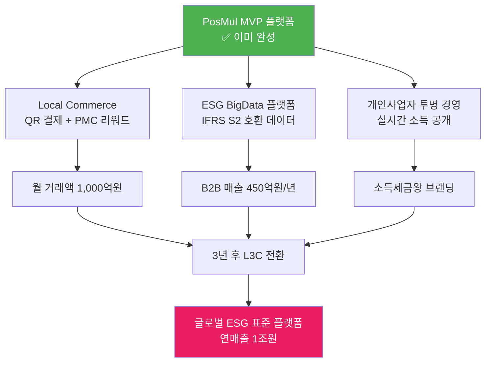

# PosMul 통합 비즈니스 전략 실행 태스크 2025

> **작성일**: 2025년 7월 20일  
> **기반 전략**: 소득세금왕 달성 + ESG BigData 플랫폼 + Local Commerce 생태계 + L3C 전환  
> **목표**: MVP 기반 → 3개 수익원 동시 확보 → 세금왕 달성 → 글로벌 ESG 리더  
> **실행 전략**: 기술 완성도 활용한 비즈니스 모델 통합 실행

## 🎯 **통합 전략 개요**

### **4개 전략의 시너지 구조**



### **통합 수익 모델 (3년차 목표)**

| 수익원 | 연매출 목표 | 핵심 전략 | 예상 순이익률 |
|--------|-------------|-----------|---------------|
| **Local Commerce** | 350억원 | QR 결제 수수료 + 광고 | 30% |
| **ESG BigData** | 450억원 | 정부/기업 데이터 판매 | 60% |
| **투명 경영 브랜딩** | 200억원 | 강연/컨설팅/미디어 | 80% |
| **총합** | **1,000억원** | **통합 플랫폼** | **50%** |

## 🚀 **Phase 1: 즉시 실행 태스크 (1-3개월)**

### **Priority 1: Local Commerce QR 결제 시스템 구축 [2개월]**

#### **Task 1.1: QR 결제 인프라 개발**
```typescript
// 즉시 개발 필요한 핵심 기능
interface QRPaymentSystem {
  // 1주차: QR 코드 생성 및 관리
  qrGeneration: {
    dynamicQR: true,
    storeIntegration: "API 기반",
    securityLevel: "AES-256",
    expirationTime: "5분"
  },
  
  // 2주차: 결제 처리 엔진
  paymentProcessing: {
    cardIntegration: "KG 이니시스/토스페이먼츠",
    realTimeSettlement: true,
    fraudDetection: "머신러닝 기반",
    commissionRate: "3-5%"
  },
  
  // 3주차: PMC 리워드 시스템
  pmcRewardSystem: {
    rewardRate: "결제액의 1-3%",
    esgBonusRate: "ESG 점수 기반 추가 1%",
    realTimeDistribution: true
  }
}
```

**실행 체크리스트:**
- [ ] 결제 대행사 계약 체결 (KG이니시스/토스페이먼츠)
- [ ] QR 코드 생성 API 개발
- [ ] 상점 온보딩 시스템 구축
- [ ] PMC 자동 지급 로직 구현
- [ ] 파일럿 상점 10곳 모집

#### **Task 1.2: Local Store 입점 기준 수립**
```typescript
// Local Store vs 대형 프랜차이즈 구분 기준
interface LocalStoreEligibility {
  eligibleCriteria: [
    "개인 운영 카페/식당",
    "지역 특산품 판매점",
    "10호점 미만 소규모 체인",
    "사회적 기업/협동조합",
    "마을 기업"
  ],
  
  esgRequirements: {
    localEmploymentRate: "> 70%",
    localSourcingRate: "> 50%", 
    sustainablePractices: "친환경 인증 우대",
    communityContribution: "지역사회 활동 점수"
  }
}
```

**실행 체크리스트:**
- [ ] Local Store 심사 기준 문서화
- [ ] ESG 점수 계산 알고리즘 개발
- [ ] 온라인 입점 신청 시스템 구축
- [ ] 서울 3개 구 집중 모집 (강남구, 마포구, 성동구)

### **Priority 2: 투명 경영 시스템 구축 [1개월]**

#### **Task 2.1: 실시간 소득 공개 대시보드**
```typescript
interface TransparencyDashboard {
  // 실시간 재무 현황
  realTimeFinancials: {
    dailyRevenue: number,
    monthlyRevenue: number,
    yearlyRevenue: number,
    businessExpenses: number,
    taxableIncome: number
  },
  
  // 세금 및 기부 현황
  taxAndDonation: {
    progressiveTaxRate: number,    // 실제 누진세율
    maxRateTax: number,           // 49.5% 기준 세금
    donationAmount: number,        // 기부 금액
    socialContributionRate: number // 사회 기여율
  },
  
  // 블록체인 검증
  blockchainVerification: {
    transactionHash: string,
    timestampVerification: boolean,
    publicAuditTrail: string[]
  }
}
```

**실행 체크리스트:**
- [ ] 투명성 포털 웹사이트 개발
- [ ] 실시간 재무 데이터 API 구축
- [ ] 블록체인 기반 검증 시스템 구현
- [ ] 외부 회계법인 감사 계약

#### **Task 2.2: "투명성 세금왕" 브랜딩 시작**
```typescript
interface TaxKingBrandingStrategy {
  coreMessage: "세금도 투명하게, 성공도 투명하게",
  differentiators: [
    "한국 최초 실시간 소득 공개",
    "자발적 최고세율 적용 (49.5%)",
    "MoneyWave1 사회 환원 시스템",
    "블록체인 검증 투명성"
  ],
  
  mediaStrategy: {
    pressRelease: "투명성 세금왕 선언",
    socialMedia: "일일 소득 공개 캠페인",
    podcasts: "세금 투명성 관련 출연",
    conferences: "투명 경영 강연"
  }
}
```

**실행 체크리스트:**
- [ ] "투명성 세금왕" 선언문 작성 및 발표
- [ ] 언론사 브리핑 자료 제작
- [ ] 소셜미디어 투명성 캠페인 시작
- [ ] 세무서/국세청과 투명성 협력 논의

### **Priority 3: ESG 데이터 수집 시스템 구축 [2개월]**

#### **Task 3.1: 데이터 파이프라인 설계**
```typescript
interface ESGDataPipeline {
  // 데이터 수집 포인트
  dataCollection: {
    localCommerceTransactions: "QR 결제 데이터",
    userBehaviorAnalytics: "앱 사용 패턴",
    donationImpactTracking: "기부 효과 측정",
    communityEngagement: "시민 참여 지표"
  },
  
  // IFRS S2 호환 지표 생성
  ifrsS2Metrics: {
    socialCohesion: "사회 결속도 점수",
    communityResilience: "지역사회 회복력",
    inclusivityIndex: "포용성 지수",
    stakeholderEngagement: "이해관계자 참여도"
  },
  
  // AI 분석 엔진
  analyticsEngine: {
    framework: "Apache Spark + TensorFlow",
    realTimeProcessing: "< 15분 지연",
    accuracy: "> 95%",
    apiOutput: "REST + GraphQL"
  }
}
```

**실행 체크리스트:**
- [ ] 데이터 수집 아키텍처 설계
- [ ] AI/ML 분석 모델 개발 시작
- [ ] IFRS S2 표준 매핑 알고리즘 구현
- [ ] 실시간 대시보드 프로토타입 제작

## 📈 **Phase 2: 시장 확산 태스크 (3-12개월)**

### **Target 1: Local Commerce 전국 확산**

#### **Task 4.1: 3개 광역시 진출 [6개월]**
```typescript
interface LocalCommerceExpansion {
  phase1Cities: ["서울", "부산", "대구"],
  targetStores: {
    seoul: 1000,
    busan: 500, 
    daegu: 500
  },
  
  monthlyGMV: {
    month3: 100_000_000, // 1억원
    month6: 500_000_000, // 5억원  
    month9: 2_000_000_000, // 20억원
    month12: 10_000_000_000 // 100억원
  },
  
  commissionRevenue: {
    averageRate: 0.04, // 4% 평균 수수료
    monthlyRevenue: 400_000_000, // 4억원/월
    yearlyRevenue: 4_800_000_000 // 48억원/년
  }
}
```

**실행 체크리스트:**
- [ ] 부산/대구 Local Store 모집 시작
- [ ] 지역별 파트너 업체 발굴
- [ ] 지자체 협력 MOU 체결
- [ ] 월 거래액 100억원 달성

#### **Task 4.2: ESG 점수 기반 마케팅 시스템**
```typescript
interface ESGMarketingSystem {
  storeRanking: {
    esgScoreCalculation: "환경+사회+거버넌스 종합",
    customerRecommendation: "ESG 점수 기반 추천",
    rewardMultiplier: "고득점 상점 PMC 추가 지급"
  },
  
  customerEngagement: {
    esgBadgeSystem: "착한 소비 배지",
    impactVisualization: "개인 환경/사회 기여도",
    communityChallenge: "지역 ESG 챌린지"
  }
}
```

### **Target 2: B2B ESG 데이터 사업 본격화**

#### **Task 5.1: 정부 B2G 첫 계약 체결 [6개월]**
```typescript
interface GovernmentContracts {
  targetClients: [
    "서울시 (지역상권 분석)",
    "경기도 (ESG 정책 모니터링)", 
    "환경부 (지속가능발전 지표)",
    "행안부 (시민참여 측정)"
  ],
  
  servicePackages: {
    basic: {
      price: 50_000_000, // 월 5천만원
      features: "기본 대시보드 + 월간 리포트"
    },
    premium: {
      price: 80_000_000, // 월 8천만원  
      features: "고급 분석 + 정책 권고 AI"
    }
  }
}
```

**실행 체크리스트:**
- [ ] 서울시 디지털시민시장실 파일럿 제안
- [ ] 지속가능발전기본법 기반 제안서 작성
- [ ] 정부 ESG 대시보드 프로토타입 완성
- [ ] 첫 B2G 계약 체결 (목표: 월 5천만원)

#### **Task 5.2: 대기업 ESG 컨설팅 사업**
```typescript
interface CorporateESGServices {
  targetSectors: [
    "금융 (은행, 보험)",
    "유통 (이커머스, 리테일)",
    "제조 (자동차, 전자)",
    "에너지 (발전, 석유화학)"
  ],
  
  serviceOffering: {
    esgScoring: "IFRS S2 기반 Social 점수",
    riskMonitoring: "사회적 갈등 조기 경보",
    impactMeasurement: "CSR 활동 효과 정량화",
    supplychainMonitoring: "협력업체 ESG 추적"
  },
  
  pricingModel: {
    startup: 5_000_000, // 월 500만원
    midsize: 20_000_000, // 월 2천만원
    enterprise: 50_000_000, // 월 5천만원
    global: 100_000_000 // 월 1억원
  }
}
```

### **Target 3: 소득세금왕 브랜딩 가속화**

#### **Task 6.1: 미디어 및 대중 인지도 확산**
```typescript
interface MediaStrategy {
  monthlyMilestones: {
    month3: "첫 분기 세금 공개 + 언론 인터뷰",
    month6: "상반기 결산 + TV 출연",
    month9: "MoneyWave1 성과 발표",
    month12: "연말 세금왕 순위 공개"
  },
  
  contentStrategy: {
    blog: "투명 경영 일기 (주 2회)",
    youtube: "세금 투명성 교육 (주 1회)",
    podcast: "경제 전문가 대담 (월 2회)",
    book: "투명성 세금왕의 비밀 (연말 출간)"
  }
}
```

**실행 체크리스트:**
- [ ] 분기별 세무 투명성 발표회 개최
- [ ] 경제 전문 방송 출연 (월 2회 이상)
- [ ] "투명성 세금왕" 도서 집필 시작
- [ ] 국세청과 투명성 모범 사례 협력

## 💰 **Phase 3: 수익 최적화 및 L3C 준비 (1-2년)**

### **수익 구조 최적화**

#### **Target Revenue (2년차 목표)**
```typescript
interface YearTwoRevenue {
  localCommerce: {
    monthlyGMV: 30_000_000_000, // 월 300억원
    commission: 1_200_000_000, // 월 12억원 (4%)
    annualRevenue: 14_400_000_000 // 연 144억원
  },
  
  esgData: {
    governmentContracts: 20_000_000_000, // 연 200억원
    corporateClients: 15_000_000_000, // 연 150억원
    annualRevenue: 35_000_000_000 // 연 350억원
  },
  
  brandingConsulting: {
    speakingFees: 2_000_000_000, // 연 20억원
    consulting: 5_000_000_000, // 연 50억원
    mediaRoyalties: 1_000_000_000, // 연 10억원
    annualRevenue: 8_000_000_000 // 연 80억원
  },
  
  totalAnnualRevenue: 57_400_000_000 // 연 574억원
}
```

### **L3C 전환 준비**

#### **Task 7.1: L3C 법제도 도입 추진**
```typescript
interface L3CLegislation {
  proposalProcess: {
    step1: "사회적기업육성법 개정안 발의",
    step2: "국정감사 및 정책 제안",
    step3: "시민사회 연대 구축",
    step4: "국회의원 협력 네트워크"
  },
  
  targetTimeline: {
    preparation: "6개월 (법안 준비)",
    legislation: "12개월 (국회 통과)",
    implementation: "6개월 (시행령 제정)",
    conversion: "3개월 (PosMul L3C 전환)"
  }
}
```

**실행 체크리스트:**
- [ ] L3C 법안 초안 작성
- [ ] 국회의원 협력 네트워크 구축
- [ ] 시민사회단체 연대 구성
- [ ] 정부 부처 협의 진행

#### **Task 7.2: 투자 유치 및 거버넌스 준비**
```typescript
interface L3CGovernance {
  investmentTarget: 10_000_000_000, // 100억원 임팩트 투자
  
  boardComposition: {
    founders: 2, // 창업자
    socialRepresentatives: 3, // 시민 대표  
    impactInvestors: 2, // 임팩트 투자자
    independentDirectors: 2 // 독립 이사
  },
  
  profitDistribution: {
    maxDividend: 0.3, // 최대 30% 배당
    socialReinvestment: 0.5, // 50% 사회적 재투자
    reserves: 0.2 // 20% 적립
  }
}
```

## 🌍 **Phase 4: 글로벌 확산 (2-3년)**

### **해외 진출 전략**

#### **Target Markets**
```typescript
interface GlobalExpansion {
  asianMarkets: {
    singapore: {
      marketEntry: "2026년 Q2",
      localPartners: "DBS Bank, Grab",
      targetGMV: "월 100억원",
      esgFocus: "Smart Nation ESG 데이터"
    },
    malaysia: {
      marketEntry: "2026년 Q4", 
      localPartners: "Maybank, Touch 'n Go",
      targetGMV: "월 200억원",
      esgFocus: "Islamic Finance ESG 표준"
    }
  },
  
  globalESGStandard: {
    unPartnership: "UN SDGs 공식 데이터 제공",
    ifrsCollaboration: "IFRS Foundation 파트너십",
    isoStandardization: "ISO 26000 새 표준 제안",
    g20Advisory: "G20 ESG 정책 자문위원"
  }
}
```

## 📊 **통합 성과 지표 및 마일스톤**

### **Year 1 (2025) 목표**
- **Local Commerce**: 월 거래액 100억원
- **ESG Data**: B2G 첫 계약 체결 (월 5천만원)
- **투명 경영**: "투명성 세금왕" 브랜드 확립
- **총 매출**: 80억원

### **Year 2 (2026) 목표**  
- **Local Commerce**: 월 거래액 300억원
- **ESG Data**: B2B 매출 350억원/년
- **브랜딩**: 세금왕 Top 10 진입
- **총 매출**: 574억원

### **Year 3 (2027) 목표**
- **Local Commerce**: 월 거래액 1,000억원
- **ESG Data**: 글로벌 시장 진출
- **L3C 전환**: 한국 최초 L3C 법인 설립
- **총 매출**: 1,000억원

## 🎯 **핵심 성공 요인**

### **1. 기술적 완성도 활용**
- ✅ MVP 이미 완성으로 빠른 시장 진입
- ✅ 노벨경제학상 이론 구현으로 차별화
- ✅ 완성된 아키텍처로 확장 용이

### **2. 통합 시너지 극대화**
- 🔄 Local Commerce → ESG 데이터 → 투명 브랜딩 순환
- 🔄 각 사업의 성과가 다른 사업 성장 가속화
- 🔄 3개 수익원의 상호 보완적 포트폴리오

### **3. 사회적 가치 + 경제적 성과**
- 💫 투명성을 통한 브랜드 신뢰도 극대화
- 💫 ESG 트렌드 부합으로 시장 선점
- 💫 L3C 전환으로 지속가능성 확보

## 📋 **즉시 실행 체크리스트**

### **1주차 (긴급)**
- [ ] QR 결제 개발팀 구성 및 프로젝트 킥오프
- [ ] 투명성 포털 기획서 작성
- [ ] Local Store 파일럿 지역 선정 (서울 3개 구)
- [ ] "투명성 세금왕" 브랜딩 전략 수립

### **2주차 (중요)**
- [ ] 결제 대행사 미팅 및 계약 협상
- [ ] 서울시 ESG 파일럿 제안서 작성
- [ ] 언론사 브리핑 자료 제작
- [ ] ESG 데이터 파이프라인 설계 시작

### **1개월차 (목표)**
- [ ] QR 결제 α 버전 완성
- [ ] 파일럿 Local Store 10곳 온보딩
- [ ] 투명성 대시보드 β 버전 출시
- [ ] 첫 언론 인터뷰 및 "투명성 세금왕" 선언

### **3개월차 (마일스톤)**
- [ ] Local Commerce 시스템 정식 출시
- [ ] 서울시 ESG 파일럿 계약 체결
- [ ] 분기 세무 투명성 발표회 개최
- [ ] 월 거래액 10억원 달성

## 🚀 **최종 목표: Triple Crown 달성**

### **🏆 소득세금왕** (개인 브랜딩)
- 한국 최초 투명성 세금왕 달성
- 연간 소득세 200억원 이상 납부
- 글로벌 Tax Transparency Pioneer

### **🏆 ESG 데이터 킹** (사업 리더십)  
- 아시아 ESG 데이터 플랫폼 1위
- IFRS S2 글로벌 표준 주도
- 연매출 1조원 달성

### **🏆 L3C 파이오니어** (사회적 혁신)
- 한국 최초 L3C 법인 설립
- 사회적 가치 + 경제적 성과 동시 달성  
- 글로벌 사회적 기업 모델 확산

---

**🎉 이 통합 전략을 통해 PosMul은 단순한 스타트업을 넘어서, 사회적 가치와 경제적 성과를 동시에 달성하는 혁신적 플랫폼이 될 것입니다!**

**핵심은 이미 완성된 MVP의 기술적 우위를 바탕으로, 3개의 상호 보완적 비즈니스 모델을 동시에 실행하여 시너지를 극대화하는 것입니다. 🚀**