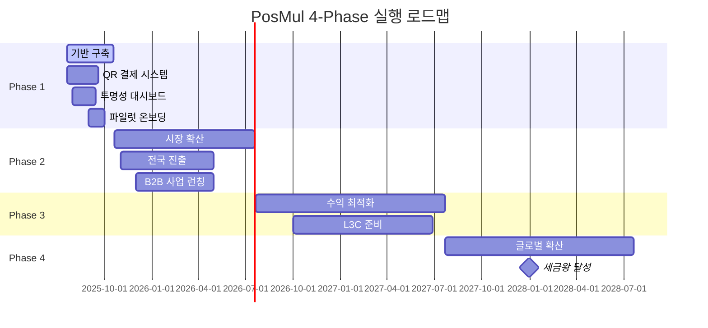

# PosMul 통합 비즈니스 전략 실행 Task List 2025

> **작성일**: 2025년 7월 21일  
> **기반**: 4개 통합 전략 (소득세금왕 + ESG BigData + Local Commerce + L3C)  
> **목표**: Phase별 체계적 실행 및 연매출 1,000억원 달성  
> **관리방식**: Todo 지속 업데이트 + Phase 완료 보고서

## 🎯 **전체 로드맵 개요**



## 📋 **Task 관리 시스템**

### **우선순위 분류**
- **🔥 High Priority**: 즉시 착수 필요 (1-3개월)
- **⚡ Medium Priority**: 단기 목표 (3-12개월)  
- **💫 Low Priority**: 중장기 목표 (1-3년)

### **완료 기준**
- ✅ **완료**: 모든 조건 충족 및 검증 완료
- 🔄 **진행중**: 착수했으나 완료되지 않음
- ⏸️ **대기중**: 다른 Task 의존성으로 대기
- ❌ **보류**: 외부 요인으로 일시 중단

---

## 🚀 **Phase 1: 즉시 실행 기반 구축 (1-3개월)**

> **Phase 목표**: MVP 기반 핵심 인프라 구축 및 파일럿 런칭  
> **성공 지표**: 파일럿 10개 매장, QR 결제 α버전, 투명성 선언

### **🔥 High Priority Tasks**

#### **Task 1.1: QR 결제 시스템 아키텍처 설계**
- **담당**: 개발팀 리드
- **기간**: 2주
- **완료 조건**:
  - [ ] 결제 대행사 선정 및 계약 (KG이니시스/토스페이먼츠)
  - [ ] QR 코드 생성 API 설계서 완성
  - [ ] PMC 리워드 연동 시스템 아키텍처
  - [ ] 보안 및 PCI DSS 준수 방안
- **예상 투자**: 30억원
- **산출물**: 기술 설계서, 개발 일정표

#### **Task 1.2: Local Store 입점 기준 및 ESG 평가 시스템**
- **담당**: 비즈니스 개발팀
- **기간**: 3주
- **완료 조건**:
  - [ ] Local Store vs 대형 프랜차이즈 구분 기준 문서화
  - [ ] ESG 점수 계산 알고리즘 개발
  - [ ] 온라인 입점 신청 시스템 구축
  - [ ] 심사 프로세스 및 승인 기준 수립
- **예상 투자**: 10억원
- **산출물**: 입점 가이드라인, ESG 평가 도구

#### **Task 1.3: 투명성 대시보드 프로토타입**
- **담당**: 프론트엔드팀
- **기간**: 6주
- **완료 조건**:
  - [ ] 실시간 소득/세금 공개 UI 완성
  - [ ] 블록체인 기반 검증 시스템 연동
  - [ ] 기부 현황 및 임팩트 측정 대시보드
  - [ ] 외부 감사 연동 API
- **예상 투자**: 20억원
- **산출물**: 투명성 포털 β버전

#### **Task 1.4: '투명성 세금왕' 브랜딩 전략**
- **담당**: 마케팅팀
- **기간**: 4주
- **완료 조건**:
  - [ ] 브랜드 아이덴티티 및 메시지 확정
  - [ ] 언론 브리핑 자료 및 보도자료 제작
  - [ ] 소셜미디어 캠페인 기획
  - [ ] "투명성 세금왕" 선언문 작성
- **예상 투자**: 5억원
- **산출물**: 브랜딩 가이드, 미디어 킷

#### **Task 1.5: PMC 리워드 시스템 구현**
- **담당**: 백엔드팀
- **기간**: 4주
- **완료 조건**:
  - [ ] ESG 점수 기반 적립률 알고리즘
  - [ ] 실시간 PMC 지급 로직 구현
  - [ ] MoneyWave1 연동 시스템
  - [ ] 사용자 리워드 대시보드
- **예상 투자**: 15억원
- **산출물**: PMC 시스템 v1.0

### **⚡ Medium Priority Tasks**

#### **Task 1.6: 파일럿 Local Store 온보딩**
- **담당**: 비즈니스 개발팀
- **기간**: 8주
- **완료 조건**:
  - [ ] 서울 3개 구 집중 지역 선정
  - [ ] 10개 파일럿 매장 선정 및 계약
  - [ ] QR 코드 설치 및 교육 완료
  - [ ] 첫 결제 테스트 성공
- **예상 투자**: 10억원
- **산출물**: 파일럿 매장 네트워크

---

## 📈 **Phase 2: 시장 확산 (3-12개월)**

> **Phase 목표**: 전국 주요 도시 확산 및 B2B 사업 본격화  
> **성공 지표**: 2,000개 매장, 월 거래액 100억원, B2G 첫 계약

### **⚡ Medium Priority Tasks**

#### **Task 2.1: 3개 광역시 진출**
- **담당**: 전국 확산팀
- **기간**: 6개월
- **완료 조건**:
  - [ ] 부산/대구 지역 파트너 발굴
  - [ ] 각 도시별 500개 매장 온보딩
  - [ ] 지자체 협력 MOU 체결
  - [ ] 월 거래액 50억원 달성
- **예상 투자**: 100억원
- **산출물**: 전국 매장 네트워크

#### **Task 2.2: 정부 B2G 첫 계약 체결**
- **담당**: 정부사업팀
- **기간**: 4개월
- **완료 조건**:
  - [ ] 서울시 디지털시민시장실 파일럿 제안
  - [ ] ESG 대시보드 정부용 프로토타입
  - [ ] 월 5천만원 규모 첫 계약 체결
  - [ ] 성과 측정 및 확산 계획
- **예상 투자**: 30억원
- **산출물**: 정부 ESG 플랫폼 v1.0

#### **Task 2.3: ESG 데이터 파이프라인 구축**
- **담당**: 데이터팀
- **기간**: 8개월
- **완료 조건**:
  - [ ] Apache Spark + TensorFlow 분석 엔진
  - [ ] IFRS S2 호환 지표 자동 생성
  - [ ] 실시간 대시보드 (15분 지연)
  - [ ] API 기반 데이터 제공 서비스
- **예상 투자**: 80억원
- **산출물**: Enterprise급 ESG 데이터 플랫폼

#### **Task 2.4: 대기업 ESG 컨설팅 런칭**
- **담당**: 컨설팅사업팀
- **기간**: 6개월
- **완료 조건**:
  - [ ] 10개 대기업 파일럿 프로젝트
  - [ ] ESG 점수 개선 컨설팅 패키지
  - [ ] 월 20억원 컨설팅 매출 달성
  - [ ] 고객 만족도 90% 이상
- **예상 투자**: 50억원
- **산출물**: B2B ESG 서비스 포트폴리오

#### **Task 2.5: 월 거래액 100억원 달성**
- **담당**: 운영팀
- **기간**: 12개월
- **완료 조건**:
  - [ ] 전국 2,000개 매장 네트워크
  - [ ] 월활성사용자 50만명
  - [ ] 평균 거래액 20만원
  - [ ] 월 수수료 매출 4억원
- **예상 투자**: 200억원
- **산출물**: 안정적 수익 구조

---

## 💰 **Phase 3: 수익 최적화 및 L3C 준비 (1-2년)**

> **Phase 목표**: 연매출 574억원 달성 및 사회적 기업 전환  
> **성공 지표**: 3개 수익원 확보, L3C 법안 통과, 임팩트 투자 유치

### **💫 Low Priority Tasks**

#### **Task 3.1: L3C 법안 발의 및 정부 협력**
- **담당**: 정책개발팀
- **기간**: 18개월
- **완료 조건**:
  - [ ] 사회적기업육성법 개정안 초안
  - [ ] 국회의원 협력 네트워크 구축
  - [ ] 시민사회단체 연대 구성
  - [ ] L3C 법안 국회 통과
- **예상 투자**: 20억원
- **산출물**: 한국형 L3C 제도 도입

#### **Task 3.2: 연매출 574억원 달성**
- **담당**: 전사
- **기간**: 24개월
- **완료 조건**:
  - [ ] Local Commerce: 144억원
  - [ ] ESG Data 사업: 350억원
  - [ ] 브랜딩 컨설팅: 80억원
  - [ ] 순이익률 25% 달성
- **예상 투자**: 300억원
- **산출물**: 다층 수익 구조 완성

#### **Task 3.3: 임팩트 투자 유치 및 L3C 거버넌스**
- **담당**: 투자유치팀
- **기간**: 12개월
- **완료 조건**:
  - [ ] 100억원 임팩트 투자 유치
  - [ ] 9명 이사회 구성 (시민 대표 포함)
  - [ ] L3C 거버넌스 구조 완성
  - [ ] 사회적 임팩트 측정 체계
- **예상 투자**: 10억원
- **산출물**: L3C 법인 전환 준비 완료

---

## 🌍 **Phase 4: 글로벌 확산 (2-3년)**

> **Phase 목표**: 연매출 1,000억원 및 소득세금왕 달성  
> **성공 지표**: 동남아 진출, 글로벌 ESG 표준, 세금왕 지위

### **💫 Low Priority Tasks**

#### **Task 4.1: 동남아 3개국 진출**
- **담당**: 글로벌사업팀
- **기간**: 18개월
- **완료 조건**:
  - [ ] 싱가포르: 500개 매장
  - [ ] 말레이시아: 1,000개 매장
  - [ ] 베트남: 2,000개 매장
  - [ ] 현지 파트너십 구축
- **예상 투자**: 200억원
- **산출물**: 아시아 ESG 네트워크

#### **Task 4.2: 연매출 1,000억원 및 세금왕 달성**
- **담당**: 전사
- **기간**: 36개월
- **완료 조건**:
  - [ ] 국내: 700억원
  - [ ] 해외: 300억원
  - [ ] 개인 소득세 200억원 납부
  - [ ] "소득세금왕" 공식 인정
- **예상 투자**: 500억원
- **산출물**: 세금왕 브랜드 완성

#### **Task 4.3: 글로벌 ESG 표준 수립**
- **담당**: 표준화팀
- **기간**: 24개월
- **완료 조건**:
  - [ ] UN SDGs 공식 파트너십
  - [ ] IFRS Foundation 협력
  - [ ] ISO 26000 새 표준 제안
  - [ ] G20 ESG 정책 자문위원
- **예상 투자**: 50억원
- **산출물**: 글로벌 ESG 리더십

---

## 📊 **Phase 완료 보고서 템플릿**

```markdown
# Phase [N] 완료 보고서
> **완료일**: YYYY-MM-DD  
> **보고 기간**: Phase [N] ([시작일] ~ [완료일])

## 📈 **전체 성과 요약**
- **Task 완료율**: X/Y tasks (XX%)
- **예산 집행률**: XXX억원/XXX억원 (XX%)
- **핵심 KPI 달성도**:
  - 매출: XXX억원 (목표 대비 XX%)
  - 사용자: XXX만명 (목표 대비 XX%)
  - 매장 수: XXX개 (목표 대비 XX%)

## 🎯 **주요 달성 성과**
### ✅ **완료된 Task들**
1. Task X.X: [Task명] - [주요 성과]
2. Task X.X: [Task명] - [주요 성과]

### 🔄 **진행중인 Task들**
1. Task X.X: [Task명] - [현재 진행률 XX%]

### ❌ **미완료/보류 Task들**
1. Task X.X: [Task명] - [보류 사유]

## 📋 **핵심 결과물**
- **기술 개발**: [완성된 시스템/기능]
- **비즈니스 성과**: [매출, 파트너십, 고객 등]
- **브랜딩**: [미디어 노출, 인지도 향상]
- **조직 역량**: [팀 확장, 전문성 강화]

## 📊 **수치적 성과**
| 지표 | 목표 | 달성 | 달성률 |
|------|------|------|--------|
| 매출 | XXX억원 | XXX억원 | XX% |
| 매장 수 | XXX개 | XXX개 | XX% |
| 사용자 | XXX만명 | XXX만명 | XX% |

## 🔍 **교훈 및 개선사항**
### 💡 **성공 요인**
- [성공한 전략/실행 방식]

### ⚠️ **위험 요인 및 대응**
- [발생한 리스크와 대응 방법]

### 🔧 **개선 필요 사항**
- [다음 Phase에서 개선할 점]

## 🚀 **다음 Phase 준비사항**
### 📝 **이월 Task**
- Task X.X: [이월 사유 및 완료 계획]

### 🎯 **새로운 우선순위**
- [시장 변화에 따른 우선순위 조정]

### 💰 **예산 계획**
- Phase [N+1] 예상 투자: XXX억원
- 주요 투자 분야: [기술/마케팅/인력 등]

### 📋 **리스크 관리**
- [예상 리스크 및 완화 방안]

## 📞 **이해관계자 피드백**
- **투자자**: [피드백 요약]
- **고객**: [만족도 및 요구사항]
- **파트너**: [협력 성과 및 개선 요청]

---
**다음 Phase 시작일**: YYYY-MM-DD  
**보고서 작성자**: [담당자명]  
**승인**: [CEO/이사회]
```

---

## 🔄 **Task 진행 및 관리 프로세스**

### **1. 주간 진행 체크**
- 매주 금요일 Task 진행률 업데이트
- 블로커 및 지연 사항 즉시 보고
- 우선순위 재조정 필요 시 논의

### **2. 월간 리뷰**
- 월말 Phase 진행률 종합 평가
- 예산 집행 현황 점검
- 다음 달 우선순위 확정

### **3. Phase 완료 기준**
- 해당 Phase 모든 High Priority Task 완료
- 핵심 KPI 목표치 80% 이상 달성
- 다음 Phase 진입 조건 충족

### **4. 위험 관리**
- 각 Task별 리스크 요인 사전 식별
- 완화 방안 및 대체 계획 수립
- 외부 의존성 최소화 전략

---

## 📞 **Task 담당자 및 연락처**

| Phase | 담당팀 | 책임자 | 연락처 |
|-------|--------|--------|--------|
| Phase 1 | 개발총괄팀 | [CTO명] | dev@posmul.com |
| Phase 2 | 사업개발팀 | [사업총괄] | business@posmul.com |
| Phase 3 | 전략기획팀 | [전략총괄] | strategy@posmul.com |
| Phase 4 | 글로벌사업팀 | [글로벌총괄] | global@posmul.com |

---

**🎊 이제 체계적인 Task 관리로 PosMul의 1,000억원 비전을 현실로 만들어보세요!**

## 🚀 **다음 액션**

현재 **Phase 1 Task 1.1 (QR 결제 시스템 아키텍처 설계)**부터 시작할 준비가 되었습니다.

어떤 Task부터 착수하시겠습니까?