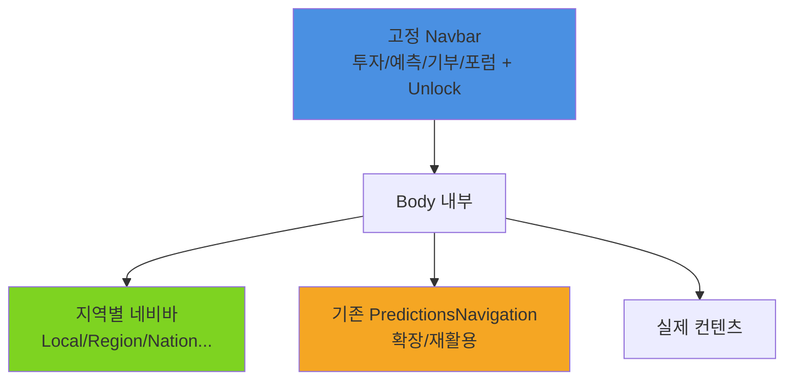

# 고정형 3단 Navbar + Body 지역별 네비 구현 가이드

## 🎯 제안된 구조 분석

### ✅ **현재 상황 (이미 구현된 부분)**

- **기존 Navbar**: 기본 4개 기능 (투자/예측/기부/포럼)
- **PredictionsNavigation**: 3-tier 구조 이미 구현됨
  - Tier 1: 예측 (고정)
  - Tier 2: invest, sports, entertainment, politics
  - Tier 3: 세부 카테고리

### 🚀 **제안 방식: 매우 구현하기 쉬움!**



## 🛠️ 구체적 구현 방안

### 1. 고정 Navbar 확장 (매우 간단)

#### 현재 Navbar.tsx 확장만 하면 됨

```typescript
// src/shared/ui/components/layout/Navbar.tsx
interface NavbarProps {
  economicBalance: EconomicBalance;
  isAuthenticated: boolean;
  userUnlockState?: UnlockState; // 추가
}

// 기존 메뉴 링크를 unlock 상태에 따라 조건부 렌더링
function NavigationLink({
  href,
  label,
  isUnlocked,
  unlockProgress
}: NavigationLinkProps) {
  if (!isUnlocked) {
    return (
      <LockedNavigationItem
        label={label}
        progress={unlockProgress}
        onClick={() => showUnlockModal(label)}
      />
    );
  }

  return (
    <Link
      href={href}
      className="text-gray-700 hover:text-blue-600 px-3 py-2 rounded-md"
    >
      {label}
    </Link>
  );
}
```

### 2. Body 지역별 네비 (완전 신규, 하지만 간단)

#### 각 기능별 layout.tsx에 추가

```typescript
// src/shared/ui/components/layout/GeographicNavbar.tsx
interface GeographicNavbarProps {
  currentFeature: 'investment' | 'prediction' | 'donation' | 'forum';
  activeScope: GeographicScope;
  availableScopes: GeographicScope[];
  onScopeChange: (scope: GeographicScope) => void;
}

export function GeographicNavbar({
  currentFeature,
  activeScope,
  availableScopes,
  onScopeChange
}: GeographicNavbarProps) {
  const scopeConfigs = {
    'Local': {
      icon: '🏠',
      label: '로컬',
      color: 'emerald',
      description: '우리 동네 예측'
    },
    'Region': {
      icon: '🌏',
      label: '지역',
      color: 'blue',
      description: '광역 단위 예측'
    },
    'Nation': {
      icon: '🇰🇷',
      label: '국가',
      color: 'purple',
      description: '전국 단위 예측'
    },
    'Colony': {
      icon: '🌍',
      label: '연합',
      color: 'indigo',
      description: '국제 협력 예측'
    },
    'Universe': {
      icon: '🌌',
      label: '우주',
      color: 'pink',
      description: '우주 시대 예측'
    }
  };

  return (
    <div className="bg-gradient-to-r from-gray-50 to-white border-b border-gray-200">
      <div className="max-w-7xl mx-auto px-4 sm:px-6 lg:px-8">
        <div className="flex items-center space-x-1 py-3">
          {/* 지역 범위 탭들 */}
          {availableScopes.map((scope) => {
            const config = scopeConfigs[scope];
            const isActive = activeScope === scope;

            return (
              <button
                key={scope}
                onClick={() => onScopeChange(scope)}
                className={cn(
                  "flex items-center space-x-2 px-4 py-2 rounded-lg font-medium transition-all",
                  "hover:bg-white hover:shadow-sm",
                  isActive
                    ? `bg-${config.color}-50 text-${config.color}-700 border border-${config.color}-200 shadow-sm`
                    : "text-gray-600 hover:text-gray-900"
                )}
                title={config.description}
              >
                <span className="text-lg">{config.icon}</span>
                <span className="text-sm">{config.label}</span>
                {isActive && (
                  <span className="text-xs bg-white px-2 py-0.5 rounded-full">
                    활성
                  </span>
                )}
              </button>
            );
          })}

          {/* 잠긴 범위들 미리보기 */}
          <div className="flex items-center space-x-1 ml-4">
            {Object.entries(scopeConfigs)
              .filter(([scope]) => !availableScopes.includes(scope as GeographicScope))
              .map(([scope, config]) => (
                <div
                  key={scope}
                  className="flex items-center space-x-1 px-3 py-1 rounded-md bg-gray-100 text-gray-400"
                  title={`${config.description} (잠김)`}
                >
                  <span className="text-sm opacity-50">{config.icon}</span>
                  <span className="text-xs">🔒</span>
                </div>
              ))}
          </div>
        </div>
      </div>
    </div>
  );
}
```

### 3. 기존 PredictionsNavigation 재활용 및 확장

#### 현재 코드를 지역별로 확장만 하면 됨

```typescript
// PredictionsNavigation.tsx 확장
const navigationDataByScope = {
  Local: {
    invest: {
      title: "💼 로컬 투자 예측",
      subcategories: [
        { slug: "local-restaurants", title: "동네 맛집", description: "우리 동네 식당 예측" },
        { slug: "local-shops", title: "동네 상점", description: "지역 소상공인" },
        { slug: "local-events", title: "동네 행사", description: "지역 이벤트" },
      ]
    },
    sports: {
      title: "⚽ 로컬 스포츠",
      subcategories: [
        { slug: "local-soccer", title: "동네 축구", description: "지역 축구팀" },
        { slug: "local-baseball", title: "동네 야구", description: "지역 야구팀" },
      ]
    }
  },
  Region: {
    invest: {
      title: "💼 지역 투자 예측",
      subcategories: [
        { slug: "region-companies", title: "지역 기업", description: "광역단위 기업" },
        { slug: "region-infrastructure", title: "인프라", description: "지역 개발" },
      ]
    },
    sports: {
      title: "⚽ 지역 스포츠",
      subcategories: [
        { slug: "k-league", title: "K리그", description: "프로축구" },
        { slug: "kbo", title: "KBO", description: "프로야구" },
      ]
    }
  }
  // Nation, Colony, Universe도 동일하게...
};

// 지역 범위에 따른 네비게이션 데이터 선택
export function PredictionsNavigation({ currentScope = 'Local' }: PredictionsNavigationProps) {
  const navigationData = navigationDataByScope[currentScope];

  // 기존 로직 그대로, 단지 데이터만 범위별로 변경
  return (
    <nav className="bg-white border-b border-gray-200">
      {/* 기존 UI 코드 재활용 */}
    </nav>
  );
}
```

### 4. Layout에서 통합 (매우 간단)

```typescript
// apps/posmul-web/src/app/prediction/layout.tsx (기존 파일 수정)
export default function PredictionLayout({ children }: PredictionLayoutProps) {
  const [activeScope, setActiveScope] = useState<GeographicScope>('Local');
  const userUnlockState = useUnlockState();

  return (
    <div className="min-h-screen bg-gray-50">
      {/* 1. 지역별 네비바 추가 */}
      <GeographicNavbar
        currentFeature="prediction"
        activeScope={activeScope}
        availableScopes={userUnlockState.availableScopes}
        onScopeChange={setActiveScope}
      />

      {/* 2. 기존 PredictionsNavigation 확장 */}
      <PredictionsNavigation currentScope={activeScope} />

      {/* 3. 기존 컨텐츠 그대로 */}
      <div className="max-w-7xl mx-auto px-4 sm:px-6 lg:px-8 py-6">
        <MoneyWaveStatus />
      </div>

      <div className="max-w-7xl mx-auto px-4 sm:px-6 lg:px-8 pb-8">
        {children}
      </div>
    </div>
  );
}
```

## 🎮 Unlock 시스템 통합

### Unlock 상태 관리

```typescript
// src/shared/hooks/useUnlockState.ts
export function useUnlockState() {
  const [unlockState, setUnlockState] = useState<UnlockState>({
    unlockedFeatures: ["investment"], // 항상 해제
    availableScopes: ["Local"], // 기본은 Local만
    progress: {
      prediction: 45, // PMP 100 중 45 달성
      donation: 0, // 아직 시작 안함
      forum: 0, // 아직 시작 안함
    },
  });

  const canUnlockPrediction = unlockState.progress.prediction >= 100;
  const canUnlockDonation =
    unlockState.unlockedFeatures.includes("prediction") &&
    unlockState.progress.donation >= 100;

  return {
    ...unlockState,
    canUnlockPrediction,
    canUnlockDonation,
    unlockFeature: (feature: string) => {
      setUnlockState((prev) => ({
        ...prev,
        unlockedFeatures: [...prev.unlockedFeatures, feature],
      }));
    },
  };
}
```

### Unlock Modal 컴포넌트

```typescript
// src/shared/ui/components/UnlockModal.tsx
export function UnlockModal({
  feature,
  progress,
  requirements,
  onClose
}: UnlockModalProps) {
  return (
    <div className="fixed inset-0 bg-black bg-opacity-50 flex items-center justify-center z-50">
      <div className="bg-white rounded-xl p-6 max-w-md w-full mx-4">
        <div className="text-center">
          {/* 자물쇠 아이콘 + 애니메이션 */}
          <div className="mx-auto w-16 h-16 bg-gray-100 rounded-full flex items-center justify-center mb-4">
            <span className="text-2xl">🔒</span>
          </div>

          <h3 className="text-lg font-semibold mb-2">
            {feature} 기능 해제 조건
          </h3>

          {/* 진행률 바 */}
          <div className="bg-gray-200 rounded-full h-2 mb-4">
            <div
              className="bg-blue-500 h-2 rounded-full transition-all"
              style={{ width: `${progress}%` }}
            />
          </div>

          <p className="text-sm text-gray-600 mb-4">
            {progress}% 완료 ({100 - progress}% 남음)
          </p>

          {/* 요구사항 리스트 */}
          <div className="text-left space-y-2 mb-6">
            {requirements.map((req, index) => (
              <div key={index} className="flex items-center space-x-2">
                <span className={req.completed ? "✅" : "⭕"}>
                  {req.completed ? "✅" : "⭕"}
                </span>
                <span className="text-sm">{req.description}</span>
              </div>
            ))}
          </div>

          {progress >= 90 && (
            <div className="bg-yellow-50 border border-yellow-200 rounded-lg p-3 mb-4">
              <p className="text-sm text-yellow-700">
                🎉 거의 다 왔어요! 조금만 더 하시면 해제됩니다!
              </p>
            </div>
          )}

          <button
            onClick={onClose}
            className="w-full bg-blue-500 text-white py-2 px-4 rounded-lg hover:bg-blue-600"
          >
            확인
          </button>
        </div>
      </div>
    </div>
  );
}
```

## 📱 모바일 최적화 (간단함)

### 모바일에서는 지역 네비를 탭으로

```typescript
// GeographicNavbar 모바일 버전
function MobileGeographicNavbar({ activeScope, availableScopes, onScopeChange }: Props) {
  return (
    <div className="md:hidden bg-white border-b">
      <div className="flex overflow-x-auto px-4 py-2">
        {availableScopes.map((scope) => (
          <button
            key={scope}
            onClick={() => onScopeChange(scope)}
            className={cn(
              "flex-shrink-0 px-3 py-1.5 rounded-full text-sm font-medium mr-2",
              activeScope === scope
                ? "bg-blue-100 text-blue-700"
                : "text-gray-600"
            )}
          >
            {scopeConfigs[scope].icon} {scopeConfigs[scope].label}
          </button>
        ))}
      </div>
    </div>
  );
}
```

## 🚀 구현 난이도 및 우선순위

### ⚡ **매우 쉬움 (1-2일)**

1. **기존 Navbar에 Unlock 상태 추가**
   - prop 하나 추가
   - 조건부 렌더링 로직
   - 간단한 잠긴 상태 UI

2. **GeographicNavbar 컴포넌트 생성**
   - 독립적인 컴포넌트
   - 기존 코드와 충돌 없음

### 🔧 **쉬움 (3-5일)**

1. **PredictionsNavigation 확장**
   - 기존 코드 재활용
   - 데이터 구조만 확장

2. **Layout 통합**
   - 기존 layout.tsx 수정
   - 상태 관리 추가

### 🎨 **중간 (1주)**

1. **Unlock Modal 및 애니메이션**
   - 모달 컴포넌트 생성
   - 진행률 UI
   - 축하 효과

## 💡 **결론: 매우 구현하기 쉬움!**

### ✅ **장점들**

1. **기존 코드 최대 활용**: PredictionsNavigation 재활용
2. **점진적 구현 가능**: 단계별로 추가 가능
3. **독립적 컴포넌트**: 서로 영향 없음
4. **확장성 좋음**: 새로운 기능 쉽게 추가
5. **모바일 친화적**: 탭 형태로 자연스러움

### 🎯 **추천 구현 순서**

1. **GeographicNavbar** 먼저 구현 (1일)
2. **기존 Navbar Unlock 상태** 추가 (1일)
3. **Layout 통합** (1일)
4. **PredictionsNavigation 확장** (2일)
5. **Unlock Modal** (2일)

이 방식이 **가장 실용적이고 구현하기 쉬운** 방법인 것 같아요! 기존 코드를 최대한 활용하면서도 복잡한 네비게이션 요구사항을 충족할 수 있습니다.

어떤 부분부터 구현해보고 싶으신가요? 🚀
