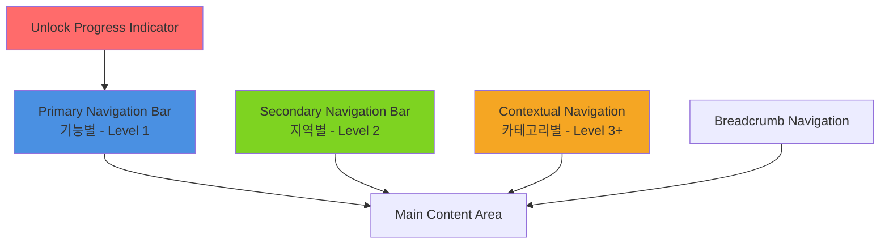

# PosMul 다층 네비게이션 구현 방안

## 📋 현재 상황 분석

### 기존 네비게이션 구조

```typescript
// 현재: 단순한 1-Level Navbar
<Navbar>
  - 예측 | 투자 | 기부 | 포럼
</Navbar>
```

### 설계된 복잡한 네비게이션 요구사항

```
Level 1: Investment | Prediction | Donation | Forum | Ranking
Level 2: Local | Region | Nation | Colony | Universe
Level 3: Sport/Economy | Food/Service | Politics/Budget
Level 4: Soccer/Baseball | Restaurant/Cafe | Election/Policy
Level 5: Create/Join/Manage/Share
```

## 🎯 추천 솔루션: 3-Tier 네비게이션 시스템

### 구조 개요



### 1. Primary Navigation Bar (고정, 상단)

#### 역할 및 기능

- **Level 1**: 핵심 기능 (Investment, Prediction, Donation, Forum, Ranking)
- **Unlock 상태 시각화**: 잠긴 기능 표시 및 진행률
- **경제 정보**: PMP/PMC 잔액 표시
- **사용자 인증**: 로그인/프로필 관리

#### 구현 위치

```typescript
// apps/posmul-web/src/app/layout.tsx
<div className="flex flex-col min-h-screen">
  <PrimaryNavbar /> {/* 기존 Navbar 확장 */}
  <main className="flex-1">
    {children}
  </main>
</div>
```

### 2. Secondary Navigation Bar (컨텍스트별, 기능 페이지 상단)

#### 역할 및 기능

- **Level 2**: 지역 범위 (Local, Region, Nation, Colony, Universe)
- **동적 활성화**: 사용자 레벨에 따른 범위 제한
- **컨텍스트 스위치**: 지역 범위 전환

#### 구현 위치

```typescript
// 각 기능별 레이아웃에서 구현
// apps/posmul-web/src/app/(features)/layout.tsx
<div>
  <SecondaryNavbar currentFeature="prediction" />
  <main>{children}</main>
</div>
```

### 3. Contextual Navigation (페이지 내, 사이드바/탭)

#### 역할 및 기능

- **Level 3+**: 세부 카테고리 및 필터
- **동적 메뉴**: 선택된 기능/범위에 따른 메뉴 변경
- **필터 및 정렬**: 상세 탐색 옵션

#### 구현 위치

```typescript
// 각 기능 페이지 내에서 구현
// apps/posmul-web/src/app/prediction/layout.tsx
<div className="flex">
  <ContextualSidebar />
  <main className="flex-1">{children}</main>
</div>
```

## 🏗️ 구체적 구현 계획

### Phase 1: Primary Navigation 확장 (우선순위 1)

#### 1.1 기존 Navbar.tsx 확장

```typescript
// src/shared/ui/components/layout/PrimaryNavbar.tsx
interface PrimaryNavbarProps {
  economicBalance: EconomicBalance;
  isAuthenticated: boolean;
  userUnlockState: UnlockState; // 새로 추가
}

export function PrimaryNavbar({
  economicBalance,
  isAuthenticated,
  userUnlockState
}: PrimaryNavbarProps) {
  return (
    <nav className="bg-white dark:bg-gray-800 shadow-sm border-b">
      <div className="max-w-7xl mx-auto px-4">
        <div className="flex justify-between h-16">
          {/* Logo */}
          <Logo />

          {/* Main Navigation with Unlock States */}
          <NavigationMenu unlockState={userUnlockState} />

          {/* Economic Balance & Auth */}
          <UserControls
            economicBalance={economicBalance}
            isAuthenticated={isAuthenticated}
          />
        </div>
      </div>
    </nav>
  );
}
```

#### 1.2 Unlock 상태 통합 네비게이션 메뉴

```typescript
// NavigationMenu 컴포넌트 상세 구현
interface NavigationMenuProps {
  unlockState: UnlockState;
}

function NavigationMenu({ unlockState }: NavigationMenuProps) {
  const menuItems = [
    { key: 'investment', label: '투자', href: '/investment', alwaysEnabled: true },
    { key: 'prediction', label: '예측', href: '/prediction', unlockRequired: true },
    { key: 'donation', label: '기부', href: '/donation', unlockRequired: true },
    { key: 'forum', label: '포럼', href: '/forum', unlockRequired: true },
    { key: 'ranking', label: '랭킹', href: '/ranking', alwaysEnabled: true },
  ];

  return (
    <div className="flex items-center space-x-2">
      {menuItems.map((item) => (
        <NavigationItem
          key={item.key}
          item={item}
          unlockState={unlockState}
        />
      ))}
    </div>
  );
}

function NavigationItem({ item, unlockState }: NavigationItemProps) {
  const isUnlocked = item.alwaysEnabled || unlockState.unlockedFeatures.includes(item.key);
  const canUnlock = unlockState.canUnlock(item.key);

  if (!isUnlocked) {
    return (
      <LockedNavigationItem
        item={item}
        progress={unlockState.getProgress(item.key)}
        canUnlock={canUnlock}
      />
    );
  }

  return (
    <Link
      href={item.href}
      className="px-3 py-2 rounded-md text-sm font-medium hover:bg-gray-100"
    >
      {item.label}
    </Link>
  );
}
```

#### 1.3 잠긴 메뉴 아이템 컴포넌트

```typescript
function LockedNavigationItem({ item, progress, canUnlock }: LockedItemProps) {
  const [showModal, setShowModal] = useState(false);

  return (
    <>
      <button
        onClick={() => setShowModal(true)}
        className={cn(
          "px-3 py-2 rounded-md text-sm font-medium relative",
          "text-gray-400 cursor-pointer hover:text-gray-600",
          canUnlock && "animate-pulse bg-yellow-50 text-yellow-700"
        )}
      >
        <span className="flex items-center">
          🔒 {item.label}
          {canUnlock && <span className="ml-1 text-xs">✨</span>}
        </span>

        {/* 진행률 바 */}
        <div className="absolute bottom-0 left-0 h-0.5 bg-blue-500 transition-all"
             style={{ width: `${progress}%` }} />
      </button>

      {showModal && (
        <UnlockModal
          item={item}
          progress={progress}
          onClose={() => setShowModal(false)}
        />
      )}
    </>
  );
}
```

### Phase 2: Secondary Navigation 구현

#### 2.1 지역별 네비게이션 바

```typescript
// src/shared/ui/components/layout/SecondaryNavbar.tsx
interface SecondaryNavbarProps {
  currentFeature: 'investment' | 'prediction' | 'donation' | 'forum';
  activeScope: GeographicScope;
  availableScopes: GeographicScope[];
  onScopeChange: (scope: GeographicScope) => void;
}

export function SecondaryNavbar({
  currentFeature,
  activeScope,
  availableScopes,
  onScopeChange
}: SecondaryNavbarProps) {
  return (
    <div className="bg-gray-50 dark:bg-gray-800 border-b border-gray-200">
      <div className="max-w-7xl mx-auto px-4">
        <div className="flex items-center h-12 space-x-1">
          {/* 지역 범위 탭 */}
          {availableScopes.map((scope) => (
            <ScopeTab
              key={scope}
              scope={scope}
              isActive={activeScope === scope}
              onClick={() => onScopeChange(scope)}
            />
          ))}

          {/* 미래 범위 미리보기 */}
          <FutureScopePreview currentFeature={currentFeature} />
        </div>
      </div>
    </div>
  );
}

function ScopeTab({ scope, isActive, onClick }: ScopeTabProps) {
  const scopeConfig = {
    'Local': { label: '🏠 로컬', color: 'green' },
    'Region': { label: '🌏 지역', color: 'blue' },
    'Nation': { label: '🇰🇷 국가', color: 'purple' },
    'Colony': { label: '🌍 식민지', color: 'indigo' },
    'Universe': { label: '🌌 우주', color: 'pink' }
  };

  const config = scopeConfig[scope];

  return (
    <button
      onClick={onClick}
      className={cn(
        "px-3 py-1.5 rounded-md text-sm font-medium transition-all",
        isActive
          ? `bg-${config.color}-100 text-${config.color}-700 border border-${config.color}-300`
          : "text-gray-600 hover:text-gray-900 hover:bg-gray-100"
      )}
    >
      {config.label}
    </button>
  );
}
```

#### 2.2 기능별 레이아웃 그룹

```typescript
// apps/posmul-web/src/app/(features)/layout.tsx
export default function FeaturesLayout({
  children,
}: {
  children: React.ReactNode;
}) {
  // 현재 경로에서 기능 파악
  const currentFeature = useFeatureFromPath();
  const userUnlockState = useUnlockState();
  const [activeScope, setActiveScope] = useGeographicScope();

  return (
    <div>
      <SecondaryNavbar
        currentFeature={currentFeature}
        activeScope={activeScope}
        availableScopes={userUnlockState.availableScopes}
        onScopeChange={setActiveScope}
      />

      <div className="max-w-7xl mx-auto px-4 py-6">
        {children}
      </div>
    </div>
  );
}
```

### Phase 3: Contextual Navigation 구현

#### 3.1 사이드바 네비게이션

```typescript
// src/shared/ui/components/layout/ContextualSidebar.tsx
interface ContextualSidebarProps {
  feature: string;
  scope: GeographicScope;
  categories: NavigationCategory[];
}

export function ContextualSidebar({
  feature,
  scope,
  categories
}: ContextualSidebarProps) {
  return (
    <aside className="w-64 bg-white dark:bg-gray-800 border-r border-gray-200">
      <div className="p-4">
        <h3 className="text-sm font-semibold text-gray-900 dark:text-white mb-3">
          카테고리
        </h3>

        <nav className="space-y-1">
          {categories.map((category) => (
            <CategoryItem
              key={category.id}
              category={category}
              feature={feature}
              scope={scope}
            />
          ))}
        </nav>
      </div>
    </aside>
  );
}

function CategoryItem({ category, feature, scope }: CategoryItemProps) {
  const isExpanded = category.children && category.children.length > 0;

  return (
    <div>
      <Link
        href={`/${feature}/${scope.toLowerCase()}/${category.slug}`}
        className="flex items-center px-3 py-2 text-sm rounded-md hover:bg-gray-100"
      >
        <span className="mr-3">{category.icon}</span>
        {category.label}
        {isExpanded && <ChevronRightIcon className="ml-auto h-4 w-4" />}
      </Link>

      {isExpanded && (
        <div className="ml-6 mt-1 space-y-1">
          {category.children.map((subcategory) => (
            <SubCategoryItem
              key={subcategory.id}
              subcategory={subcategory}
              feature={feature}
              scope={scope}
              parentSlug={category.slug}
            />
          ))}
        </div>
      )}
    </div>
  );
}
```

## 📱 반응형 구현 전략

### 모바일 네비게이션

```typescript
// 모바일에서는 햄버거 메뉴 + 드로어 방식
function MobileNavigation({ unlockState }: MobileNavigationProps) {
  const [isOpen, setIsOpen] = useState(false);

  return (
    <>
      {/* 햄버거 메뉴 버튼 */}
      <button
        onClick={() => setIsOpen(true)}
        className="md:hidden p-2"
      >
        <MenuIcon className="h-6 w-6" />
      </button>

      {/* 드로어 메뉴 */}
      <Drawer isOpen={isOpen} onClose={() => setIsOpen(false)}>
        <MobileNavigationContent unlockState={unlockState} />
      </Drawer>
    </>
  );
}

function MobileNavigationContent({ unlockState }: MobileContentProps) {
  return (
    <div className="p-4">
      {/* Level 1: 기능별 */}
      <div className="space-y-2 mb-6">
        <h3 className="text-sm font-semibold text-gray-500">주요 기능</h3>
        <MobileFeatureLinks unlockState={unlockState} />
      </div>

      {/* Level 2: 지역별 */}
      <div className="space-y-2 mb-6">
        <h3 className="text-sm font-semibold text-gray-500">지역 범위</h3>
        <MobileScopeSelector />
      </div>

      {/* Level 3+: 카테고리 */}
      <div className="space-y-2">
        <h3 className="text-sm font-semibold text-gray-500">카테고리</h3>
        <MobileCategoryLinks />
      </div>
    </div>
  );
}
```

## 🔄 URL 구조 및 라우팅

### URL 패턴 설계

```typescript
// URL 구조: /[feature]/[scope]/[category]/[subcategory]
// 예시:
// /prediction/local/sport/soccer
// /investment/region/food/restaurant
// /donation/nation/education/university

// 동적 라우팅 구조
// apps/posmul-web/src/app/[feature]/[scope]/[category]/[subcategory]/page.tsx
```

### 라우팅 Hook

```typescript
// src/shared/hooks/useNavigationState.ts
export function useNavigationState() {
  const pathname = usePathname();
  const router = useRouter();

  const { feature, scope, category, subcategory } = useMemo(() => {
    const segments = pathname.split("/").filter(Boolean);
    return {
      feature: segments[0] as Feature,
      scope: segments[1] as GeographicScope,
      category: segments[2],
      subcategory: segments[3],
    };
  }, [pathname]);

  const navigateToScope = useCallback(
    (newScope: GeographicScope) => {
      const newPath = `/${feature}/${newScope.toLowerCase()}`;
      router.push(newPath);
    },
    [feature, router]
  );

  const navigateToCategory = useCallback(
    (newCategory: string) => {
      const newPath = `/${feature}/${scope.toLowerCase()}/${newCategory}`;
      router.push(newPath);
    },
    [feature, scope, router]
  );

  return {
    currentState: { feature, scope, category, subcategory },
    navigateToScope,
    navigateToCategory,
  };
}
```

## ⚡ 성능 최적화 전략

### 1. 메뉴 데이터 캐싱

```typescript
// 메뉴 구조는 사용자별로 캐싱
const menuCache = new Map<string, NavigationStructure>();

export function useNavigationMenu(userId: string, unlockState: UnlockState) {
  return useMemo(() => {
    const cacheKey = `${userId}-${unlockState.version}`;

    if (menuCache.has(cacheKey)) {
      return menuCache.get(cacheKey);
    }

    const menu = generateNavigationStructure(unlockState);
    menuCache.set(cacheKey, menu);
    return menu;
  }, [userId, unlockState]);
}
```

### 2. 지연 로딩

```typescript
// 복잡한 카테고리 메뉴는 지연 로딩
const ContextualSidebar = lazy(() => import('./ContextualSidebar'));

function FeatureLayout({ children }: FeatureLayoutProps) {
  return (
    <div className="flex">
      <Suspense fallback={<SidebarSkeleton />}>
        <ContextualSidebar />
      </Suspense>
      <main className="flex-1">{children}</main>
    </div>
  );
}
```

## 🎯 구현 우선순위 로드맵

### Phase 1: 기초 인프라 (2024 Q4)

1. ✅ **PrimaryNavbar 확장**
   - Unlock 상태 통합
   - 잠긴 메뉴 아이템 UI
   - 기본 진행률 표시

2. ✅ **URL 구조 정의**
   - 동적 라우팅 설정
   - 네비게이션 Hook 구현

3. ✅ **모바일 반응형**
   - 햄버거 메뉴
   - 드로어 네비게이션

### Phase 2: 중간층 구현 (2025 Q1)

1. **SecondaryNavbar 구현**
   - 지역 범위 탭
   - 컨텍스트 전환 로직

2. **기능별 레이아웃 그룹**
   - 각 기능별 전용 레이아웃
   - 공통 컴포넌트 추상화

### Phase 3: 고급 기능 (2025 Q2)

1. **ContextualSidebar**
   - 카테고리별 상세 네비게이션
   - 동적 메뉴 생성

2. **성능 최적화**
   - 메뉴 캐싱
   - 지연 로딩

3. **AI 기반 개인화**
   - 사용자별 맞춤 메뉴 순서
   - 추천 카테고리

## 💡 결론 및 추천사항

### 🎯 **추천: 3-Tier 네비게이션 + 단계적 구현**

1. **기존 Navbar 확장** → PrimaryNavbar (Level 1)
2. **SecondaryNavbar 신규** → 지역 범위 (Level 2)
3. **ContextualSidebar 신규** → 카테고리 (Level 3+)

### 🏗️ **구현 위치**

- **Primary**: `layout.tsx`에서 전역 적용
- **Secondary**: `(features)/layout.tsx`에서 기능별 적용
- **Contextual**: 각 페이지 내에서 필요시 적용

이렇게 하면 복잡한 네비게이션을 단계적으로 구현하면서도 사용자 경험을 해치지 않고 확장성을 보장할 수 있습니다! 🚀

어떤 부분부터 시작하고 싶으신가요?
