# PosMul 네비게이션 아키텍처 설계 문서

## 📋 문제 정의

### 현재 상황

- **종목별 분류**: soccer/sport/prediction 등 3-depth 구조
- **지역별 확장**: Local → Region → Nation → Colony → Universe (50년 계획)
- **4개 핵심 도메인**: Investment, Prediction, Donation, Forum
- **복잡도 폭증**: 기존 3-depth로는 한계

### 핵심 과제

- 50년간 확장 가능한 네비게이션 구조 설계
- 사용자 경험 최적화 (복잡성 vs 접근성)
- 일관된 정보 아키텍처 구축
- 점진적 기능 노출 (Progressive Disclosure)

## 🎯 혁신적 네비게이션 아키텍처 제안

### 1. 이중 축 네비게이션 시스템 (Dual-Axis Navigation)

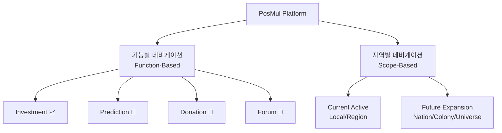

#### 기능별 축 (Function-Based Navigation)

- **1차 네비**: Investment, Prediction, Donation, Forum
- **일관된 구조**: 모든 기능에서 동일한 하위 분류 체계

#### 지역별 축 (Scope-Based Navigation)

- **동적 활성화**: 현재는 Local/Region만 활성화
- **점진적 노출**: Nation → Colony → Universe 순차 활성화
- **컨텍스트 스위치**: 사용자가 지역 범위 선택 가능

### 2. 적응형 메뉴 구조 (Adaptive Menu Architecture)

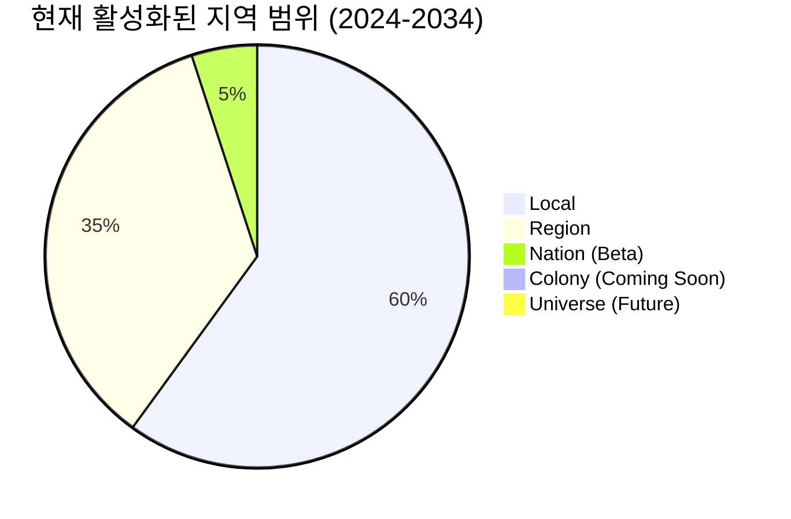

#### Phase 1: 현재-10년 (2024-2034)

```
📈 Investment
├── 💰 Local League ✅
├── 🏢 Major League ✅
├── ☁️ Cloud Funding ✅
├── 🌏 Region League (Beta)
└── 🚀 Upcoming Leagues (Disabled)

🔮 Prediction
├── 🏠 Local Events ✅
├── ⚽ Sports
│   ├── Local Soccer ✅
│   ├── Regional Soccer (Beta)
│   └── National Soccer (Coming)
├── 🌏 Regional Events (Beta)
└── 🚀 Future Scopes (Disabled)
```

#### Phase 2: 중기-25년 (2035-2049)

```
🔮 Prediction
├── 🏠 Local Events
├── 🌏 Regional Events
├── 🇰🇷 National Events ✅
├── 🌍 Colony Events (Beta)
└── 🌌 Universe Events (Coming)
```

### 3. 스마트 컨텍스트 네비게이션

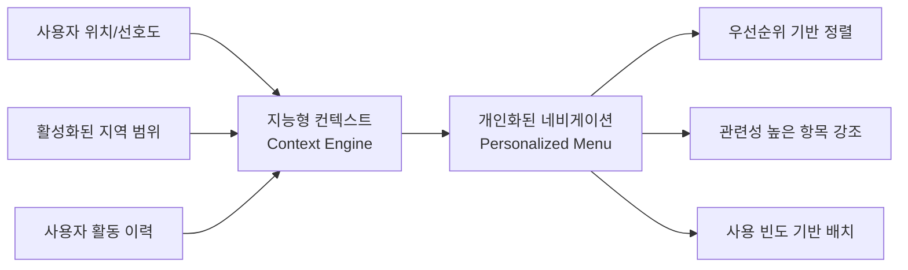

#### 구현 전략

- **위치 기반**: 사용자 위치에 따른 Local/Regional 우선 노출
- **관심사 기반**: 활동 이력 분석으로 개인화
- **점진적 확장**: 새로운 지역 범위 활성화 시 알림 및 안내

## 🏗️ 구체적 네비게이션 구조

### 최종 권장 구조: 하이브리드 3+2 Depth

```
Level 1 (기능): Investment | Prediction | Donation | Forum | Ranking
Level 2 (범위): Local | Region | Nation | Colony | Universe
Level 3 (카테고리): Sport/Economy/Politics | Soccer/Baseball | etc.
Level 4 (세부): Specific Events/Projects/Categories
Level 5 (액션): Create/Participate/Manage
```

### Investment 예시

```
📈 Investment
├── 🏠 Local (현재 활성)
│   ├── Local League
│   │   ├── 식품 🍜
│   │   ├── 의류 👕
│   │   └── 서비스 🛠️
│   └── Region League (Beta)
├── 🇰🇷 Nation (Coming Soon)
│   ├── Nation League
│   └── Government Projects
├── 🌍 Colony (Future)
└── 🌌 Universe (Future)
```

### Prediction 예시

```
🔮 Prediction
├── 🏠 Local (현재 활성)
│   ├── 스포츠 ⚽
│   │   ├── 지역 축구 리그
│   │   └── 지역 야구 리그
│   ├── 경제 💼
│   └── 정치 🗳️
├── 🌏 Region (Beta)
│   ├── 스포츠 ⚽
│   │   ├── K리그
│   │   └── KBO
│   └── 광역 선거
├── 🇰🇷 Nation (Coming Soon)
├── 🌍 Colony (Future)
└── 🌌 Universe (Future)
```

## � 게임화 Unlock 시스템 설계

### 1. Local 기능별 Unlock 전략

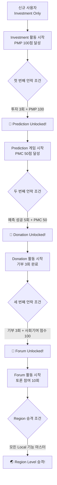

### 2. 상세 Unlock 조건 시스템

#### 🔮 Prediction Unlock 조건

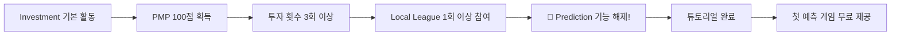

**구체적 요구사항:**

- **PMP 획득**: Investment 활동으로 100 PMP 적립
- **활동 횟수**: 최소 3회 이상 투자 참여
- **다양성**: Local League 최소 1회 참여 (Major League만으론 불가)
- **보너스**: 해제 시 첫 예측 게임 10 PMP 무료 제공

#### 💝 Donation Unlock 조건

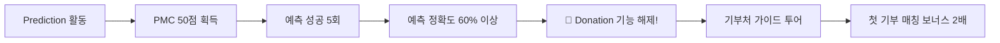

**구체적 요구사항:**

- **PMC 획득**: Prediction 성공으로 50 PMC 적립
- **성공 경험**: 최소 5회 예측 성공
- **정확도**: 전체 예측 정확도 60% 이상 유지
- **보너스**: 해제 시 첫 기부 매칭 보너스 2배 적용

#### 💬 Forum Unlock 조건

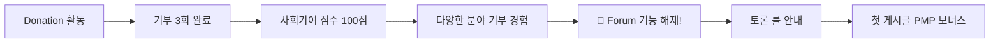

**구체적 요구사항:**

- **기부 횟수**: 최소 3회 이상 기부 완료
- **사회기여 점수**: 기부 영향력 분석으로 100점 달성
- **다양성**: 최소 2개 이상 다른 분야/기관에 기부
- **보너스**: 해제 시 첫 게시글 작성 시 10 PMP 보너스

### 3. 시각적 진행 시스템

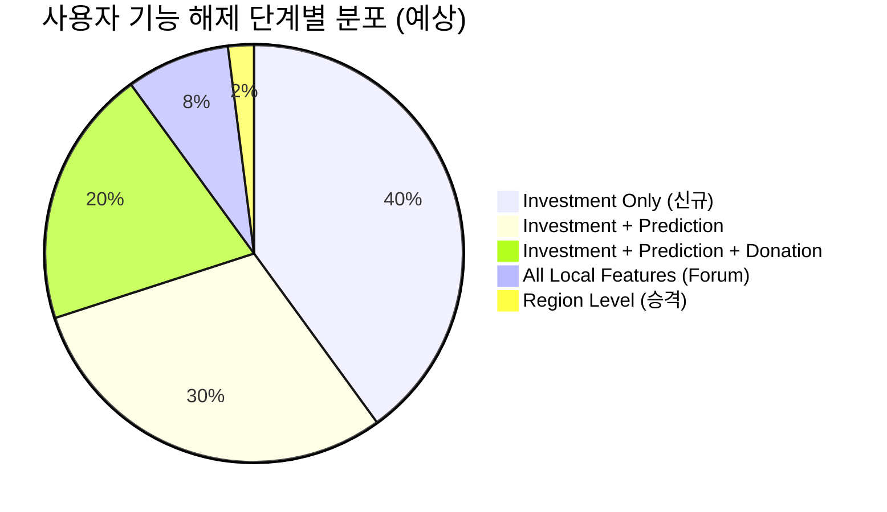

#### 진행률 표시 UI 컴포넌트

```typescript
interface UnlockProgress {
  currentLevel: "Investment" | "Prediction" | "Donation" | "Forum" | "Region";
  nextUnlock: {
    feature: string;
    requirements: UnlockRequirement[];
    progress: number; // 0-100%
    estimatedTime: string;
  };
  completedChallenges: string[];
  availableBonuses: Bonus[];
}

interface UnlockRequirement {
  type: "PMP" | "PMC" | "ActivityCount" | "AccuracyRate" | "Diversity";
  current: number;
  required: number;
  description: string;
}
```

## �🎨 사용자 경험 최적화 방안

### 1. 게임화된 단계적 기능 노출 (Gamified Progressive Disclosure)

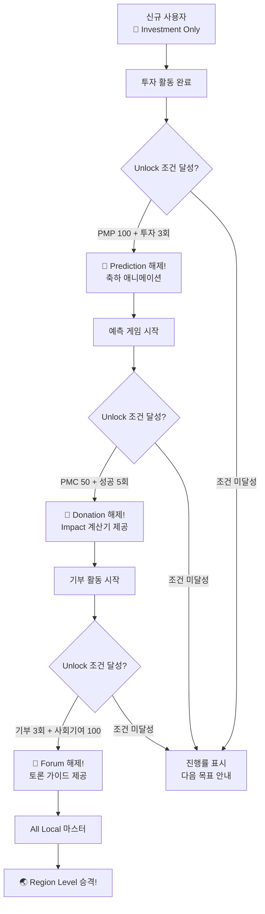

### 4. Unlock 알림 및 보상 시스템

#### 🎊 Unlock 성공 시 경험

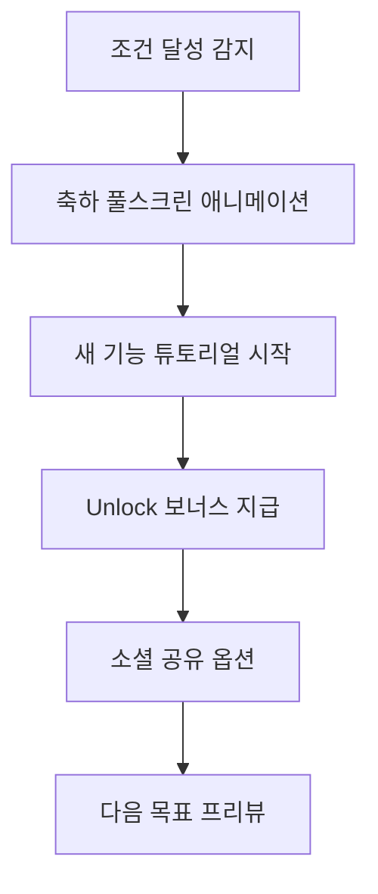

#### 🎁 Unlock 보너스 패키지

- **Prediction Unlock**:
  - 첫 예측 게임 10 PMP 무료 제공
  - 예측 가이드 PDF 다운로드
  - "예측 초보자" 뱃지 획득
- **Donation Unlock**:
  - 첫 기부 매칭 보너스 2배 (최대 50 PMC)
  - 사회기여 영향력 계산기 제공
  - "선행자" 뱃지 획득
- **Forum Unlock**:
  - 첫 게시글 작성 시 10 PMP 보너스
  - 토론 매너 가이드 제공
  - "토론가" 뱃지 획득

### 5. 진행률 추적 및 동기부여 시스템

#### 📊 실시간 진행률 대시보드

```typescript
interface UnlockDashboard {
  currentPhase: {
    name: string;
    completionRate: number;
    nextMilestone: string;
  };
  requirements: {
    completed: UnlockRequirement[];
    pending: UnlockRequirement[];
    tips: string[];
  };
  recentAchievements: Achievement[];
  friendsProgress: FriendProgress[]; // 소셜 비교
}
```

#### 🏆 성취 시스템 통합

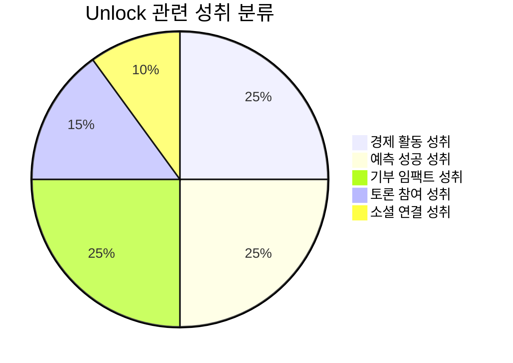

**구체적 성취 예시:**

- 🥇 **Investment Master**: PMP 1000점 달성
- 🎯 **Prediction Guru**: 연속 10회 예측 성공
- 💝 **Generous Heart**: 누적 기부 PMC 500점
- 💬 **Discussion Leader**: 토론에서 10회 이상 '좋아요' 획득
- 🌟 **Community Builder**: 5명 이상 친구 초대

### 6. 소셜 및 경쟁 요소

#### 👥 친구 초대 인센티브

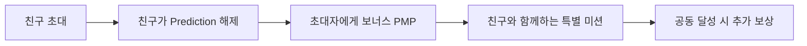

#### 🏅 리더보드 시스템

- **Weekly Unlock Challenge**: 주간 가장 많은 기능 해제한 사용자
- **Speed Unlock**: 가장 빠르게 모든 Local 기능 해제
- **Quality Unlock**: 높은 정확도로 단계별 해제 달성

### 7. 개인화된 Unlock 경로

#### 🎨 맞춤형 추천 시스템

```typescript
interface PersonalizedUnlock {
  userType: "Investor" | "Predictor" | "Philanthropist" | "Discusser";
  recommendedPath: UnlockStep[];
  alternativePaths: UnlockStep[][];
  personalizedChallenges: Challenge[];
}

// 사용자 성향에 따른 맞춤 경로
const generateUnlockPath = (userBehavior: UserBehavior) => {
  if (userBehavior.investmentFocused) {
    return prioritizeInvestmentPath();
  } else if (userBehavior.sociallyActive) {
    return prioritizeSocialPath();
  }
  // ... 기타 경로들
};
```

### 2. 스마트 메뉴 시스템 (Unlock 상태 통합)

#### 적응형 메뉴 바 (Unlock 기반)

```typescript
interface NavigationState {
  activeScopes: ("Local" | "Region" | "Nation" | "Colony" | "Universe")[];
  unlockedFeatures: ("Investment" | "Prediction" | "Donation" | "Forum")[];
  userLevel: number;
  location: GeolocationData;
  preferences: UserPreferences;
  unlockProgress: UnlockProgress;
}

// Unlock 상태 반영 메뉴 생성
const generateUnlockAwareMenu = (state: NavigationState) => {
  return {
    investment: { enabled: true, highlight: false }, // 항상 활성
    prediction: {
      enabled: state.unlockedFeatures.includes("Prediction"),
      highlight: canUnlock("Prediction", state.unlockProgress),
      lockInfo: getPredictionUnlockInfo(state.unlockProgress),
    },
    donation: {
      enabled: state.unlockedFeatures.includes("Donation"),
      highlight: canUnlock("Donation", state.unlockProgress),
      lockInfo: getDonationUnlockInfo(state.unlockProgress),
    },
    forum: {
      enabled: state.unlockedFeatures.includes("Forum"),
      highlight: canUnlock("Forum", state.unlockProgress),
      lockInfo: getForumUnlockInfo(state.unlockProgress),
    },
  };
};
```

#### 🔒 잠긴 메뉴 아이템 UI/UX

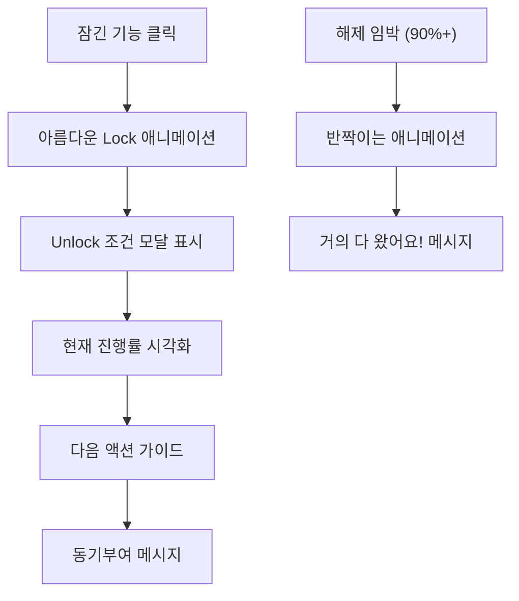

### 3. 시각적 계층 구조

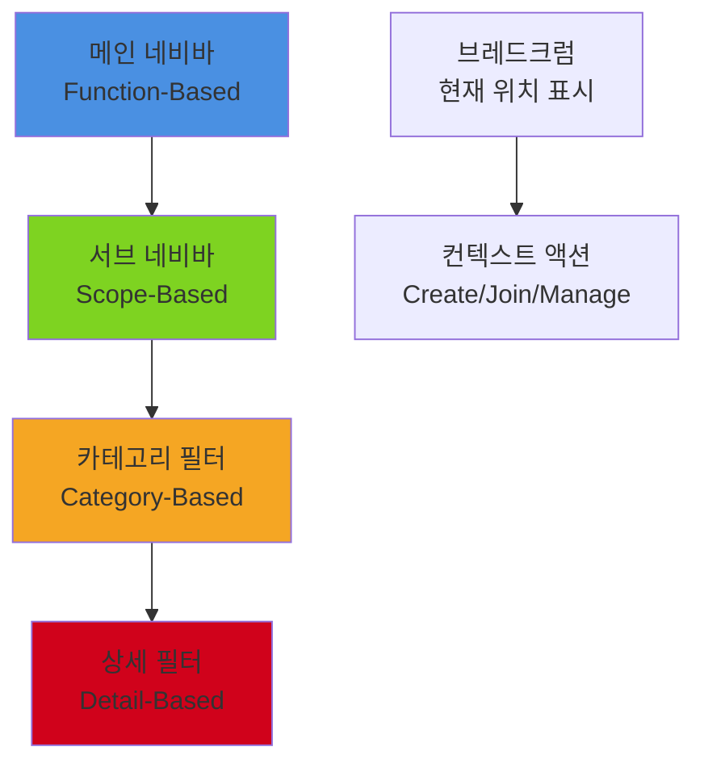

## 📱 반응형 네비게이션 전략

### 모바일 우선 접근법

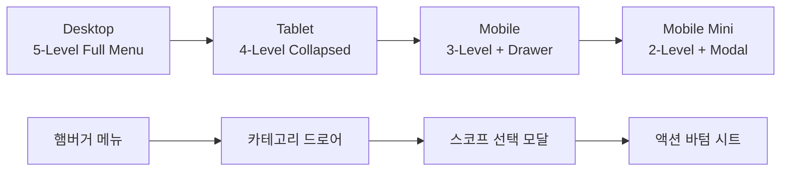

### 기기별 최적화

- **Desktop**: 전체 5-depth 메뉴 노출
- **Tablet**: 4-depth, 일부 컬랩스
- **Mobile**: 3-depth + 드로어 메뉴
- **Mobile Mini**: 2-depth + 모달 방식

## � Unlock 시스템 구현 계획

### Phase 1: 기본 Unlock 시스템 (Q4 2024)

1. **Investment → Prediction Unlock** 구현
   - PMP 적립 추적 시스템
   - 활동 횟수 카운터
   - Unlock 조건 검증 로직
   - 기본 축하 애니메이션

2. **진행률 표시 UI** 개발
   - 실시간 진행률 바
   - 다음 목표 안내
   - 잠긴 기능 클릭 시 모달

3. **기본 보상 시스템**
   - Unlock 보너스 지급
   - 간단한 뱃지 시스템

### Phase 2: 고도화 (2025 Q1-Q2)

1. **전체 Unlock 체인** 완성
   - Prediction → Donation → Forum
   - Region Level 승격 시스템
   - 복합 조건 검증

2. **개인화 및 소셜 기능**
   - 사용자 유형별 맞춤 경로
   - 친구 초대 인센티브
   - 리더보드 시스템

3. **고급 UI/UX**
   - 멋진 Unlock 애니메이션
   - 진행률 대시보드
   - 성취 시스템 통합

### Phase 3: 확장 및 최적화 (2025 Q3-Q4)

1. **AI 기반 개인화**
   - 사용자 행동 패턴 분석
   - 맞춤형 Unlock 경로 추천
   - 동기부여 최적화

2. **소셜 확장**
   - 팀/그룹 Unlock 챌린지
   - 커뮤니티 이벤트 연동
   - 바이럴 확산 메커니즘

## 📈 예상 효과 및 KPI

### 사용자 참여도 증가

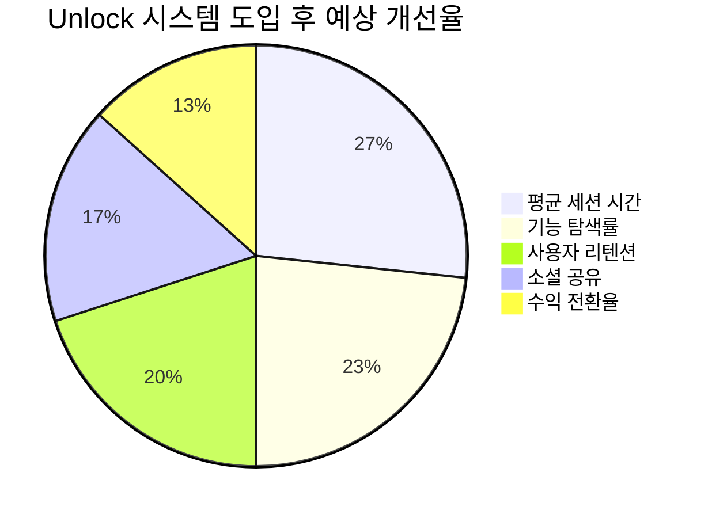

### 핵심 성과 지표 (KPI)

- **기능별 도달률**:
  - Prediction 해제율: 70% → 90% (목표)
  - Donation 해제율: 30% → 60% (목표)
  - Forum 해제율: 10% → 40% (목표)

- **사용자 경험**:
  - 평균 체류 시간: 15분 → 25분 (목표)
  - 월간 활성 사용자: +50% 증가 (목표)
  - 기능별 완주율: 20% → 45% (목표)

- **비즈니스 임팩트**:
  - 사용자 생애 가치(LTV): +35% 증가
  - 바이럴 계수: 1.2 → 1.8 (목표)
  - 수익 전환율: +20% 증가

### Phase별 활성화 로드맵

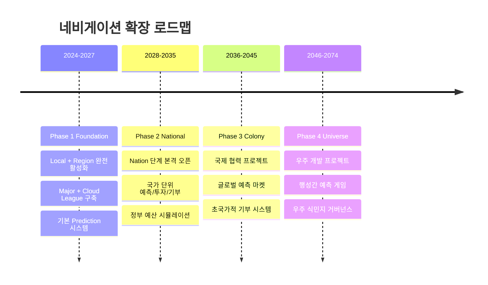

### 기술적 확장성

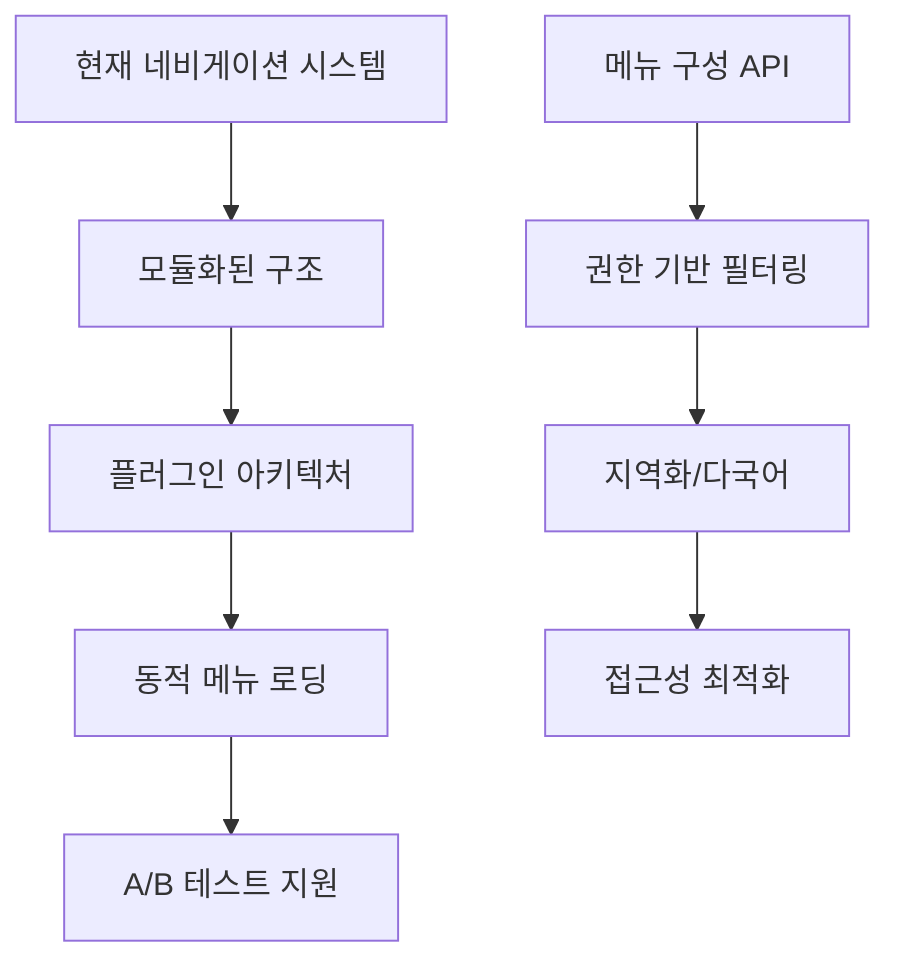

## 🎯 구현 우선순위

### 즉시 구현 (Q4 2024)

1. **이중축 기본 구조** 구축
2. **Local/Region 메뉴** 완성
3. **모바일 반응형** 최적화
4. **브레드크럼 시스템**

### 단기 구현 (2025 H1)

1. **스마트 컨텍스트 엔진**
2. **개인화 알고리즘**
3. **점진적 노출 시스템**
4. **Nation 베타 준비**

### 중기 구현 (2025-2027)

1. **A/B 테스트 시스템**
2. **고급 필터링**
3. **AI 추천 네비게이션**
4. **다국어 지원**

## 🏁 결론 및 권장사항

### 최종 권장 구조

```
📱 Main Navigation (Level 1):
   Investment | Prediction | Donation | Forum | Ranking

🌍 Scope Navigation (Level 2):
   Local ✅ | Region 🔄 | Nation 🚧 | Colony 🔮 | Universe 🌌

📂 Category Navigation (Level 3):
   Sport/Economy/Politics | Food/Clothing/Service

🔍 Detail Navigation (Level 4):
   Specific Items/Events

⚡ Action Navigation (Level 5):
   Create/Join/Manage/Share
```

### 핵심 성공 요인

1. **단순성 유지**: 복잡해도 직관적 사용
2. **점진적 노출**: 사용자 수준에 맞는 메뉴
3. **일관성**: 모든 기능에서 동일한 패턴
4. **확장성**: 50년 확장 계획 수용
5. **개인화**: AI 기반 맞춤형 네비게이션

이 구조로 구현하면 현재의 복잡성을 해결하면서도 미래 확장성을 완벽하게 보장할 수 있습니다! 🚀
