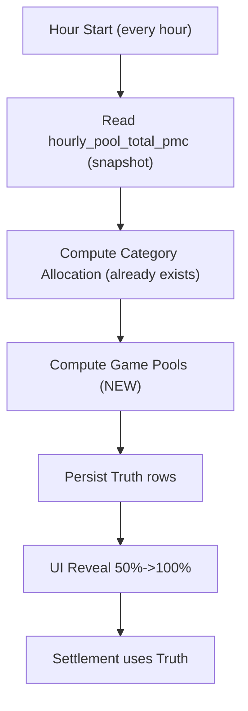
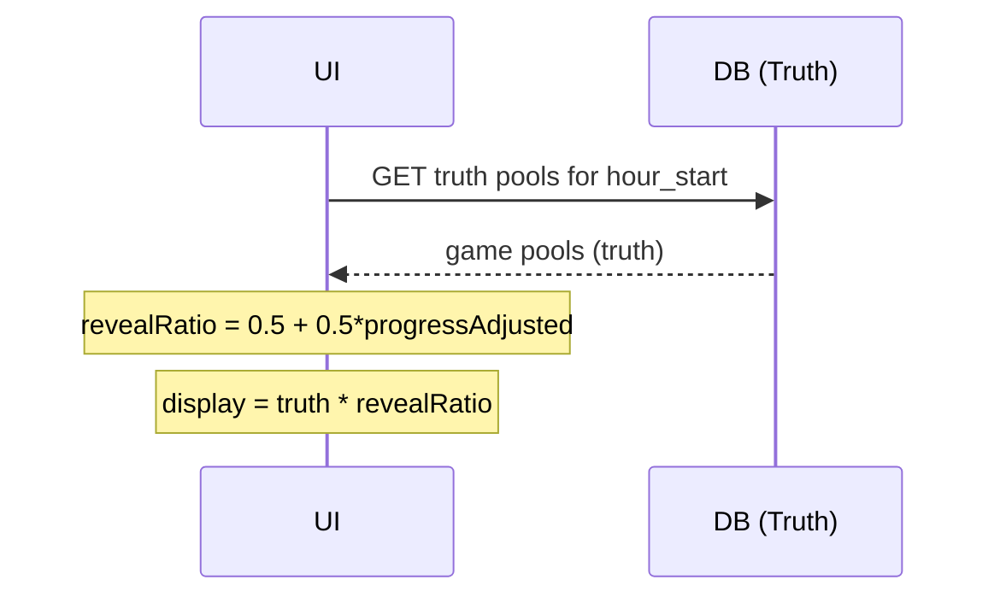
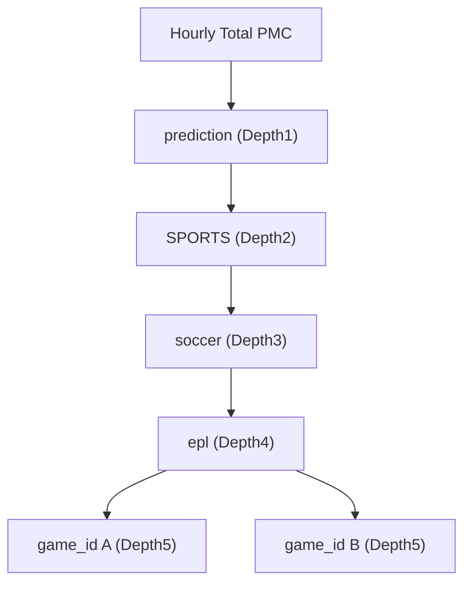
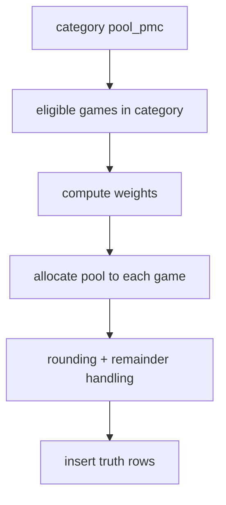
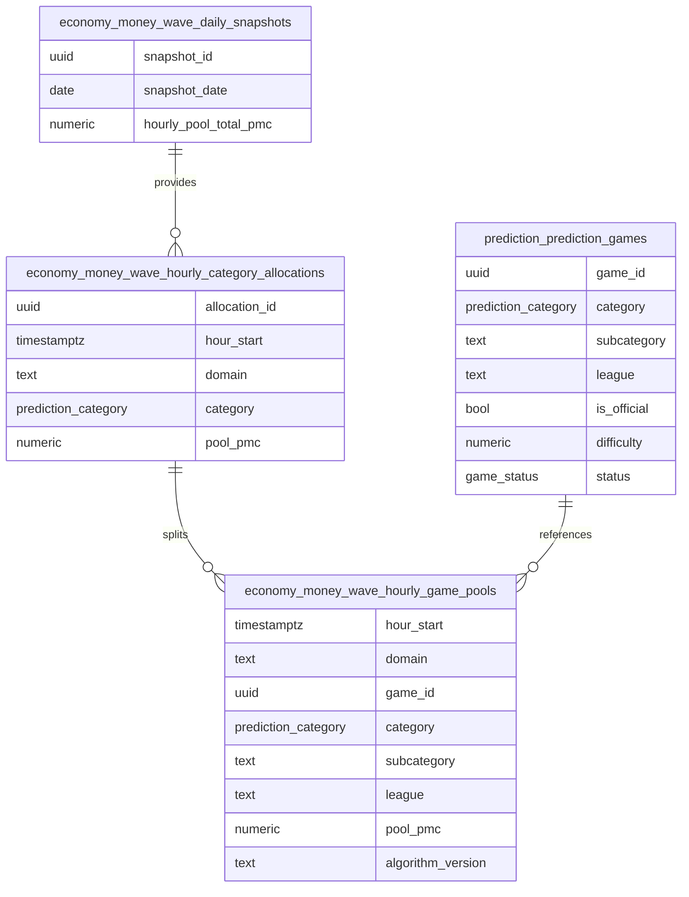
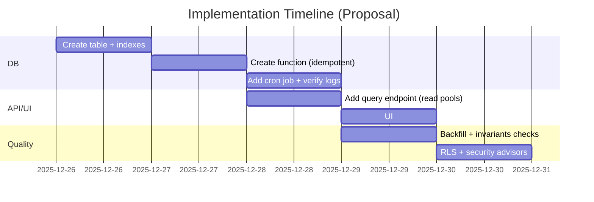
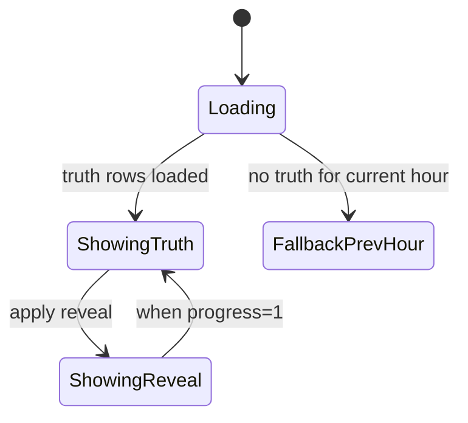
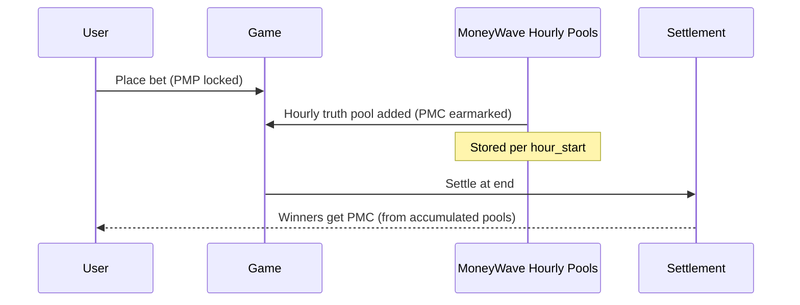
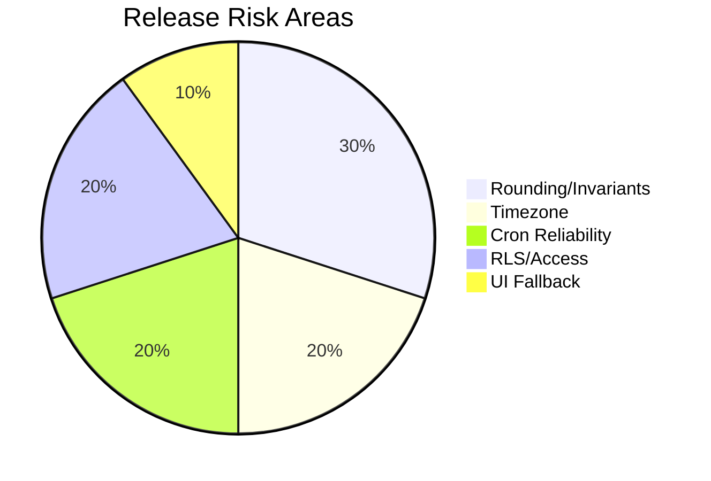

# PLAN: MoneyWave Hourly Game Pools (Depth 1~5, Truth + Reveal)

## 0. Purpose
이 문서는 **"매 정각(hour start)에 게임별 Pool(=Truth)을 DB에 확정 저장"** 하고, UI는 **50% → 100% reveal(Display)** 로 보여주는 방식(사용자 제안)을 기준으로, **Depth 1~5**(prediction → sports → soccer → epl → game)까지 **PMC/PMP 흐름을 일관되게 노출**하기 위한 구현 계획서입니다.

- 핵심 목표
  - 룰렛 UI가 “그 시간의 확정 금액”을 기반으로 안정적으로 동작
  - 매 시간마다 **게임별 pool이 고정**되어 금액이 흔들리지 않음
  - Depth 1~5 롤업(합계)이 언제나 결정적이고 감사(audit) 가능

- 핵심 원칙
  - **Truth(정산/분배 기준)** 과 **Display(연출/노출)** 를 분리
  - DB는 Truth를 저장, UI는 Truth를 reveal하여 Display 생성

---

## 1. Existing State (What we already have)

### 1.1 Documents that already exist
- MoneyWave overall docs: `docs/explanation/moneywave/*`
  - `docs/explanation/moneywave/README.md`: 계산 레이어(DDD Aggregate, 서비스, UI 훅) 정리
  - `docs/explanation/moneywave/moneywave-ui.md`: UI가 prediction 전용이라는 설명(일부 내용은 최근 UI 변경으로 갱신 필요)

### 1.2 Database tables already exist (economy/prediction)
- Truth input
  - `economy.money_wave_daily_snapshots.hourly_pool_total_pmc`
  - `economy.money_wave_config`
- Truth output (category-level)
  - `economy.money_wave_hourly_category_allocations` (domain='prediction', category별 pool_pmc)
  - `economy.compute_prediction_hourly_category_allocations(p_hour_start)` + `pg_cron` job
- Category policy
  - `economy.prediction_category_multipliers` (category별 reward_multiplier)
- Prediction game taxonomy fields (for depth 3~4)
  - `prediction.prediction_games.category` (Depth2 for SPORTS etc)
  - `prediction.prediction_games.subcategory` (Depth3: e.g. soccer)
  - `prediction.prediction_games.league` (Depth4: e.g. epl)

---

## 2. Requirements (Your method)

### 2.1 Truth / Display separation
- **Truth**
  - 매 정각, “이번 1시간에 각 게임이 받을 pool_pmc”를 확정
  - Truth는 DB에 저장되어야 하며, 이후에는 **변하지 않아야 함**

- **Display**
  - UI는 해당 hour의 Truth를 가져와서
  - revealRatio = 0.5 + 0.5 * progressAdjusted (0.5→1.0)
  - displayPool = truthPool * revealRatio
  - progressAdjusted에는 activityBoost(참여자/활성게임 부스트)를 적용하되, 1시간 내 100%는 보장

### 2.2 Depth model (1~5)
- Depth1: domain = prediction
- Depth2: category (SPORTS 등)
- Depth3: subcategory (soccer 등)
- Depth4: league (epl 등)
- Depth5: game (prediction_games.game_id)

핵심은 “게임별 Truth가 있으면” Depth1~4는 **rollup(sum)** 으로 항상 일관되게 계산 가능하다는 점입니다.

---

## 3. Proposed Approach (Recommended)

### 3.1 Choose “hour-start fixed game set”
매 정각에 다음 조건을 만족하는 게임만 이번 hour의 후보로 고정합니다.
- `status = 'ACTIVE'`
- `created_at <= hour_start` (또는 `registration_start <= hour_start`)
- `settlement_date > hour_start` (이미 끝났거나 끝날 게임 제외)

이렇게 하면 “중간에 게임이 늘어났는데 pool이 쪼개져서 금액이 흔들리는 문제”를 제거할 수 있습니다.

### 3.2 Compute game pool from category pool
- 1단계: category allocation(기존 테이블/함수)을 확보
  - hour_start에 category allocation row가 없으면 먼저 생성(기존 함수 호출)

- 2단계: 각 category별로 eligible games를 조회
- 3단계: game weight를 계산하여 category pool을 game별로 분배

**Game Weight (v1 proposal, 최소 복잡도)**
- baseWeight = 1
- categoryMultiplier = economy.prediction_category_multipliers[category]
- officialBonus = (is_official ? 1.10 : 1.00)  // optional, 정책 결정 필요
- difficultyFactor = 1 + (difficulty - 1) * 0.05 // optional, 정책 결정 필요
- weight = baseWeight * categoryMultiplier * officialBonus * difficultyFactor

> 주의: multiplier는 “카테고리 몫을 키우는 용도”로 이미 쓰고 있으므로, 게임 단계에서 다시 곱하면 이중 적용이 될 수 있습니다.
> 따라서 **카테고리 단계에서는 multiplier로 비중을 만들고**, 게임 단계에서는 (기본은) baseWeight만 쓰는 방식이 가장 단순합니다.
> 본 계획서는 **"카테고리 단계: multiplier" + "게임 단계: 기본 균등"** 을 default로 추천하고, 필요하면 게임 단계 factor를 단계적으로 추가합니다.

---

## 4. Database Design (NEW)

### 4.1 New table: hourly game pools
**Schema**: `economy` (MoneyWave는 economy bounded-context로 유지)

`economy.money_wave_hourly_game_pools` (proposed)
- hour_start timestamptz (PK part)
- domain text (fixed 'prediction')
- game_id uuid (PK part)  // FK는 optional(결합도 낮추려면 FK 없이 운영)
- category prediction_category
- subcategory text nullable
- league text nullable
- pool_pmc numeric (>= 0)
- algorithm_version text
- computed_at timestamptz default now()

Constraints/Indexes
- unique(hour_start, domain, game_id)
- index(hour_start, category)
- index(hour_start, category, subcategory, league)

### 4.2 Optional: view for rollups (Depth1~4)
게임별 Truth가 있으면 Depth rollup은 view로 충분합니다.
- `economy.v_money_wave_hourly_depth_rollups`
  - group by (hour_start, domain)
  - group by (hour_start, domain, category)
  - group by (hour_start, domain, category, subcategory)
  - group by (hour_start, domain, category, subcategory, league)

> 테이블로 저장할지(view로 계산할지)는 성능 요구에 따라 결정. 초기에 view 추천.

---

## 5. DB Functions & Cron (NEW)

### 5.1 Function: compute hourly game pools
`economy.compute_prediction_hourly_game_pools(p_hour_start timestamptz default date_trunc('hour', now()))`

Responsibilities
1) Ensure category allocations exist for p_hour_start
2) Query eligible games snapshot for that hour
3) Allocate each category pool into game pools
4) Persist into `economy.money_wave_hourly_game_pools`
5) Guarantee: sum(game pools by hour_start) == hourly_pool_total_pmc (within rounding)

Idempotency
- safe to re-run for same hour_start
- recommended strategy: delete existing rows for (hour_start, domain='prediction') then insert deterministic rows

Rounding strategy (important)
- calculate allocations in numeric
- round down to 8 decimals (or keep numeric full precision)
- distribute remainder to top-weighted games deterministically (stable ordering by game_id)

Security / RLS
- function should be `SECURITY DEFINER`
- table should have RLS policy to allow read (anon/auth) for the current+recent hours (product decision)

### 5.2 Cron job
- schedule: `0 * * * *`
- command:
  - option A: call game pool function only (it internally ensures category allocations)
  - option B: call both in order (category then game)

추천: option A (single entrypoint)로 운영 단순화

---

## 6. UI Plan (Truth from DB, reveal on client)

### 6.1 Data source switch
- Today: `useWaveCalculation` reads `economy.money_wave_daily_snapshots` and counts games for weights
- Next:
  - For category-level widget: read `economy.money_wave_hourly_category_allocations` for current hour_start
  - For roulette/game list: read `economy.money_wave_hourly_game_pools` for current hour_start

### 6.2 Reveal rule (your method)
- hour_start 기준으로 progress를 계산
- revealRatio = 0.5 + 0.5 * progressAdjusted
- displayPool = truthPool * revealRatio

Important
- UI는 “truth가 이미 확정된 값”만 reveal해야 함
- 즉, truth rows가 없다면
  - (A) 로딩/대기
  - (B) 직전 hour의 truth를 보여주는 fallback

---

## 7. PMP/PMC Flow (Depth 5까지 노출)

### 7.1 Economic meaning separation
- PMP: 베팅(사용자가 risk를 걸 때)
- PMC: 보상/풀(게임이 지급하는 reward)

### 7.2 Recommended UX exposure
- Depth1~4 화면: “이 시간에 확정된 PMC pool의 흐름” (rollup)
- Depth5(게임): “이 게임이 이번 시간에 확보한 truth pool” + reveal display
- Settlement(게임 종료): truth pool 누적치를 기반으로 승자에게 PMC 지급

---

## 8. Edge Cases (Things you might not have considered)

1) **Game lifecycle boundary**
- game becomes ACTIVE at 09:30 → it should not affect 09:00 hour pool; starts receiving from 10:00

2) **Timezone drift**
- hour_start는 config timezone(Asia/Seoul)로 고정해야 UX와 일치

3) **Cron re-run / missed run**
- idempotent function + backfill command 필요

4) **Rounding invariants**
- sum(game pools) must match category pool and hourly snapshot
- remainder distribution must be deterministic

5) **RLS / public visibility**
- pool은 leaderboard 성격이라 anon read가 필요할 수 있음
- 그러나 쓰기/정산은 반드시 보호

6) **Double counting multipliers**
- multiplier를 category와 game 단계에서 동시에 적용하면 과대분배 위험

---

## 9. Verification Checklist (Operational)

- Invariants
  - For hour_start H:
    - sum(category.pool_pmc) == snapshot.hourly_pool_total_pmc
    - sum(game.pool_pmc) == sum(category.pool_pmc)
    - For each category C: sum(game.pool_pmc where category=C) == category.pool_pmc

- Cron
  - next hour boundary 이후 game pool rows 생성 확인

- UI
  - reveal이 0.5→1.0로 단조 증가
  - progress=1에서 display==truth

---

## 10. Work Items (Concrete tasks)

1) DB Migration (MCP)
- create `economy.money_wave_hourly_game_pools`
- indexes + unique constraint
- RLS policies (read) + restrict write

2) DB Function (MCP)
- `economy.compute_prediction_hourly_game_pools(p_hour_start)`
- deterministic allocation + remainder handling

3) Cron
- replace/extend job to call game pool function
- keep category allocation function usage inside

4) UI
- read truth rows for current hour
- apply reveal only on client
- add fallback behavior

5) Docs
- update `docs/explanation/moneywave/moneywave-ui.md` to reflect “snapshot 기반 + reveal + multipliers” (optional but recommended)

---

## 11. Open Questions (Need product decision)

1) 게임 단계에서 difficulty/is_official을 weight에 넣을까?
- v1: no (균등)
- v2: yes (점진적)

2) RLS 공개 범위
- anon read 허용할지, auth-only로 할지

3) pool을 “누적”로 볼지 “해당 hour에만 유효”로 볼지
- 추천: per-hour rows는 history로 남기고, 게임의 누적 pool은 view로 계산

---

## Appendix: Compatibility with DDD rules
- DB 저장은 `economy` 스키마에 두어 economy bounded-context를 유지
- `prediction.prediction_games`는 참조만 하고, FK 강제는 선택(결합도 관리)
- “도메인 간 직접 의존”은 코드 레벨에서는 Application Layer를 경유하고, DB는 “식별자 기반 데이터 교환”으로 최소 결합을 유지
