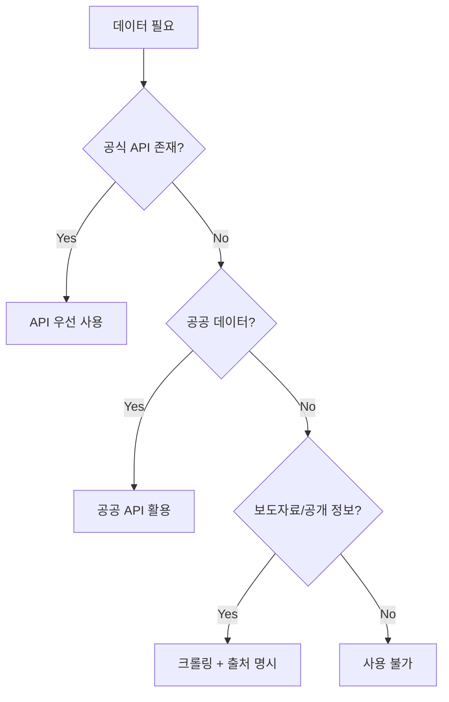

# Prediction 정기 게임 데이터 소스 전략

> **목적**: 카테고리별 정기적 예측 게임을 위한 데이터 소스 매핑 및 자동화 전략

---

## 현재 보유 API 키

| API | 용도 | 키 위치 | 상태 |
|-----|------|--------|------|
| **KOSIS** | 한국 통계청 데이터 | `.env.local` | ✅ 보유 |
| **DART** | 한국 기업공시 | `.env.local` | ✅ 보유 |
| **Football Data** | 축구 리그/경기 | `.env.local` | ✅ 보유 |
| **Alpha Vantage** | 글로벌 주식 데이터 | `.env.local` | ✅ 보유 |
| **FMP (Financial Modeling Prep)** | 재무제표/실적 | `.env.local` | ✅ 보유 |
| **LocalData** | 한국 지역 데이터 | `.env.local` | ✅ 보유 |

---

## 카테고리별 데이터 소스 매핑

### 1️⃣ 경제 (Economics) - 분기별 영업이익 등

#### 정기 발표 이벤트

| 이벤트 | 주기 | 데이터 소스 | 게임 예시 |
|--------|------|------------|-----------|
| **기업 분기실적** | 분기 | FMP Earnings Calendar | "삼성전자 Q1 EPS 예상치 상회?" |
| **KOSPI 종가** | 일간 | Alpha Vantage | "오늘 코스피 상승 or 하락?" |
| **금리 발표** | 월간 | KOSIS / 한국은행 | "기준금리 동결 or 인상?" |
| **고용률** | 월간 | KOSIS | "실업률 3% 이하 유지?" |
| **GDP 성장률** | 분기 | KOSIS | "Q1 GDP 성장률 2% 초과?" |

#### API 활용

```
# FMP Earnings Calendar
GET /stable/earnings-calendar?from=2026-01-01&to=2026-03-31

# Alpha Vantage - 일일 주가
GET /query?function=GLOBAL_QUOTE&symbol=005930.KS

# DART - 기업공시
GET /api/list.json?corp_code=00126380  # 삼성전자
```

---

### 2️⃣ 스포츠 (Sports)

#### 정기 이벤트

| 이벤트 | 주기 | 데이터 소스 | 게임 예시 |
|--------|------|------------|-----------|
| **EPL 경기** | 주간 | Football Data API | "맨유 vs 첼시 승자?" |
| **K-League** | 주간 | (추가 필요) | "전북 현대 우승?" |
| **KBO 시즌** | 일간 | (추가 필요) | "KIA 타이거즈 오늘 승리?" |
| **챔피언스 리그** | 비정기 | Football Data API | "CL 우승팀 예측" |

#### 보유 리그 코드 (Football Data)
```
WC  - FIFA World Cup
CL  - UEFA Champions League
PL  - Premier League
BL1 - Bundesliga
SA  - Serie A
PD  - Primera Division
```

#### 추가 필요
- [ ] **KBO 데이터**: 네이버 스포츠 크롤링 or KBO 공식 API
- [ ] **K-League**: K리그 공식 or 스포츠 뉴스 크롤링

---

### 3️⃣ 엔터테인먼트 (Entertainment)

#### 정기 이벤트

| 이벤트 | 주기 | 데이터 소스 | 게임 예시 |
|--------|------|------------|-----------|
| **주말 박스오피스** | 주간 | KOBIS (영화진흥위원회) | "1위 영화 예측" |
| **드라마 시청률** | 주간 | (크롤링 필요) | "눈물의 여왕 20% 돌파?" |
| **멜론 차트** | 일간 | (크롤링 필요) | "BTS 1위 유지?" |
| **시상식 수상** | 연간 | TMDB + 크롤링 | "아카데미 작품상" |

#### 추천 API

| API | 용도 | 무료/유료 |
|-----|------|----------|
| **TMDB** | 영화/드라마 메타데이터 | 무료 |
| **KOBIS** | 한국 박스오피스 | 무료 |
| **OMDb** | 영화 정보 | 무료 (1000건/일) |

#### 크롤링 필요 (법적 검토 필요)
- **드라마 시청률**: Nielsen Korea, AGB닐슨 → 보도자료 크롤링
- **음원 차트**: 멜론/지니뮤직 → robots.txt 확인 필요

---

### 4️⃣ 정치 (Politics)

#### 정기 이벤트

| 이벤트 | 주기 | 데이터 소스 | 게임 예시 |
|--------|------|------------|-----------|
| **여론조사** | 주간 | (크롤링) | "OOO 후보 지지율 40% 이상?" |
| **국회 법안 표결** | 비정기 | 국회 API | "법안 통과 여부" |
| **선거** | 연간 | 중앙선거관리위원회 | "대선 당선자" |

#### 추천 API
- **국회 법안 API**: 열린국회정보
- **선거 데이터**: 중앙선거관리위원회 API

---

### 5️⃣ 사용자 제안 (User-Generated)

- Forum 토론 → 게임 전환
- 커뮤니티 투표 시스템
- AI 기반 트렌드 분석

---

## 크롤링 vs API 전략

### 크롤링 법적 고려사항

| 항목 | 권장 | 주의 |
|------|------|------|
| **robots.txt** | 반드시 확인 | 차단된 경로 접근 금지 |
| **이용약관** | 확인 필요 | 상업적 이용 제한 확인 |
| **요청 빈도** | 1초당 1회 이하 | 서버 부하 방지 |
| **캐싱** | 적극 활용 | 동일 데이터 재요청 최소화 |

### 권장 접근법



---

## 정기 게임 템플릿 설계

### 일간 (Daily)

```typescript
const dailyTemplates: GameTemplate[] = [
  {
    id: "kospi-daily",
    title: "오늘 코스피 상승 or 하락?",
    category: "economics",
    dataSource: "ALPHA_VANTAGE",
    scheduledTime: "08:30 KST",  // 장 시작 전
    duration: 8,  // 8시간 (장 마감까지)
    recurrence: "daily",
    settlementSource: {
      type: "API",
      endpoint: "ALPHA_VANTAGE",
      field: "08. previous close vs 05. price"
    }
  },
  {
    id: "entertainment-daily",
    title: "오늘 멜론 차트 1위 유지?",
    category: "entertainment",
    dataSource: "SCRAPING",
    scheduledTime: "00:00 KST",
    duration: 24,
    recurrence: "daily"
  }
];
```

### 주간 (Weekly)

```typescript
const weeklyTemplates: GameTemplate[] = [
  {
    id: "boxoffice-weekly",
    title: "이번 주 박스오피스 1위?",
    category: "entertainment",
    dataSource: "KOBIS",
    scheduledTime: "매주 금요일 09:00",
    duration: 72,  // 금~월
    recurrence: "weekly"
  },
  {
    id: "epl-weekly",
    title: "EPL 경기 결과",
    category: "sports",
    dataSource: "FOOTBALL_DATA",
    scheduledTime: "경기 시작 2시간 전",
    duration: 2,
    recurrence: "weekly"
  }
];
```

### 분기 (Quarterly)

```typescript
const quarterlyTemplates: GameTemplate[] = [
  {
    id: "samsung-earnings",
    title: "삼성전자 분기 실적 예상치 상회?",
    category: "economics",
    dataSource: "FMP_EARNINGS",
    scheduledTime: "실적 발표 1주일 전",
    duration: 168,  // 7일
    recurrence: "quarterly",
    settlementSource: {
      type: "API",
      endpoint: "FMP",
      query: "symbol=005930.KS"
    }
  }
];
```

---

## Polymarket 자동화 추정

**Polymarket의 방식 (추정):**
1. **마켓 팀 수동 생성**: 주요 이벤트는 인력 개입
2. **API 기반 자동 감지**: 금융/스포츠 캘린더 API 연동
3. **커뮤니티 제안**: Discord/Twitter로 아이디어 수집
4. **이벤트 기반 트리거**: 뉴스/이벤트 발생 시 자동 생성

**PosMul 차별화:**
- 한국 특화 데이터 (KOSIS, DART, KBO, K-Drama)
- Forum 연동 자동 제안
- MoneyWave 연동 상금 배정

---

## 구현 우선순위

### Phase 1: 보유 API 활용 (즉시)
- [ ] FMP Earnings Calendar → 분기 실적 게임
- [ ] Football Data → EPL/CL 경기 게임
- [ ] Alpha Vantage → 일일 주가 게임
- [ ] KOSIS → 경제 지표 게임

### Phase 2: 추가 API 연동 (1-2주)
- [ ] TMDB API 키 발급 및 연동
- [ ] KOBIS (박스오피스) 연동
- [ ] 국회 API 연동

### Phase 3: 크롤링 서비스 (2-4주)
- [ ] 드라마 시청률 (AGB닐슨 보도자료)
- [ ] 여론조사 (갤럽/리서치뷰 보도자료)
- [ ] KBO/K-League (스포츠 뉴스)

---

## 필요한 추가 API 키

| API | 용도 | 무료 티어 |
|-----|------|----------|
| **TMDB** | 영화/드라마 | 무료 |
| **KOBIS** | 박스오피스 | 무료 |
| **국회 열린정보** | 법안/의원 | 무료 |
| **기상청** | 날씨 예측 게임 | 무료 |

---

**작성일**: 2026-01-13
