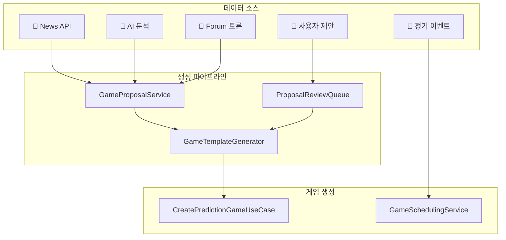
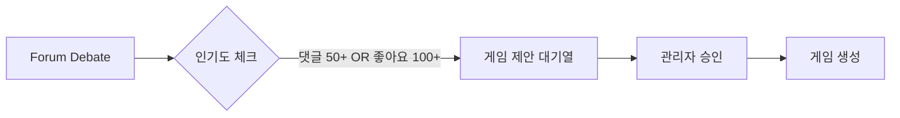

# Prediction 게임 생성 모듈 기획서

> **목적**: 예측 게임 콘텐츠 자동화 및 다양한 생성 경로 구축

---

## 현재 상태 분석

### 구현된 기능 ✅

| 컴포넌트 | 위치 | 설명 |
|----------|------|------|
| `CreatePredictionGameUseCase` | `application/use-cases/` | 게임 생성 핵심 로직 (207줄) |
| `GameSchedulingService` | `application/services/` | 템플릿 기반 스케줄링 (771줄) |
| `ScheduledGameTemplate` | 동일 파일 | 게임 템플릿 구조체 |

**현재 지원 기능:**
- 수동 게임 생성 (관리자)
- 템플릿 기반 스케줄링 (반복: once/daily/weekly/monthly)
- MoneyWave 연동 상금풀 배정
- 게임 중요도 자동 계산

**게임 템플릿 속성:**
```typescript
interface ScheduledGameTemplate {
  id: string;
  title: string;
  category: "politics" | "sports" | "entertainment" | "economics" | ...;
  importance: "low" | "medium" | "high" | "critical";
  recurrence: "once" | "daily" | "weekly" | "monthly";
  sourceType?: SettlementSourceType;
  sourceConfig?: Record<string, unknown>;
}
```

### 미구현 기능 ❌

- AI 기반 자동 생성
- 뉴스 기반 자동 생성
- Forum 연동 생성
- 사용자 제안 시스템

---

## 제안: 게임 생성 아키텍처



---

## 생성 경로 상세 설계

### 1️⃣ AI 자동생성 (News-Driven)

**원리:** News API로 트렌딩 뉴스 수집 → AI가 예측 가능한 이벤트 추출 → 자동 게임 생성

**구현 설계:**
```typescript
interface NewsGameGeneratorService {
  // 뉴스 수집
  fetchTrendingNews(category: string): Promise<NewsArticle[]>;
  
  // AI 분석: 예측 가능한 이벤트 추출
  extractPredictableEvents(articles: NewsArticle[]): Promise<PredictableEvent[]>;
  
  // 게임 템플릿 변환
  convertToGameProposal(event: PredictableEvent): GameProposal;
}
```

**News API 활용 예시:**
```
GET /v2/top-headlines?country=kr&category=politics
```
→ "2026년 대선 후보 지지율" 관련 기사 발견
→ AI: "OOO 후보가 1위를 유지할까?" 게임 제안

**정기 실행:**
- 매일 오전 9시: 뉴스 스캔 및 게임 제안 생성
- 카테고리 로테이션: 정치 → 경제 → 스포츠 → 엔터

---

### 2️⃣ Forum-Driven (토론 기반)

**원리:** Forum의 인기 토론 → 자동 또는 수동 게임 전환

**연동 설계:**


**데이터 흐름:**
```typescript
interface ForumGameConnector {
  // 인기 토론 모니터링
  monitorHotDebates(): Promise<Debate[]>;
  
  // 게임 전환 가능성 평가
  evaluateConvertibility(debate: Debate): ConvertibilityScore;
  
  // 게임 제안 생성
  createProposalFromDebate(debate: Debate): GameProposal;
}
```

---

### 3️⃣ 사용자 제안 (Community-Driven)

**원리:** 사용자가 게임 아이디어 제안 → 투표 → 채택 시 게임 생성

**Polymarket 참고:**
> "Markets are created by the markets team with input from users and the community."

**제안 시스템 설계:**
```typescript
interface UserProposalSystem {
  // 제안 등록
  submitProposal(proposal: UserGameProposal): Promise<ProposalId>;
  
  // 커뮤니티 투표
  voteOnProposal(proposalId: ProposalId, vote: "up" | "down"): void;
  
  // 채택 기준
  adoptionCriteria: {
    minVotes: 50;
    minApprovalRate: 0.7;
    minStakeDeposit: 100; // PMP
  };
}
```

**제안 템플릿:**
| 필드 | 필수 | 설명 |
|------|------|------|
| title | ✅ | 게임 제목 |
| question | ✅ | 예측 질문 |
| options | ✅ | 선택지 (Yes/No 또는 커스텀) |
| resolutionSource | ✅ | 결과 판정 출처 |
| resolveDate | ✅ | 마감 예정일 |
| rationale | ❌ | 제안 이유 |

---

### 4️⃣ 정기/이벤트 분류

**게임 유형 분류:**

| 유형 | 주기 | 예시 |
|------|------|------|
| **정기 발표** | 예측 가능 | 경제 지표, 선거, 시즌 스포츠 |
| **이벤트성** | 불규칙 | 돌발 뉴스, 재해, 정책 발표 |

**정기 이벤트 템플릿 (현재 구현됨):**
```typescript
// GameSchedulingService 내 기본 템플릿 예시
{
  id: "kospi-daily",
  title: "오늘 코스피 상승 or 하락?",
  category: "economics",
  recurrence: "daily",
  scheduledTime: "20:00 KST" // 미국 시장 개장 전
}
```

**이벤트성 게임 (추가 필요):**
```typescript
interface EventDrivenGame {
  triggerType: "news_threshold" | "api_webhook" | "manual";
  triggerCondition: {
    keywords: string[];
    importanceThreshold: number;
  };
}
```

---

## 구현 우선순위

### Phase 1: 정기 이벤트 강화 (1-2주)
- [ ] 경제 지표 템플릿 확장 (GDP, 금리, 물가)
- [ ] 스포츠 시즌 연동 (KBO, K-League)
- [ ] 정치 일정 연동 (국회 표결, 선거일)

### Phase 2: News-Driven 자동화 (2-4주)
- [ ] News API 연동 서비스
- [ ] AI 이벤트 추출 로직 (OpenAI/Claude)
- [ ] 자동 제안 → 관리자 승인 워크플로우

### Phase 3: 사용자 제안 시스템 (3-4주)
- [ ] 제안 UI/API
- [ ] 커뮤니티 투표 시스템
- [ ] 채택 → 게임 생성 자동화

### Phase 4: Forum 연동 (4-5주)
- [ ] 인기 토론 모니터링
- [ ] 게임 전환 가능성 평가
- [ ] Forum ↔ Prediction 양방향 연동

---

## 기술 스택 제안

| 기능 | 기술 |
|------|------|
| 뉴스 수집 | News API, Google News RSS |
| AI 분석 | OpenAI GPT-4 / Claude API |
| 스케줄링 | Node-cron / Supabase Edge Functions |
| 실시간 트리거 | Supabase Realtime / Webhooks |

---

## Polymarket 참고 포인트

| Polymarket | PosMul 적용 |
|------------|-------------|
| 마켓 팀 + 커뮤니티 제안 | 관리자 + 사용자 제안 이원화 |
| 명확한 Resolution Source | 결과 판정 출처 필수 입력 |
| 최소 거래량 기준 | 최소 참여자/베팅 기준 설정 |
| Discord/Twitter 제안 | Forum + 전용 제안 페이지 |

---

**작성일**: 2026-01-13
