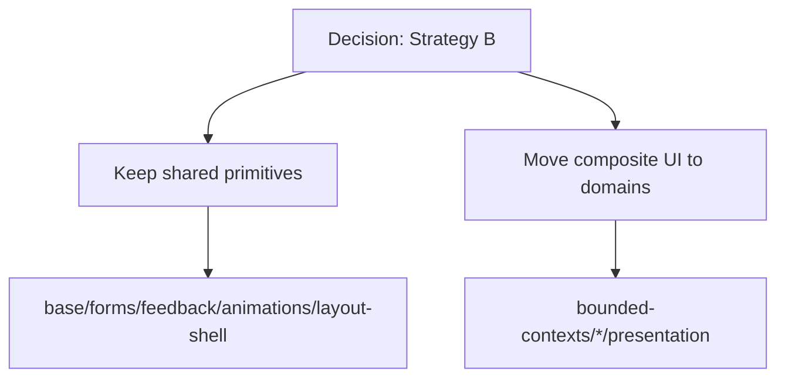
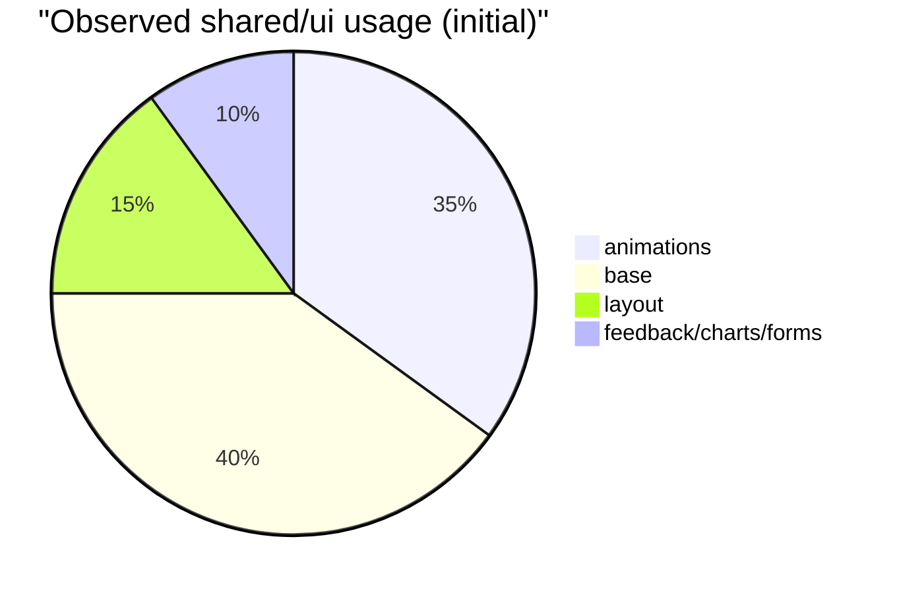
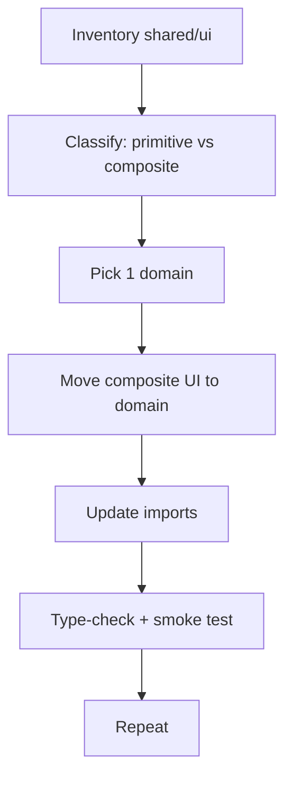
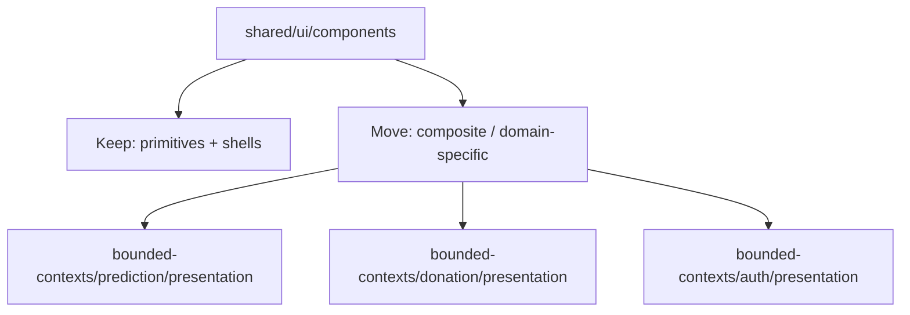
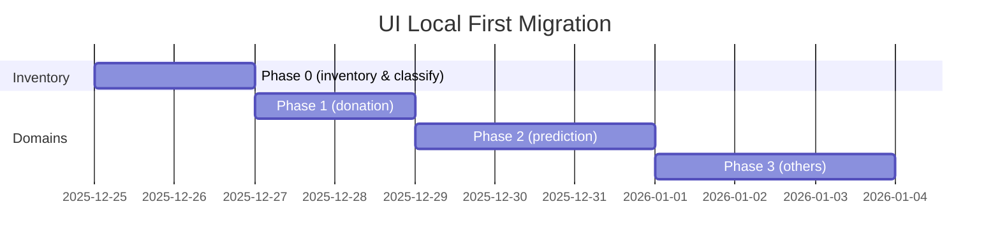

# Implementation Plan: UI Local First Migration (shared/ui → domain)

**상태**: 🔄 진행 중
**시작일**: 2025-12-25
**마지막 업데이트**: 2025-12-25
**예상 완료**: YYYY-MM-DD

---

## 📋 개요

### 목적
- `shared/ui` 비대화를 줄이고, Bounded Context 간 UI 결합을 낮춘다.
- “프리미티브는 shared, 조합 UI는 도메인” 규칙을 실제 코드에 반영한다.

### 결정 사항(확정)
- **전략 B 적용**: 프리미티브 UI는 `shared/ui`에 유지하고, 도메인 조합 UI는 각 도메인 `presentation`으로 옮긴다.
- 목표: **도메인 간 조합 UI 상호의존 0** (단, shared 프리미티브/전역 shell 의존은 허용)

### 성공 기준
- [ ] 도메인 조합 UI가 `bounded-contexts/*/presentation`으로 이동된다
- [ ] `shared/ui`에는 **프리미티브 + 전역 shell + 공통 피드백**만 남는다
- [ ] 도메인 간에 `bounded-contexts/A`가 `bounded-contexts/B`의 UI를 import 하지 않는다
- [ ] `pnpm -F @posmul/posmul-web type-check` 통과
- [ ] 주요 페이지(예: prediction/donation/auth) 수동 동작 확인

---

## 🔎 현재 관찰(초기 스캔)

- `shared/ui/components/animations` (`FadeIn`, `HoverLift`)는 `auth`, `economy`, `forum`, `prediction` 등 여러 라우트에서 사용 중
- `shared/ui/components/base` (`Card`, `Button`, `Badge` 등)는 여러 도메인 presentation에서 광범위하게 사용
- `shared/ui/components/layout/ThreeRowNavbar`는 앱 전역 레이아웃에서 사용
- 일부 컴포넌트는 이미 도메인(presentation)에서 조합 UI를 만들고 있으나, 내부에 shared/base 의존이 큼

---

## 🧾 Phase 0 Inventory: `shared/ui/components/*` (31 files)

| Path | 분류 | 라벨 | 메모 | 이동 대상(예정) |
|---|---|---|---|---|
| `shared/ui/components/animations/index.tsx` | animations | Shared 유지 | 단순 표현 유틸(여러 도메인 공용) | - |
| `shared/ui/components/base/Badge.tsx` | base | Shared 유지 | 프리미티브 | - |
| `shared/ui/components/base/Button.tsx` | base | Shared 유지 | 프리미티브 | - |
| `shared/ui/components/base/Card.tsx` | base | Shared 유지 | 프리미티브 | - |
| `shared/ui/components/base/ErrorClasses.ts` | base | Shared 유지 | 프리미티브/에러 유틸 | - |
| `shared/ui/components/base/index.ts` | base | Shared 유지 | base 재export | - |
| `shared/ui/components/charts/area-chart.tsx` | charts | Shared 유지 | 차트 프리미티브(도메인 의미 없음) | - |
| `shared/ui/components/charts/bar-chart.tsx` | charts | Shared 유지 | 차트 프리미티브(도메인 의미 없음) | - |
| `shared/ui/components/charts/line-chart.tsx` | charts | Shared 유지 | 차트 프리미티브(도메인 의미 없음) | - |
| `shared/ui/components/charts/pie-chart.tsx` | charts | Shared 유지 | 차트 프리미티브(도메인 의미 없음) | - |
| `shared/ui/components/charts/index.ts` | charts | Shared 유지 | charts 재export | - |
| `shared/ui/components/feedback/BaseErrorUI.tsx` | feedback | Shared 유지 | 공통 피드백 UI | - |
| `shared/ui/components/feedback/BaseSkeleton.tsx` | feedback | Shared 유지 | 공통 피드백 UI | - |
| `shared/ui/components/feedback/LoadingSpinner.tsx` | feedback | Shared 유지 | 공통 피드백 UI | - |
| `shared/ui/components/feedback/Toast.tsx` | feedback | Shared 유지 | 앱 전역 경험 | - |
| `shared/ui/components/feedback/index.ts` | feedback | Shared 유지 | feedback 재export | - |
| `shared/ui/components/forms/Input.tsx` | forms | Shared 유지 | 폼 프리미티브 | - |
| `shared/ui/components/forms/LoginForm.tsx` | forms | 보류(TBD) | 인증 조합 UI(공용/도메인 경계 재논의 필요) | - |
| `shared/ui/components/forms/SignUpForm.tsx` | forms | 보류(TBD) | 인증 조합 UI(공용/도메인 경계 재논의 필요) | - |
| `shared/ui/components/forms/index.ts` | forms | Shared 유지 | forms 재export(예측 폼은 도메인으로 이동 완료) | - |
| `shared/ui/components/games/UnifiedGameCard.tsx` | games | 보류(TBD) | 조합 UI 성격. 현재 `CategoryOverviewLayout`에서만 사용 확인 | (사용처 확정 후) |
| `shared/ui/components/games/UnifiedGameCard.new.tsx` | games | 보류(TBD) | 신규안/대체안으로 보임(정리 필요) | (사용처 확정 후) |
| `shared/ui/components/games/index.ts` | games | 보류(TBD) | games 재export(정리 필요) | - |
| `shared/ui/components/layout/ThreeRowNavbar.tsx` | layout-shell | Shared 유지 | 전역 네비게이션(shell) | - |
| `shared/ui/components/layout/MoneyWaveStatus.tsx` | layout-shell | Shared 유지 | 전역 위젯(shell) | - |
| `shared/ui/components/layout/MoneyWave/CompactWidget.tsx` | layout-shell | Shared 유지 | 전역 위젯 하위(ThreeRowNavbar 사용) | - |
| `shared/ui/components/layout/MoneyWave/SlotMachine.tsx` | layout-shell | Shared 유지 | 전역 위젯 하위(애니메이션) | - |
| `shared/ui/components/layout/MoneyWave/useWaveCalculation.ts` | layout-shell | Shared 유지 | 위젯 계산 로직(전역 위젯) | - |
| `shared/ui/components/layout/MoneyWave/index.ts` | layout-shell | Shared 유지 | MoneyWave 재export | - |
| `shared/ui/components/layout/CategoryOverviewLayout.tsx` | layout | 보류(TBD) | 카테고리 개요 레이아웃(도메인 중립 여부 검토 필요) | (사용처 확정 후) |
| `shared/ui/components/layout/index.ts` | layout | 보류(TBD) | layout 재export(이동/유지 결정에 따라 정리) | - |

### Phase 0 실행 로그(첫 Slice)
- ✅ prediction 도메인 로컬 UI로 `SlotMachine` 복제 후, `CompactMoneyWaveCard`에서 shared 레이아웃 의존 제거
  - 추가: `src/bounded-contexts/prediction/presentation/components/MoneyWave/SlotMachine.tsx`
  - 변경: `src/bounded-contexts/prediction/presentation/components/CompactMoneyWaveCard.tsx` import 교체
- ✅ prediction 전용 `PredictionGameForm`을 도메인으로 이동 후 shared export 제거
  - 추가: `src/bounded-contexts/prediction/presentation/components/forms/PredictionGameForm.tsx`
  - 변경: `src/app/prediction/create/page.tsx` import 교체
  - 변경: `src/shared/ui/components/forms/index.ts`에서 export 제거
- ✅ 타입체크 게이트를 막던 `ignoreDeprecations: "6.0"` 설정 제거
  - 변경: `apps/posmul-web/tsconfig.json`

---

## 🧭 마이그레이션 전략(원칙)

1. **분류(Inventory) 우선**: 무작정 옮기지 않고 “프리미티브 vs 조합 UI”를 먼저 확정
2. **Local First 기본값**: 애매하면 도메인 로컬에 두고, 충분히 안정적일 때만 shared로 승격
3. **한 번에 크게 옮기지 않기**: 도메인 1개씩, 폴더 1개씩 점진 이동

---

## 🧩 범위 정의(무엇을 옮길지)

### 남길 가능성이 높은 것(Shared 유지)
- `base/` (Button/Input/Card/Badge 등 프리미티브 성격)
- `forms/` (Input 등 프리미티브 폼 요소)
- `feedback/` (ToastProvider/useToast 등 앱 전역 경험)
- `layout/` 중 전역 네비게이션/푸터 같은 shell (Top/Bottom)
- `animations/` 중 여러 도메인에서 공통으로 쓰는 단순 유틸

### 옮길 후보(도메인 로컬 우선)
- `cards/`, `games/`, 도메인 의미가 강한 layout 하위(예: 특정 기능/도메인 전용 UI)
- 도메인에서만 쓰이거나 변경 주기가 도메인에 종속인 컴포넌트

### 보류(정책 B에서의 주의)
- `shared`에 있는 컴포넌트라도 **도메인 의미가 섞이면 무조건 도메인으로 이동**한다.
- 다만 `animations`처럼 여러 도메인에서 쓰는 “표현 유틸”은 shared 유지가 합리적일 수 있다.

---

## 🚀 구현 Phase

### Phase 0: Inventory & 분류 기준 확정
**목표**: shared 컴포넌트 목록과 “유지/이동/보류” 라벨링을 완료
- [ ] `shared/ui/components/*` 트리 목록을 문서에 표로 정리
- [ ] 각 컴포넌트의 사용처(도메인/라우트)를 대략 집계
- [ ] 분류 기준(프리미티브/조합/전역 shell)을 팀 합의로 고정

**Quality Gate**
- [ ] 분류표 리뷰 완료(최소 1명)

---

### Phase 1: Donation 도메인부터 조합 UI 이동
**목표**: donation 전용 조합 UI를 도메인으로 이동(공유 의존 최소화)
- [ ] `shared`에서 donation 전용으로 보이는 컴포넌트 후보 선정
- [ ] `bounded-contexts/donation/presentation/components`로 이동
- [ ] import 경로 업데이트(빌드/타입체크 기준)

**Quality Gate**
- [ ] `pnpm -F @posmul/posmul-web type-check` 통과
- [ ] donation 주요 화면 수동 확인

---

### Phase 2: Prediction 도메인 조합 UI 이동
**목표**: prediction 전용 카드/게임/차트 조합 UI를 도메인으로 이동
- [ ] prediction 전용 컴포넌트 후보 선정(예: MoneyWave/게임/카드)
- [ ] `bounded-contexts/prediction/presentation/components`로 이동
- [ ] shared에 남을 “차트 프리미티브”와 도메인 “차트 조합”을 분리

**Quality Gate**
- [ ] `pnpm -F @posmul/posmul-web type-check` 통과
- [ ] prediction 주요 화면 수동 확인

---

### Phase 3: Auth/Forum/Economy 등 나머지 도메인 순차 적용
**목표**: 도메인별로 동일 규칙을 반복 적용
- [ ] 도메인 1개씩 처리(한 번에 여러 도메인 금지)
- [ ] 이동 후, shared 폴더에서 불필요해진 파일 정리(삭제는 마지막에)

**Quality Gate**
- [ ] `pnpm -F @posmul/posmul-web type-check` 통과
- [ ] 라우팅/레이아웃 이슈 없음

---

## 📅 예상 일정(가이드)

---

## ⚠️ 리스크 / 대응
- **리스크**: 상대경로 import가 많아 이동 시 경로 수정이 대량 발생
  - **대응**: 도메인 1개씩 이동 + 단일 PR 단위로 제한
- **리스크**: shared/base에 과의존(진짜 프리미티브인지 경계가 흐림)
  - **대응**: 정책 B로 **base/forms는 유지**, 조합 UI만 도메인으로 이동해 결합도를 낮춘다

- **리스크**: 도메인 간 UI 재사용 요구가 다시 발생
  - **대응**: 즉시 shared로 올리지 말고, 각 도메인에서 **동일 프리미티브로 재구성**하거나, 충분히 안정적일 때만 “승격 체크리스트”를 거쳐 shared로 승격

---

## 📝 Notes
- 2025-12-25: 초기 계획서 생성(사용처 스캔 기반)
