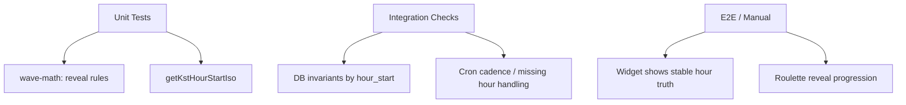
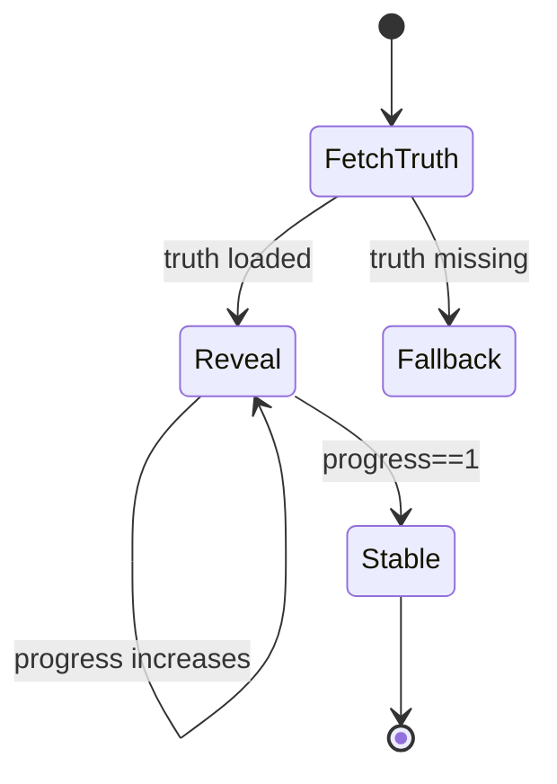
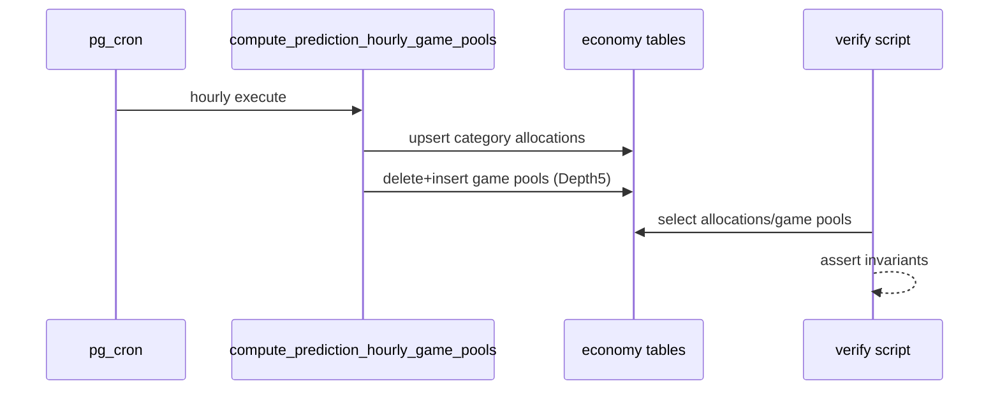
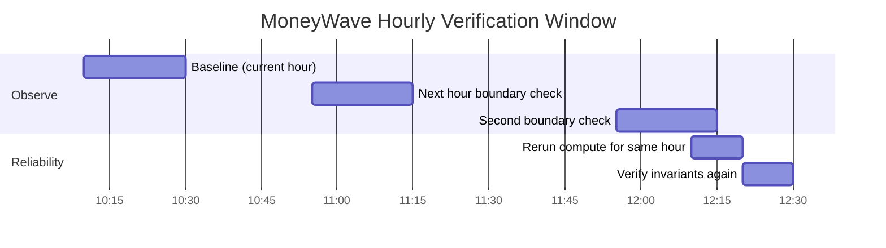
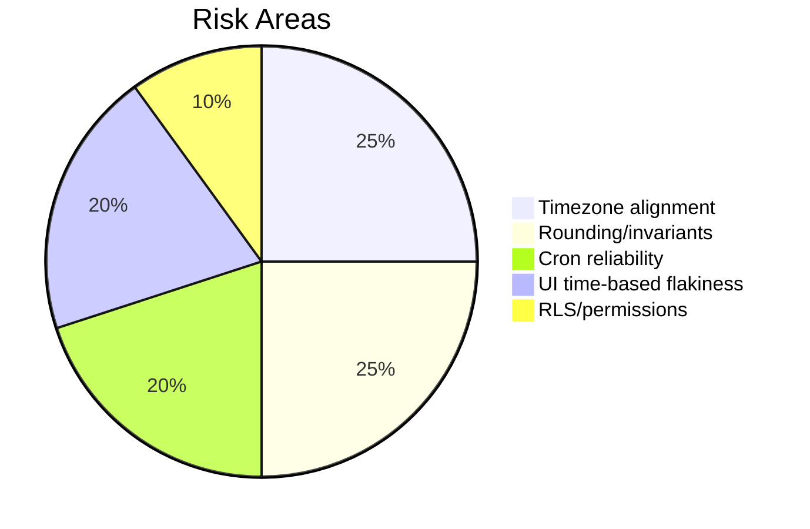

# TEST PLAN: MoneyWave Depth5 Pools + Roulette Reveal

목표는 1시간마다 MoneyWave Truth가 **Depth5(game_id)까지 DB에 확정 저장**되고, UI 룰렛(연출)이 **50% → 100% reveal** 규칙대로 안정적으로 동작하는지 검증하는 것입니다.

## 1) What to verify (Acceptance)

- DB (Truth)
  - 매 hour_start마다 `economy.money_wave_hourly_category_allocations`가 존재한다.
  - 매 hour_start마다 `economy.money_wave_hourly_game_pools`가 존재한다.
  - 불변식(invariants):
    - `sum(game_pools.pool_pmc) == sum(category_allocations.pool_pmc)`
    - 카테고리별로 `sum(game_pools.pool_pmc where category=C) == category_allocations.pool_pmc for C`
- UI (Display)
  - 같은 hour_start 내에서 display는 **0.5x → 1.0x**로 단조 증가(비감소)한다.
  - progress=1에서 display == truth가 된다.
  - activityBoost는 reveal 속도(진행감)만 바꾸고, 1시간 내 100% 도달을 깨지 않는다.

```mermaid
flowchart TD
  A[Hour Start (KST)] --> B[DB Truth: category allocations]
  B --> C[DB Truth: game pools (Depth5)]
  C --> D[UI reads Truth]
  D --> E[revealRatio 0.5 -> 1.0]
  E --> F[Display amount]
  C --> G[Settlement uses Truth]
```

## 2) Test scope & layers



## 3) Automated tests (repo)

### 3.1 Unit tests (Jest)
- `computeRevealRatio(progress, participants, activeGames)`
  - progress=0 → revealRatio=0.5
  - progress=1 → revealRatio=1
  - 0.5 ≤ revealRatio ≤ 1
  - progress 단조 증가(비감소)
- `getKstHourStartIso(now)`
  - KST 정각 절삭이 UTC ISO(Z)로 정확히 매핑되는지

실행
- `pnpm -F @posmul/posmul-web test`



## 4) DB verification (hourly, Depth5)

### 4.1 Read-only invariant check script
스크립트는 **현재 hour_start(KST)와 직전 hour_start(KST)** 2개에 대해 불변식을 검사합니다.

실행
- 환경 변수 필요: `NEXT_PUBLIC_SUPABASE_URL`, `SUPABASE_SERVICE_ROLE_KEY`
- `pnpm -F @posmul/posmul-web verify:moneywave:depth5`

검사 항목
- allocations rows > 0
- game pools rows > 0
- totals match exactly (micro 단위 BigInt 합산)
- per-category totals match



## 5) Hourly run plan (operational)

권장: 최소 3시간 연속 관찰(현재/다음/그다음) + 누락 케이스(크론 지연/재실행) 1회.



## 6) Risks & anti-flakes

- DB는 numeric 정밀도/반올림 이슈가 있으므로, 검증은 float가 아닌 micro(BigInt) 합산으로 한다.
- UI reveal은 시간 기반이므로, E2E는 “값이 증가한다/최종이 truth에 수렴한다” 같은 성질 검증 위주로 한다.
- 크론 실행 시각 자체가 UTC여도, hour_start 계산이 KST로 고정되어 있으면 Truth는 KST 정각 기준으로 생성된다.


