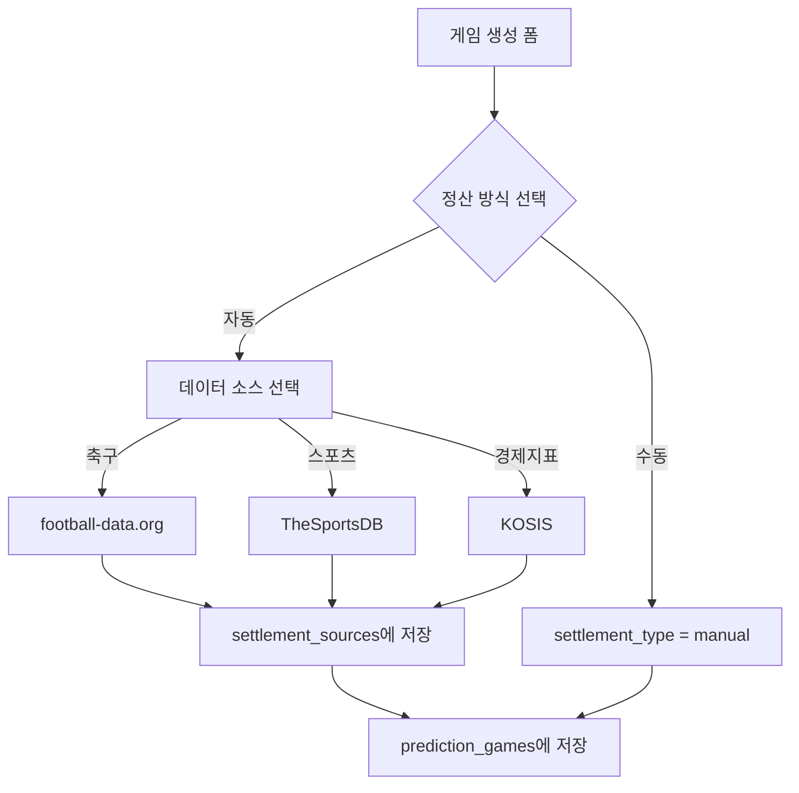
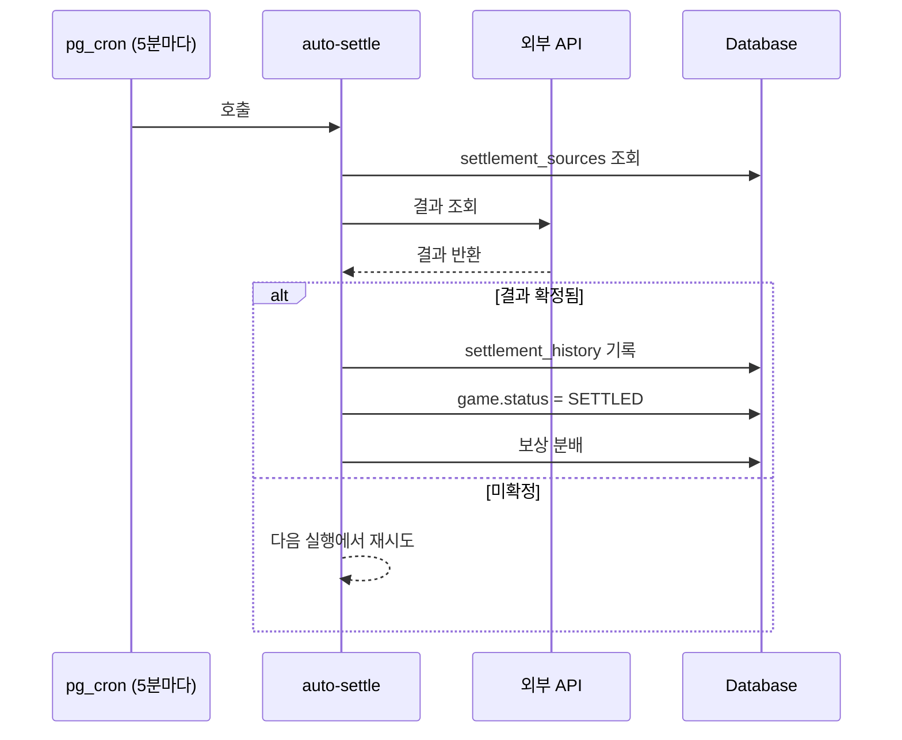

# 예측 게임 생성 및 정산 시스템

## 개요

PosMul 예측 게임 시스템은 두 가지 정산 방식을 지원합니다:
1. **자동 정산**: 외부 API에서 결과를 가져와 자동으로 정산
2. **수동 정산**: 관리자가 직접 결과를 입력하여 정산

---

## 게임 생성 플로우



### 필수 입력 항목

| 항목 | 설명 |
|------|------|
| 제목 | 게임 제목 (10자 이상) |
| 설명 | 상세 설명 (20자 이상) |
| 예측 타입 | binary / multiple / numeric |
| 옵션 | 최소 2개 선택지 |
| 종료 시간 | 예측 참여 마감 시간 |
| 정산 시간 | 결과 확정 예상 시간 |
| 정산 방식 | manual / semi_auto / auto |

---

## 정산 방식 1: 자동 정산 (API 연동)

### 지원 데이터 소스

| 소스 | 용도 | API |
|------|------|-----|
| football-data.org | 축구 경기 결과 | 무료 |
| TheSportsDB | 다양한 스포츠 | 무료 |
| KOSIS | 정부 경제지표 | 무료 |

### 동작 방식



### 설정 예시 (축구 경기)

```json
{
  "source_type": "football_data",
  "external_id": "12345",
  "scheduled_at": "2024-01-15T22:00:00Z",
  "source_config": {
    "optionMapping": {
      "HOME_TEAM": "option_id_1",
      "AWAY_TEAM": "option_id_2", 
      "DRAW": "option_id_3"
    }
  }
}
```

---

## 정산 방식 2: 수동 정산 (관리자 직접)

### 프로세스


### 관리자 정산 절차

1. 관리자 대시보드 접속
2. 정산 대기 게임 목록 확인
3. 해당 게임 선택 → 승리 옵션 지정
4. 정산 실행 버튼 클릭
5. settlement_history에 기록됨

---

## 보상 계산 로직

```typescript
// 상금 풀 = 패자들의 총 베팅액
prizePool = losers.totalStaked

// 각 승자의 보상
for (winner of winners) {
  ratio = winner.staked / winners.totalStaked
  gross = winner.staked + prizePool * ratio
  fee = gross * 0.02  // 2% 플랫폼 수수료
  net = gross - fee
  
  // winner에게 net 지급
}
```

### 예시

| 참가자 | 선택 | 베팅액 |
|--------|------|--------|
| A | 맨시티 승 | 1,000 |
| B | 맨시티 승 | 2,000 |
| C | 아스날 승 | 3,000 |

**결과: 맨시티 승**
- 상금 풀: 3,000 (C의 베팅액)
- A 보상: 1,000 + 3,000 × (1/3) = 2,000 → 수수료 2% 차감 = **1,960**
- B 보상: 2,000 + 3,000 × (2/3) = 4,000 → 수수료 2% 차감 = **3,920**

---

## 관련 테이블

| 테이블 | 역할 |
|--------|------|
| `prediction_games` | 게임 정보, status, winning_option_id |
| `settlement_sources` | 자동 정산 API 설정 |
| `settlement_history` | 정산 이력 |
| `predictions` | 사용자 베팅 |

---

## 관련 파일

| 파일 | 역할 |
|------|------|
| `PredictionGameForm.tsx` | 게임 생성 폼 |
| `settlement-orchestrator.service.ts` | API 연동 오케스트레이터 |
| `prediction-settlement.service.ts` | 보상 계산 로직 |
| `supabase/functions/auto-settle` | 자동 정산 Edge Function |
