# PosMul Project Guidelines (Enhanced Visualization Edition)

> **Purpose**: PosMul 프로젝트 특화 개발 및 협업 규칙  
> **Scope**: DDD 아키텍처, MCP 도구, 경제 시스템, 기술 스택  
> **Application**: PosMul 플랫폼 개발 전반

## 🚨 **CRITICAL: PosMul 시각화 표준 (Mandatory for All PosMul Docs)**

### 🎯 **PosMul 문서 시각화 필수 요구사항**

**❌ 시각화 없는 PosMul 문서는 절대 허용되지 않습니다!**

#### 📊 **PosMul 도메인별 시각화 표준**

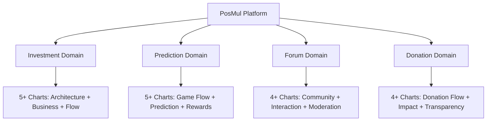

#### 🏗️ **DDD 아키텍처 시각화 표준**

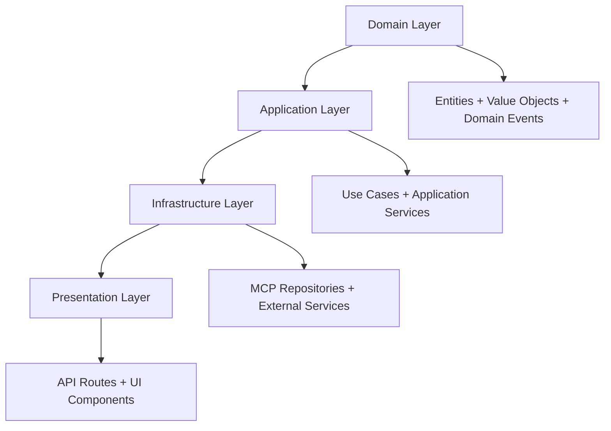

#### 💰 **경제 시스템 시각화 표준**

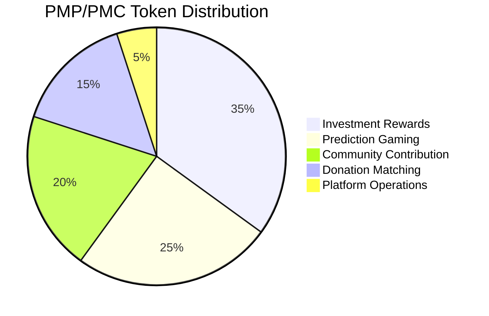

### 🎨 **PosMul 색상 팔레트 (강제 적용)**

**PosMul 브랜드 색상 시스템:**

- **#4169E1** (Royal Blue): Investment Domain, 핵심 기능
- **#32CD32** (Lime Green): Prediction Domain, 게임 요소
- **#FF69B4** (Hot Pink): Donation Domain, 기부 활동
- **#FFD700** (Gold): Forum Domain, 커뮤니티
- **#87CEEB** (Sky Blue): 시스템 아키텍처, 기술 요소

## 📚 Table of Contents

- [@1. 프로젝트 개요](#1-프로젝트-개요)
- [@2. 아키텍처 원칙](#2-아키텍처-원칙)
- [@3. 도메인 구조](#3-도메인-구조)
- [@4. 기술 스택 및 도구](#4-기술-스택-및-도구)
- [@5. 개발 워크플로우](#5-개발-워크플로우)
- [@6. 경제 시스템 설계](#6-경제-시스템-설계)
- [@7. 품질 및 테스트](#7-품질-및-테스트)
- [@8. 배포 및 운영](#8-배포-및-운영)
- [@9. PosMul 시각화 가이드라인](#9-posmul-시각화-가이드라인)
- [@10. 협업 규칙](#10-협업-규칙)

---

## 1. 프로젝트 개요

### 🎯 **PosMul 플랫폼 비전**

PosMul은 예측 게임, 투자, 기부, 커뮤니티를 통합한 종합 플랫폼으로, 사용자들이 PMP/PMC 토큰 경제 시스템을 통해 가치를 창출하고 공유할 수 있는 생태계입니다.

### 📊 **플랫폼 구성 요소**

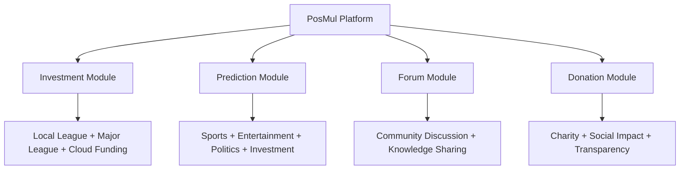

### 🏗️ **핵심 아키텍처 원칙**

- **Domain-Driven Design (DDD)**: 비즈니스 도메인 중심의 설계
- **Clean Architecture**: 계층 분리와 의존성 역전
- **Event-Driven Architecture**: 도메인 이벤트 기반 통신
- **MCP Integration**: Model Context Protocol을 통한 데이터 관리
- **🔥 Visualization First**: 모든 설계 문서에 시각화 우선 적용

---

## 2. 아키텍처 원칙

### 🏛️ **DDD 계층 구조**

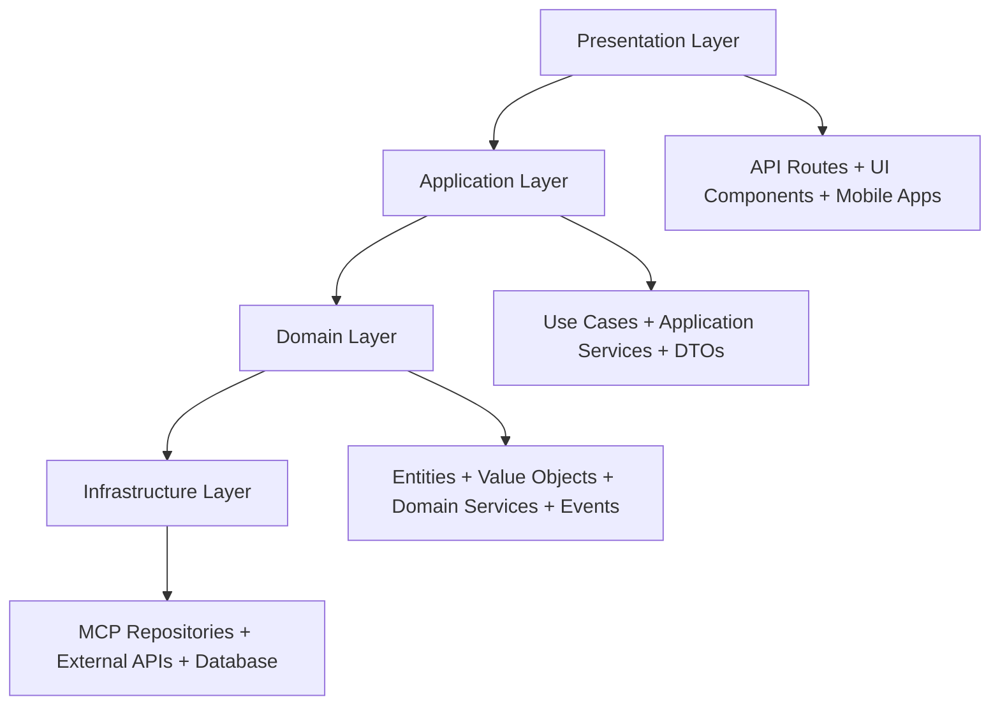

#### 📋 **계층별 책임**

1. **Domain Layer (도메인 계층)**

   - 비즈니스 로직의 핵심
   - Entities, Value Objects, Domain Events
   - 외부 의존성 없는 순수한 비즈니스 규칙

2. **Application Layer (애플리케이션 계층)**

   - Use Cases 구현
   - 도메인 객체들의 협력 조율
   - 트랜잭션 관리

3. **Infrastructure Layer (인프라 계층)**

   - MCP Repository 구현체
   - 외부 서비스 연동
   - 데이터베이스 접근

4. **Presentation Layer (표현 계층)**
   - API Routes (Next.js App Router)
   - UI Components (React)
   - 모바일 앱 인터페이스

### 🔄 **의존성 방향**

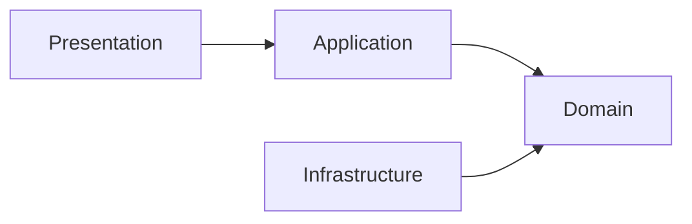

**핵심 원칙**: 모든 의존성은 Domain Layer를 향해야 함

---

## 3. 도메인 구조

### 🎯 **4개 핵심 도메인**

#### 💰 **Investment Domain**

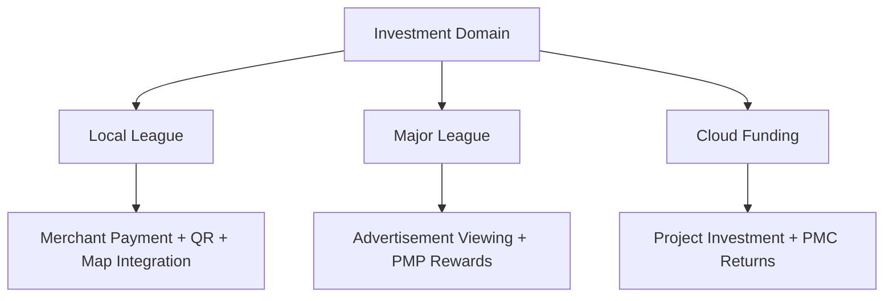

**핵심 엔티티:**

- `Merchant`: 지역 상점 정보
- `Advertisement`: 광고 콘텐츠
- `CrowdFunding`: 크라우드 펀딩 프로젝트
- `Investment`: 투자 기록

#### 🎮 **Prediction Domain**

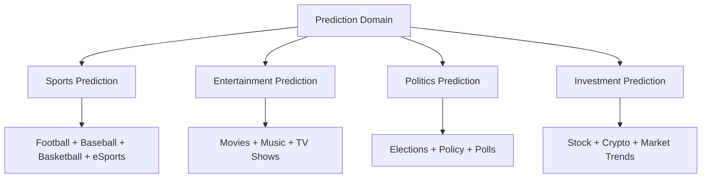

**핵심 엔티티:**

- `Prediction`: 예측 게임
- `PredictionPool`: 예측 풀
- `UserPrediction`: 사용자 예측
- `PredictionResult`: 예측 결과

#### 💬 **Forum Domain**

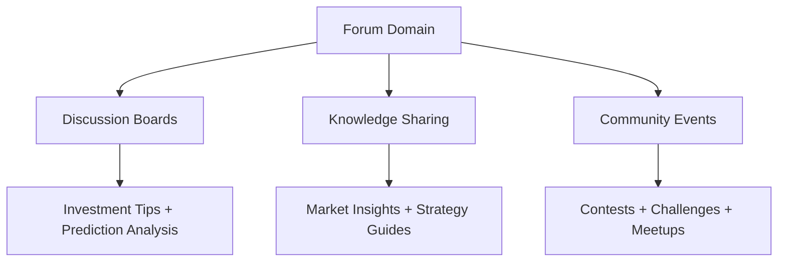

**핵심 엔티티:**

- `Post`: 게시글
- `Comment`: 댓글
- `Topic`: 주제/카테고리
- `UserReputation`: 사용자 평판

#### ❤️ **Donation Domain**

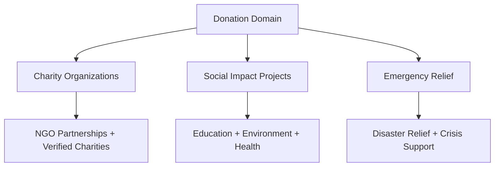

**핵심 엔티티:**

- `Donation`: 기부 기록
- `Charity`: 자선 단체
- `Campaign`: 기부 캠페인
- `ImpactReport`: 영향 보고서

### 🔗 **도메인 간 관계**

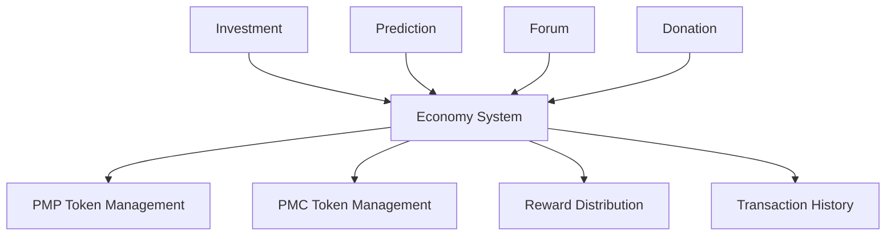

---

## 4. 기술 스택 및 도구

### 🛠️ **핵심 기술 스택**

#### **Frontend & Framework**

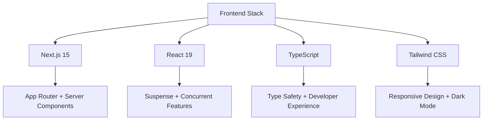

#### **Backend & Database**

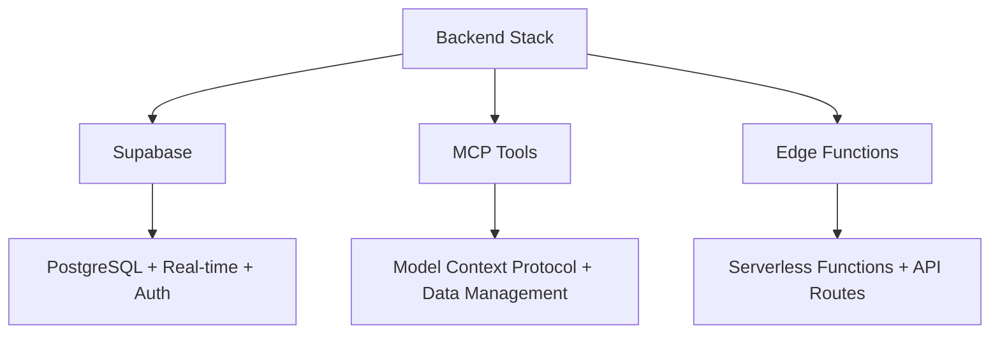

#### **개발 도구**

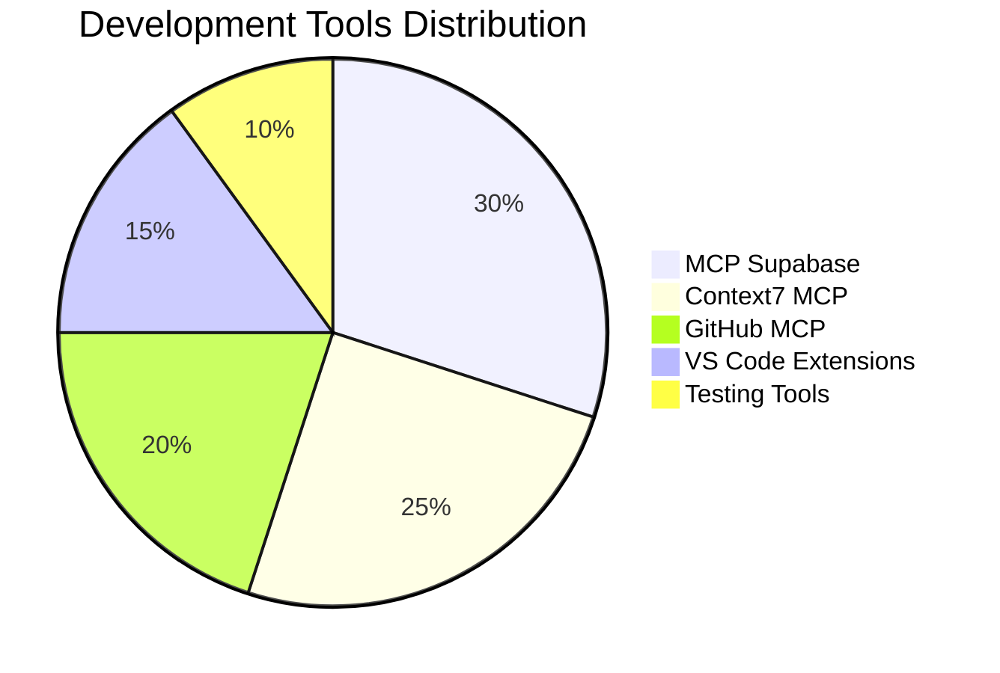

### 🔧 **MCP 도구 활용**

#### **필수 MCP 도구**

1. **Supabase MCP**: 데이터베이스 관리
2. **Context7 MCP**: 문서화 및 모범 사례
3. **GitHub MCP**: 코드 관리 및 협업

#### **MCP 사용 원칙**

- **CLI 도구 금지**: Supabase CLI 대신 MCP 도구 사용
- **직접 데이터베이스 접근**: MCP를 통한 스키마 관리
- **문서화 자동화**: Context7 MCP로 최신 정보 유지

---

## 5. 개발 워크플로우

### 🔄 **개발 프로세스**

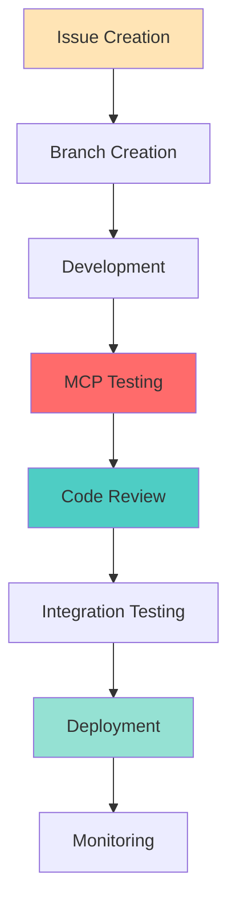

#### **브랜치 전략**

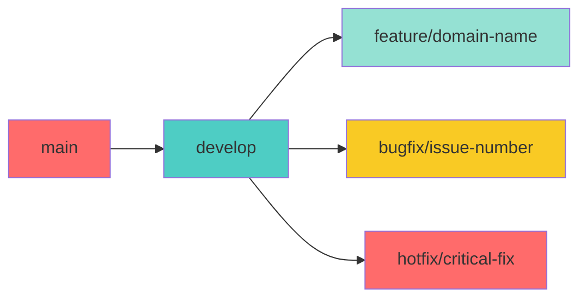

#### **커밋 컨벤션**

```bash
# 도메인별 커밋 메시지
feat(investment): add Local League merchant payment
fix(prediction): resolve sports prediction calculation
docs(forum): update community guidelines
test(donation): add charity verification tests
```

### 📋 **코드 리뷰 체크리스트**

- [ ] DDD 원칙 준수
- [ ] MCP 도구 활용
- [ ] 타입 안전성 확보
- [ ] 테스트 커버리지 80% 이상
- [ ] **🔥 시각화 포함**: 모든 설계 문서에 다이어그램 포함
- [ ] 성능 최적화 고려
- [ ] 보안 취약점 검토

---

## 6. 경제 시스템 설계

### 💰 **PMP/PMC 토큰 시스템**

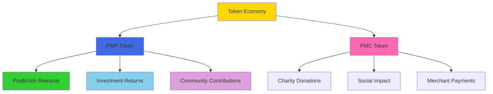

#### **토큰 획득 방법**

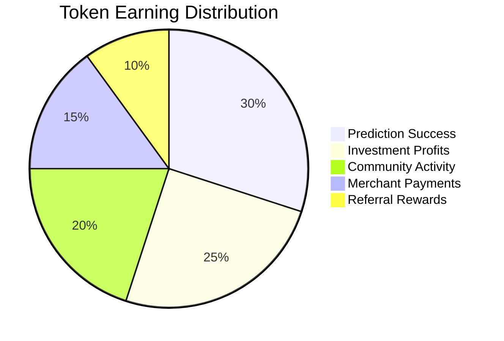

#### **경제 모델 원칙**

1. **Agency Theory**: 사용자 인센티브 정렬
2. **CAPM**: 위험 기반 수익률 계산
3. **Behavioral Economics**: 사용자 행동 패턴 분석
4. **Token Utility**: 실제 사용 가치 창출

### 📊 **수익 모델**

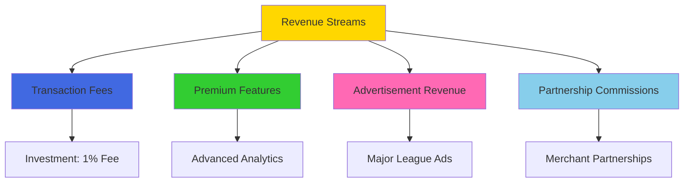

---

## 7. 품질 및 테스트

### 🧪 **테스트 전략**

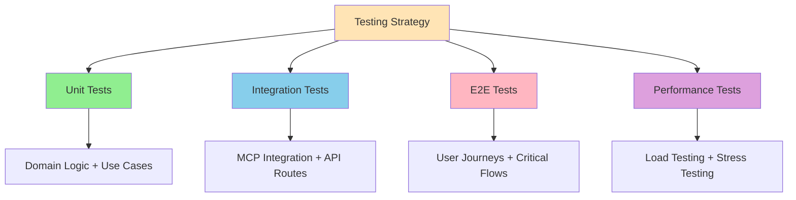

#### **테스트 커버리지 목표**

```mermaid
pie title Test Coverage Goals
    "Domain Layer" : 95
    "Application Layer" : 90
    "Infrastructure Layer" : 80
    "Presentation Layer" : 75
```

#### **품질 메트릭**

- **코드 커버리지**: 80% 이상
- **성능**: API 응답 시간 200ms 이하
- **가용성**: 99.9% 업타임
- **보안**: OWASP Top 10 준수
- **🔥 문서화**: 모든 주요 기능에 시각화 포함

### 🔍 **코드 품질 도구**

- **ESLint**: 코드 스타일 검사
- **Prettier**: 코드 포맷팅
- **TypeScript**: 타입 안전성
- **Jest**: 단위 테스트
- **Playwright**: E2E 테스트

---

## 8. 배포 및 운영

### 🚀 **배포 전략**

```mermaid
graph TD
    A[Deployment Pipeline] --> B[Development]
    B --> C[Staging]
    C --> D[Production]

    A --> E[Feature Flags]
    A --> F[Blue-Green Deployment]
    A --> G[Rollback Strategy]

    style A fill:#FFE4B5
    style B fill:#90EE90
    style C fill:#87CEEB
    style D fill:#FFB6C1
```

#### **환경별 설정**

```mermaid
pie title Environment Distribution
    "Production" : 40
    "Staging" : 30
    "Development" : 20
    "Testing" : 10
```

#### **모니터링 및 알림**

- **성능 모니터링**: Vercel Analytics
- **에러 추적**: Sentry
- **로그 관리**: Supabase Logs
- **알림 시스템**: Discord/Slack 연동

### 📊 **운영 메트릭**

```mermaid
graph TD
    A[Operational Metrics] --> B[Performance]
    A --> C[Business]
    A --> D[Technical]

    B --> E[Response Time + Throughput]
    C --> F[User Growth + Token Volume]
    D --> G[Error Rate + Uptime]

    style A fill:#FFD700
    style B fill:#32CD32
    style C fill:#4169E1
    style D fill:#FF69B4
```

---

## 9. PosMul 시각화 가이드라인

### 🎨 **PosMul 전용 시각화 표준**

#### 📊 **도메인별 필수 차트**

**Investment Domain 시각화:**

```mermaid
quadrantChart
    title Investment Opportunity Matrix
    x-axis Risk Low --> High
    y-axis Return Low --> High
    quadrant-1 High Return Low Risk
    quadrant-2 High Return High Risk
    quadrant-3 Low Return Low Risk
    quadrant-4 Low Return High Risk

    Local League: [0.3, 0.7]
    Major League: [0.5, 0.6]
    Cloud Funding: [0.7, 0.8]
```

**Prediction Domain 시각화:**

```mermaid
pie title Prediction Categories
    "Sports" : 35
    "Investment" : 25
    "Entertainment" : 20
    "Politics" : 15
    "Others" : 5
```

**Forum Domain 시각화:**

```mermaid
graph TD
    A[Community Engagement] --> B[Discussion Quality]
    A --> C[Knowledge Sharing]
    A --> D[User Reputation]

    B --> E[Upvotes + Comments + Views]
    C --> F[Guides + Tips + Analysis]
    D --> G[Contribution Score + Trust Level]

    style A fill:#FFD700
    style B fill:#4169E1
    style C fill:#32CD32
    style D fill:#FF69B4
```

**Donation Domain 시각화:**

```mermaid
graph LR
    A[Donation Impact] --> B[Transparency]
    B --> C[Verification]
    C --> D[Impact Measurement]
    D --> E[Community Trust]
    E --> A

    style A fill:#FF69B4
    style B fill:#32CD32
    style C fill:#4169E1
    style D fill:#FFD700
    style E fill:#87CEEB
```

#### 🏗️ **아키텍처 시각화 템플릿**

**DDD 레이어 시각화:**

```mermaid
graph TD
    subgraph "Presentation Layer"
        A[API Routes]
        B[UI Components]
        C[Mobile Apps]
    end

    subgraph "Application Layer"
        D[Use Cases]
        E[Application Services]
        F[DTOs]
    end

    subgraph "Domain Layer"
        G[Entities]
        H[Value Objects]
        I[Domain Events]
        J[Domain Services]
    end

    subgraph "Infrastructure Layer"
        K[MCP Repositories]
        L[External APIs]
        M[Database]
    end

    A --> D
    B --> D
    C --> D
    D --> G
    E --> H
    F --> I
    K --> G
    L --> H
    M --> I
```

#### 💰 **경제 시스템 시각화**

**토큰 플로우:**

```mermaid
graph TD
    A[User Actions] --> B[Token Earning]
    B --> C[Token Pool]
    C --> D[Token Spending]
    D --> E[Value Creation]
    E --> A

    B --> F[PMP: Prediction + Investment]
    B --> G[PMC: Donation + Merchant]

    style A fill:#87CEEB
    style B fill:#90EE90
    style C fill:#FFD700
    style D fill:#FF69B4
    style E fill:#DDA0DD
```

### 🔧 **PosMul Mermaid 확장 규칙**

#### **브랜드 색상 강제 적용**

```mermaid
pie title PosMul Brand Colors Usage
    "Investment (#4169E1)" : 30
    "Prediction (#32CD32)" : 25
    "Forum (#FFD700)" : 25
    "Donation (#FF69B4)" : 20
```

#### **도메인 식별 아이콘**

- 💰 Investment Domain
- 🎮 Prediction Domain
- 💬 Forum Domain
- ❤️ Donation Domain
- 🏗️ Architecture
- 📊 Economics
- 🔧 Technical

### 📋 **PosMul 시각화 체크리스트**

```
🔥 PosMul Critical Checks:
□ 도메인별 브랜드 색상 적용
□ 도메인 식별 아이콘 포함
□ DDD 레이어 구분 명확
□ 경제 시스템 연관성 표시
□ MCP 도구 연동 표시

⚡ PosMul Quality Checks:
□ 비즈니스 가치 명확화
□ 사용자 여정 포함
□ 토큰 이코노미 연결
□ 크로스 도메인 관계 표시
□ 기술 스택 일관성
```

---

## 10. 협업 규칙

### 🤝 **팀 협업 원칙**

#### **커뮤니케이션**

- **비동기 우선**: GitHub Issues, Discussions 활용
- **정기 동기화**: 주간 스프린트 리뷰
- **문서화 필수**: 모든 결정사항 기록
- **🔥 시각화 공유**: 모든 설계 논의에 다이어그램 포함

#### **코드 소유권**

```mermaid
graph TD
    A[Code Ownership] --> B[Domain Experts]
    A --> C[Cross-Domain Reviews]
    A --> D[Shared Components]

    B --> E[Investment: Backend Team]
    B --> F[Prediction: Game Team]
    B --> G[Forum: Community Team]
    B --> H[Donation: Social Team]


```

#### **의사결정 프로세스**

1. **RFC (Request for Comments)**: 주요 변경사항
2. **Technical Review**: 아키텍처 영향도 평가
3. **Business Review**: 비즈니스 가치 검증
4. **Team Consensus**: 팀 합의 도출

### 📋 **프로젝트 관리**

#### **스프린트 계획**

```mermaid
gantt
    title PosMul Sprint Planning
    dateFormat  YYYY-MM-DD
    section Sprint 1
    Investment MVP    :done, inv1, 2024-01-01, 2w
    section Sprint 2
    Prediction Core   :active, pred1, 2024-01-15, 2w
    section Sprint 3
    Forum Basic      :forum1, 2024-01-29, 2w
    section Sprint 4
    Donation MVP     :don1, 2024-02-12, 2w
```

#### **이슈 관리**

- **라벨 시스템**: domain:investment, type:feature, priority:high
- **템플릿 활용**: 버그 리포트, 기능 요청, RFC
- **자동화**: GitHub Actions을 통한 워크플로우

### 🎯 **성과 측정**

```mermaid
pie title Team Performance Metrics
    "Code Quality" : 30
    "Delivery Speed" : 25
    "Documentation" : 20
    "Collaboration" : 15
    "Innovation" : 10
```

#### **KPI 대시보드**

- **개발 속도**: Story Points per Sprint
- **품질 지표**: Bug Rate, Test Coverage
- **협업 효율성**: Review Time, Communication Score
- **사용자 만족도**: Feature Adoption, User Feedback

---

## 📋 **PosMul 개발 체크리스트**

### ✅ **Architecture Compliance**

- [ ] DDD 원칙 준수 (Domain-First Design)
- [ ] Clean Architecture 계층 분리
- [ ] MCP 도구 활용 (Supabase CLI 금지)
- [ ] 이벤트 기반 도메인 통신
- [ ] **🔥 시각화 포함**: 모든 설계에 다이어그램

### ✅ **Business Logic Verification**

- [ ] 토큰 경제 시스템 통합
- [ ] 도메인 간 일관성 유지
- [ ] 사용자 여정 최적화
- [ ] 비즈니스 규칙 검증
- [ ] **🔥 경제 모델 시각화**: 토큰 플로우 다이어그램

### ✅ **Technical Standards**

- [ ] TypeScript 타입 안전성
- [ ] Next.js 15 + React 19 호환성
- [ ] 성능 최적화 (200ms 응답시간)
- [ ] 보안 베스트 프랙티스
- [ ] **🔥 기술 스택 시각화**: 아키텍처 다이어그램

### ✅ **Quality Assurance**

- [ ] 테스트 커버리지 80% 이상
- [ ] 코드 리뷰 완료
- [ ] 성능 테스트 통과
- [ ] 보안 감사 완료
- [ ] **🔥 품질 메트릭 시각화**: 대시보드 차트

### ✅ **Documentation & Communication**

- [ ] API 문서 업데이트
- [ ] 사용자 가이드 작성
- [ ] 개발자 문서 정리
- [ ] 팀 커뮤니케이션 완료
- [ ] **🔥 필수 시각화**: 문서 유형별 최소 차트 개수 충족

---

**Note**: 이 가이드라인은 PosMul 프로젝트의 성공적인 개발과 운영을 위한 필수 규칙입니다. 모든 팀원은 이 원칙을 준수하여 일관되고 고품질의 제품을 만들어 나가야 합니다.

**🎯 Enhanced Note**: PosMul 프로젝트의 모든 문서와 설계는 시각화 중심으로 작성되어야 하며, 이는 팀 커뮤니케이션 효율성과 제품 품질 향상을 위한 필수 요구사항입니다.
