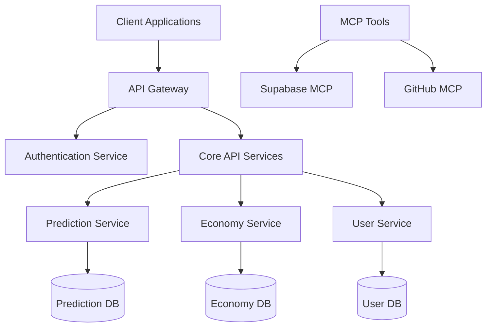

# 📋 Reference - 기술 사전

> **목적**: 정확한 기술 정보 제공  
> **대상**: 숙련된 사용자, 개발자

## 🎯 Reference 특징

- ✅ **정확성**: 100% 정확한 정보 제공
- ✅ **완전성**: 모든 옵션/매개변수 포함
- ✅ **구조화**: 체계적이고 일관된 구조
- ✅ **검색 가능**: 빠른 정보 검색 지원

## 📁 카테고리별 레퍼런스

### 🔗 [API](./api/) - API 레퍼런스

완전한 API 문서:

- REST API 엔드포인트
- GraphQL 스키마
- 요청/응답 스키마
- 에러 코드 및 메시지

### 💻 [CLI](./cli/) - 명령줄 인터페이스

CLI 도구 완전 가이드:

- 명령어 레퍼런스
- 옵션 및 플래그
- 설정 파일 형식
- 예제 사용법

### ⚙️ [Configuration](./configuration/) - 설정 레퍼런스

모든 설정 옵션:

- 환경 변수
- 설정 파일 스키마
- 기본값 및 권장값
- 설정 유효성 검사

## 📊 아키텍처 개요



## 📝 Reference 작성 가이드

새로운 레퍼런스를 작성할 때는 다음 템플릿을 사용하세요:

```markdown
# 📋 [API/도구] Reference

## 📖 개요

- 버전 정보
- 호환성

## 🔗 엔드포인트/명령어

### GET /endpoint

- Parameters
- Response Schema
- Status Codes

## ⚙️ 설정 옵션

| 옵션 | 타입 | 기본값 | 설명 |

## ❌ 에러 코드

- CODE_001: 설명
```

## 🔗 관련 문서

- [Tutorials](../tutorials/) - 기초 학습
- [How-to Guides](../how-to/) - 문제 해결
- [Explanation](../explanation/) - 심화 이해
