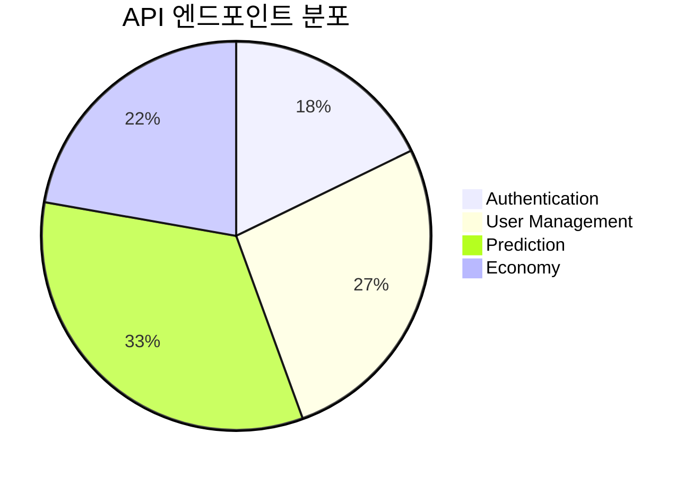

# 🔗 API Reference

> 모든 API 엔드포인트와 기술 세부사항

## 📋 API 카테고리

### 🔐 Authentication API

- [ ] **인증 및 토큰 관리**
- [ ] **사용자 세션 관리**
- [ ] **권한 검증**

### 👤 User Management API

- [ ] **사용자 프로필 관리**
- [ ] **사용자 설정**
- [ ] **사용자 통계**

### 🎯 Prediction API

- [ ] **예측 게임 생성/관리**
- [ ] **예측 참여**
- [ ] **결과 정산**

### 💰 Economy API

- [ ] **PMP/PMC 관리**
- [ ] **트랜잭션 기록**
- [ ] **Money Wave 시스템**

## 📊 API 현황

## 📝 새 API 문서 추가하기

새로운 API 문서를 추가할 때는 다음 형식을 따르세요:

`[service-name]-api.md`
