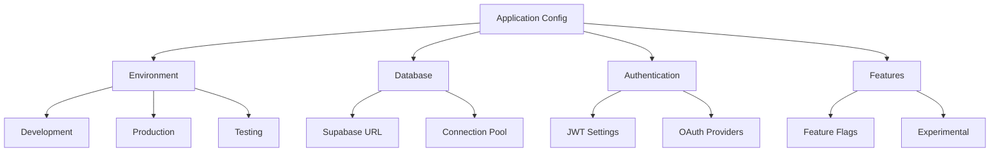

# ⚙️ Configuration Reference

> 모든 설정 옵션과 환경 변수 완전 가이드

## 📋 설정 카테고리

### 🌍 Environment Variables

- [ ] **개발 환경 변수**
- [ ] **프로덕션 환경 변수**
- [ ] **보안 관련 설정**

### 📄 Configuration Files

- [ ] **next.config.ts**
- [ ] **tailwind.config.ts**
- [ ] **tsconfig.json**
- [ ] **package.json**

### 🔗 Service Configurations

- [ ] **Supabase 설정**
- [ ] **GitHub MCP 설정**
- [ ] **Vercel 배포 설정**

## 🎛️ 주요 설정 구조

## 📊 설정 우선순위

1. **환경 변수** (최우선)
2. **설정 파일** (.env.local)
3. **기본값** (코드 내 정의)

## 📝 새 설정 문서 추가하기

새로운 설정 문서를 추가할 때는 다음 형식을 따르세요:

`[component]-config.md`
