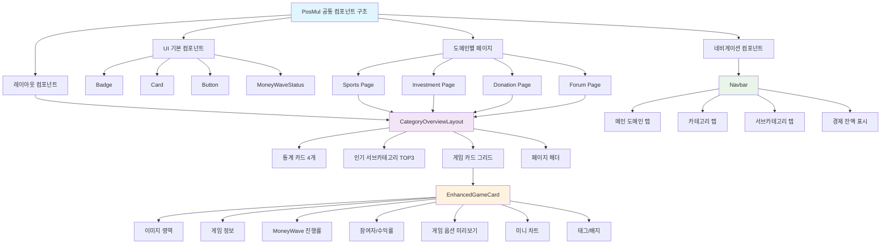
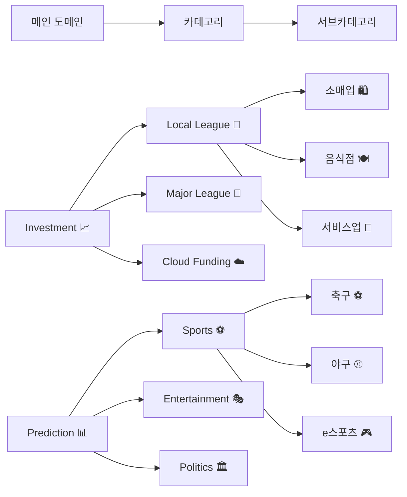
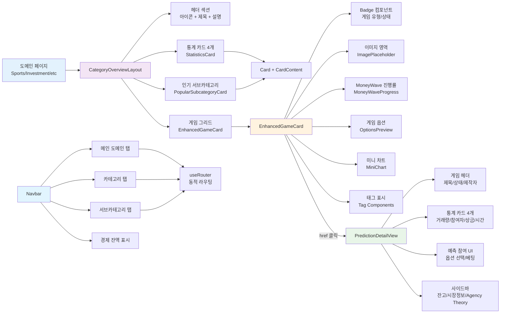

# PosMul 공통 컴포넌트 완전 가이드

> **목적**: 프론트엔드 개발자들을 위한 PosMul 플랫폼 공통 컴포넌트 사용법 및 아키텍처 가이드  
> **작성일**: 2024년 12월  
> **버전**: v1.0

## 📋 목차

1. [개요](#개요)
2. [아키텍처 구조](#아키텍처-구조)
3. [핵심 레이아웃 컴포넌트](#핵심-레이아웃-컴포넌트)
4. [게임 카드 컴포넌트](#게임-카드-컴포넌트)
5. [네비게이션 컴포넌트](#네비게이션-컴포넌트)
6. [UI 기본 컴포넌트](#ui-기본-컴포넌트)
7. [컴포넌트 연결 관계](#컴포넌트-연결-관계)
8. [개발 가이드](#개발-가이드)
9. [타입 정의](#타입-정의)

## 개요

PosMul 플랫폼은 **DDD(Domain-Driven Design)**와 **Clean Architecture** 원칙을 따르는 공통 컴포넌트 시스템을 제공합니다. 모든 도메인(Investment, Prediction, Donation, Forum)에서 일관된 사용자 경험을 위해 재사용 가능한 컴포넌트들을 설계했습니다.

### 🎯 핵심 원칙

- **일관성**: 모든 도메인에서 동일한 디자인 패턴
- **재사용성**: 한 번 개발하여 여러 곳에서 활용
- **확장성**: 새로운 기능 추가 시 기존 구조 유지
- **타입 안전성**: TypeScript 기반 엄격한 타입 체크
- **경제 시스템 통합**: PMP/PMC 기반 MoneyWave 시스템 내장

## 아키텍처 구조



## 핵심 레이아웃 컴포넌트

### CategoryOverviewLayout

**경로**: `src/shared/components/CategoryOverviewLayout.tsx`

모든 도메인([category])에서 재사용 가능한 공통 레이아웃 컴포넌트입니다.

#### 주요 기능

1. **📊 통계 정보 4개 카드**

   - MoneyWave 총 보상 풀
   - 총 참여자 수
   - 활성 게임 수
   - 서브카테고리 수

2. **🔥 인기 서브카테고리 TOP 3**

   - 참여자 수 기준 자동 정렬
   - 순위 표시 (#1, #2, #3)
   - 아이콘과 함께 시각적 표시

3. **🎮 게임 카드 그리드**

   - EnhancedGameCard 사용
   - 반응형 그리드 레이아웃
   - 최대 표시 개수 제한 가능

4. **📄 페이지 헤더**
   - 대형 아이콘 표시
   - 제목과 설명
   - 중앙 정렬 레이아웃

#### Props 인터페이스

```typescript
interface CategoryOverviewLayoutProps {
  category: string; // 도메인 이름 (예: "스포츠")
  title: string; // 페이지 제목
  description: string; // 페이지 설명
  icon: string; // 이모지 아이콘
  statistics: CategoryStatistics; // 통계 정보
  popularSubcategories: PopularSubcategory[]; // 인기 서브카테고리
  games: GameCardProps[]; // 게임 데이터 배열
  showPopularSection?: boolean; // 인기 섹션 표시 여부 (기본: true)
  maxGamesDisplay?: number; // 최대 게임 표시 개수 (기본: 6)
}
```

#### 사용 예시

```typescript
import { CategoryOverviewLayout } from "@/shared/components";

export default function SportsPage() {
  const sportsStatistics = {
    totalRewardPool: 2500000, // 250만 PMC
    totalParticipants: 45678,
    activeGames: 89,
    subcategoryCount: 8,
  };

  const popularSubcategories = [
    {
      id: "soccer",
      title: "축구",
      icon: "⚽",
      participantCount: 15420,
      rank: 1,
    },
    {
      id: "esports",
      title: "e스포츠",
      icon: "🎮",
      participantCount: 12456,
      rank: 2,
    },
    {
      id: "baseball",
      title: "야구",
      icon: "⚾",
      participantCount: 8934,
      rank: 3,
    },
  ];

  return (
    <CategoryOverviewLayout
      category="스포츠"
      title="스포츠 예측"
      description="축구, 야구, 농구, e스포츠 등 다양한 스포츠 경기 결과를 예측하고 보상을 획득하세요!"
      icon="⚽"
      statistics={sportsStatistics}
      popularSubcategories={popularSubcategories}
      games={sportsGames}
      maxGamesDisplay={6}
    />
  );
}
```

## 게임 카드 컴포넌트

### EnhancedGameCard

**경로**: `src/shared/components/EnhancedGameCard.tsx`

풍부한 정보와 시각적 요소를 포함한 개선된 게임 카드 컴포넌트입니다.

### PredictionDetailView

**경로**: `src/bounded-contexts/prediction/presentation/components/PredictionDetailView.tsx`

개별 예측 게임의 상세 정보를 표시하고 참여할 수 있는 완전한 DetailPage 컴포넌트입니다.

#### 주요 기능

1. **📋 게임 헤더 정보**

   - 게임 제목, 설명, 카테고리
   - 상태 배지 (진행중/종료/정산중/대기중)
   - 제작자 정보 및 평판 점수
   - 마감 시간 카운트다운

2. **📊 통계 카드 (4개)**

   - 총 거래량 ($): 현재까지 베팅된 총 금액
   - 참여자 수: 게임에 참여한 사용자 수
   - 상금 풀 (PMC): MoneyWave 기반 보상 풀
   - 남은 시간: 게임 마감까지 남은 시간

3. **🎯 예측 참여 UI**

   - 게임 유형별 옵션 표시 (binary/wdl/ranking/multichoice)
   - 실시간 확률 및 배당률 표시
   - 베팅 금액 설정 (최소/최대 제한)
   - 예상 수익 자동 계산
   - 24시간 변동률 표시

4. **📱 사이드바 정보**
   - 사용자 잔고 (PMP/PMC)
   - 시장 정보 (예측 타입, 거래량, 변동률)
   - Agency Theory 적용 설명
   - 민주적 의사결정 프로세스 안내

#### 지원하는 예측 타입

```typescript
type PredictionType = "binary" | "wdl" | "ranking" | "multichoice";

// Binary (이진 예측): 예/아니오
// WDL (승무패): 승리/무승부/패배
// Ranking (순위): 순위 맞추기
// Multichoice (다중선택): 여러 옵션 중 선택
```

#### 사용 예시

```typescript
import { PredictionDetailView } from "@/bounded-contexts/prediction/presentation/components/PredictionDetailView";

export default function GameDetailPage({
  params,
}: {
  params: { slug: string };
}) {
  const game = {
    id: "champions-league-final",
    title: "2024 챔피언스리그 결승 - 맨시티 vs 레알 마드리드",
    description: "유럽 최고의 클럽들이 만나는 운명의 대결!",
    predictionType: "wdl" as const,
    options: [
      { id: "home", label: "맨시티 승리", probability: 0.45, odds: 2.2 },
      { id: "draw", label: "무승부", probability: 0.25, odds: 4.0 },
      { id: "away", label: "레알 마드리드 승리", probability: 0.3, odds: 3.3 },
    ],
    totalVolume: 3700000,
    participantCount: 24567,
    endTime: new Date("2024-12-25T19:00:00Z"),
    settlementTime: new Date("2024-12-25T22:00:00Z"),
    status: "ACTIVE" as const,
    category: "축구",
    creator: {
      name: "유럽축구전문가",
      reputation: 4.8,
      avatar: "⚽",
    },
    prizePool: 185000,
    minimumStake: 1000,
    maximumStake: 50000,
  };

  const userBalance = {
    pmp: 25000,
    pmc: 15000,
  };

  return (
    <div className="min-h-screen bg-gray-50 py-8">
      <div className="container mx-auto px-4">
        <PredictionDetailView game={game} userBalance={userBalance} />
      </div>
    </div>
  );
}
```

#### Agency Theory 통합

PredictionDetailView는 Agency Theory 원칙을 UI에 직접 반영합니다:

- **정보 비대칭 해결**: 모든 참여자에게 동일한 정보 제공
- **전문가 vs 일반인**: 제작자 평판 시스템으로 전문성 표시
- **집단 지성**: 실시간 확률 업데이트로 집단 의견 반영
- **투명한 보상**: MoneyWave 기반 명확한 보상 구조

#### 주요 특징

1. **🖼️ 이미지 지원**

   - 실제 이미지 URL 지원
   - 개발 중 그라데이션 placeholder
   - 게임 유형별 아이콘 표시

2. **🎯 게임 유형 시각화**

   - `binary` (⚡ 예/아니오): 간단한 이진 선택
   - `wdl` (🎯 승/무/패): 스포츠 경기 결과
   - `ranking` (🏆 순위 예측): 순위 맞추기
   - `multichoice` (🎲 다중 선택): 여러 옵션 중 선택

3. **💰 MoneyWave 정보 시각화**

   - 진행률 바 표시
   - 배수 정보 (예: 2.4x)
   - PMC 금액 표시
   - 배분 날짜 정보

4. **📊 게임 옵션 미리보기**

   - 주요 옵션 최대 3개 표시
   - 확률 또는 배당률 표시
   - "더보기" 표시로 추가 옵션 안내

5. **🏷️ 태그 및 배지 시스템**
   - 게임 관련 키워드 태그
   - HOT (🔥) 배지: 인기 게임
   - 추천 (⭐) 배지: 특별 추천 게임
   - 상태별 색상 구분

#### 게임 유형별 설정

```typescript
const gameTypeInfo = {
  binary: {
    icon: "⚡",
    label: "예/아니오",
    color: "bg-blue-100 text-blue-800",
  },
  wdl: {
    icon: "🎯",
    label: "승/무/패",
    color: "bg-green-100 text-green-800",
  },
  ranking: {
    icon: "🏆",
    label: "순위 예측",
    color: "bg-purple-100 text-purple-800",
  },
  multichoice: {
    icon: "🎲",
    label: "다중 선택",
    color: "bg-orange-100 text-orange-800",
  },
};
```

#### MoneyWave 정보 구조

```typescript
interface MoneyWaveInfo {
  allocatedPool: number; // 할당된 총 풀 (PMC)
  currentPool: number; // 현재 누적된 풀 (PMC)
  waveMultiplier: number; // 배수 (예: 2.4)
  distributionDate?: string; // 배분 날짜 (ISO 8601)
}
```

#### 사용 예시

```typescript
const gameData: EnhancedGameCardProps = {
  id: "game-001",
  title: "2024 챔피언스리그 결승 - 맨시티 vs 레알 마드리드",
  description: "유럽 최고의 클럽들이 만나는 운명의 대결!",
  category: "축구",
  gameType: "wdl",
  status: "active",
  difficulty: "medium",
  participants: 3420,
  maxParticipants: 5000,
  totalStake: 125000,
  minStake: 100,
  maxStake: 10000,
  expectedReturn: 2.8,
  endTime: "2024-12-20T19:00:00Z",
  href: "/prediction/sports/soccer/champions-league-final",
  moneyWave: {
    allocatedPool: 300000,
    currentPool: 125000,
    waveMultiplier: 2.4,
    distributionDate: "2024-12-21",
  },
  options: [
    { id: "home", label: "맨시티 승리", probability: 0.45, odds: 2.2 },
    { id: "draw", label: "무승부", probability: 0.25, odds: 4.0 },
    { id: "away", label: "레알 마드리드 승리", probability: 0.3, odds: 3.3 },
  ],
  imagePlaceholder: "챔피언스리그 결승",
  tags: ["챔피언스리그", "유럽축구", "결승전"],
  isHot: true,
  isFeatured: true,
};
```

## 네비게이션 컴포넌트

### Navbar

**경로**: `src/shared/components/navigation/Navbar.tsx`

3단계 동적 네비게이션 시스템을 제공하는 메인 네비게이션 컴포넌트입니다.

#### 네비게이션 구조



#### 주요 기능

1. **메인 도메인 탭 (1단계)**

   - Investment, Prediction, Donation, Forum, Ranking
   - 각 도메인별 아이콘과 색상 구분

2. **카테고리 탭 (2단계)**

   - 도메인별 하위 카테고리
   - 동적 개수 표시 (예: "Sports (89)")
   - HOT 배지 지원

3. **서브카테고리 탭 (3단계)**

   - 특정 카테고리의 세부 분류
   - 컴팩트한 디자인
   - 스크롤 가능한 가로 레이아웃

4. **경제 잔액 표시**
   - PMP (Point for Major Prediction): 위험 없는 자산
   - PMC (Point for Minor Community): 위험 있는 자산
   - 실시간 업데이트

#### 동적 라우팅 지원

```typescript
// URL 구조 예시
/prediction/oprsst /
  soccer / // 도메인/카테고리/서브카테고리
  investment /
  local -
  league / // 도메인/카테고리
    donation /
    direct / // 도메인/카테고리
    forum /
    brainstorming; // 도메인/카테고리
```

#### 사용 예시

```typescript
<Navbar
  economicBalance={{
    pmp: 15420, // PMP 잔액
    pmc: 8934, // PMC 잔액
  }}
  isAuthenticated={true}
/>
```

## UI 기본 컴포넌트

### Badge

**경로**: `src/shared/components/ui/badge.tsx`

상태 표시, 태그, 라벨을 위한 재사용 가능한 배지 컴포넌트입니다.

#### Variants

```typescript
type BadgeVariant = "default" | "secondary" | "destructive" | "outline" | "success";

// 사용 예시
<Badge variant="default">기본</Badge>      // 파란색
<Badge variant="secondary">보조</Badge>    // 회색
<Badge variant="destructive">경고</Badge>  // 빨간색
<Badge variant="outline">테두리</Badge>    // 테두리만
<Badge variant="success">성공</Badge>      // 녹색
```

### Card

**경로**: `src/shared/components/ui/card.tsx`

콘텐츠를 담는 기본 카드 컴포넌트입니다.

#### 구성 요소

```typescript
import {
  Card,
  CardContent,
  CardDescription,
  CardHeader,
  CardTitle,
} from "@/shared/components/ui/card";

// 사용 예시
<Card>
  <CardHeader>
    <CardTitle>카드 제목</CardTitle>
    <CardDescription>카드 설명</CardDescription>
  </CardHeader>
  <CardContent>카드 본문 내용</CardContent>
</Card>;
```

### MoneyWaveStatus

**경로**: `src/shared/components/MoneyWaveStatus.tsx`

MoneyWave 시스템의 현재 상태를 표시하는 컴포넌트입니다.

#### 주요 정보

- 현재 웨이브 단계
- 다음 웨이브까지 남은 시간
- 총 보상 풀 현황
- 참여 가능한 게임 수

## 컴포넌트 연결 관계



## 개발 가이드

### 새로운 도메인 페이지 생성

```typescript
// 1. 통계 데이터 정의
const myStatistics: CategoryStatistics = {
  totalRewardPool: 1000000, // PMC 단위
  totalParticipants: 5000,
  activeGames: 25,
  subcategoryCount: 5,
};

// 2. 인기 서브카테고리 정의
const myPopularSubcategories: PopularSubcategory[] = [
  {
    id: "sub1",
    title: "서브카테고리 1",
    icon: "🎯",
    participantCount: 1000,
    rank: 1,
  },
  {
    id: "sub2",
    title: "서브카테고리 2",
    icon: "🚀",
    participantCount: 800,
    rank: 2,
  },
  {
    id: "sub3",
    title: "서브카테고리 3",
    icon: "⭐",
    participantCount: 600,
    rank: 3,
  },
];

// 3. 게임 데이터 정의
const myGames: GameCardProps[] = [
  {
    id: "game-001",
    title: "게임 제목",
    description: "게임에 대한 상세 설명",
    category: "내카테고리",
    gameType: "binary", // binary | wdl | ranking | multichoice
    status: "active", // active | ended | pending | settling
    difficulty: "medium", // high | medium | low
    participants: 1000,
    maxParticipants: 2000,
    totalStake: 50000,
    minStake: 100,
    maxStake: 5000,
    expectedReturn: 2.5,
    endTime: "2024-12-31T23:59:59Z",
    href: "/my-domain/my-category/game-001",
    moneyWave: {
      allocatedPool: 100000,
      currentPool: 50000,
      waveMultiplier: 2.0,
      distributionDate: "2025-01-01",
    },
    options: [
      { id: "yes", label: "예", probability: 0.6, odds: 1.7 },
      { id: "no", label: "아니오", probability: 0.4, odds: 2.5 },
    ],
    imagePlaceholder: "게임 이미지",
    tags: ["태그1", "태그2", "태그3"],
    isHot: false,
    isFeatured: true,
  },
];

// 4. 페이지 컴포넌트 구현
export default function MyDomainPage() {
  return (
    <CategoryOverviewLayout
      category="내도메인"
      title="내 도메인 제목"
      description="내 도메인에 대한 상세한 설명을 여기에 작성합니다."
      icon="🎯"
      statistics={myStatistics}
      popularSubcategories={myPopularSubcategories}
      games={myGames}
      maxGamesDisplay={6}
    />
  );
}
```

### 게임 카드 커스터마이징

```typescript
// 고급 게임 카드 설정 예시
const advancedGame: GameCardProps = {
  // 기본 필수 필드들...
  id: "advanced-game",
  title: "고급 예측 게임",
  description: "복잡한 다중 선택 예측 게임입니다.",

  // 이미지 관련
  imageUrl: "https://example.com/game-image.jpg", // 실제 이미지 URL
  imageAlt: "게임 이미지 설명", // 접근성을 위한 alt 텍스트
  imagePlaceholder: "고급 게임 이미지", // 이미지 로딩 실패 시 표시

  // 게임 유형 및 옵션
  gameType: "multichoice",
  options: [
    {
      id: "opt1",
      label: "선택지 1",
      probability: 0.3,
      odds: 3.3,
      volume: 15000,
    },
    {
      id: "opt2",
      label: "선택지 2",
      probability: 0.25,
      odds: 4.0,
      volume: 12000,
    },
    {
      id: "opt3",
      label: "선택지 3",
      probability: 0.25,
      odds: 4.0,
      volume: 12000,
    },
    {
      id: "opt4",
      label: "선택지 4",
      probability: 0.2,
      odds: 5.0,
      volume: 8000,
    },
  ],

  // 특별 표시
  isHot: true, // 🔥 HOT 배지 표시
  isFeatured: true, // ⭐ 추천 배지 표시

  // 태그 시스템
  tags: ["인기", "고수익", "단기", "스포츠"],

  // 시간 정보
  startTime: "2024-12-15T00:00:00Z", // 게임 시작 시간
  endTime: "2024-12-31T23:59:59Z", // 게임 종료 시간
  settlementTime: "2025-01-02T00:00:00Z", // 정산 시간

  // MoneyWave 상세 정보
  moneyWave: {
    allocatedPool: 500000, // 할당된 총 풀 (50만 PMC)
    currentPool: 275000, // 현재 누적 풀 (27.5만 PMC)
    waveMultiplier: 3.2, // 3.2배 배수
    distributionDate: "2025-01-03", // 배분 날짜
  },

  // 미니 차트 데이터 (추후 구현)
  chartData: {
    type: "line",
    data: [100, 150, 200, 180, 220, 275],
    labels: ["Day 1", "Day 2", "Day 3", "Day 4", "Day 5", "Day 6"],
    trend: "up",
  },
};
```

### 컴포넌트 Import 가이드

```typescript
// 기본 레이아웃 컴포넌트
import {
  CategoryOverviewLayout,
  type CategoryStatistics,
  type PopularSubcategory,
  type GameCardProps,
} from "@/shared/components/CategoryOverviewLayout";

// 게임 카드 컴포넌트
import {
  EnhancedGameCard,
  type EnhancedGameCardProps,
  type GameType,
  type MoneyWaveInfo,
} from "@/shared/components/EnhancedGameCard";

// UI 기본 컴포넌트
import { Badge } from "@/shared/components/ui/badge";
import {
  Card,
  CardContent,
  CardDescription,
  CardHeader,
  CardTitle,
} from "@/shared/components/ui/card";

// 통합 Import (권장)
import {
  CategoryOverviewLayout,
  EnhancedGameCard,
  Badge,
  Card,
  MoneyWaveStatus,
  type CategoryStatistics,
  type GameCardProps,
  type EnhancedGameCardProps,
} from "@/shared/components";
```

## 타입 정의

### 핵심 인터페이스

```typescript
// 카테고리 통계 정보
interface CategoryStatistics {
  totalRewardPool: number; // MoneyWave 총 보상 풀 (PMC)
  totalParticipants: number; // 총 참여자 수
  activeGames: number; // 활성 게임 수
  subcategoryCount: number; // 서브카테고리 수
}

// 인기 서브카테고리
interface PopularSubcategory {
  id: string; // 서브카테고리 ID
  title: string; // 표시 제목
  icon: string; // 이모지 아이콘
  participantCount: number; // 참여자 수
  rank: number; // 순위 (1, 2, 3)
}

// 게임 유형
type GameType = "binary" | "wdl" | "ranking" | "multichoice";

// 게임 상태
type GameStatus = "active" | "ended" | "pending" | "settling";

// 난이도
type GameDifficulty = "high" | "medium" | "low";

// MoneyWave 정보
interface MoneyWaveInfo {
  allocatedPool: number; // 할당된 총 풀 (PMC)
  currentPool: number; // 현재 누적된 풀 (PMC)
  waveMultiplier: number; // 배수 (예: 2.4)
  distributionDate?: string; // 배분 날짜 (ISO 8601)
}

// 게임 옵션
interface GameOption {
  id: string; // 옵션 ID
  label: string; // 옵션 표시 텍스트
  probability?: number; // 확률 (0-1)
  odds?: number; // 배당률
  volume?: number; // 거래량
}

// 미니 차트 데이터 (추후 구현)
interface MiniChartData {
  type: "line" | "bar" | "pie";
  data: number[];
  labels?: string[];
  trend?: "up" | "down" | "stable";
}
```

### 확장된 게임 카드 Props

```typescript
interface EnhancedGameCardProps {
  // 기본 정보
  id: string;
  title: string;
  description: string;
  category: string;
  gameType: GameType;

  // 이미지 정보
  imageUrl?: string;
  imageAlt?: string;
  imagePlaceholder?: string;

  // 게임 상태
  status: GameStatus;
  difficulty: GameDifficulty;

  // 참여 정보
  participants: number;
  maxParticipants?: number;
  totalStake: number;
  minStake: number;
  maxStake: number;

  // MoneyWave 정보
  moneyWave: MoneyWaveInfo;

  // 게임 옵션
  options?: GameOption[];

  // 시간 정보
  startTime?: string;
  endTime: string;
  settlementTime?: string;

  // 수익 정보
  expectedReturn: number;
  currentOdds?: number;

  // 미니 차트
  chartData?: MiniChartData;

  // 링크
  href: string;

  // 추가 정보
  tags?: string[];
  isHot?: boolean;
  isFeatured?: boolean;
}
```

## 성능 최적화 가이드

### 1. 이미지 최적화

```typescript
// Next.js Image 컴포넌트 사용 권장
import Image from "next/image";

// EnhancedGameCard에서 이미지 최적화
{
  game.imageUrl ? (
    <Image
      src={game.imageUrl}
      alt={game.imageAlt || game.title}
      width={400}
      height={200}
      className="w-full h-32 object-cover rounded-lg"
      priority={game.isFeatured} // 추천 게임은 우선 로딩
    />
  ) : (
    <ImagePlaceholder text={game.imagePlaceholder} gameType={game.gameType} />
  );
}
```

### 2. 컴포넌트 메모이제이션

```typescript
import { memo } from "react";

// 게임 카드 메모이제이션
export const EnhancedGameCard = memo(
  ({ game }: { game: EnhancedGameCardProps }) => {
    // 컴포넌트 로직...
  }
);

// 통계 카드 메모이제이션
const StatisticsCard = memo(
  ({ icon, title, value, subtitle, color }: StatisticsCardProps) => {
    // 컴포넌트 로직...
  }
);
```

### 3. 가상화 (대량 데이터용)

```typescript
// react-window 사용 예시 (게임이 많을 때)
import { FixedSizeGrid as Grid } from "react-window";

const VirtualizedGameGrid = ({ games }: { games: GameCardProps[] }) => {
  const Cell = ({ columnIndex, rowIndex, style }: any) => {
    const gameIndex = rowIndex * 3 + columnIndex;
    const game = games[gameIndex];

    if (!game) return null;

    return (
      <div style={style}>
        <EnhancedGameCard game={game} />
      </div>
    );
  };

  return (
    <Grid
      columnCount={3}
      columnWidth={400}
      height={600}
      rowCount={Math.ceil(games.length / 3)}
      rowHeight={350}
      width="100%"
    >
      {Cell}
    </Grid>
  );
};
```

## 접근성 가이드

### 1. ARIA 라벨

```typescript
// 게임 카드에 적절한 ARIA 라벨 추가
<Card
  role="article"
  aria-labelledby={`game-title-${game.id}`}
  aria-describedby={`game-desc-${game.id}`}
>
  <CardTitle id={`game-title-${game.id}`}>{game.title}</CardTitle>
  <CardDescription id={`game-desc-${game.id}`}>
    {game.description}
  </CardDescription>
</Card>
```

### 2. 키보드 네비게이션

```typescript
// 키보드로 접근 가능한 게임 카드
<Link
  href={game.href}
  className="block focus:outline-none focus:ring-2 focus:ring-blue-500 rounded-lg"
  onKeyDown={(e) => {
    if (e.key === "Enter" || e.key === " ") {
      e.preventDefault();
      router.push(game.href);
    }
  }}
>
  <Card>{/* 카드 내용 */}</Card>
</Link>
```

### 3. 색상 대비

```typescript
// 높은 대비율을 위한 색상 설정
const accessibleColors = {
  primary: "#1e40af", // 충분한 대비율의 파란색
  success: "#059669", // 충분한 대비율의 녹색
  warning: "#d97706", // 충분한 대비율의 주황색
  danger: "#dc2626", // 충분한 대비율의 빨간색
};
```

## 테스트 가이드

### 1. 컴포넌트 단위 테스트

```typescript
// EnhancedGameCard 테스트 예시
import { render, screen } from "@testing-library/react";
import { EnhancedGameCard } from "@/shared/components/EnhancedGameCard";

describe("EnhancedGameCard", () => {
  const mockGame = {
    id: "test-game",
    title: "테스트 게임",
    description: "테스트 게임 설명",
    category: "테스트",
    gameType: "binary" as const,
    status: "active" as const,
    difficulty: "medium" as const,
    participants: 100,
    totalStake: 10000,
    minStake: 100,
    maxStake: 1000,
    expectedReturn: 2.0,
    endTime: "2024-12-31T23:59:59Z",
    href: "/test-game",
    moneyWave: {
      allocatedPool: 20000,
      currentPool: 10000,
      waveMultiplier: 2.0,
    },
  };

  it("게임 제목이 올바르게 표시되어야 한다", () => {
    render(<EnhancedGameCard game={mockGame} />);
    expect(screen.getByText("테스트 게임")).toBeInTheDocument();
  });

  it("게임 유형 배지가 표시되어야 한다", () => {
    render(<EnhancedGameCard game={mockGame} />);
    expect(screen.getByText("⚡ 예/아니오")).toBeInTheDocument();
  });

  it("MoneyWave 정보가 표시되어야 한다", () => {
    render(<EnhancedGameCard game={mockGame} />);
    expect(screen.getByText("2x 배수")).toBeInTheDocument();
  });
});
```

### 2. 통합 테스트

```typescript
// CategoryOverviewLayout 통합 테스트
import { render, screen } from "@testing-library/react";
import { CategoryOverviewLayout } from "@/shared/components/CategoryOverviewLayout";

describe("CategoryOverviewLayout", () => {
  const mockProps = {
    category: "테스트",
    title: "테스트 페이지",
    description: "테스트 페이지 설명",
    icon: "🎯",
    statistics: {
      totalRewardPool: 1000000,
      totalParticipants: 5000,
      activeGames: 25,
      subcategoryCount: 5,
    },
    popularSubcategories: [],
    games: [],
  };

  it("페이지 제목과 설명이 표시되어야 한다", () => {
    render(<CategoryOverviewLayout {...mockProps} />);
    expect(screen.getByText("테스트 페이지")).toBeInTheDocument();
    expect(screen.getByText("테스트 페이지 설명")).toBeInTheDocument();
  });

  it("통계 정보가 올바르게 표시되어야 한다", () => {
    render(<CategoryOverviewLayout {...mockProps} />);
    expect(screen.getByText("1,000,000 PMC")).toBeInTheDocument();
    expect(screen.getByText("5,000")).toBeInTheDocument();
  });
});
```

## 문제 해결

### 자주 발생하는 문제들

#### 1. TypeScript 타입 에러

```typescript
// 문제: GameCardProps에 필수 속성이 누락됨
// 해결: 모든 필수 속성을 포함하여 객체 생성

const gameData: GameCardProps = {
  // 필수 속성들을 모두 포함해야 함
  id: "game-001",
  title: "게임 제목",
  description: "게임 설명",
  category: "카테고리",
  gameType: "binary", // 이 속성이 누락되면 타입 에러
  status: "active",
  difficulty: "medium",
  participants: 100,
  totalStake: 1000,
  minStake: 10,
  maxStake: 100,
  expectedReturn: 2.0,
  endTime: "2024-12-31T23:59:59Z",
  href: "/game/001",
  moneyWave: {
    // 이 객체도 필수
    allocatedPool: 2000,
    currentPool: 1000,
    waveMultiplier: 2.0,
  },
};
```

#### 2. 이미지 로딩 실패

```typescript
// 문제: 이미지 URL이 잘못되거나 로딩 실패
// 해결: placeholder와 에러 처리 추가

const ImageWithFallback = ({
  src,
  alt,
  placeholder,
}: {
  src?: string;
  alt?: string;
  placeholder?: string;
}) => {
  const [imageError, setImageError] = useState(false);

  if (!src || imageError) {
    return <ImagePlaceholder text={placeholder} />;
  }

  return (
     setImageError(true)}
      className="w-full h-32 object-cover rounded-lg"
    />
  );
};
```

#### 3. 성능 문제

```typescript
// 문제: 많은 게임 카드로 인한 성능 저하
// 해결: 가상화 또는 페이지네이션 적용

const OptimizedGameGrid = ({ games }: { games: GameCardProps[] }) => {
  const [visibleGames, setVisibleGames] = useState(games.slice(0, 12));
  const [page, setPage] = useState(1);

  const loadMore = () => {
    const nextPage = page + 1;
    const startIndex = (nextPage - 1) * 12;
    const endIndex = startIndex + 12;

    setVisibleGames((prev) => [...prev, ...games.slice(startIndex, endIndex)]);
    setPage(nextPage);
  };

  return (
    <div>
      <div className="grid grid-cols-1 md:grid-cols-2 lg:grid-cols-3 gap-6">
        {visibleGames.map((game) => (
          <EnhancedGameCard key={game.id} game={game} />
        ))}
      </div>

      {visibleGames.length < games.length && (
        <button
          onClick={loadMore}
          className="mt-6 px-4 py-2 bg-blue-600 text-white rounded"
        >
          더 보기
        </button>
      )}
    </div>
  );
};
```

## 향후 개발 계획

### 1. 예정된 기능

- **실시간 차트**: 게임별 참여 트렌드 시각화
- **고급 필터링**: 카테고리, 난이도, 수익률 등으로 필터링
- **즐겨찾기**: 사용자별 게임 즐겨찾기 기능
- **알림 시스템**: 게임 시작/종료 알림
- **다크 모드**: 다크 테마 지원

### 2. 성능 개선

- **이미지 최적화**: WebP 포맷 지원, 지연 로딩
- **컴포넌트 메모이제이션**: 컴포넌트 로직 최적화
- **캐싱**: React Query를 통한 데이터 캐싱
- **가상화**: 대량 데이터 처리를 위한 가상 스크롤

### 3. 접근성 개선

- **스크린 리더**: 완전한 스크린 리더 지원
- **키보드 네비게이션**: 모든 기능의 키보드 접근성
- **고대비 모드**: 시각 장애인을 위한 고대비 테마
- **다국어 지원**: 국제화(i18n) 구현

---

## 📞 지원 및 문의

이 문서에 대한 질문이나 개선 사항이 있으시면 개발팀에 문의해 주세요.

- **개발팀**: PosMul Development Team
- **문서 버전**: v1.0
- **최종 업데이트**: 2024년 12월

---

_이 문서는 PosMul 플랫폼의 공통 컴포넌트 시스템을 설명합니다. 지속적으로 업데이트되며, 새로운 기능이 추가될 때마다 문서도 함께 갱신됩니다._
