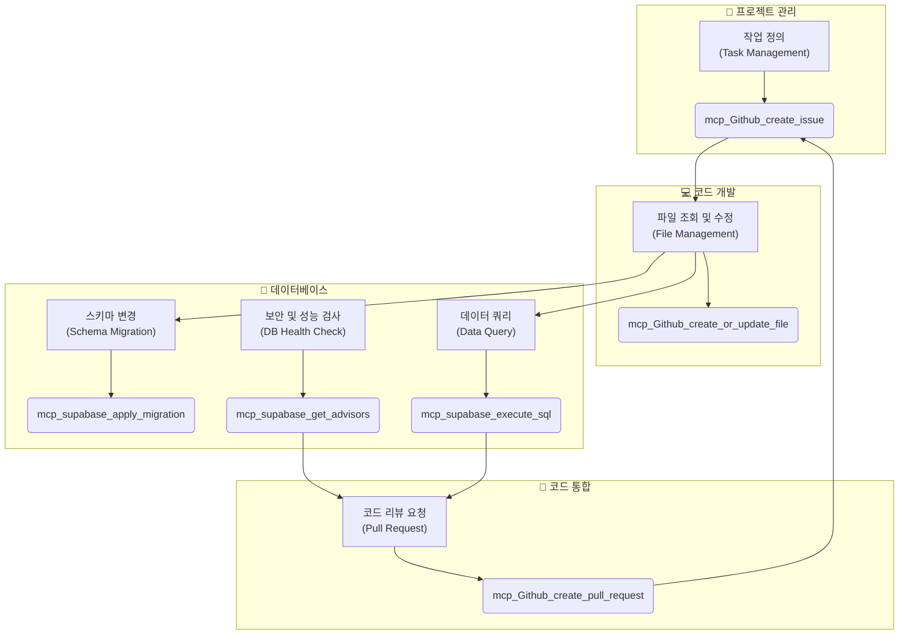

# 📋 PosMul Core MCP Tools Reference

## 📖 개요

이 문서는 PosMul 프로젝트의 **MCP-First 개발 워크플로우**에 사용되는 핵심 `mcp_Github` 및 `mcp_supabase` 도구에 대한 빠른 참조 가이드(Cheat Sheet)입니다. 개발 중 필요한 도구를 신속하게 찾고 정확하게 사용하는 것을 목표로 합니다.

## 🏗️ MCP 개발 워크플로우와 핵심 도구

## 🤖 GitHub MCP 도구

### 주요 도구 목록

| 도구 이름                         | 설명                               | 핵심 파라미터                                |
| --------------------------------- | ---------------------------------- | -------------------------------------------- |
| `mcp_Github_create_issue`         | 새 작업이나 버그에 대한 이슈 생성  | `owner`, `repo`, `title`, `body`, `labels`   |
| `mcp_Github_create_pull_request`  | 코드 변경 사항에 대한 PR 생성      | `owner`, `repo`, `title`, `head`, `base`, `body` |
| `mcp_Github_create_or_update_file` | 원격 저장소의 파일을 생성 또는 수정 | `owner`, `repo`, `path`, `content`, `message`, `branch` |
| `mcp_Github_get_file_contents`    | 원격 저장소 파일의 내용 조회       | `owner`, `repo`, `path`, `branch`            |

### 사용 예시

#### `mcp_Github_create_issue`

> `mcp_Github_create_issue`를 사용해서 PosMul 저장소에 "UI 버그 수정"이라는 제목으로 이슈를 생성해줘. 레이블은 "bug", "ui"로 부탁해.

#### `mcp_Github_create_pull_request`

> `mcp_Github_create_pull_request`를 사용해서 "feat/login-ui-fix" 브랜치를 main으로 보내는 PR을 생성해줘. 제목은 "Feat: 로그인 UI 버그 수정"이고, 본문에는 "Closes #123"을 포함해줘.

---

## 🐘 Supabase MCP 도구

### 주요 도구 목록

| 도구 이름                               | 설명                                           | 핵심 파라미터                                  |
| --------------------------------------- | ---------------------------------------------- | ---------------------------------------------- |
| `mcp_supabase_apply_migration`          | DDL 쿼리를 사용하여 DB 스키마를 변경           | `name`, `query`                                |
| `mcp_supabase_execute_sql`              | DML 쿼리(SELECT, INSERT, UPDATE 등)를 실행     | `query`, `params` (optional)                   |
| `mcp_supabase_get_advisors`             | DB의 보안 및 성능 관련 권장 사항 확인          | `type` (`security` 또는 `performance`)         |
| `mcp_supabase_generate_typescript_types` | 현재 DB 스키마 기반으로 TypeScript 타입을 생성 | (파라미터 없음)                                |
| `mcp_supabase_list_tables`              | 데이터베이스의 모든 테이블 목록을 조회         | `schemas` (optional, default: `public`)        |

### 사용 예시

#### `mcp_supabase_apply_migration`

> `mcp_supabase_apply_migration`을 사용해서 "create_users_profile_table"라는 이름으로 마이그레이션을 실행해줘. [SQL 쿼리 내용]

#### `mcp_supabase_execute_sql`

> `mcp_supabase_execute_sql`을 사용해서 `prediction_games` 테이블에서 `status`가 'active'인 모든 게임을 조회해줘.

#### `mcp_supabase_get_advisors`

> `mcp_supabase_get_advisors`를 실행해서 `security` 타입의 어드바이저 리포트를 확인해줘.

## ✅ MCP 사용 베스트 프랙티스

- **마이그레이션 후 검사**: `mcp_supabase_apply_migration` 실행 후에는 항상 `mcp_supabase_get_advisors`를 실행하여 새로운 보안 취약점이 생겼는지 확인하세요.
- **타입 동기화**: 스키마 변경 후에는 `mcp_supabase_generate_typescript_types`를 실행하여 프론트엔드와 백엔드의 데이터 모델을 최신 상태로 유지하세요.
- **구체적인 프롬프트**: AI 어시스턴트에게 요청할 때는 도구 이름과 필요한 파라미터를 명확하게 전달해야 더 정확한 결과를 얻을 수 있습니다.
- **읽기 전용 도구 활용**: `mcp_Github_get_file_contents`나 `mcp_supabase_list_tables`와 같은 읽기 전용 도구를 사용하여 변경 전 상태를 먼저 확인하는 습관을 들이세요. 