# PosMul 프로젝트 보고서 양식 규칙 (Report Template Rules)

## 🎯 보고서 작성 철학

**PosMul**은 AI 시대 직접민주주의 플랫폼으로서, 모든 보고서는 **데이터 기반 의사결정**과 **투명성**을 지원해야 합니다. 보고서는 단순한 문서가 아닌 **의사결정 도구**이며, **경제학 이론 검증**과 **Agency Theory 구현 현황**을 명확히 전달해야 합니다.

## 📋 보고서 유형별 템플릿

### 1. 프로젝트 상태 보고서 (Project Status Report)

```markdown
# [프로젝트명] 상태 보고서 (YYYY년 MM월)

> **AI 시대 직접민주주의 플랫폼 개발 현황 종합 분석**

## 📊 Executive Summary

### 핵심 성과 지표 (KPI)
- **전체 완성도**: XX% (목표: XX%)
- **MVP 진행률**: XX%
- **기술 부채**: XX시간 (전월 대비 ±XX%)
- **테스트 커버리지**: XX%


## 🏗️ 아키텍처 현황

### Bounded Contexts 완성도

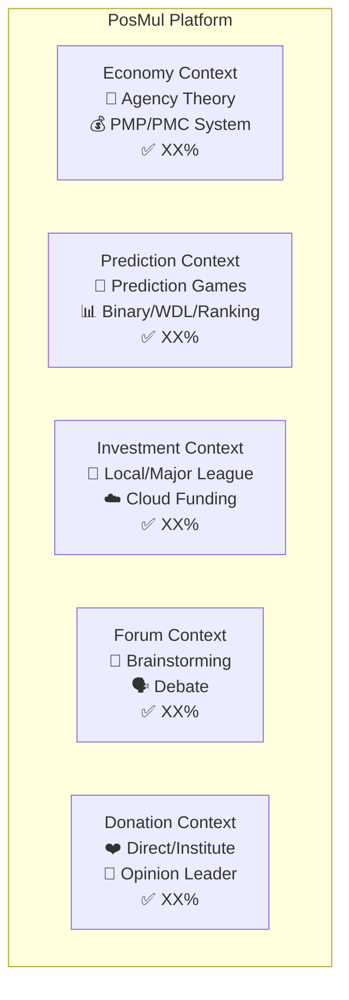

## 📈 경제 시스템 성과

### Agency Theory 구현 현황
- **Principal-Agent 관계 모델링**: ✅ 완료
- **CAPM 통합**: ✅ 완료
- **Behavioral Economics 요소**: 🔄 진행 중

### PMP/PMC 토큰 시스템
| 지표 | 현재 값 | 목표 값 | 상태 |
|------|---------|---------|------|
| PMP 발행량 | XX | XX | ✅ |
| PMC 순환량 | XX | XX | 🔄 |
| 경제 거래 수 | XX | XX | ⚠️ |

## 🔧 기술적 성과

### 데이터베이스 현황 (Supabase MCP)
- **테이블 수**: XX개
- **마이그레이션**: XX개 적용
- **RLS 정책**: XX개 활성화
- **성능 지표**: 평균 응답시간 XXms

### 코드 품질 지표
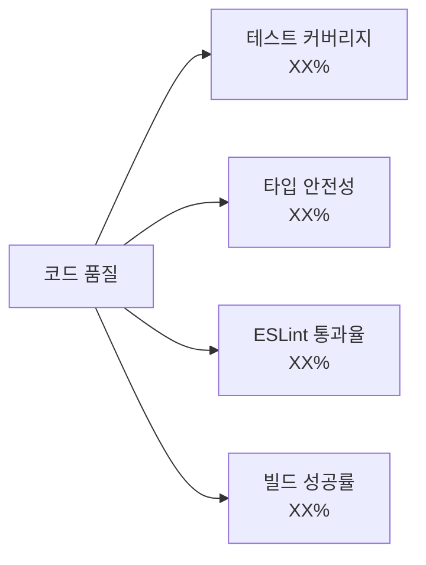

## ⚠️ 주요 이슈 및 해결 방안

### 🚨 Critical Issues
1. **[이슈명]**: 설명 및 해결 방안
2. **[이슈명]**: 설명 및 해결 방안

### ⚡ Performance Issues  
1. **[성능 이슈]**: 현재 상황 및 최적화 계획

## 🎯 다음 달 계획

### Phase 1: 안정화 (Week 1-2)
- [ ] 빌드 시스템 안정화
- [ ] 테스트 커버리지 90% 달성
- [ ] 보안 취약점 해결

### Phase 2: 기능 확장 (Week 3-4)
- [ ] 실시간 데이터 연동
- [ ] AI 모델 통합
- [ ] 모바일 대응

## 📊 Mermaid 차트 활용 가이드

모든 보고서에는 **최소 3개 이상의 Mermaid 다이어그램**을 포함해야 합니다:

1. **진행률 차트** (pie/bar)
2. **아키텍처 다이어그램** (graph/flowchart)
3. **시간 흐름 차트** (gantt/timeline)
```

### 2. 기술 분석 보고서 (Technical Analysis Report)

```markdown
# [기술명/기능명] 기술 분석 보고서

## 🔍 분석 개요

### 목적
- **분석 대상**: [구체적인 기술/기능]
- **분석 기간**: YYYY-MM-DD ~ YYYY-MM-DD
- **분석 범위**: [범위 정의]

### 핵심 질문
1. [분석하고자 하는 핵심 질문 1]
2. [분석하고자 하는 핵심 질문 2]
3. [분석하고자 하는 핵심 질문 3]

## 📊 데이터 수집 및 방법론

### 수집 방법
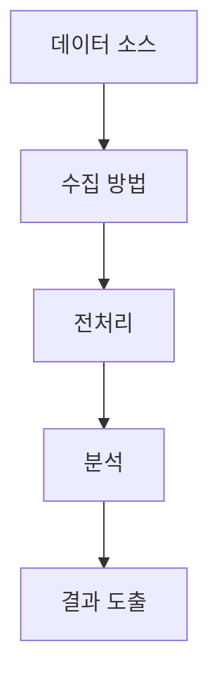

### 분석 도구
- **코드 분석**: ESLint, TypeScript Compiler
- **성능 분석**: Chrome DevTools, Lighthouse
- **데이터베이스**: Supabase Analytics
- **MCP 도구**: mcp_supabase_get_advisors

## 🔬 상세 분석 결과

### 정량적 분석
| 지표 | 측정값 | 기준값 | 평가 |
|------|--------|--------|------|
| [지표1] | XX | XX | ✅/⚠️/❌ |
| [지표2] | XX | XX | ✅/⚠️/❌ |

### 정성적 분석
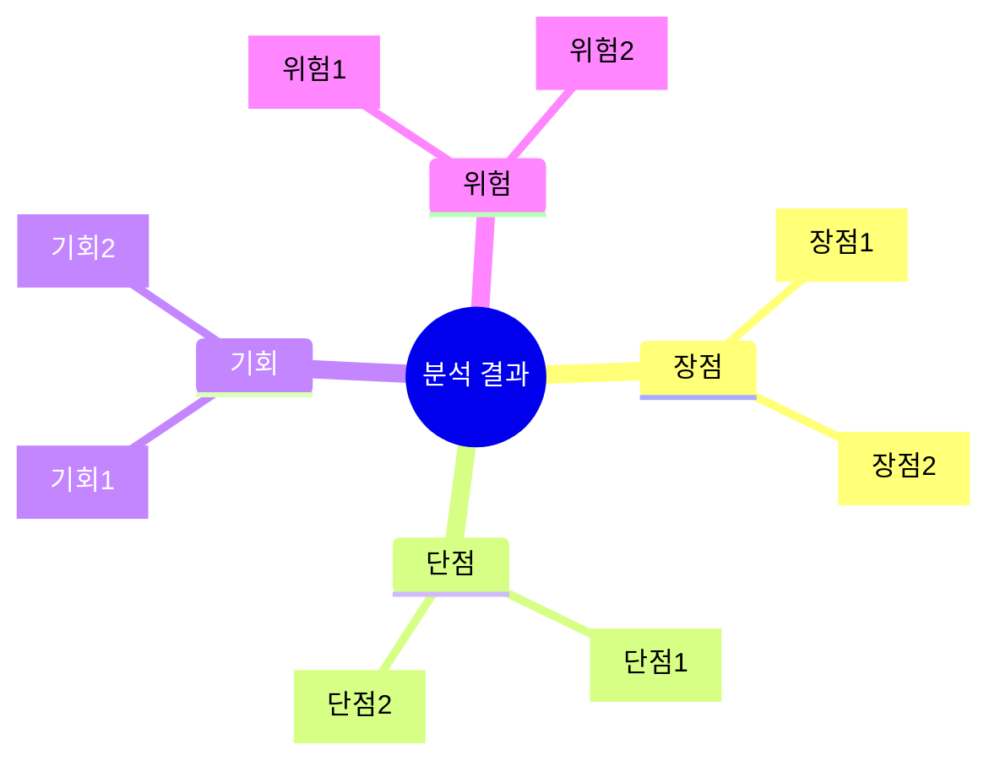

## 💡 권장사항

### 즉시 조치 (High Priority)
1. **[권장사항1]**: 구체적인 실행 방안
2. **[권장사항2]**: 구체적인 실행 방안

### 중장기 계획 (Medium Priority)
1. **[권장사항1]**: 타임라인 포함
2. **[권장사항2]**: 타임라인 포함

## 📈 예상 효과


## 🔄 후속 조치 계획

### 모니터링 지표
- **지표1**: 측정 방법 및 주기
- **지표2**: 측정 방법 및 주기

### 검토 일정
- **1주 후**: 즉시 조치 효과 확인
- **1개월 후**: 중간 평가
- **3개월 후**: 최종 평가
```

### 3. 경제 시스템 분석 보고서 (Economic System Report)

```markdown
# PosMul 경제 시스템 분석 보고서

## 🏛️ Agency Theory 구현 현황

### Principal-Agent 관계 모델링

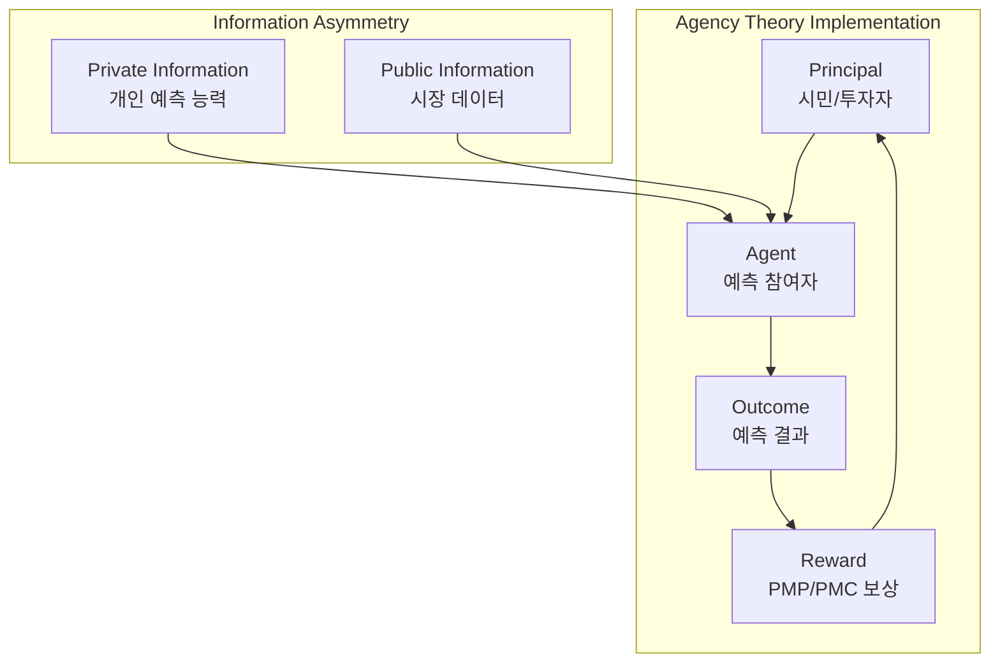

### CAPM 통합 현황

#### 위험-수익 모델
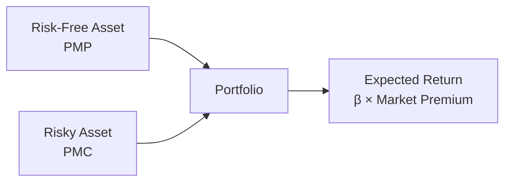

#### 베타 계수 분석
| 예측 유형 | 베타 계수 | 위험도 | 예상 수익률 |
|-----------|-----------|--------|-------------|
| Binary | 0.8 | 낮음 | 1.5x-3.0x |
| WDL | 1.2 | 중간 | 2.0x-4.0x |
| Ranking | 1.8 | 높음 | 3.0x-12.0x |

## 💰 PMP/PMC 토큰 경제 분석

### 토큰 흐름 다이어그램
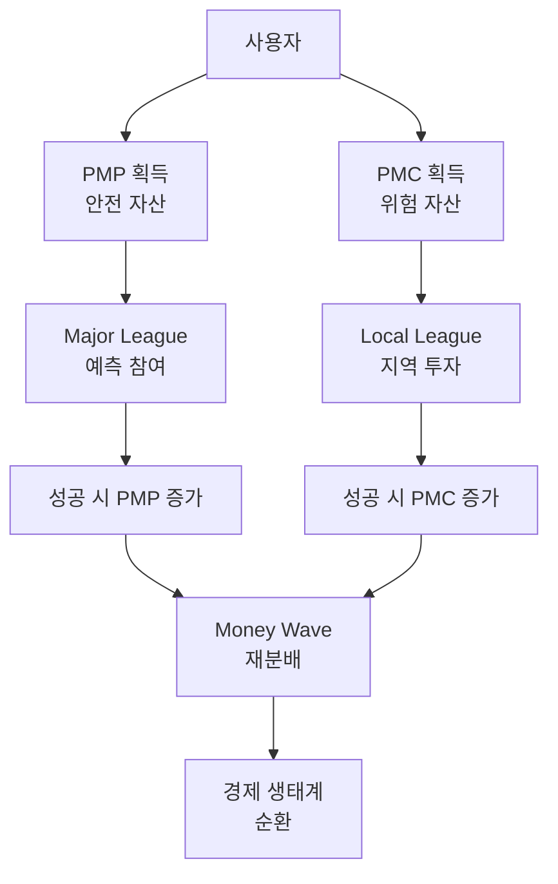

### 경제 지표 분석

#### 토큰 공급량 추이
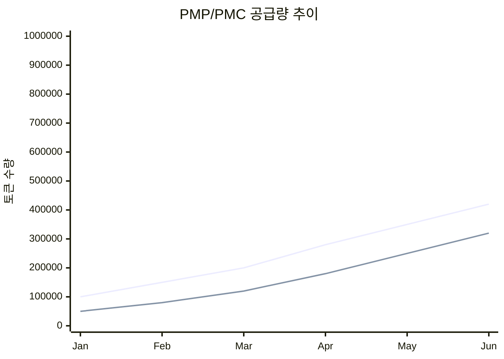

#### 거래량 분석
| 월 | PMP 거래량 | PMC 거래량 | 총 거래 수 | 평균 거래 크기 |
|----|------------|------------|------------|----------------|
| 1월 | 10,000 | 5,000 | 150 | 100 |
| 2월 | 15,000 | 8,000 | 230 | 100 |
| 3월 | 22,000 | 12,000 | 340 | 100 |

### Behavioral Economics 요소

#### 손실 회피 성향 분석
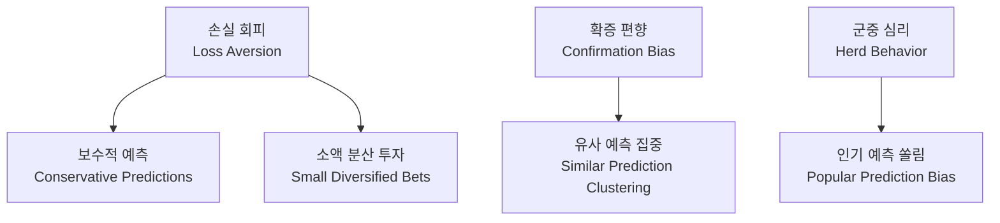

## 🎯 경제 성과 지표

### 시장 효율성 지표
- **가격 발견 효율성**: XX% (목표: 85%)
- **정보 반영 속도**: XX초 (목표: <30초)
- **유동성 지수**: XX (목표: >0.8)

### 참여자 행동 분석
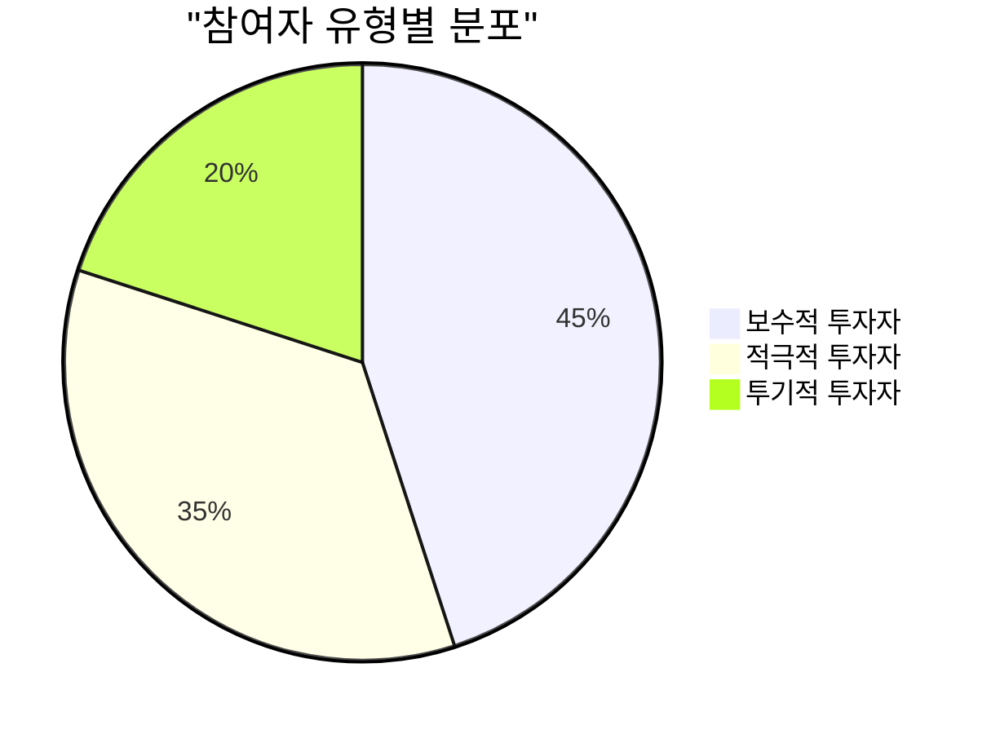

## 📊 Money Wave 시스템 분석

### 재분배 메커니즘
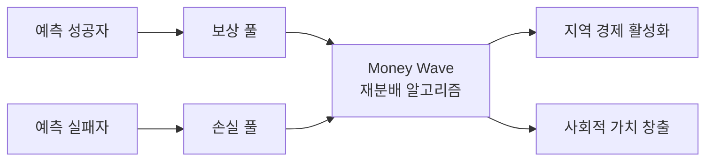

### 재분배 효과 측정
| 지표 | 현재 값 | 목표 값 | 달성률 |
|------|---------|---------|--------|
| 지니 계수 개선 | 0.05 | 0.10 | 50% |
| 지역 경제 기여도 | 15% | 25% | 60% |
| 사회적 가치 창출 | $50K | $100K | 50% |

## 🔮 미래 전망 및 권장사항

### 단기 개선 과제 (1-3개월)
1. **토큰 유동성 개선**: 마켓 메이킹 시스템 도입
2. **예측 정확도 향상**: AI 보조 도구 개발
3. **사용자 경험 개선**: 직관적 인터페이스 구현

### 중장기 발전 방향 (3-12개월)
1. **DeFi 프로토콜 통합**: 외부 유동성 확보
2. **크로스체인 확장**: 다중 블록체인 지원
3. **제도권 진입**: 규제 샌드박스 참여

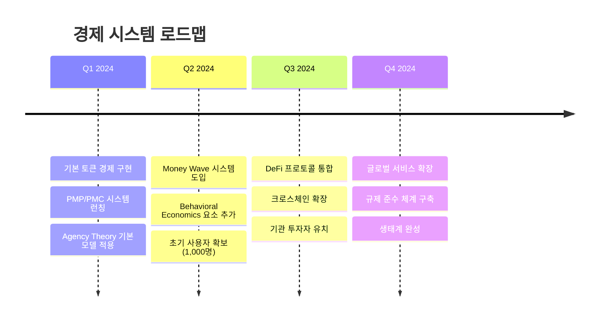
```

## 🎨 보고서 작성 가이드라인

### 📝 문서 구조 원칙

1. **Executive Summary 필수**: 모든 보고서는 2-3문단의 요약으로 시작
2. **데이터 기반 서술**: 주관적 의견보다 객관적 데이터 우선
3. **시각화 중심**: 텍스트 대신 차트와 다이어그램 활용
4. **실행 가능한 권장사항**: 구체적이고 측정 가능한 액션 아이템

### 🎯 Mermaid 다이어그램 활용 규칙

#### 필수 포함 차트 (보고서당 최소 3개)
1. **진행률/성과 차트**: pie, bar, xychart
2. **프로세스/플로우 차트**: flowchart, graph
3. **시간 기반 차트**: timeline, gantt

#### 차트별 사용 가이드
```markdown
# Pie Chart - 비율 표시


# Flowchart - 프로세스 표시
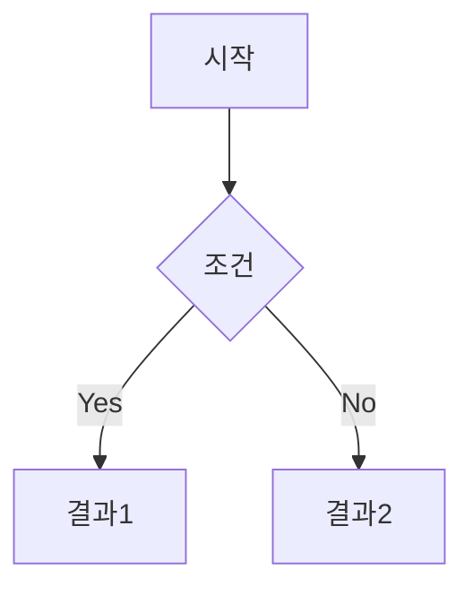

# Timeline - 로드맵 표시
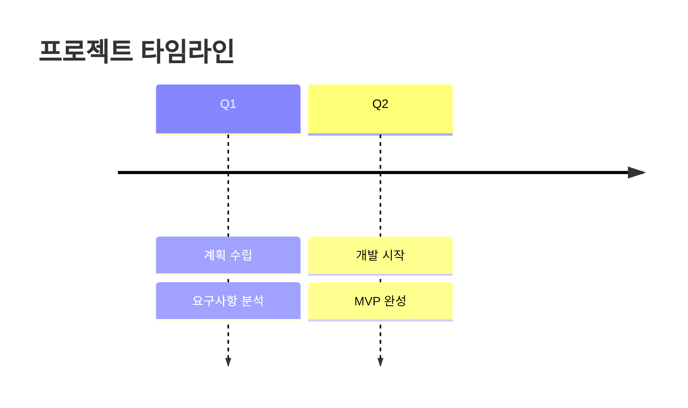

# XY Chart - 트렌드 표시
```mermaid
xychart-beta
    title "성과 추이"
    x-axis [Jan, Feb, Mar]
    y-axis "값" 0 --> 100
    line [10, 30, 50]
```
```

### 📊 데이터 표현 기준

#### 수치 표현 규칙
- **백분율**: 소수점 1자리까지 (예: 95.5%)
- **금액**: 천 단위 구분자 사용 (예: $1,234,567)
- **시간**: ISO 8601 형식 (예: 2024-12-15)
- **상태**: 이모지 활용 (✅ 완료, 🔄 진행중, ⚠️ 주의, ❌ 실패)

#### 표 작성 규칙
```markdown
| 항목 | 현재 값 | 목표 값 | 상태 | 비고 |
|------|---------|---------|------|------|
| 완성도 | 95% | 100% | ✅ | 목표 달성 임박 |
| 테스트 | 87% | 90% | 🔄 | 추가 테스트 필요 |
```

### 🎨 스타일 가이드

#### 색상 코드 (Mermaid 테마)
- **성공**: #4CAF50 (녹색)
- **진행**: #2196F3 (파란색)  
- **주의**: #FF9800 (주황색)
- **위험**: #F44336 (빨간색)
- **중립**: #9E9E9E (회색)

#### 아이콘 활용
- 🎯 목표/계획
- 📊 데이터/분석
- 🔧 기술/개발
- 💰 경제/재정
- ⚠️ 주의/위험
- ✅ 완료/성공
- 🔄 진행중
- 📈 성장/개선
- 🏗️ 아키텍처/구조

## 🚀 보고서 자동화 도구

### MCP 도구 활용
```typescript
// 보고서 데이터 수집 자동화
const generateReport = async () => {
  // 데이터베이스 현황
  const tables = await mcp_supabase_list_tables({
    project_id: "fabyagohqqnusmnwekuc"
  });
  
  // 보안 권장사항
  const security = await mcp_supabase_get_advisors({
    project_id: "fabyagohqqnusmnwekuc",
    type: "security"
  });
  
  // 성능 분석
  const performance = await mcp_supabase_get_advisors({
    project_id: "fabyagohqqnusmnwekuc", 
    type: "performance"
  });
  
  return {
    database: { tables: tables.length },
    security: security.length,
    performance: performance.length
  };
};
```

### 보고서 템플릿 선택 가이드

#### 프로젝트 상태 보고서
- **주기**: 월간
- **대상**: 경영진, 스테이크홀더
- **목적**: 전체 진행 상황 공유

#### 기술 분석 보고서  
- **주기**: 필요시
- **대상**: 개발팀, 아키텍트
- **목적**: 기술적 의사결정 지원

#### 경제 시스템 보고서
- **주기**: 분기별
- **대상**: 경제학자, 투자자
- **목적**: 경제 모델 검증 및 개선

## 📋 체크리스트

### 보고서 작성 전 확인사항
- [ ] 목적과 대상 독자 명확화
- [ ] 데이터 수집 및 검증 완료
- [ ] 적절한 템플릿 선택
- [ ] Mermaid 다이어그램 3개 이상 준비

### 작성 중 확인사항
- [ ] Executive Summary 작성
- [ ] 데이터 기반 서술
- [ ] 시각화 적절히 활용
- [ ] 실행 가능한 권장사항 포함

### 작성 후 확인사항
- [ ] 문법 및 맞춤법 검토
- [ ] Mermaid 차트 렌더링 확인
- [ ] 하이퍼링크 및 참조 검증
- [ ] 동료 리뷰 완료

---

## 🎯 결론

이 보고서 양식 규칙을 통해 **PosMul 프로젝트의 모든 보고서가 일관성 있고 전문적인 품질**을 유지할 수 있습니다. 

**핵심 원칙**:
1. **데이터 중심**: 객관적 사실 기반 서술
2. **시각화 우선**: Mermaid 다이어그램 적극 활용  
3. **실행 지향**: 구체적이고 측정 가능한 권장사항
4. **경제 이론 통합**: Agency Theory와 CAPM 관점 반영

모든 팀원은 이 규칙을 준수하여 **투명하고 신뢰할 수 있는 보고서**를 작성해야 합니다. 