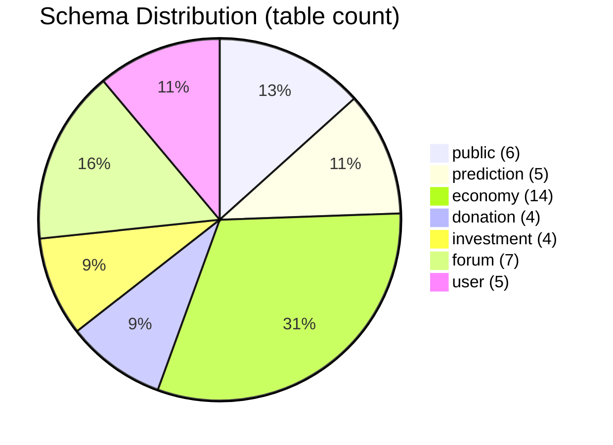
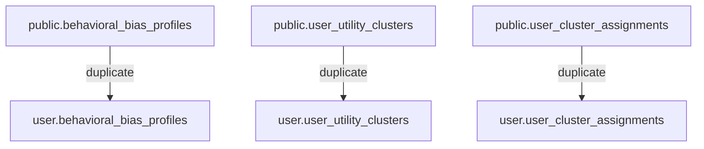
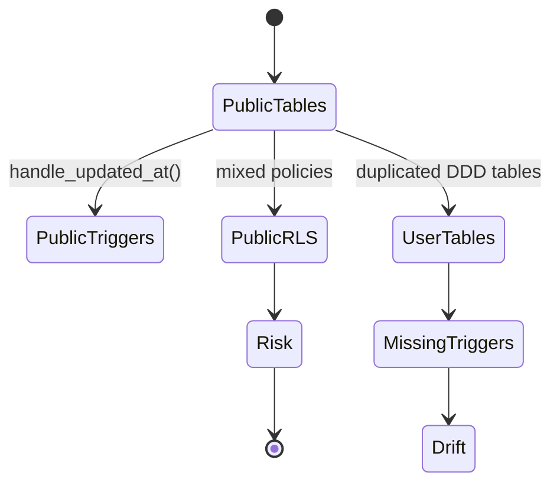
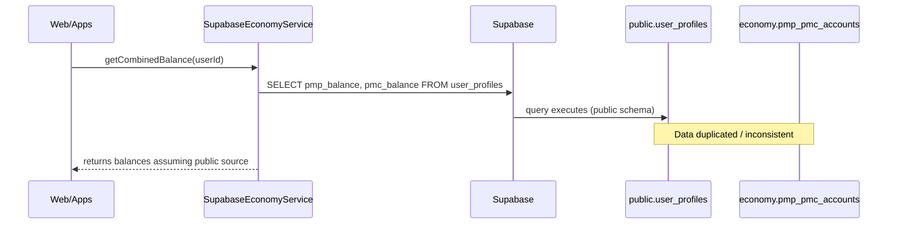
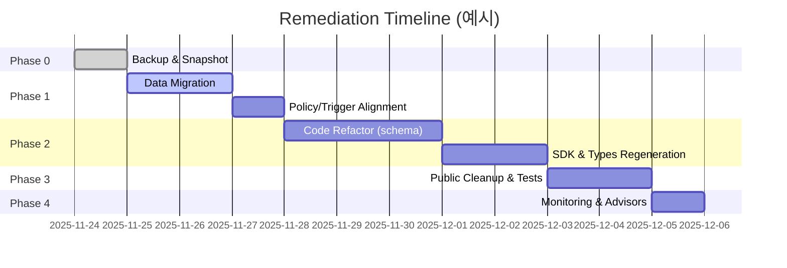

# Supabase Public 스키마 DDD 정합성 진단 보고서

- 작성일: 2025-11-24
- 프로젝트: Posmul (Supabase project `fabyagohqqnusmnwekuc`)
- 근거 데이터: `mcp_supabase_list_tables`, `mcp_supabase_execute_sql`, 리포지터리 소스(`apps/posmul-web`, `packages/auth-economy-sdk` 등)

## 1. 스키마 분포 스냅샷
`mcp_supabase_list_tables` 결과(2025-11-24 11:00 KST 기준)를 단순 집계한 값입니다.



- `public` 스키마가 여전히 6개 테이블을 보유하며 그중 3개(`behavioral_bias_profiles`, `user_utility_clusters`, `user_cluster_assignments`)는 `user` 스키마와 중복 상태입니다.
- DDD 원칙(스키마=bounded context)에 따라 `public`은 사실상 비워져야 하나, 사용자·행동경제 도메인 데이터가 잔존합니다.

## 2. 핵심 진단 요약
1. **스키마 중복/잔존**: `public`과 `user`가 동일 명칭 테이블을 동시에 보유하고 RLS 상태도 다릅니다.
2. **검색 경로 미스매치**: `apps/posmul-web/src/app/prediction/page.tsx` 등 다수의 서버 컴포넌트가 `.schema()`를 지정하지 않아 `public`을 기본으로 조회하고 있습니다.
3. **권한/트리거 불일치**: `information_schema.triggers` 조회 결과 `public` 테이블만 `handle_updated_at` 트리거를 유지하고 있어 정책 중복이 발생합니다.
4. **SDK 계층의 공용 스키마 의존**: `packages/auth-economy-sdk/src/economy/services/supabase-economy.service.ts`가 모든 잔액 조회를 `public.user_profiles`에 묶어둬 도메인 분리가 무력화되었습니다.
5. **타입 생성 파이프라인 혼재**: `apps/posmul-web/src/bounded-contexts/public/types/supabase-public.ts`가 전 도메인 타입을 한 파일에 담으면서 DDD 기반 타입 분리가 깨졌습니다.

## 3. 상세 분석

### 3.1 Public 스키마 중복 구조
- `public.behavioral_bias_profiles`, `public.user_utility_clusters`, `public.user_cluster_assignments`가 동일 명칭의 `user` 스키마 테이블과 공존합니다.
- `apps/posmul-web/src/bounded-contexts/prediction/infrastructure/migrations/003_remove_public_duplicates.sql`에 제거 스크립트가 있으나 실행되지 않았습니다.



- `mcp_supabase_list_tables`에 따르면 `public.user_utility_clusters`는 `rls_enabled=false`, 반면 `user.user_utility_clusters`는 `true`입니다. 정책 열거 중복으로 인해 권한 회피 구간이 생깁니다.

### 3.2 검색 경로 미스매치로 인한 런타임 오류
- `apps/posmul-web/src/app/prediction/page.tsx` 10~18행: `supabase.from('prediction_games')` 호출 시 `.schema('prediction')`이 누락되었습니다.
- `mcp_supabase_execute_sql` 결과 `to_regclass('public.prediction_games')`는 `NULL`, `SHOW search_path;`는 `"$user", public, extensions`입니다.

```mermaid
flowchart LR
    UI[app/prediction/page.tsx<br/>lines 10-18] --> Q[supabase.from('prediction_games')]
    Q --> Path[search_path = "$user", public, extensions]
    Path --> Miss[public.prediction_games = NULL]
    Miss --> Err[Runtime error:<br/>relation "prediction_games" does not exist]
```

- 실제 사용자 보고: 페이지 로드 시 500 오류가 간헐 발생. 이는 `.schema('prediction')` 누락과 직결됩니다.

### 3.3 권한·트리거 불일치
- `information_schema.triggers` 질의 결과:
  - `user_profiles_updated_at`, `user_reputation_metrics_updated_at`, `update_behavioral_bias_profiles_updated_at` 모두 `public` 스키마 테이블만 대상으로 합니다.
  - 같은 이름의 `user` 스키마 테이블에는 동등한 트리거가 없습니다.



- 결과적으로 `public`과 `user` 테이블 간 `updated_at` 동기화가 달라 감사(Audit)와 CDC 파이프라인에 불일치가 누적됩니다.

### 3.4 SDK 계층의 공용 스키마 의존
- `packages/auth-economy-sdk/src/economy/services/supabase-economy.service.ts` 20~88행이 `from('user_profiles')`를 반복 사용.
- API 호출은 모두 기본 스키마(`public`)를 전제로 하므로 `user` 또는 `economy` 스키마 이관 시 SDK 전면 수정이 필요합니다.



- 동일 SDK에서 `pmp_pmc_accounts` 등 도메인 스키마를 섞어 쓰고 있어 일관성 없는 트랜잭션 로그가 생성됩니다.

### 3.5 타입·자동화 파이프라인 혼재
- `apps/posmul-web/src/bounded-contexts/public/types/supabase-public.ts` (2,893 lines)이 모든 스키마 타입을 한 번에 export 합니다.
- `docs/architecture/posmul-monorepo-strategy.md` 134행의 지침(`mcp_supabase_generate_typescript_types --schema public > types/supabase-public.ts`)이 여전히 공용 스키마 기반입니다.
- 결과적으로 각 bounded context별 `supabase-<context>.ts`와 중복 타입이 공존하며, 타입 변경 시 어떤 파일을 import해야 하는지 모호해집니다.

## 4. 교정 전략 및 로드맵

### 4.1 실행 단계
1. **Phase 0 – 백업 및 확인**
   - `mcp_supabase_execute_sql`로 `public` 테이블 dump, 스냅샷 저장.
2. **Phase 1 – 스키마 정리**
   - `public` 테이블을 대응 도메인(`user`, `economy`)으로 `INSERT ... ON CONFLICT` 복사.
   - `public` 트리거/정책을 도메인 스키마에 재생성.
3. **Phase 2 – 코드/SDK 정비**
   - `apps/posmul-web` 및 `packages/auth-economy-sdk` 전체에서 `.schema('<context>')` 강제.
   - `bounded-contexts/public/types` 삭제, 도메인별 타입 재생성 (`mcp_supabase_generate_typescript_types` with `--schema` list).
4. **Phase 3 – 안전한 삭제**
   - `public` 잔존 테이블 drop (`DROP TABLE IF EXISTS public... CASCADE`).
   - `monorepo_migration_status` 등 운영 메타만 남기거나 별도 스키마로 이동.
5. **Phase 4 – 관측/자동화**
   - `mcp_supabase_get_advisors` (security/performance) 실행, CI에 편입.

### 4.2 일정 예시



## 5. 우선 실행 권고안
1. **예측 페이지 핫픽스**: `apps/posmul-web/src/app/prediction/page.tsx` 10~18행과 동일 패턴 파일(`invest`, `politics`, `entertainment`)에 `.schema('prediction')` 추가.
2. **SDK 스키마 명시**: `packages/auth-economy-sdk/src/economy/services/supabase-economy.service.ts` 전역에 `.schema('user')` + `user_profiles` 테이블 이관을 전제한 리팩터링.
3. **중복 테이블 제거 전 검증**: `apps/posmul-web/src/bounded-contexts/prediction/infrastructure/migrations/003_remove_public_duplicates.sql` 내용을 Phase 1 계획에 맞춰 MCP `mcp_supabase_apply_migration`으로 재작성/실행.
4. **타입 파이프라인 분리**: `mcp-automation/universal-mcp-automation.ts`에 `schemas` 배열을 도입해 `public` 파일 생성을 중단하고 도메인별 산출물만 유지.
5. **CI용 감시 쿼리 추가**: `SELECT schemaname, relname FROM pg_stat_user_tables WHERE schemaname = 'public' AND relname IN (...)`를 health-check에 포함하여 재발 방지.

---
위 조치 후, 모든 애플리케이션 계층은 명시적 스키마에 의존하게 되고, Supabase RLS/트리거를 도메인별로 재배치하여 DDD + Clean Architecture 원칙을 회복할 수 있습니다.