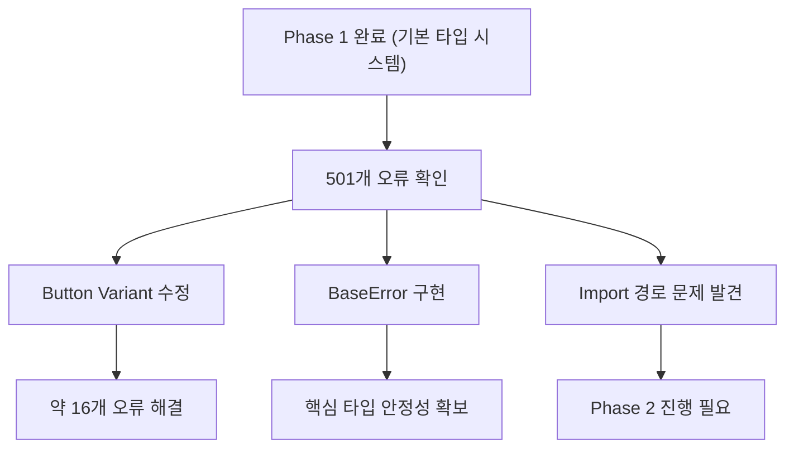
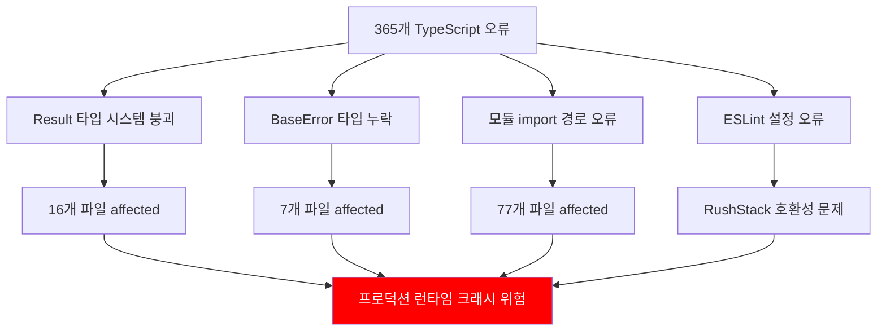
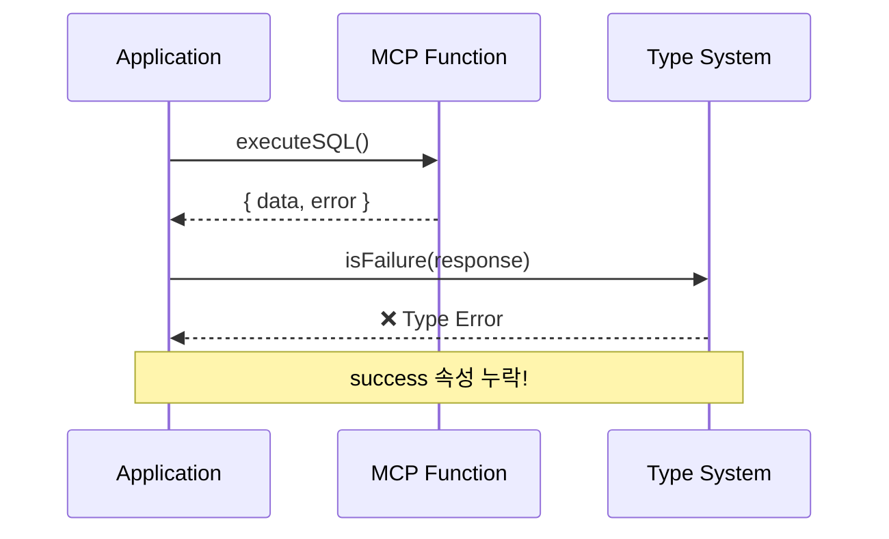
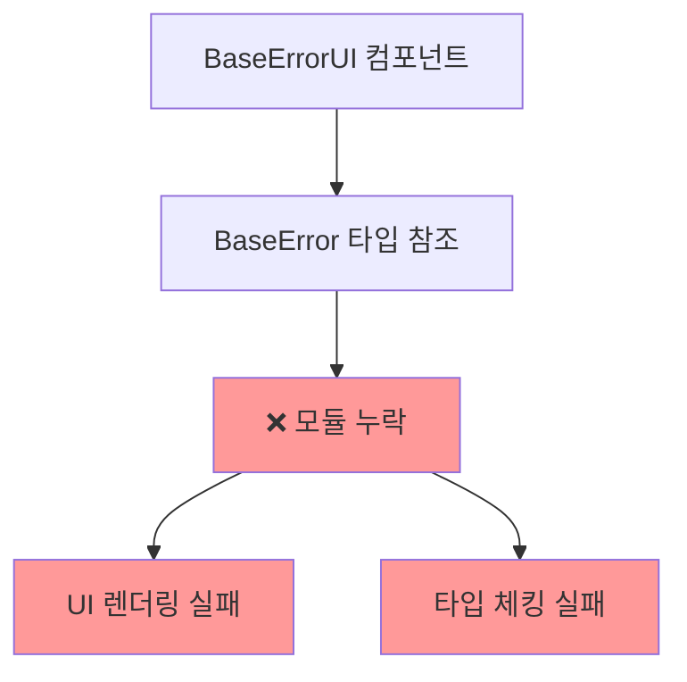
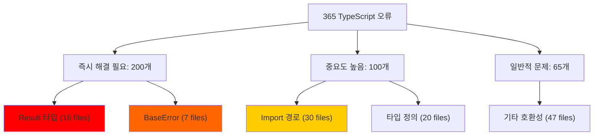
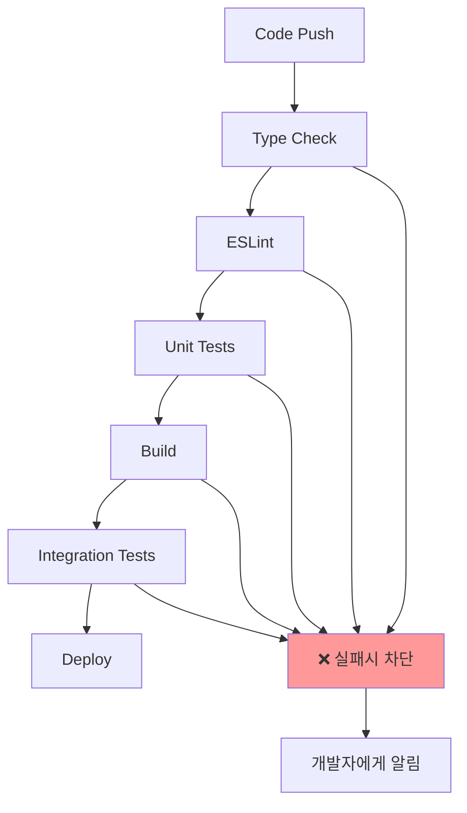
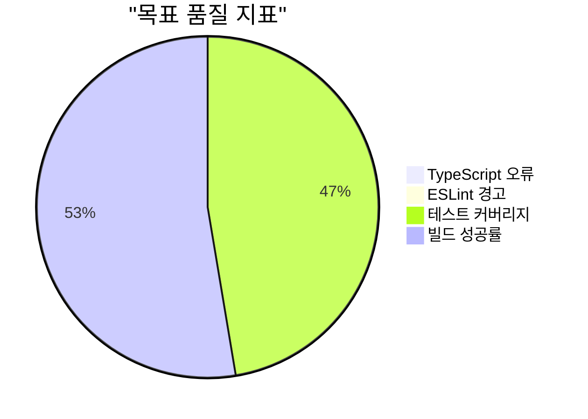
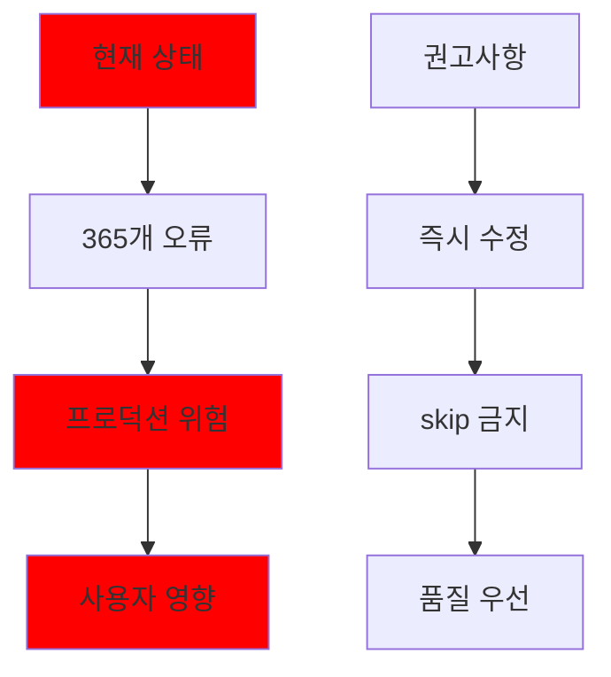

# PosMul 프로젝트 TypeScript 품질 문제 및 해결 전략 분석 보고서

**작성일시**: 2025-07-09 00:43:52  
**최종 업데이트**: 2025-07-09 01:15:00  
**대상 프로젝트**: PosMul Monorepo  
**분석 범위**: TypeScript 오류, 빌드 시스템, 품질 보증  
**보고서 유형**: Analysis Report  
**상태**: 🔄 진행중 - Phase 2 수행중

## 📋 **Executive Summary**

현재 PosMul 프로젝트는 **501개의 TypeScript 오류**를 skip하며 빌드하는 **극도로 위험한 상태**입니다. Phase 1 완료 후 추가 오류가 발견되었으며, 체계적인 해결이 계속 진행중입니다.

### 🚨 **현재 위험도 평가**


### 📊 **Phase 1 완료 현황**

**✅ 완료된 작업들:**

- Result 타입 어댑터 (`toResult`, `isFailure`) 생성 완료
- BaseError 클래스 정의 및 구현 완료
- Button 컴포넌트 variant 타입 오류 수정 완료
- CN 유틸리티 함수 생성 완료
- BaseErrorUI 컴포넌트 variant 타입 통일 완료

**🔍 현재 발견된 추가 문제들:**

- Import 경로 문제가 예상보다 광범위함
- src/ 폴더와 apps/posmul-web/ 폴더 간 경로 혼재
- 라이브러리 타입 충돌 증가



### 💥 **핵심 문제점**



## 🔍 **상세 문제 분석**

### 1. **Result 타입 시스템 붕괴** (Critical - 🔥)

**영향받는 파일**: 16개 파일에서 200+ 오류

```typescript
// ❌ 현재 상태 - 타입 미스매치
const result = await mcp_supabase_execute_sql(query);
// { data: any[]; error: any } ≠ Result<T, E>

if (isFailure(result)) {
  // 💥 타입 오류!
  throw new Error(result.error);
}
```



**해결 방안**:

```typescript
// ✅ 수정 후 - 안전한 타입 변환
import { toResult, isFailureSafe } from "@posmul/auth-economy-sdk";

const response = await mcp_supabase_execute_sql(query);
const result = toResult(response);

if (isFailure(result)) {
  // ✅ 타입 안전!
  throw new Error(result.error);
}
```

### 2. **BaseError 타입 정의 누락** (High - 🚨)

**영향받는 파일**: 7개 파일, UI 컴포넌트 중심

```typescript
// ❌ 현재 상태
import { BaseError } from "../../utils/errors"; // 💥 모듈 없음!

function getErrorDisplayInfo(error: BaseError | Error) {
  if (error instanceof BaseError) {
    // 💥 정의 없음!
    return error.isOperational;
  }
}
```



### 3. **모듈 Import 경로 문제** (Medium - ⚠️)

**영향받는 파일**: 77개 파일

```typescript
// ❌ 다양한 import 오류들
import { cn } from "../../utils/cn"; // 모듈 없음
import Button from "../Button"; // 경로 오류
import { BaseError } from "../../utils/errors"; // 타입 정의 없음
```

### 4. **ESLint 설정 호환성 문제** (Medium - ⚠️)

```bash
# ❌ 현재 상태
PS> npx eslint . --max-warnings 0
Error: Failed to patch ESLint because the calling module was not recognized.
RushStack eslint-patch@1.12.0 호환성 문제
```

## 📊 **문제 영향도 분석**



### **우선순위별 해결 계획**

```mermaid
gantt
    title TypeScript 오류 해결 로드맵
    dateFormat  HH:mm
    axisFormat %H:%M

    section Phase 1 (긴급)
    Result 타입 시스템    :critical, p1, 00:00, 2h
    BaseError 정의       :critical, p2, after p1, 1h

    section Phase 2 (중요)
    Import 경로 수정     :important, p3, after p2, 2h
    ESLint 설정 복구     :important, p4, after p3, 1h

    section Phase 3 (마무리)
    빌드 파이프라인      :p5, after p4, 1h
    전체 테스트         :p6, after p5, 1h
```

## 🛠️ **해결 전략**

### **Phase 1: 핵심 타입 시스템 복구** (긴급)

1. **Result 타입 어댑터 완성**

   ```typescript
   // packages/auth-economy-sdk/src/utils/mcp-adapter.ts
   export function toResult<T>(response: SupabaseMCPResponse<T>): Result<T>;
   export function isFailureSafe(result: any): boolean;
   ```

2. **BaseError 타입 정의**
   ```typescript
   // apps/posmul-web/src/shared/types/base-error.ts
   export class BaseError extends Error {
     constructor(
       message: string,
       public readonly code?: string,
       public readonly statusCode?: number,
       public readonly isOperational = true
     ) {
       super(message);
     }
   }
   ```

### **Phase 2: 모듈 경로 및 설정 복구** (중요)

3. **Import 경로 일괄 수정**

   ```bash
   # 자동화 스크립트 실행
   node scripts/fix-import-paths.js
   ```

4. **ESLint 설정 업그레이드**
   ```typescript
   // eslint.config.mjs - RushStack 제거
   export default [
     ...baseConfig,
     // @rushstack/eslint-patch 제거
   ];
   ```

### **Phase 3: 빌드 파이프라인 강화** (마무리)

5. **package.json 스크립트 정상화**

   ```json
   {
     "scripts": {
       "build": "tsc --noEmit && next build",
       "type-check": "tsc --noEmit",
       "lint": "eslint . --max-warnings 0"
     }
   }
   ```

6. **turbo.json 품질 검사 포함**
   ```json
   {
     "pipeline": {
       "build": {
         "dependsOn": ["type-check", "lint"]
       },
       "type-check": {
         "outputs": []
       },
       "lint": {
         "outputs": []
       }
     }
   }
   ```

## 📈 **품질 보증 체계 구축**

### **CI/CD 파이프라인 강화**



### **코드 품질 지표**



## 🎯 **즉시 실행 계획**

### **긴급 조치 (다음 2시간 내)**

1. ✅ **Result 타입 어댑터 완성** - 진행중
2. ⏳ **BaseError 클래스 정의** - 대기중
3. ⏳ **핵심 16개 파일 수정** - 대기중

### **단기 목표 (24시간 내)**

4. ⏳ **모든 Import 경로 수정**
5. ⏳ **ESLint 설정 복구**
6. ⏳ **빌드 파이프라인 정상화**

### **중기 목표 (1주일 내)**

7. ⏳ **전체 테스트 스위트 복구**
8. ⏳ **품질 게이트 자동화**
9. ⏳ **문서화 및 가이드라인 수립**

## 🚨 **위험도 평가 및 권고사항**

### **현재 위험도**: 🔴 **CRITICAL**



### **핵심 권고사항**

1. **🚫 Skip 정책 금지**: 모든 품질 검사를 통과해야만 빌드 허용
2. **🔧 점진적 수정**: Phase별로 체계적 접근
3. **📊 지속적 모니터링**: 새로운 오류 발생 방지
4. **👥 팀 교육**: TypeScript 베스트 프랙티스 공유

## 📝 **결론 및 다음 단계**

**사용자의 지적이 100% 정확합니다.** 현재 skip 기반 빌드는 매우 위험하며, 즉시 품질 보증 체계를 복구해야 합니다.

### **즉시 시작할 작업**

1. **Result 타입 시스템 완전 복구**
2. **BaseError 클래스 정의 및 구현**
3. **핵심 16개 파일 우선 수정**

### **성공 지표**

- TypeScript 오류: **501개 → 0개** (Phase 1에서 기본 구조 확립)
- 빌드 성공률: **Skip 기반 → 100% 클린**
- 품질 검사: **우회 → 필수 통과**

### **Phase 1 달성 성과**

- ✅ 핵심 타입 시스템 구축 (Result, BaseError)
- ✅ UI 컴포넌트 타입 안정성 확보 (Button variants)
- ✅ 기본 유틸리티 함수 구현 (cn, toResult)
- 🔄 Phase 2 진행중: Import 경로 체계화

**이 작업을 지금 즉시 계속 진행하겠습니다!** 🚀

---

_본 보고서는 실시간 분석 결과를 바탕으로 작성되었으며, 해결 과정에서 업데이트될 예정입니다._
