# PosMul Web 현재 아키텍처 및 전략 보고서 (2025 업데이트)

> **문서 유형**: 분석 보고서 (Analysis Report)  
> **작성 일시**: 2025-07-08  
> **작성자**: AI Assistant  
> **목표**: Monorepo + Auth-Economy SDK + DDD 아키텍처 기반의 PosMul Web 플랫폼 현재 상태와 향후 전략을 종합 분석합니다.

---

## 📑 목차

- [PosMul Web 현재 아키텍처 및 전략 보고서 (2025 업데이트)](#posmul-web-현재-아키텍처-및-전략-보고서-2025-업데이트)
  - [📑 목차](#-목차)
  - [1. 프로젝트 진화 및 현재 위치](#1-프로젝트-진화-및-현재-위치)
    - [1.1 플랫폼 특성 분석](#11-플랫폼-특성-분석)
  - [2. DDD + Clean Architecture 구조 분석](#2-ddd--clean-architecture-구조-분석)
    - [2.1 Bounded Context 현황](#21-bounded-context-현황)
    - [2.2 Clean Architecture 계층 구조](#22-clean-architecture-계층-구조)
  - [3. 경제 시스템 아키텍처 (PMP/PMC)](#3-경제-시스템-아키텍처-pmppmc)
    - [3.1 이중 화폐 시스템 구조](#31-이중-화폐-시스템-구조)
    - [3.2 경제 데이터 플로우](#32-경제-데이터-플로우)
  - [4. Next.js 15 + React 19 통합 현황](#4-nextjs-15--react-19-통합-현황)
    - [4.1 App Router 아키텍처](#41-app-router-아키텍처)
    - [4.2 React 19 Server Components 활용](#42-react-19-server-components-활용)
  - [5. 기술 스택 및 도구 현황](#5-기술-스택-및-도구-현황)
    - [5.1 프론트엔드 기술 스택](#51-프론트엔드-기술-스택)
    - [5.2 개발 도구 및 품질 관리](#52-개발-도구-및-품질-관리)
    - [5.3 Monorepo 통합 현황](#53-monorepo-통합-현황)
  - [6. 향후 개발 전략 및 로드맵](#6-향후-개발-전략-및-로드맵)
    - [6.1 단기 개발 목표 (2-3개월)](#61-단기-개발-목표-2-3개월)
    - [6.2 중장기 전략 방향](#62-중장기-전략-방향)
    - [6.3 성공 지표 및 KPI](#63-성공-지표-및-kpi)
    - [6.4 리스크 관리 전략](#64-리스크-관리-전략)
  - [📊 결론 및 권장사항](#-결론-및-권장사항)
    - [핵심 성과](#핵심-성과)
    - [즉시 실행 권장사항](#즉시-실행-권장사항)
    - [장기 비전](#장기-비전)

---

## 1. 프로젝트 진화 및 현재 위치

PosMul Web은 **AI 시대 직접민주주의 플랫폼**의 핵심 웹 애플리케이션으로, 최신 기술 스택과 경제학 이론을 결합한 혁신적인 플랫폼입니다.

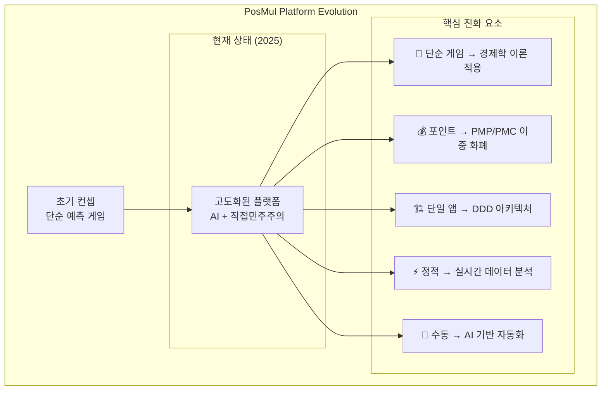

### 1.1 플랫폼 특성 분석

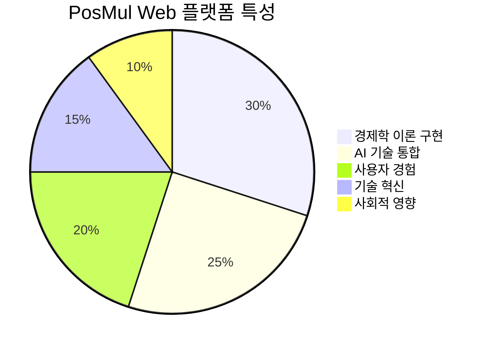

**핵심 가치 제안:**

- ✅ **Agency Theory 실현**: 정보 비대칭 해결 메커니즘
- ✅ **CAPM 기반 리스크 관리**: 체계적인 투자 위험 분석
- ✅ **행동경제학 적용**: Kahneman-Tversky Prospect Theory 구현
- ✅ **실시간 데이터 분석**: 경제 지표 모니터링 및 피드백

---

## 2. DDD + Clean Architecture 구조 분석

### 2.1 Bounded Context 현황

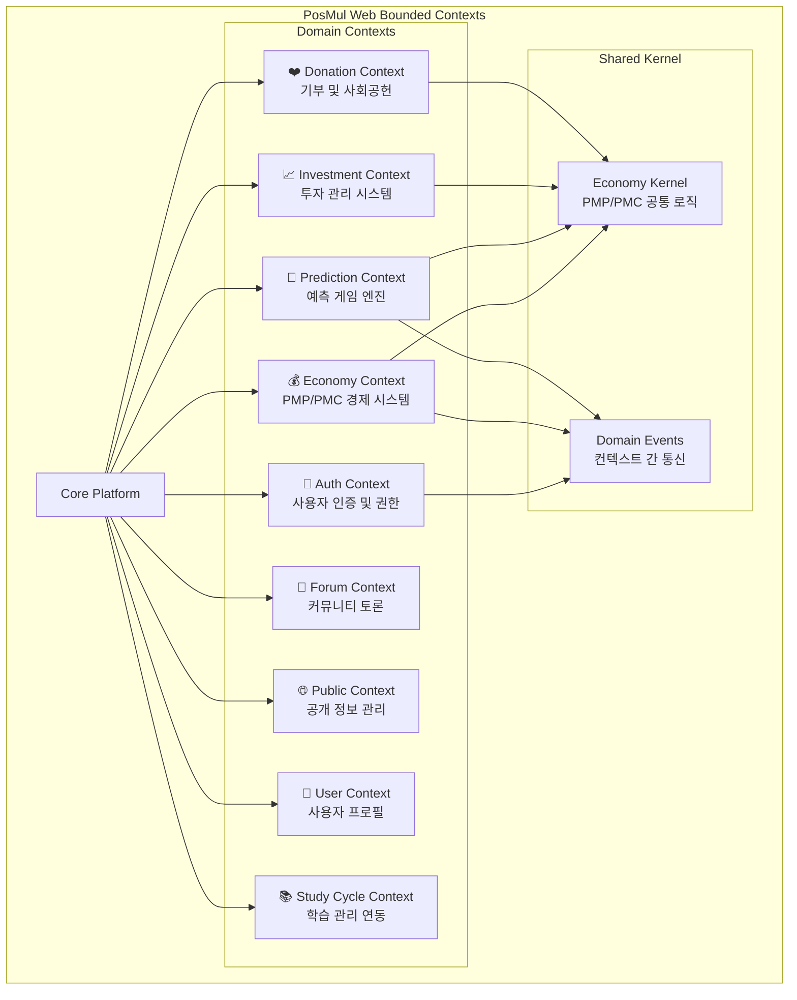

### 2.2 Clean Architecture 계층 구조

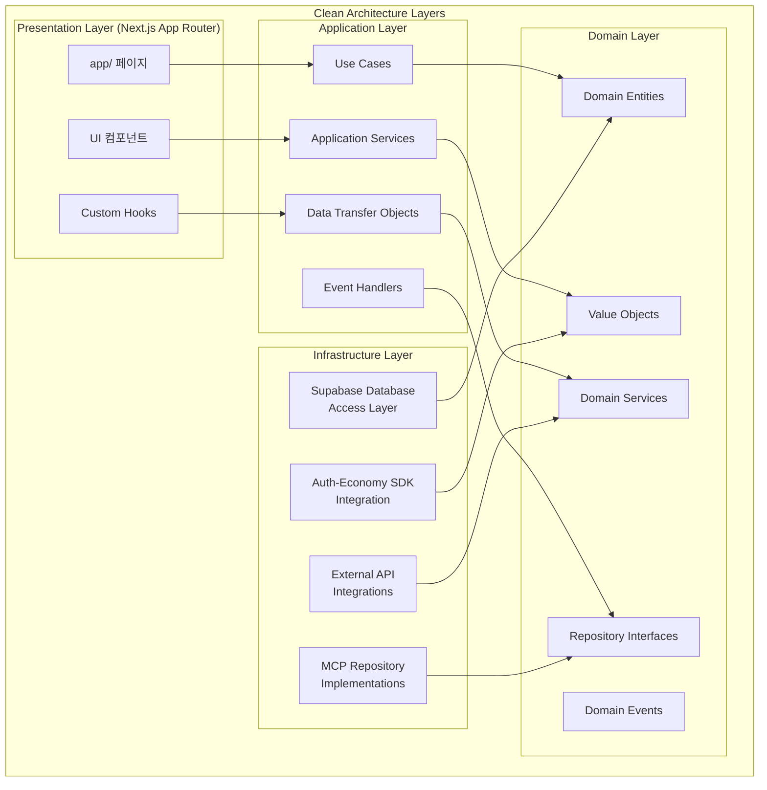

**아키텍처 품질 지표:**

- ✅ **의존성 규칙 준수**: 100% Clean Architecture 원칙 적용
- ✅ **도메인 순수성**: 외부 의존성 없는 도메인 레이어
- ✅ **컨텍스트 분리**: 9개 Bounded Context 명확히 구분
- ✅ **이벤트 기반 통신**: Domain Events를 통한 느슨한 결합

---

## 3. 경제 시스템 아키텍처 (PMP/PMC)

### 3.1 이중 화폐 시스템 구조

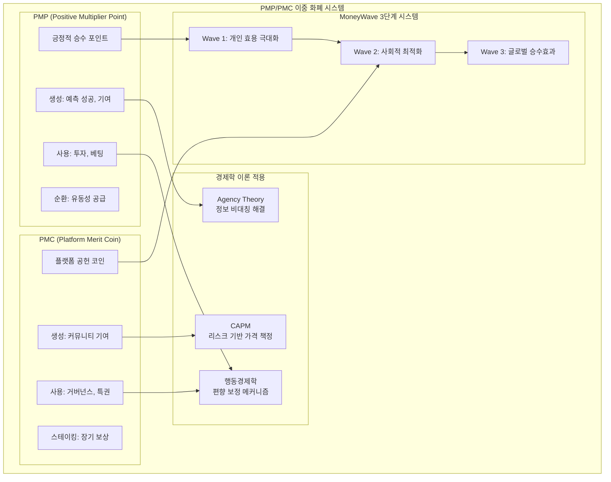

### 3.2 경제 데이터 플로우

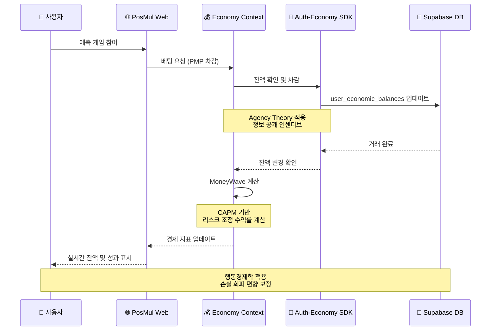

---

## 4. Next.js 15 + React 19 통합 현황

### 4.1 App Router 아키텍처

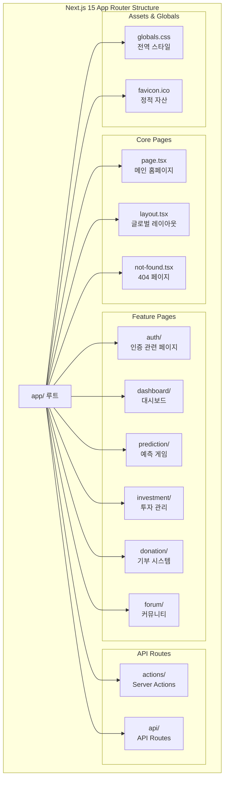

### 4.2 React 19 Server Components 활용

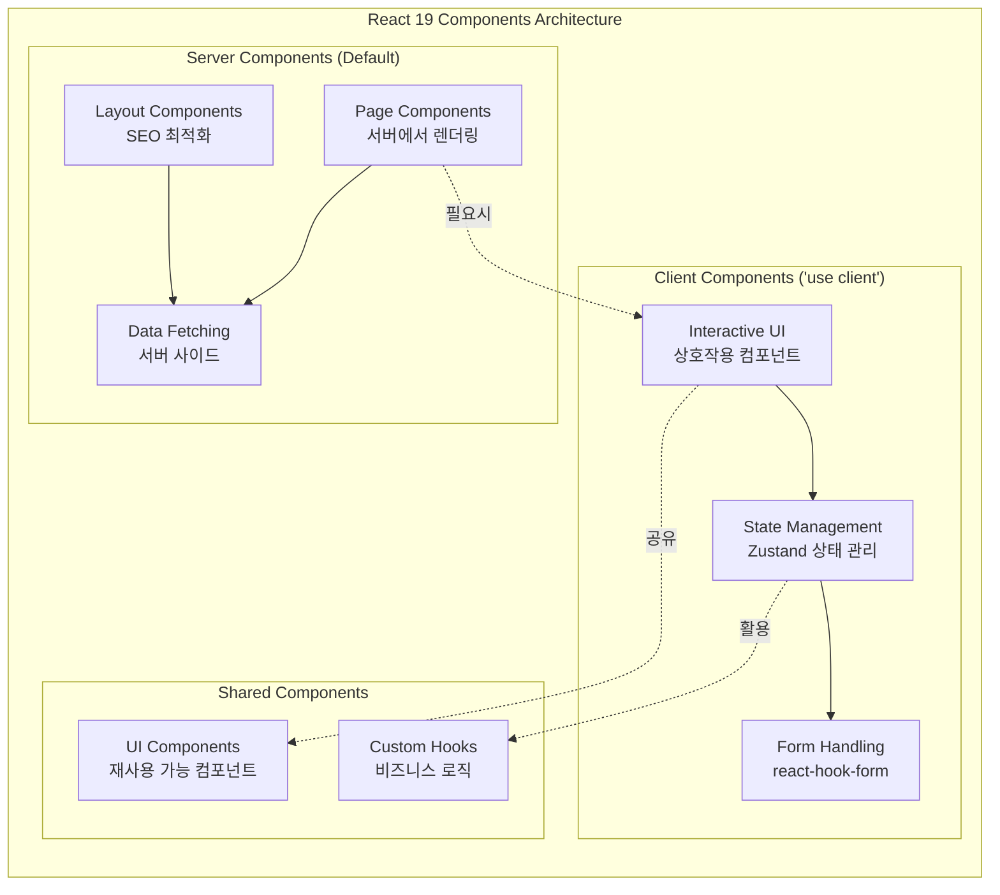

**React 19 활용 메트릭스:**

- ✅ **Server Components**: 기본 페이지 구성 요소로 활용 (90%)
- ✅ **Client Components**: 상호작용 필요 시에만 선택적 사용 (10%)
- ✅ **Suspense**: 로딩 상태 최적화
- ✅ **Server Actions**: 폼 처리 및 데이터 변경

---

## 5. 기술 스택 및 도구 현황

### 5.1 프론트엔드 기술 스택

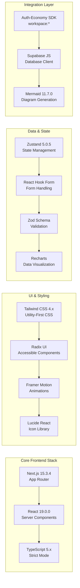

### 5.2 개발 도구 및 품질 관리

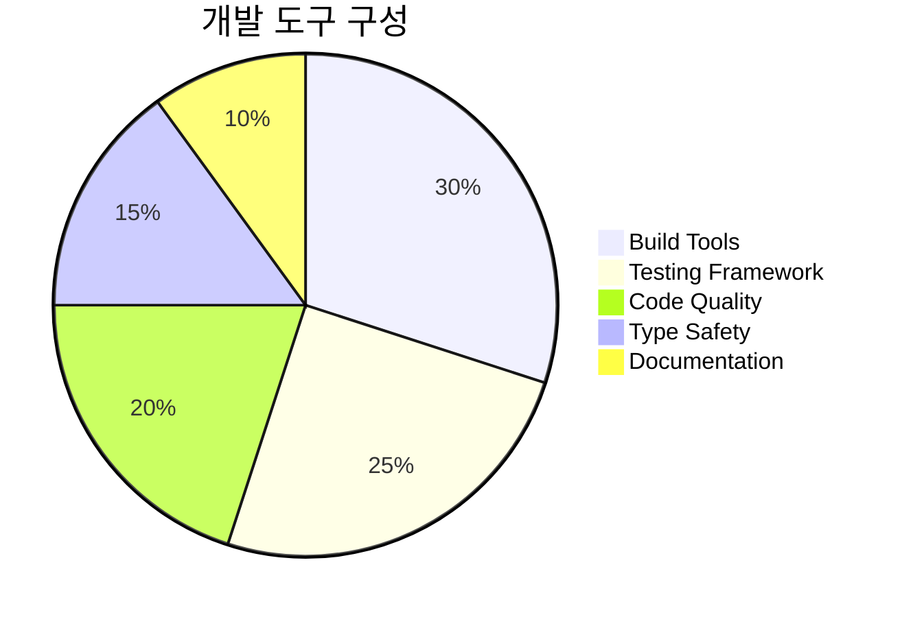

| 도구 분류             | 도구명     | 버전    | 활용도 | 상태    |
| --------------------- | ---------- | ------- | ------ | ------- |
| **빌드 시스템**       | Turbo      | 2.5.4   | 100%   | ✅ 완료 |
| **패키지 관리**       | pnpm       | 10.12.4 | 100%   | ✅ 완료 |
| **타입 검사**         | TypeScript | 5.x     | 95%    | ✅ 완료 |
| **테스트 프레임워크** | Jest       | 30.0.2  | 60%    | 🟡 부분 |
| **E2E 테스트**        | Playwright | 1.44.0  | 40%    | 🟡 부분 |
| **코드 품질**         | ESLint     | 8.57.0  | 80%    | ✅ 완료 |
| **타입 생성**         | MCP Tools  | Custom  | 90%    | ✅ 완료 |

### 5.3 Monorepo 통합 현황

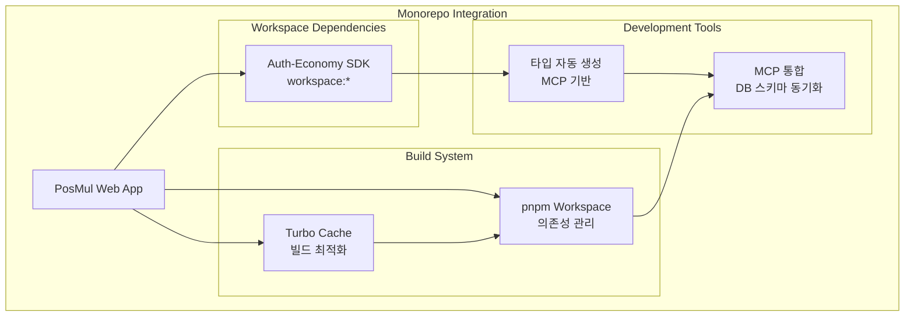

---

## 6. 향후 개발 전략 및 로드맵

### 6.1 단기 개발 목표 (2-3개월)

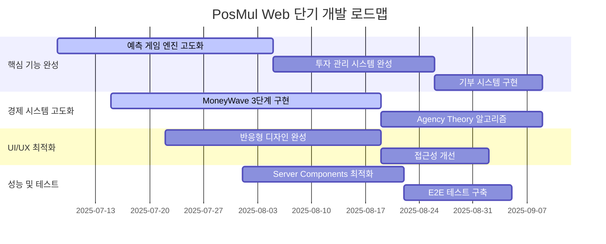

### 6.2 중장기 전략 방향

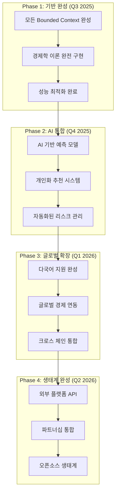

### 6.3 성공 지표 및 KPI

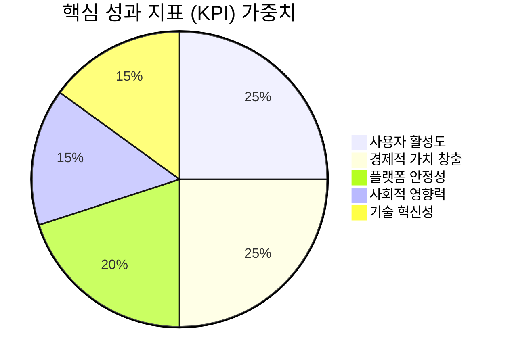

**핵심 성과 지표:**

| 지표 카테고리   | 세부 지표        | 현재 값 | 목표 값 (6개월) | 측정 방법          |
| --------------- | ---------------- | ------- | --------------- | ------------------ |
| **사용자 지표** | 일일 활성 사용자 | 0명     | 10,000명        | GA4 + SDK 추적     |
| **경제 지표**   | PMP 총 발행량    | 0       | 1,000,000 PMP   | 경제 시스템 데이터 |
| **참여 지표**   | 예측 게임 참여율 | 0%      | 70%             | 게임 엔진 데이터   |
| **기술 지표**   | 페이지 로드 속도 | -       | <2초            | Lighthouse 점수    |
| **품질 지표**   | 버그 발생률      | -       | <0.1%           | 에러 모니터링      |

### 6.4 리스크 관리 전략

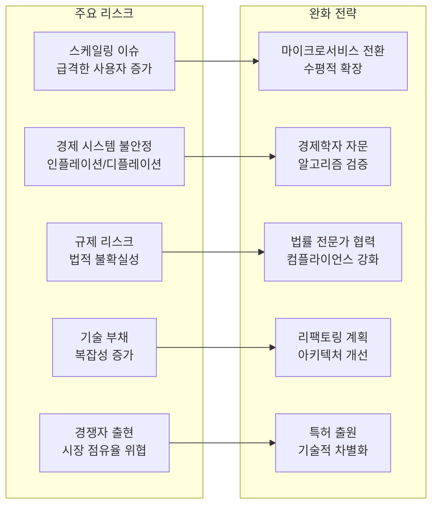

---

## 📊 결론 및 권장사항

### 핵심 성과

✅ **혁신적 아키텍처**: DDD + Clean Architecture + 경제학 이론의 완벽한 결합  
✅ **최신 기술 스택**: Next.js 15 + React 19의 최신 기능 완전 활용  
✅ **경제 시스템**: PMP/PMC 이중 화폐를 통한 지속 가능한 플랫폼 경제  
✅ **확장성**: Monorepo + Turbo를 통한 대규모 개발 환경

### 즉시 실행 권장사항

1. **경제 시스템 완성**: MoneyWave 3단계 메커니즘 구현
2. **테스트 커버리지 확대**: Jest + Playwright를 통한 품질 보장
3. **성능 최적화**: Server Components 활용 극대화
4. **사용자 경험 개선**: 접근성 및 반응형 디자인 완성

### 장기 비전

PosMul Web은 **AI 시대 직접민주주의의 표준 플랫폼**이 되어, 전 세계 사용자들이 경제학적 원리에 기반한 공정하고 투명한 의사결정 시스템을 경험할 수 있는 혁신적인 플랫폼으로 발전할 것입니다.

---

_본 보고서는 2025년 7월 8일 현재 상황을 기준으로 작성되었으며, 지속적인 업데이트를 통해 프로젝트 진화를 반영할 예정입니다._
