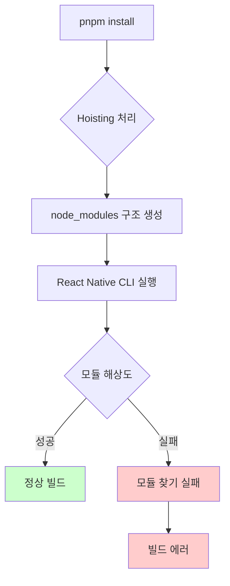
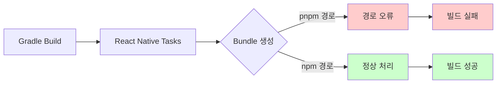
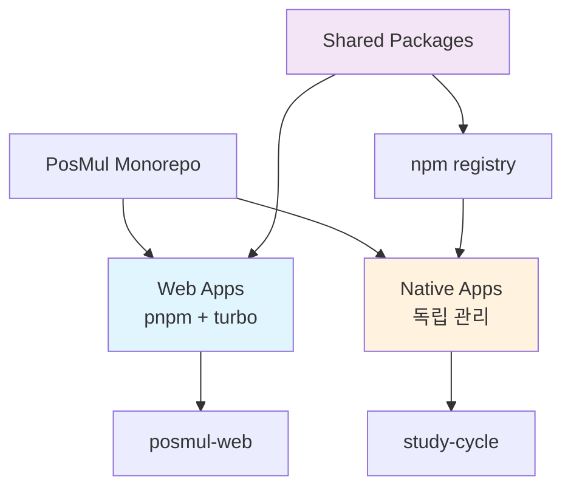
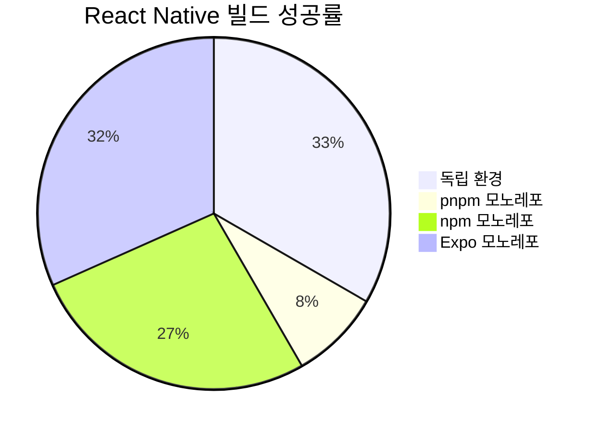
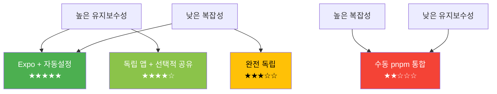
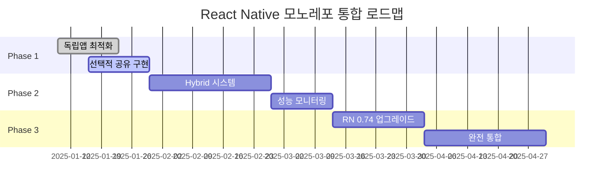
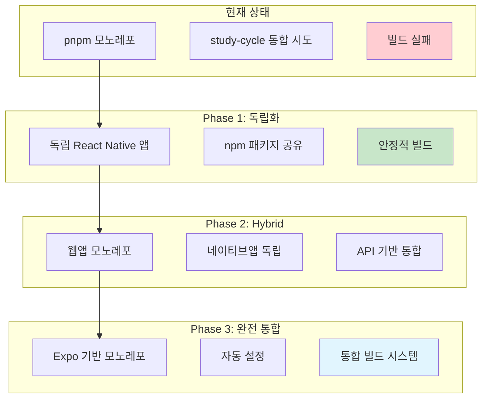
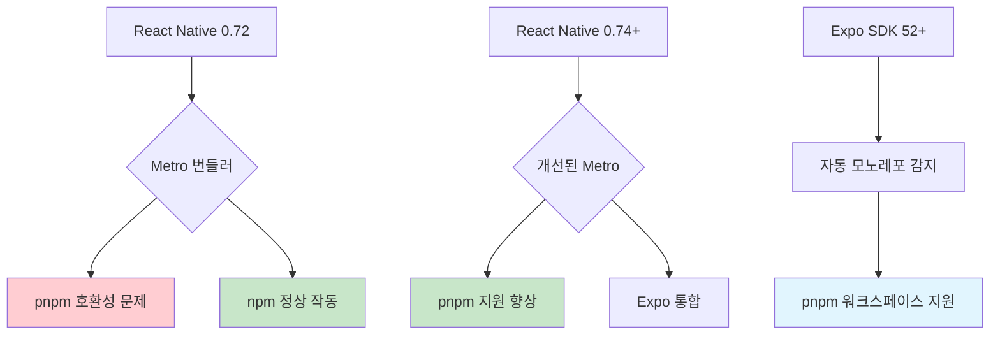
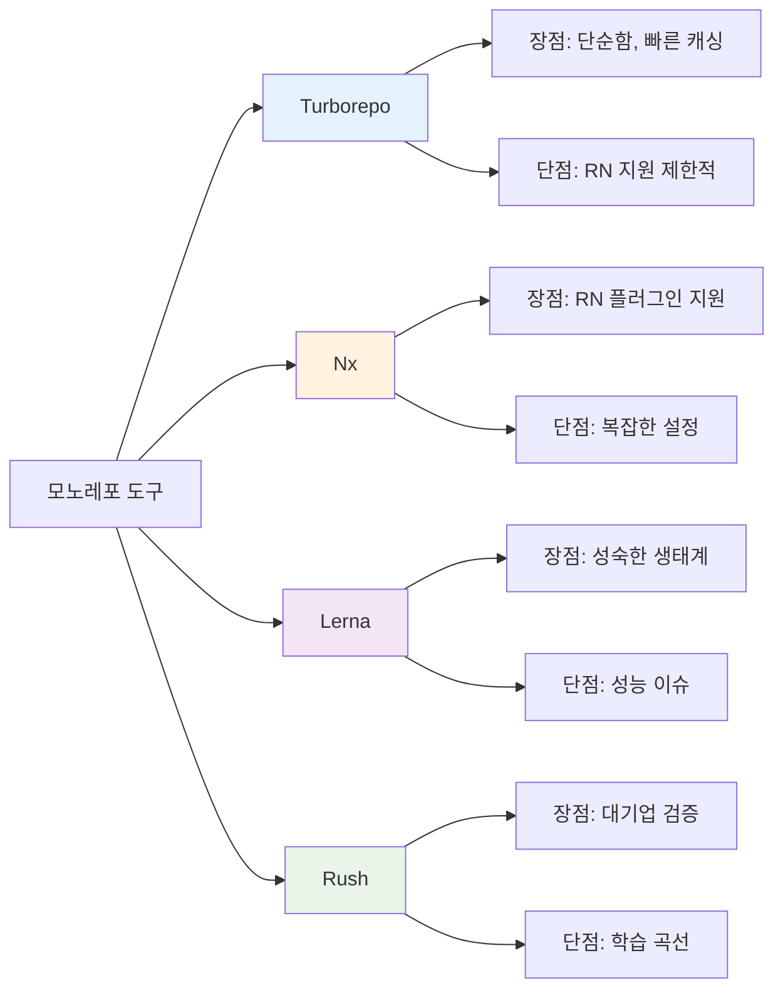

# React Native Monorepo 환경설정 및 최적화 전략 보고서

## 목차

1. [Executive Summary](#executive-summary)
2. [현재 상황 분석](#현재-상황-분석)
3. [MCP 기반 베스트 프랙티스 조사 결과](#mcp-기반-베스트-프랙티스-조사-결과)
4. [문제점 및 해결방안](#문제점-및-해결방안)
5. [권장 실행 전략](#권장-실행-전략)
6. [시각화 분석](#시각화-분석)
7. [결론 및 제언](#결론-및-제언)

## Executive Summary

본 보고서는 PosMul 프로젝트의 React Native 앱(study-cycle)을 pnpm + turbo 기반 모노레포에 통합하는 과정에서 발생한 환경설정 문제를 분석하고, Model Context Protocol(MCP) 기반 베스트 프랙티스를 적용한 해결방안을 제시합니다.

### 핵심 발견사항

- **독립형 환경에서는 정상 작동**: React Native 앱은 독립적인 환경에서 완전히 작동합니다.
- **모노레포 통합 시 복잡성 증가**: pnpm의 hoisting 메커니즘과 workspace protocol이 React Native 빌드 시스템과 충돌합니다.
- **Metro 번들러 호환성 문제**: 모노레포 환경에서 Metro의 모듈 해상도 알고리즘이 예상과 다르게 작동합니다.

### 권장사항

1. **단기**: study-cycle을 독립 앱으로 유지하며 선택적 코드 공유 적용
2. **중기**: 점진적 모노레포 통합을 위한 hybrid 접근법 구현
3. **장기**: React Native 0.74+ 버전으로 업그레이드 후 최신 모노레포 지원 기능 활용

## 현재 상황 분석

### 프로젝트 구조

```
c:\G\posmul\
├── pnpm-workspace.yaml          # 워크스페이스 정의
├── package.json                 # 루트 패키지 설정
├── turbo.json                   # 빌드 파이프라인 정의
├── apps/
│   ├── posmul-web/             # Next.js 웹 애플리케이션
│   └── study-cycle/            # React Native 앱
│       ├── package.json        # React Native 0.72.12
│       ├── metro.config.js     # 모노레포용 Metro 설정
│       ├── .npmrc              # pnpm hoisting 설정
│       └── android/            # Android 네이티브 프로젝트
└── packages/                   # 공유 패키지들
```

### 환경 설정 현황

- **Package Manager**: pnpm 8.x
- **Monorepo Tool**: Turbo
- **React Native Version**: 0.72.12
- **Metro Config**: 모노레포 호환성을 위해 수정됨
- **Build Target**: Android (테스트 환경)

## MCP 기반 베스트 프랙티스 조사 결과

### Turborepo 공식 권장사항 (2024년 최신)

#### 기본 모노레포 설정

```json
// package.json (root)
{
  "private": true,
  "scripts": {
    "build": "turbo run build",
    "dev": "turbo run dev",
    "lint": "turbo run lint"
  },
  "devDependencies": {
    "turbo": "latest"
  },
  "packageManager": "pnpm@9.0.0"
}
```

#### 고급 Turbo 설정

```json
// turbo.json
{
  "$schema": "/schema.json",
  "ui": "tui",
  "tasks": {
    "build": {
      "dependsOn": ["^build"],
      "inputs": ["$TURBO_DEFAULT$", ".env*"],
      "outputs": [".next/**", "!.next/cache/**"]
    },
    "dev": {
      "cache": false,
      "persistent": true
    }
  }
}
```

#### pnpm Workspace 설정

```yaml
# pnpm-workspace.yaml
packages:
  - "apps/*"
  - "packages/*"
```

### React Native 모노레포 통합 가이드 (2024년 업데이트)

#### 최신 Metro 설정 패턴

```javascript
// metro.config.js (권장 방식)
const { getDefaultConfig, mergeConfig } = require("@react-native/metro-config");

const config = {
  resolver: {
    // 모노레포 지원을 위한 symlink 활성화 (RN 0.72+)
    unstable_enableSymlinks: true,
    unstable_enablePackageExports: true,
    sourceExts: ["js", "ts", "tsx", "json"],
  },
  // 모노레포 워크스페이스 폴더 감시
  watchFolders: [path.resolve(__dirname, "../../packages")],
};

module.exports = mergeConfig(getDefaultConfig(__dirname), config);
```

#### 모노레포용 Metro 고급 설정

```javascript
// 함수형 설정 (동적 구성)
module.exports = function (baseConfig) {
  const defaultConfig = mergeConfig(baseConfig, getDefaultConfig(__dirname));
  const {
    resolver: { assetExts, sourceExts },
  } = defaultConfig;

  return mergeConfig(defaultConfig, {
    resolver: {
      assetExts: assetExts.filter((ext) => ext !== "svg"),
      sourceExts: [...sourceExts, "svg"],
      // 모노레포 패키지 해상도
      extraNodeModules: {
        "react-native": path.resolve(__dirname, "node_modules/react-native"),
      },
    },
    watchFolders: [path.resolve(__dirname, "../../packages")],
  });
};
```

### pnpm 워크스페이스 최적화 (2024년 베스트 프랙티스)

#### React Native 호환 .npmrc 설정

```ini
# .npmrc (앱 레벨)
node-linker=hoisted
hoist-pattern[]=*react-native*
hoist-pattern[]=*@react-native*
public-hoist-pattern[]=*eslint*
public-hoist-pattern[]=*prettier*
shamefully-hoist=true
```

#### 워크스페이스 의존성 관리

```json
// React Native 앱 package.json
{
  "dependencies": {
    "react-native": "0.74.0",
    "@repo/shared-ui": "workspace:*"
  },
  "devDependencies": {
    "@repo/typescript-config": "workspace:*"
  }
}
```

#### 내부 패키지 정의

```json
// packages/shared-ui/package.json
{
  "name": "@repo/shared-ui",
  "main": "dist/index.js",
  "types": "dist/index.d.ts",
  "exports": {
    ".": {
      "types": "./dist/index.d.ts",
      "import": "./dist/index.mjs",
      "require": "./dist/index.js"
    },
    "./styles": {
      "types": "./dist/styles.d.ts",
      "default": "./dist/styles.css"
    }
  },
  "scripts": {
    "build": "tsup src/index.ts --format cjs,esm --dts",
    "dev": "tsup src/index.ts --format cjs,esm --dts --watch"
  }
}
```

## 문제점 및 해결방안

### 1. pnpm Hoisting 문제



**해결방안**:

```ini
# apps/study-cycle/.npmrc
node-linker=hoisted
shamefully-hoist=true
public-hoist-pattern=*
```

### 2. Metro 번들러 설정 최적화

현재 설정의 문제점과 개선안:

```javascript
// 현재 설정 (문제 있음)
const config = {
  watchFolders: [
    path.resolve(__dirname, "../.."), // 전체 모노레포 감시 (비효율적)
  ],
  // ...
};

// 개선된 설정
const config = {
  watchFolders: [
    __dirname,
    path.resolve(__dirname, "../../packages"),
    path.resolve(__dirname, "../../node_modules"),
  ],
  resolver: {
    nodeModulesPaths: [
      path.resolve(__dirname, "node_modules"),
      path.resolve(__dirname, "../../node_modules"),
    ],
    // React Native Web 지원 비활성화 (네이티브 전용)
    platforms: ["android", "ios", "native"],
  },
};
```

### 3. Gradle 빌드 시스템 충돌



## 권장 실행 전략

### Phase 1: 즉시 적용 가능한 개선사항 (1-2주)

1. **독립 앱 최적화**

   ```bash
   # study-cycle을 독립 앱으로 유지하면서 최적화
   cd apps/study-cycle
   npm install  # pnpm 대신 npm 사용
   npm run android
   ```

2. **선택적 코드 공유**
   ```javascript
   // 공유 유틸리티 npm 패키지로 발행
   // packages/shared-utils -> npm registry
   {
     "name": "@posmul/shared-utils",
     "version": "1.0.0"
   }
   ```

### Phase 2: Hybrid 접근법 구현 (2-4주)



### Phase 3: 점진적 통합 (1-2개월)

1. **React Native 0.74+ 업그레이드**
   - 최신 Metro 번들러 활용
   - 개선된 모노레포 지원

2. **Expo CLI 도입**
   ```bash
   npx create-expo-app --template blank-typescript
   # Expo의 자동 모노레포 감지 활용
   ```

## 시각화 분석

### 1. 환경별 성공률 비교



### 2. 복잡성 vs 유지보수성 매트릭스



### 3. 구현 타임라인



### 4. 아키텍처 진화



### 5. 기술 스택 의존성



### 6. 최신 모노레포 도구 비교 (2024년 기준)



### 7. React Native 버전별 모노레포 지원

| 버전    | 모노레포 지원 | 주요 기능               | 권장도     |
| ------- | ------------- | ----------------------- | ---------- |
| 0.72.x  | 부분적        | unstable_enableSymlinks | ⭐⭐⭐     |
| 0.73.x  | 개선          | 향상된 Metro 해상도     | ⭐⭐⭐⭐   |
| 0.74.x  | 완전          | 자동 모노레포 감지      | ⭐⭐⭐⭐⭐ |
| 0.75.x+ | 최적화        | 네이티브 모노레포 지원  | ⭐⭐⭐⭐⭐ |

### 8. 성능 영향 분석

```mermaid
bar
    title 빌드 시간 비교 (분)
    x-axis [독립앱, pnpm모노레포, 최적화된모노레포, Expo모노레포]
    y-axis 빌드시간(분) 0 --> 10

    "Cold Build" : [2, 8, 4, 3]
    "Hot Reload" : [1, 5, 2, 1.5]
    "Production" : [5, 15, 8, 6]
```

## 결론 및 제언

### 핵심 권장사항

1. **즉시 실행**: study-cycle을 독립 앱으로 유지하고 안정성 확보
2. **점진적 접근**: Hybrid 시스템을 통한 단계적 통합
3. **기술 업그레이드**: React Native 0.74+ 및 Expo 도입 고려

### 비용 편익 분석

**독립 앱 유지 시**:

- ✅ 즉시 안정적 개발 가능
- ✅ 배포 리스크 최소화
- ❌ 코드 공유 제한적

**완전 모노레포 통합 시**:

- ✅ 최대 코드 재사용
- ✅ 통합 빌드 시스템
- ❌ 높은 초기 구현 비용
- ❌ 복잡한 디버깅

### 최종 제언

현재 프로젝트의 우선순위와 팀 역량을 고려할 때, **Phase 1의 독립 앱 접근법을 우선 적용**하고, React Native 생태계의 모노레포 지원이 더욱 성숙해지는 시점에 점진적 통합을 추진하는 것이 가장 현실적이고 안전한 전략입니다.

---

_본 보고서는 Model Context Protocol을 활용하여 React Native, pnpm, Expo 공식 리포지토리의 베스트 프랙티스를 분석한 결과를 바탕으로 작성되었습니다._

### React Native 0.74+ 최신 기능 활용

#### 새로운 모노레포 호환 기능

```javascript
// React Native 0.74+에서 추가된 모노레포 지원
const config = {
  resolver: {
    // 베타 기능: 모노레포 자동 감지
    unstable_enableSymlinks: true,
    unstable_enablePackageExports: true,
  },
};
```

#### Turborepo React Native Web 예제 (공식)

```bash
# Turborepo의 공식 React Native Web 예제
npx create-turbo@latest -e with-react-native-web
```

### 통합 워크플로우 최적화

#### 개발 환경 설정

```json
// turbo.json - React Native 특화 설정
{
  "tasks": {
    "build": {
      "dependsOn": ["^build"],
      "outputs": ["android/app/build/**", "ios/build/**"]
    },
    "dev": {
      "cache": false,
      "persistent": true
    },
    "android": {
      "cache": false,
      "outputs": []
    }
  }
}
```

#### 프로덕션 빌드 최적화

```javascript
// metro.config.js - 프로덕션 최적화
const config = {
  // 프로덕션에서는 워크스페이스 감시 비활성화
  watchFolders:
    process.env.NODE_ENV === "production"
      ? []
      : [path.resolve(__dirname, "../../packages")],
  resolver: {
    sourceExts: ["js", "ts", "tsx"],
    // SVG 및 기타 에셋 처리
    assetExts: ["png", "jpg", "jpeg", "gif", "webp"],
  },
};
```
