# Study-Cycle 프로젝트 현재 아키텍처 및 전략 보고서 (2025 업데이트)

> **문서 유형**: 분석 보고서 (Analysis Report)  
> **작성 일시**: 2025-07-08  
> **작성자**: AI Assistant  
> **목표**: Monorepo + Auth-Economy SDK 통합 환경에서의 Study-Cycle 프로젝트 현재 아키텍처와 전략을 분석하고 향후 개발 방향을 제시합니다.

---

## 📑 목차

- [Study-Cycle 프로젝트 현재 아키텍처 및 전략 보고서 (2025 업데이트)](#study-cycle-프로젝트-현재-아키텍처-및-전략-보고서-2025-업데이트)
  - [📑 목차](#-목차)
  - [1. 프로젝트 진화 및 현재 위치](#1-프로젝트-진화-및-현재-위치)
    - [1.1 진화의 핵심 동력](#11-진화의-핵심-동력)
  - [2. 아키텍처 현황 분석 (Monorepo 통합)](#2-아키텍처-현황-분석-monorepo-통합)
    - [2.1 현재 프로젝트 구조](#21-현재-프로젝트-구조)
    - [2.2 Study-Cycle 내부 구조](#22-study-cycle-내부-구조)
  - [3. Auth-Economy SDK 통합 구조](#3-auth-economy-sdk-통합-구조)
    - [3.1 SDK 통합 아키텍처](#31-sdk-통합-아키텍처)
    - [3.2 경제 시스템 통합 방식](#32-경제-시스템-통합-방식)
  - [4. 핵심 기능 재정의 (SDK 기반)](#4-핵심-기능-재정의-sdk-기반)
    - [4.1 학습 보상 시스템 (PMP/PMC 연동)](#41-학습-보상-시스템-pmppmc-연동)
    - [4.2 현재 구현된 기능 매트릭스](#42-현재-구현된-기능-매트릭스)
  - [5. 기술 스택 현황](#5-기술-스택-현황)
    - [5.1 프론트엔드 (React Native)](#51-프론트엔드-react-native)
    - [5.2 백엔드 및 인프라](#52-백엔드-및-인프라)
  - [6. 개발 전략 및 로드맵](#6-개발-전략-및-로드맵)
    - [6.1 단기 개발 목표 (1-2개월)](#61-단기-개발-목표-1-2개월)
    - [6.2 중장기 전략 방향](#62-중장기-전략-방향)
    - [6.3 성공 지표 (KPI)](#63-성공-지표-kpi)
    - [6.4 리스크 및 완화 전략](#64-리스크-및-완화-전략)
  - [📊 결론 및 권장사항](#-결론-및-권장사항)
    - [핵심 성과](#핵심-성과)
    - [즉시 실행 권장사항](#즉시-실행-권장사항)
    - [장기 비전](#장기-비전)

---

## 1. 프로젝트 진화 및 현재 위치

Study-Cycle 프로젝트는 2025년 초기 컨셉에서 **PosMul Monorepo 생태계 내 통합 앱**으로 진화했습니다.

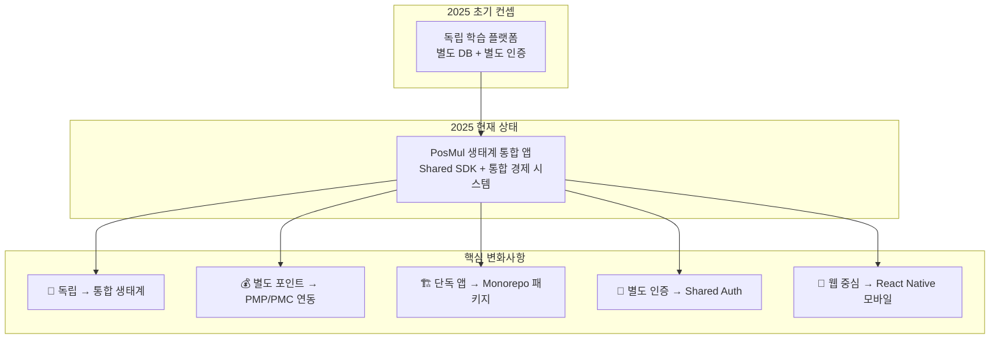

### 1.1 진화의 핵심 동력

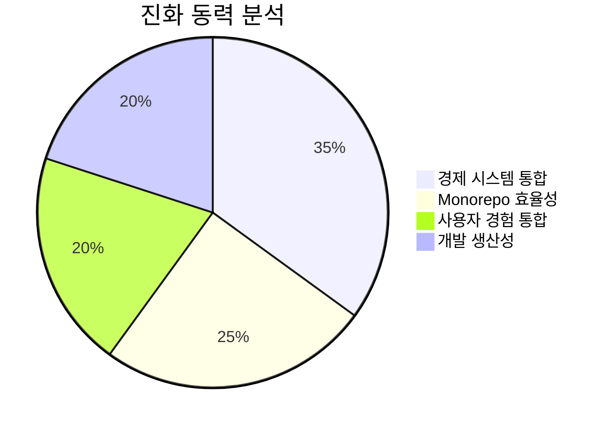

**주요 변화 동력:**

- ✅ **경제 시스템 통합**: PMP/PMC를 활용한 학습 보상 체계
- ✅ **개발 효율성**: Shared SDK로 중복 개발 최소화
- ✅ **사용자 경험**: 단일 계정으로 PosMul 전체 생태계 접근
- ✅ **확장성**: 향후 다른 앱과의 크로스 플랫폼 연동

---

## 2. 아키텍처 현황 분석 (Monorepo 통합)

### 2.1 현재 프로젝트 구조

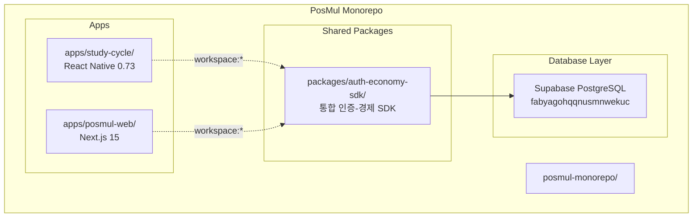

### 2.2 Study-Cycle 내부 구조

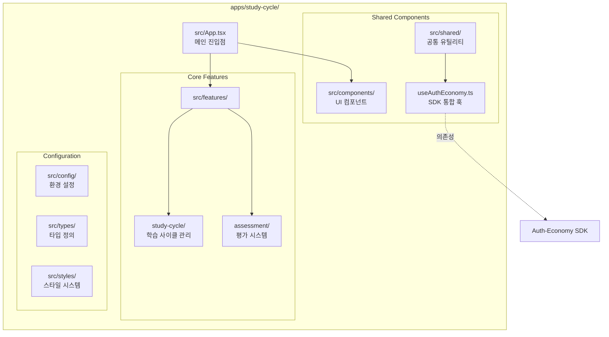

---

## 3. Auth-Economy SDK 통합 구조

### 3.1 SDK 통합 아키텍처

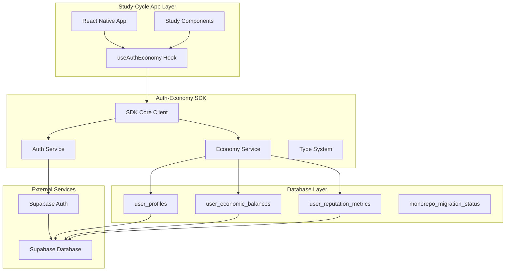

### 3.2 경제 시스템 통합 방식

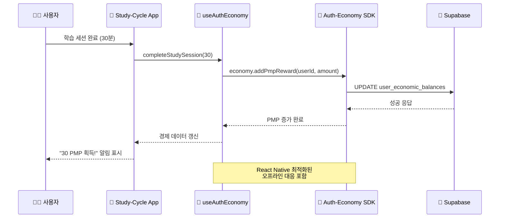

---

## 4. 핵심 기능 재정의 (SDK 기반)

### 4.1 학습 보상 시스템 (PMP/PMC 연동)

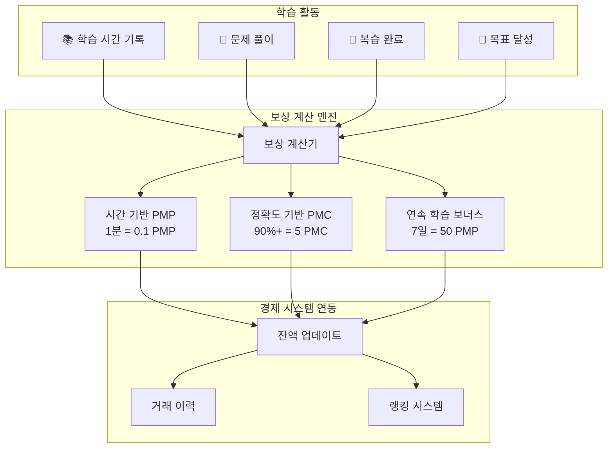

### 4.2 현재 구현된 기능 매트릭스

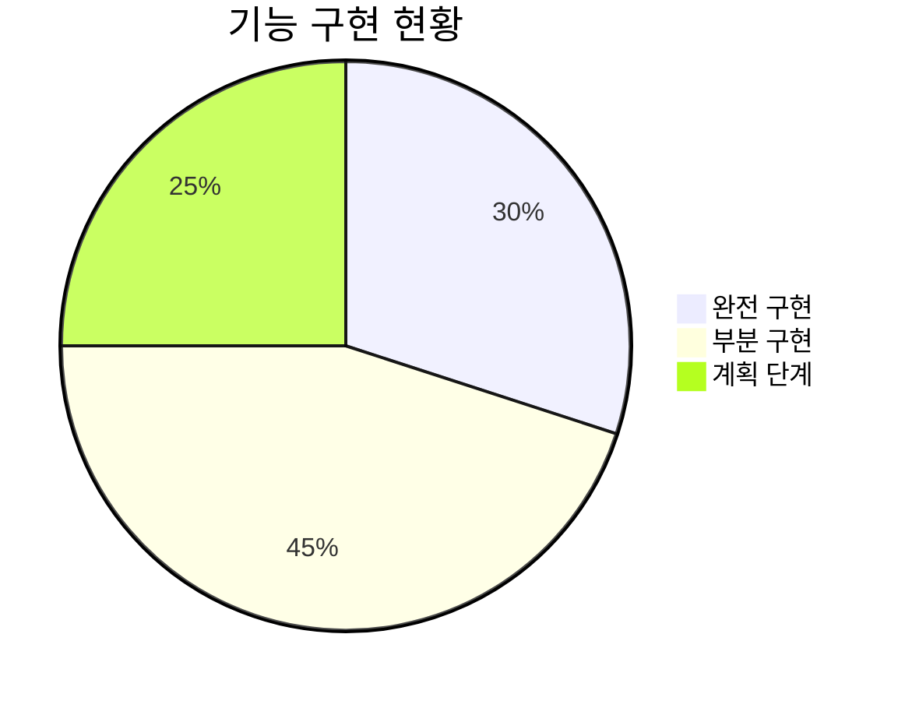

| 기능 영역            | 구현 상태 | 완성도 | 비고                      |
| -------------------- | --------- | ------ | ------------------------- |
| **사용자 인증**      | ✅ 완료   | 95%    | SDK 기반 완전 통합        |
| **경제 시스템 연동** | ✅ 완료   | 90%    | PMP/PMC 잔액 관리         |
| **학습 시간 추적**   | 🟡 부분   | 60%    | 기본 기능 구현됨          |
| **보상 지급 시스템** | 🟡 부분   | 70%    | completeStudySession 구현 |
| **문제 풀이 엔진**   | 🔴 계획   | 20%    | 기본 구조만 존재          |
| **진도 관리**        | 🔴 계획   | 15%    | 아이디어 단계             |
| **랭킹 시스템**      | 🔴 계획   | 10%    | 미구현                    |

---

## 5. 기술 스택 현황

### 5.1 프론트엔드 (React Native)

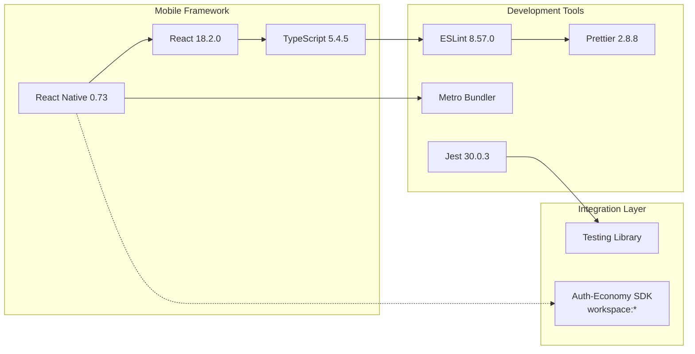

### 5.2 백엔드 및 인프라

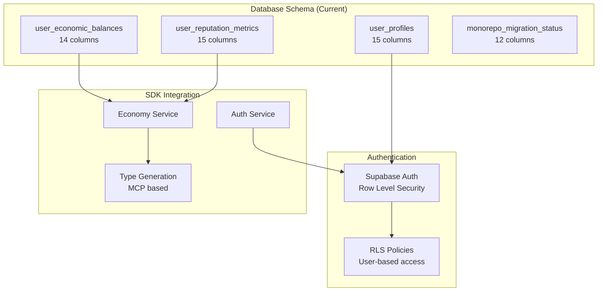

---

## 6. 개발 전략 및 로드맵

### 6.1 단기 개발 목표 (1-2개월)

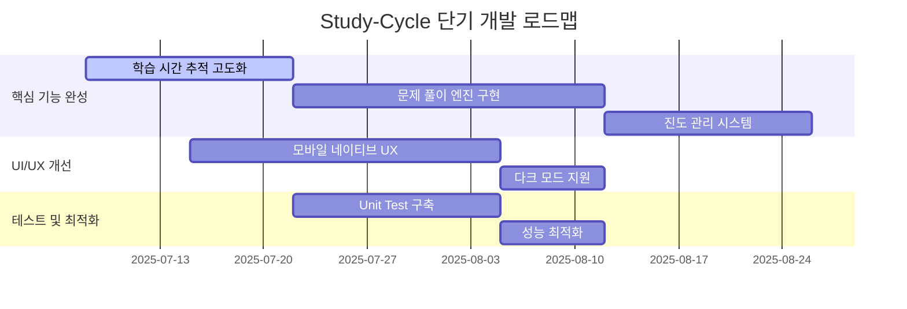

### 6.2 중장기 전략 방향

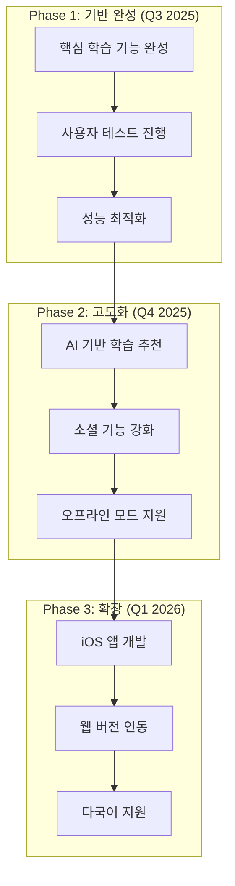

### 6.3 성공 지표 (KPI)

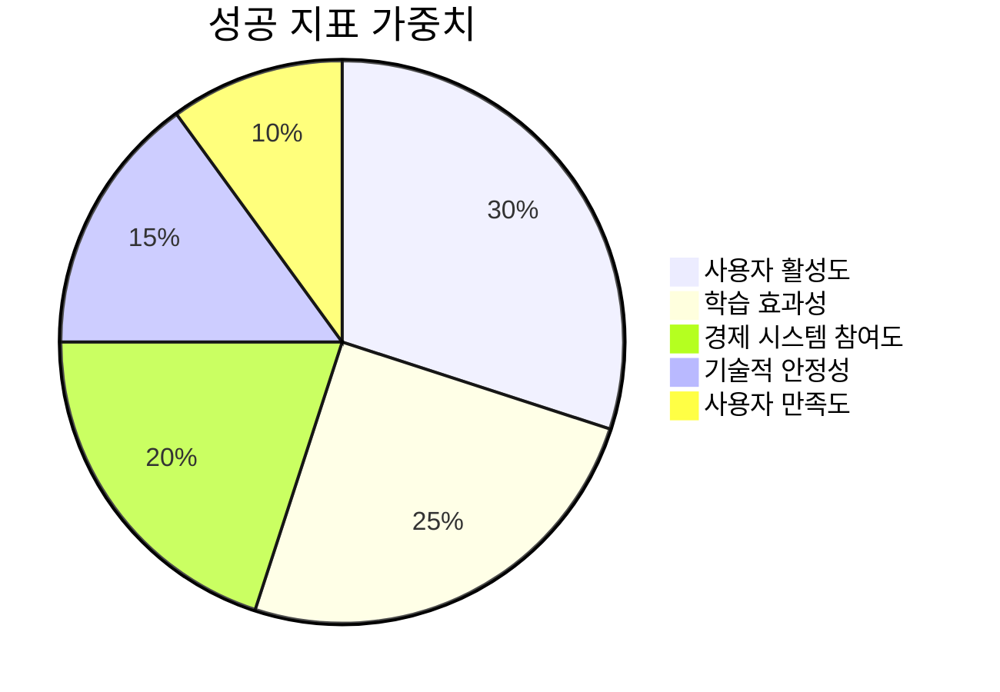

**핵심 성과 지표:**

| 지표               | 현재 값 | 목표 값 (3개월)  | 측정 방법                  |
| ------------------ | ------- | ---------------- | -------------------------- |
| **일 활성 사용자** | 0명     | 100명            | SDK 기반 세션 추적         |
| **평균 학습 시간** | -       | 45분/일          | useAuthEconomy 훅 데이터   |
| **PMP 획득량**     | -       | 1,000 PMP/사용자 | 경제 시스템 데이터         |
| **앱 크래시율**    | -       | <1%              | React Native 크래시 리포팅 |
| **피드백 점수**    | -       | 4.2/5.0          | 앱스토어 리뷰              |

### 6.4 리스크 및 완화 전략

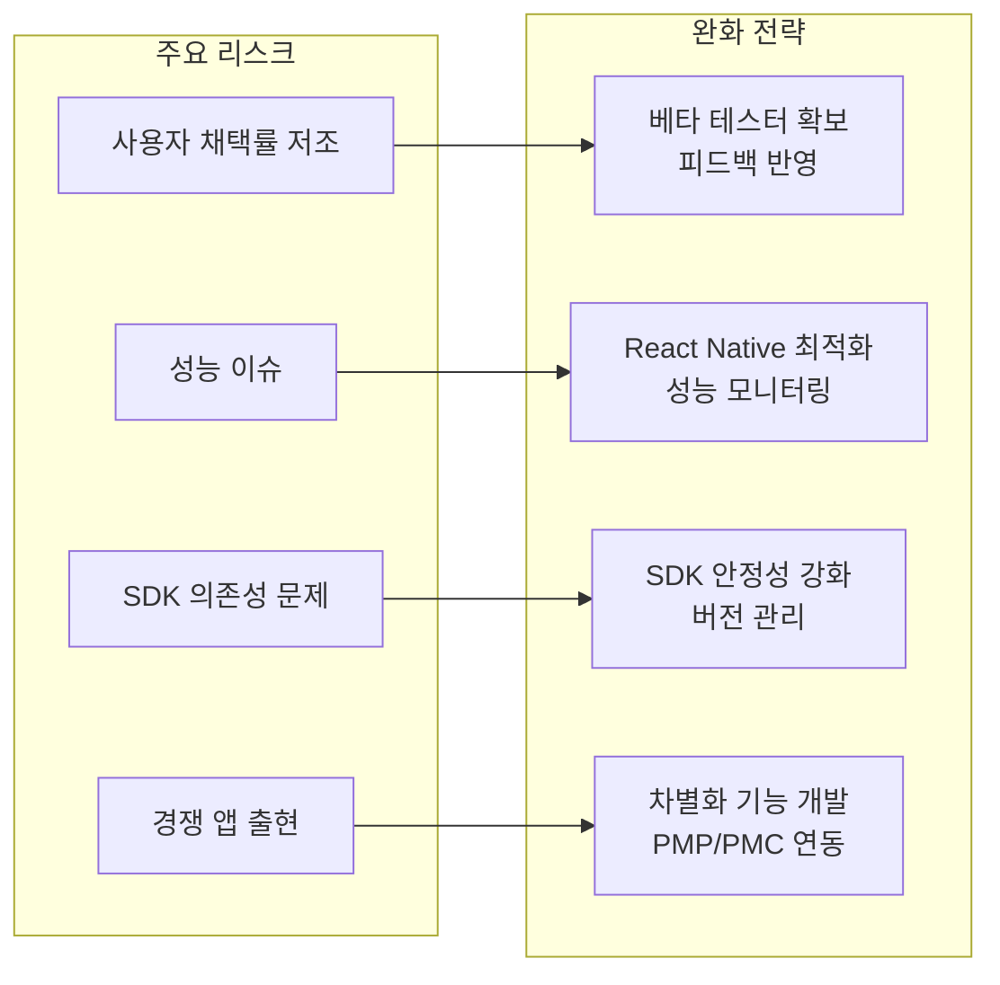

---

## 📊 결론 및 권장사항

### 핵심 성과

✅ **성공적인 Monorepo 통합**: Auth-Economy SDK를 통한 효율적인 개발 환경 구축  
✅ **경제 시스템 연동**: PMP/PMC 기반의 학습 보상 체계 확립  
✅ **React Native 기반**: 모바일 네이티브 경험 제공  
✅ **타입 안전성**: TypeScript + SDK를 통한 안전한 개발

### 즉시 실행 권장사항

1. **문제 풀이 엔진 완성**: Assessment 기능의 핵심 구현
2. **UI/UX 고도화**: React Native 네이티브 컴포넌트 활용
3. **테스트 커버리지 확대**: 현재 부족한 테스트 시나리오 보완
4. **성능 최적화**: 학습 데이터 동기화 최적화

### 장기 비전

Study-Cycle은 **PosMul 생태계의 모바일 허브**로 발전하여, 사용자들이 학습을 통해 경제적 가치를 창출하고 커뮤니티에 기여할 수 있는 플랫폼으로 성장할 것입니다.

---

_본 보고서는 2025년 7월 8일 현재 상황을 기준으로 작성되었으며, 지속적인 업데이트를 통해 프로젝트 진화를 반영할 예정입니다._
