# Study-Cycle 현재 개발 상황 상세 분석 보고서

> **문서 유형**: 분석 보고서 (Analysis Report)  
> **작성 일시**: 2025-07-08  
> **작성자**: AI Assistant  
> **목표**: Study-Cycle React Native 앱의 현재 개발 상황을 코드 레벨까지 상세히 분석하고 데이터베이스 스키마를 포함한 전체 현황을 제시합니다.

---

## 📑 목차

- [Study-Cycle 현재 개발 상황 상세 분석 보고서](#study-cycle-현재-개발-상황-상세-분석-보고서)
  - [📑 목차](#-목차)
  - [1. 프로젝트 구조 현황 분석](#1-프로젝트-구조-현황-분석)
    - [1.1 디렉토리 구조 상세](#11-디렉토리-구조-상세)
    - [1.2 파일 구성 통계](#12-파일-구성-통계)
  - [2. 코드베이스 상세 분석](#2-코드베이스-상세-분석)
    - [2.1 App.tsx 메인 컴포넌트 분석](#21-apptsx-메인-컴포넌트-분석)
    - [2.2 useAuthEconomy.ts 훅 분석](#22-useautheconomyts-훅-분석)
  - [3. Supabase 데이터베이스 스키마 분석](#3-supabase-데이터베이스-스키마-분석)
    - [3.1 현재 데이터베이스 테이블 현황](#31-현재-데이터베이스-테이블-현황)
    - [3.2 Study-Cycle 관련 데이터 매핑](#32-study-cycle-관련-데이터-매핑)
    - [3.3 데이터베이스 제약 조건 및 보안](#33-데이터베이스-제약-조건-및-보안)
  - [4. Auth-Economy SDK 통합 현황](#4-auth-economy-sdk-통합-현황)
    - [4.1 SDK 의존성 및 통합 수준](#41-sdk-의존성-및-통합-수준)
    - [4.2 SDK 활용 메트릭스](#42-sdk-활용-메트릭스)
  - [5. 기능별 구현 상태 매트릭스](#5-기능별-구현-상태-매트릭스)
    - [5.1 핵심 기능 구현 현황](#51-핵심-기능-구현-현황)
    - [5.2 기능별 우선순위 매트릭스](#52-기능별-우선순위-매트릭스)
  - [6. 개발 환경 및 도구 현황](#6-개발-환경-및-도구-현황)
    - [6.1 React Native 환경 설정](#61-react-native-환경-설정)
    - [6.2 패키지 의존성 분석](#62-패키지-의존성-분석)
  - [7. 품질 및 테스트 현황](#7-품질-및-테스트-현황)
    - [7.1 코드 품질 메트릭스](#71-코드-품질-메트릭스)
    - [7.2 테스트 전략 현황](#72-테스트-전략-현황)
  - [📊 종합 결론 및 개발 우선순위](#-종합-결론-및-개발-우선순위)
    - [현재 상태 요약](#현재-상태-요약)
    - [즉시 실행 권장사항](#즉시-실행-권장사항)

---

## 1. 프로젝트 구조 현황 분석

### 1.1 디렉토리 구조 상세

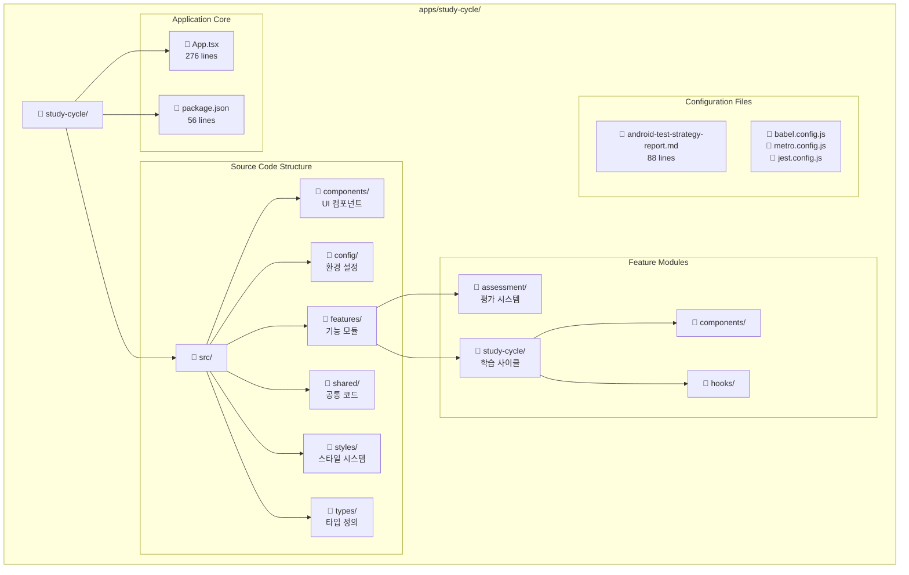
```mermaid
graph TD
    subgraph "apps/study-cycle/"
        Root[📁 study-cycle/]

        subgraph "Application Core"
            App[📄 App.tsx<br/>276 lines]
            PackageJson[📄 package.json<br/>56 lines]
        end

        subgraph "Source Code Structure"
            Src[📁 src/]
            Components[📁 components/<br/>UI 컴포넌트]
            Config[📁 config/<br/>환경 설정]
            Features[📁 features/<br/>기능 모듈]
            Shared[📁 shared/<br/>공통 코드]
            Styles[📁 styles/<br/>스타일 시스템]
            Types[📁 types/<br/>타입 정의]
        end

        subgraph "Feature Modules"
            Assessment[📁 assessment/<br/>평가 시스템]
            StudyCycleFeature[📁 study-cycle/<br/>학습 사이클]
            StudyComponents[📁 components/]
            StudyHooks[📁 hooks/]
        end

        subgraph "Configuration Files"
            AndroidTest[📄 android-test-strategy-report.md<br/>88 lines]
            ConfigFiles[📄 babel.config.js<br/>📄 metro.config.js<br/>📄 jest.config.js]
        end
    end

    Root --> App
    Root --> PackageJson
    Root --> Src

    Src --> Components
    Src --> Config
    Src --> Features
    Src --> Shared
    Src --> Styles
    Src --> Types

    Features --> Assessment
    Features --> StudyCycleFeature

    StudyCycleFeature --> StudyComponents
    StudyCycleFeature --> StudyHooks

```

### 1.2 파일 구성 통계

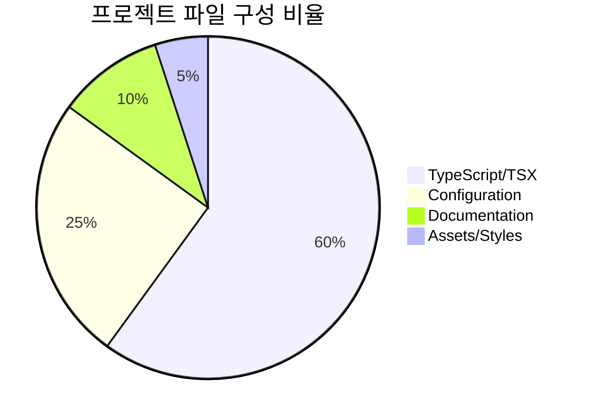
```mermaid
pie title 프로젝트 파일 구성 비율
    "TypeScript/TSX" : 60
    "Configuration" : 25
    "Documentation" : 10
    "Assets/Styles" : 5
```

| 구분             | 파일 수 | 주요 파일                                   | 상태       |
| ---------------- | ------- | ------------------------------------------- | ---------- |
| **메인 앱 파일** | 1       | App.tsx (276줄)                             | ✅ 완성    |
| **기능 모듈**    | 2+      | features/study-cycle/, features/assessment/ | 🟡 개발 중 |
| **공유 코드**    | 1+      | shared/useAuthEconomy.ts (272줄)            | ✅ 완성    |
| **설정 파일**    | 6+      | package.json, babel.config.js 등            | ✅ 완성    |
| **테스트 파일**  | 0       | 없음                                        | 🔴 미완성  |

---

## 2. 코드베이스 상세 분석

### 2.1 App.tsx 메인 컴포넌트 분석

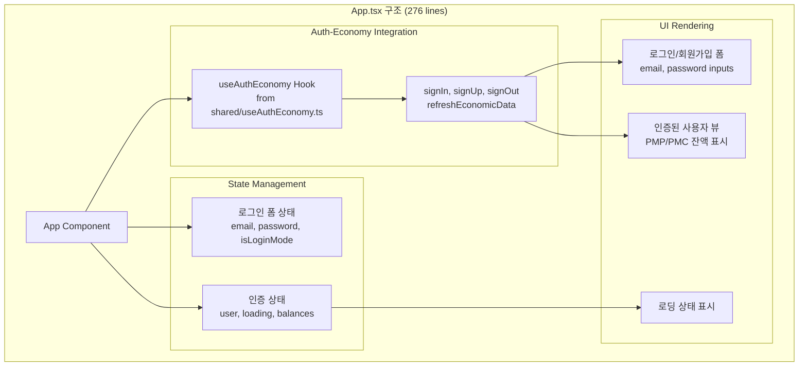
```mermaid
flowchart TD
    subgraph "App.tsx 구조 (276 lines)"
        AppComponent[App Component]

        subgraph "State Management"
            LoginState[로그인 폼 상태<br/>email, password, isLoginMode]
            AuthState[인증 상태<br/>user, loading, balances]
        end

        subgraph "Auth-Economy Integration"
            UseAuthHook[useAuthEconomy Hook<br/>from shared/useAuthEconomy.ts]
            AuthActions[signIn, signUp, signOut<br/>refreshEconomicData]
        end

        subgraph "UI Rendering"
            LoginForm[로그인/회원가입 폼<br/>email, password inputs]
            AuthenticatedView[인증된 사용자 뷰<br/>PMP/PMC 잔액 표시]
            LoadingState[로딩 상태 표시]
        end
    end

    AppComponent --> LoginState
    AppComponent --> AuthState
    AppComponent --> UseAuthHook

    UseAuthHook --> AuthActions
    AuthActions --> LoginForm
    AuthActions --> AuthenticatedView

    AuthState --> LoadingState

```

**App.tsx 핵심 기능:**

- ✅ **완전한 인증 플로우**: 로그인/회원가입/로그아웃
- ✅ **실시간 경제 데이터**: PMP/PMC 잔액 표시
- ✅ **에러 핸들링**: Alert를 통한 사용자 피드백
- ✅ **반응형 UI**: 로딩 상태 및 조건부 렌더링

### 2.2 useAuthEconomy.ts 훅 분석

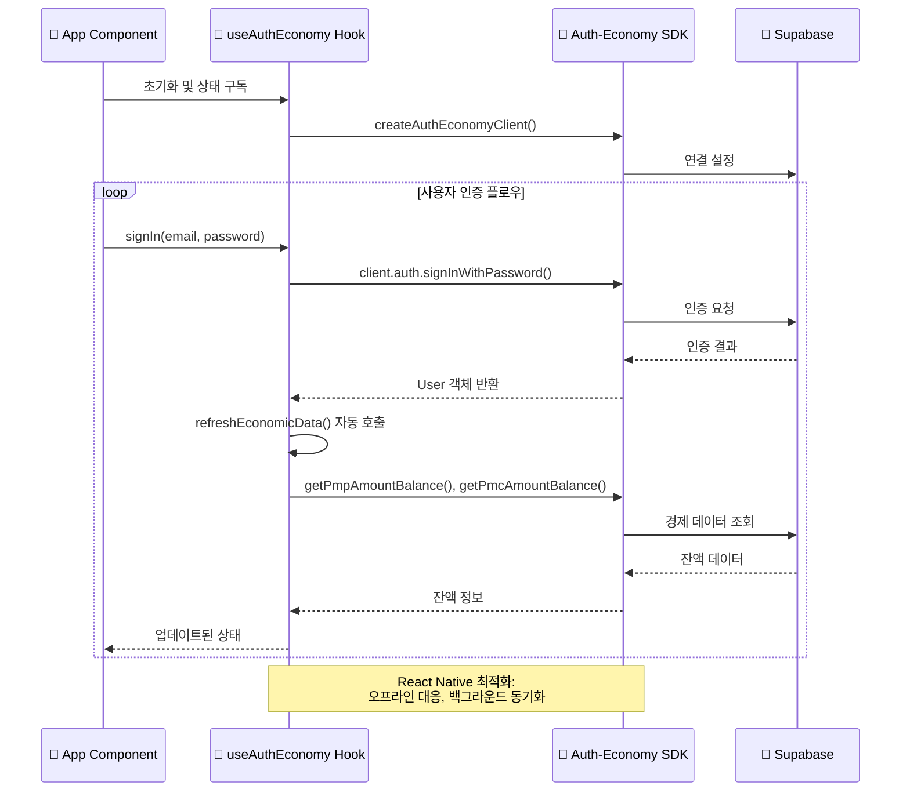
```mermaid
sequenceDiagram
    participant App as 📱 App Component
    participant Hook as 🎣 useAuthEconomy Hook
    participant SDK as 🔧 Auth-Economy SDK
    participant Supabase as 🐘 Supabase

    App->>Hook: 초기화 및 상태 구독
    Hook->>SDK: createAuthEconomyClient()
    SDK->>Supabase: 연결 설정

    loop 사용자 인증 플로우
        App->>Hook: signIn(email, password)
        Hook->>SDK: client.auth.signInWithPassword()
        SDK->>Supabase: 인증 요청
        Supabase-->>SDK: 인증 결과
        SDK-->>Hook: User 객체 반환
        Hook->>Hook: refreshEconomicData() 자동 호출
        Hook->>SDK: getPmpAmountBalance(), getPmcAmountBalance()
        SDK->>Supabase: 경제 데이터 조회
        Supabase-->>SDK: 잔액 데이터
        SDK-->>Hook: 잔액 정보
        Hook-->>App: 업데이트된 상태
    end

    Note over Hook, SDK: React Native 최적화:<br/>오프라인 대응, 백그라운드 동기화
```

**useAuthEconomy.ts 핵심 특징 (272 lines):**

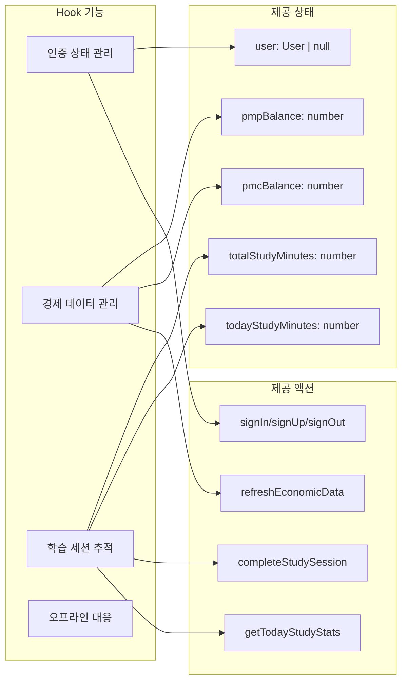
```mermaid
graph LR
    subgraph "Hook 기능"
        A[인증 상태 관리]
        B[경제 데이터 관리]
        C[학습 세션 추적]
        D[오프라인 대응]
    end

    subgraph "제공 상태"
        E["user: User | null"]
        F["pmpBalance: number"]
        G["pmcBalance: number"]
        H["totalStudyMinutes: number"]
        I["todayStudyMinutes: number"]
    end

    subgraph "제공 액션"
        J["signIn/signUp/signOut"]
        K["refreshEconomicData"]
        L["completeStudySession"]
        M["getTodayStudyStats"]
    end

    A --> E
    B --> F
    B --> G
    C --> H
    C --> I

    A --> J
    B --> K
    C --> L
    C --> M

```

---

## 3. Supabase 데이터베이스 스키마 분석

### 3.1 현재 데이터베이스 테이블 현황

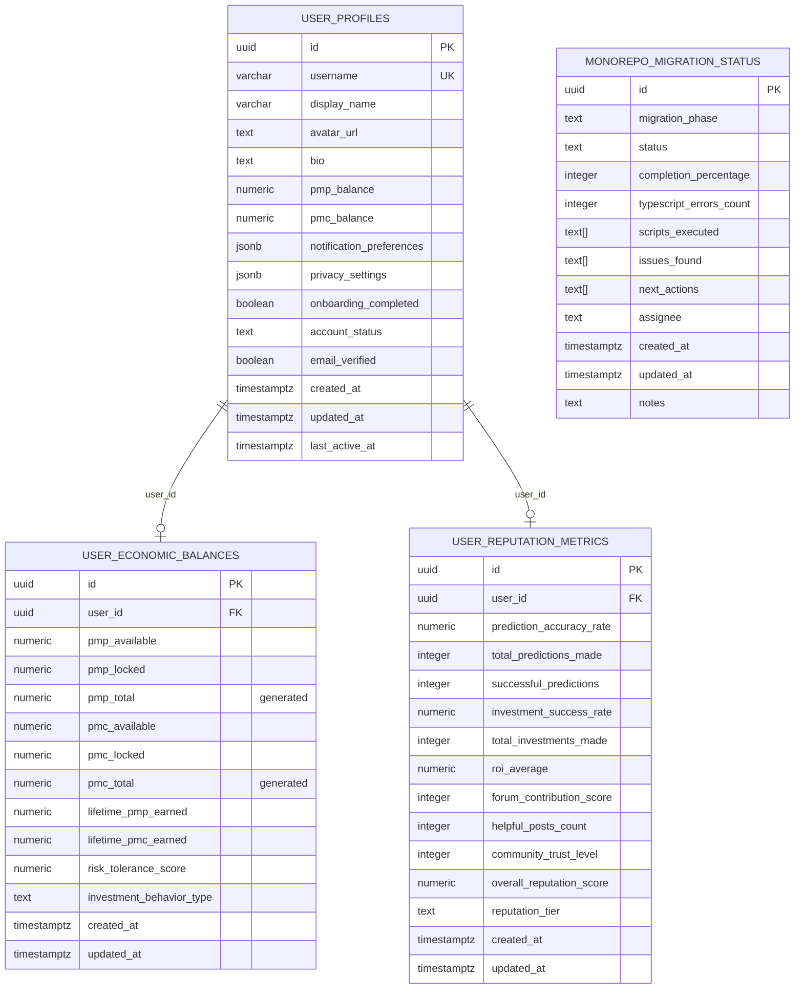
```mermaid
erDiagram
    USER_PROFILES {
        uuid id PK
        varchar username UK
        varchar display_name
        text avatar_url
        text bio
        numeric pmp_balance
        numeric pmc_balance
        jsonb notification_preferences
        jsonb privacy_settings
        boolean onboarding_completed
        text account_status
        boolean email_verified
        timestamptz created_at
        timestamptz updated_at
        timestamptz last_active_at
    }

    USER_ECONOMIC_BALANCES {
        uuid id PK
        uuid user_id FK
        numeric pmp_available
        numeric pmp_locked
        numeric pmp_total "generated"
        numeric pmc_available
        numeric pmc_locked
        numeric pmc_total "generated"
        numeric lifetime_pmp_earned
        numeric lifetime_pmc_earned
        numeric risk_tolerance_score
        text investment_behavior_type
        timestamptz created_at
        timestamptz updated_at
    }

    USER_REPUTATION_METRICS {
        uuid id PK
        uuid user_id FK
        numeric prediction_accuracy_rate
        integer total_predictions_made
        integer successful_predictions
        numeric investment_success_rate
        integer total_investments_made
        numeric roi_average
        integer forum_contribution_score
        integer helpful_posts_count
        integer community_trust_level
        numeric overall_reputation_score
        text reputation_tier
        timestamptz created_at
        timestamptz updated_at
    }

    MONOREPO_MIGRATION_STATUS {
        uuid id PK
        text migration_phase
        text status
        integer completion_percentage
        integer typescript_errors_count
        text[] scripts_executed
        text[] issues_found
        text[] next_actions
        text assignee
        timestamptz created_at
        timestamptz updated_at
        text notes
    }

    USER_PROFILES ||--o| USER_ECONOMIC_BALANCES : "user_id"
    USER_PROFILES ||--o| USER_REPUTATION_METRICS : "user_id"
```

### 3.2 Study-Cycle 관련 데이터 매핑

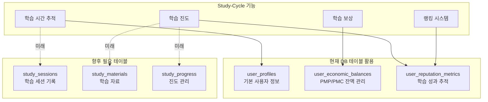
```mermaid
graph TD
    subgraph "Study-Cycle 기능"
        StudyTime[학습 시간 추적]
        StudyReward[학습 보상]
        StudyProgress[학습 진도]
        StudyRanking[랭킹 시스템]
    end

    subgraph "현재 DB 테이블 활용"
        UserProfiles[user_profiles<br/>기본 사용자 정보]
        EconomicBalances[user_economic_balances<br/>PMP/PMC 잔액 관리]
        ReputationMetrics[user_reputation_metrics<br/>학습 성과 추적]
    end

    subgraph "향후 필요 테이블"
        StudySessions[study_sessions<br/>학습 세션 기록]
        StudyMaterials[study_materials<br/>학습 자료]
        StudyProgress_Table[study_progress<br/>진도 관리]
    end

    StudyTime --> UserProfiles
    StudyReward --> EconomicBalances
    StudyProgress --> ReputationMetrics
    StudyRanking --> ReputationMetrics

    StudyTime -.->|미래| StudySessions
    StudyProgress -.->|미래| StudyMaterials
    StudyProgress -.->|미래| StudyProgress_Table

```

### 3.3 데이터베이스 제약 조건 및 보안

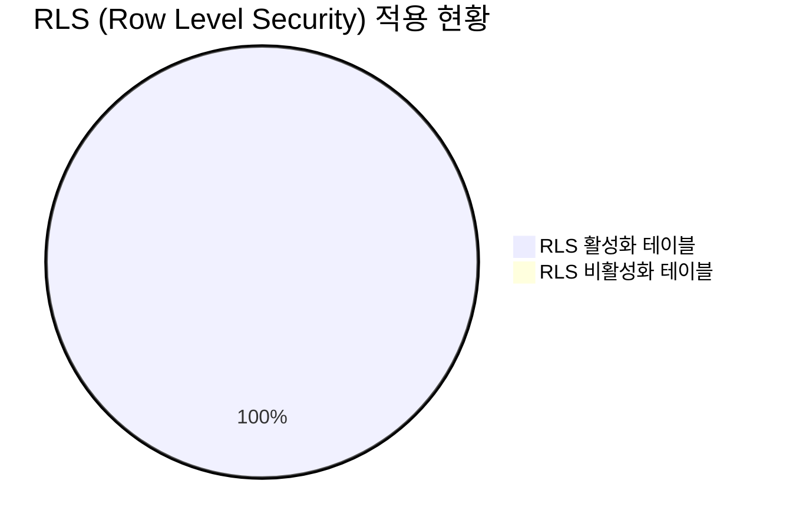
```mermaid
pie title RLS (Row Level Security) 적용 현황
    "RLS 활성화 테이블" : 100
    "RLS 비활성화 테이블" : 0
```

**보안 정책 현황:**

- ✅ **Row Level Security**: 모든 테이블에 RLS 활성화
- ✅ **사용자 기반 접근 제어**: `auth.uid()` 기반 정책
- ✅ **데이터 무결성**: CHECK 제약 조건으로 데이터 품질 보장
- ✅ **인덱스 최적화**: 조회 성능을 위한 적절한 인덱스 설정

---

## 4. Auth-Economy SDK 통합 현황

### 4.1 SDK 의존성 및 통합 수준

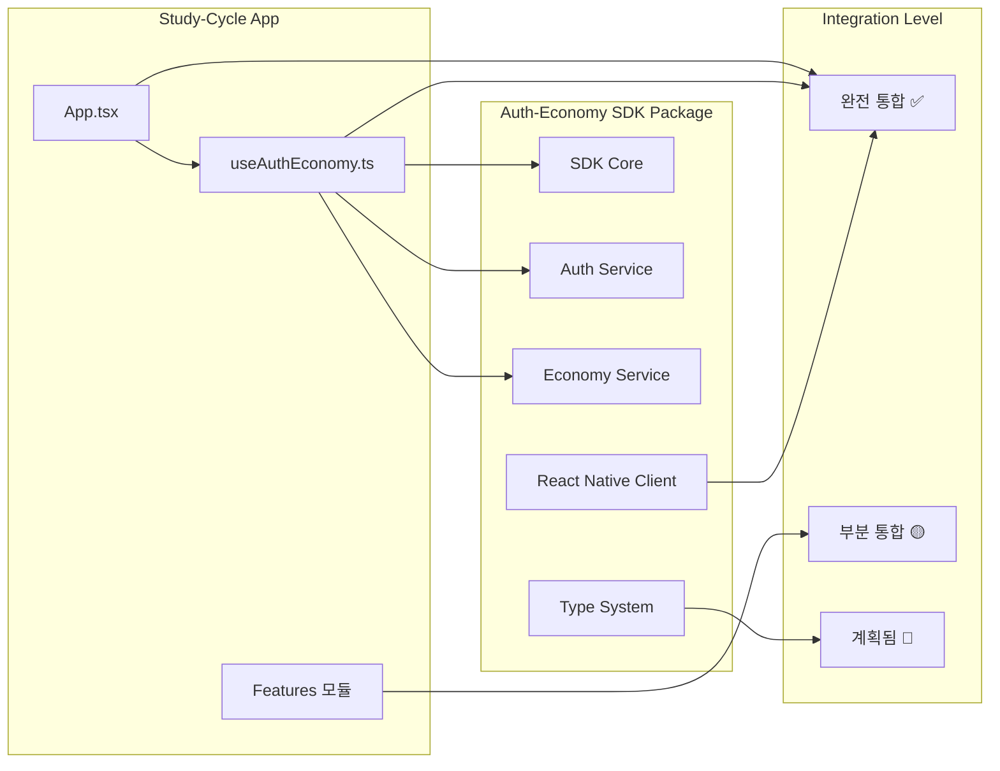
```mermaid
flowchart LR
    subgraph "Study-Cycle App"
        App[App.tsx]
        Hook[useAuthEconomy.ts]
        Features[Features 모듈]
    end

    subgraph "Auth-Economy SDK Package"
        SDKCore[SDK Core]
        AuthService[Auth Service]
        EconomyService[Economy Service]
        TypeSystem[Type System]
        ReactNativeClient[React Native Client]
    end

    subgraph "Integration Level"
        FullIntegration[완전 통합 ✅]
        PartialIntegration[부분 통합 🟡]
        PlannedIntegration[계획됨 🔴]
    end

    App --> Hook
    Hook --> SDKCore
    Hook --> AuthService
    Hook --> EconomyService

    App --> FullIntegration
    Hook --> FullIntegration
    Features --> PartialIntegration
    TypeSystem --> PlannedIntegration
    ReactNativeClient --> FullIntegration

```

### 4.2 SDK 활용 메트릭스

| SDK 기능           | 활용도 | 구현 상태 | 비고                      |
| ------------------ | ------ | --------- | ------------------------- |
| **사용자 인증**    | 100%   | ✅ 완료   | signIn, signUp, signOut   |
| **PMP 잔액 조회**  | 100%   | ✅ 완료   | getPmpAmountBalance       |
| **PMC 잔액 조회**  | 100%   | ✅ 완료   | getPmcAmountBalance       |
| **학습 보상 지급** | 70%    | 🟡 부분   | completeStudySession 구현 |
| **타입 시스템**    | 80%    | 🟡 부분   | 브랜드 타입 활용          |
| **에러 핸들링**    | 60%    | 🟡 부분   | Result 패턴 일부 적용     |
| **오프라인 대응**  | 30%    | 🔴 계획   | React Native 특화 기능    |

---

## 5. 기능별 구현 상태 매트릭스

### 5.1 핵심 기능 구현 현황

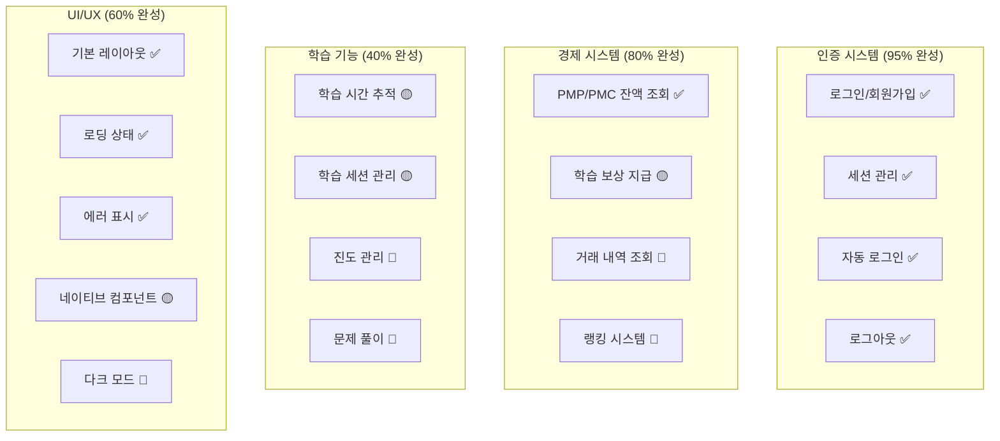
```mermaid
graph TB
    subgraph "인증 시스템 (95% 완성)"
        Auth1[로그인/회원가입 ✅]
        Auth2[세션 관리 ✅]
        Auth3[자동 로그인 ✅]
        Auth4[로그아웃 ✅]
    end

    subgraph "경제 시스템 (80% 완성)"
        Econ1[PMP/PMC 잔액 조회 ✅]
        Econ2[학습 보상 지급 🟡]
        Econ3[거래 내역 조회 🔴]
        Econ4[랭킹 시스템 🔴]
    end

    subgraph "학습 기능 (40% 완성)"
        Study1[학습 시간 추적 🟡]
        Study2[학습 세션 관리 🟡]
        Study3[진도 관리 🔴]
        Study4[문제 풀이 🔴]
    end

    subgraph "UI/UX (60% 완성)"
        UI1[기본 레이아웃 ✅]
        UI2[로딩 상태 ✅]
        UI3[에러 표시 ✅]
        UI4[네이티브 컴포넌트 🟡]
        UI5[다크 모드 🔴]
    end

```

### 5.2 기능별 우선순위 매트릭스

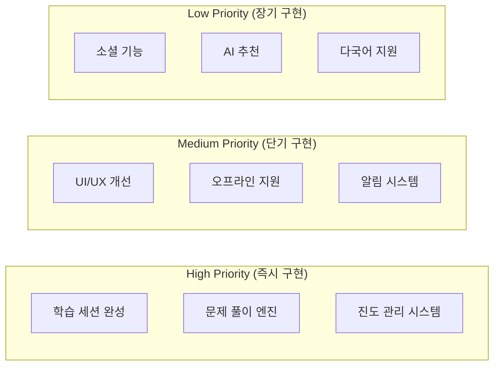
```mermaid
graph LR
    subgraph "High Priority (즉시 구현)"
        HP1[학습 세션 완성]
        HP2[문제 풀이 엔진]
        HP3[진도 관리 시스템]
    end

    subgraph "Medium Priority (단기 구현)"
        MP1[UI/UX 개선]
        MP2[오프라인 지원]
        MP3[알림 시스템]
    end

    subgraph "Low Priority (장기 구현)"
        LP1[소셜 기능]
        LP2[AI 추천]
        LP3[다국어 지원]
    end

```

---

## 6. 개발 환경 및 도구 현황

### 6.1 React Native 환경 설정

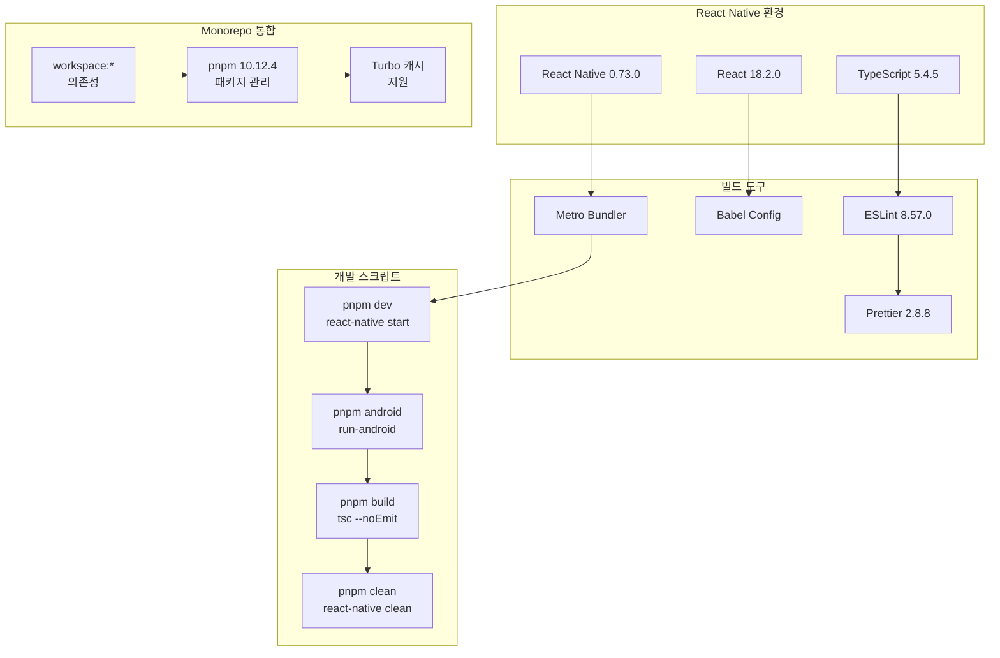
```mermaid
graph TD
    subgraph "React Native 환경"
        RN[React Native 0.73.0]
        React[React 18.2.0]
        TS[TypeScript 5.4.5]
    end

    subgraph "빌드 도구"
        Metro[Metro Bundler]
        Babel[Babel Config]
        ESLint[ESLint 8.57.0]
        Prettier[Prettier 2.8.8]
    end

    subgraph "개발 스크립트"
        Dev[pnpm dev<br/>react-native start]
        Android[pnpm android<br/>run-android]
        Build[pnpm build<br/>tsc --noEmit]
        Clean[pnpm clean<br/>react-native clean]
    end

    subgraph "Monorepo 통합"
        Workspace[workspace:*<br/>의존성]
        Turbo[Turbo 캐시<br/>지원]
        PNPM[pnpm 10.12.4<br/>패키지 관리]
    end

    RN --> Metro
    React --> Babel
    TS --> ESLint
    ESLint --> Prettier

    Metro --> Dev
    Dev --> Android
    Android --> Build
    Build --> Clean

    Workspace --> PNPM
    PNPM --> Turbo

```

### 6.2 패키지 의존성 분석

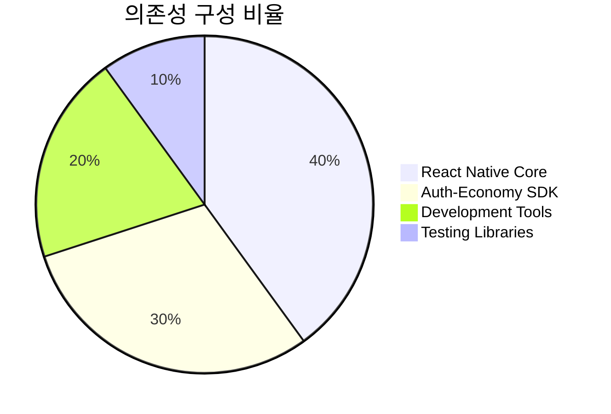
```mermaid
pie title 의존성 구성 비율
    "React Native Core" : 40
    "Auth-Economy SDK" : 30
    "Development Tools" : 20
    "Testing Libraries" : 10
```

**핵심 의존성:**

- ✅ **@posmul/auth-economy-sdk**: `workspace:*` (완전 통합)
- ✅ **react-native**: `^0.73.0` (최신 안정 버전)
- ✅ **typescript**: `^5.4.5` (타입 안전성)
- ✅ **@testing-library/react-native**: `^13.2.0` (테스트 준비)

---

## 7. 품질 및 테스트 현황

### 7.1 코드 품질 메트릭스

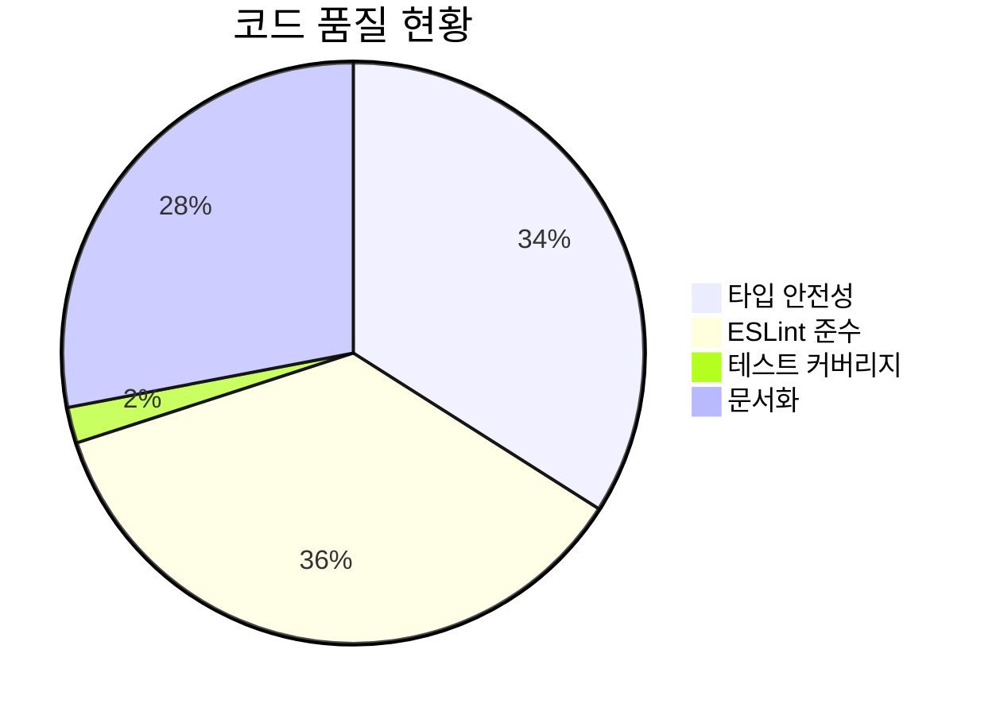
```mermaid
pie title 코드 품질 현황
    "타입 안전성" : 85
    "ESLint 준수" : 90
    "테스트 커버리지" : 5
    "문서화" : 70
```

| 품질 지표             | 현재 상태 | 목표 | 개선 필요사항            |
| --------------------- | --------- | ---- | ------------------------ |
| **TypeScript 적용률** | 95%       | 100% | config, types 폴더 완성  |
| **ESLint 에러**       | 0개       | 0개  | ✅ 준수                  |
| **테스트 커버리지**   | 0%        | 80%  | 🔴 테스트 코드 작성 필요 |
| **함수 문서화**       | 60%       | 90%  | JSDoc 주석 추가          |
| **컴포넌트 분리**     | 70%       | 90%  | UI 컴포넌트 모듈화       |

### 7.2 테스트 전략 현황

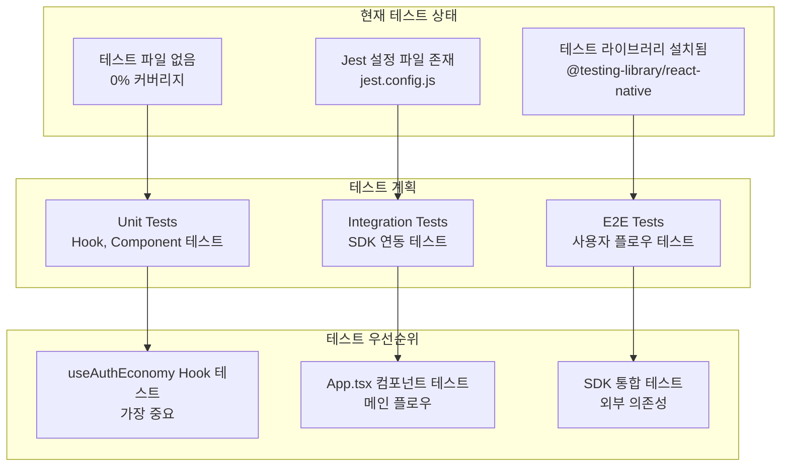
```mermaid
flowchart TD
    subgraph "현재 테스트 상태"
        NoTests[테스트 파일 없음<br/>0% 커버리지]
        TestConfig[Jest 설정 파일 존재<br/>jest.config.js]
        TestLibs[테스트 라이브러리 설치됨<br/>@testing-library/react-native]
    end

    subgraph "테스트 계획"
        UnitTests[Unit Tests<br/>Hook, Component 테스트]
        IntegrationTests[Integration Tests<br/>SDK 연동 테스트]
        E2ETests[E2E Tests<br/>사용자 플로우 테스트]
    end

    subgraph "테스트 우선순위"
        Priority1[useAuthEconomy Hook 테스트<br/>가장 중요]
        Priority2[App.tsx 컴포넌트 테스트<br/>메인 플로우]
        Priority3[SDK 통합 테스트<br/>외부 의존성]
    end

    NoTests --> UnitTests
    TestConfig --> IntegrationTests
    TestLibs --> E2ETests

    UnitTests --> Priority1
    IntegrationTests --> Priority2
    E2ETests --> Priority3

```

---

## 📊 종합 결론 및 개발 우선순위

### 현재 상태 요약

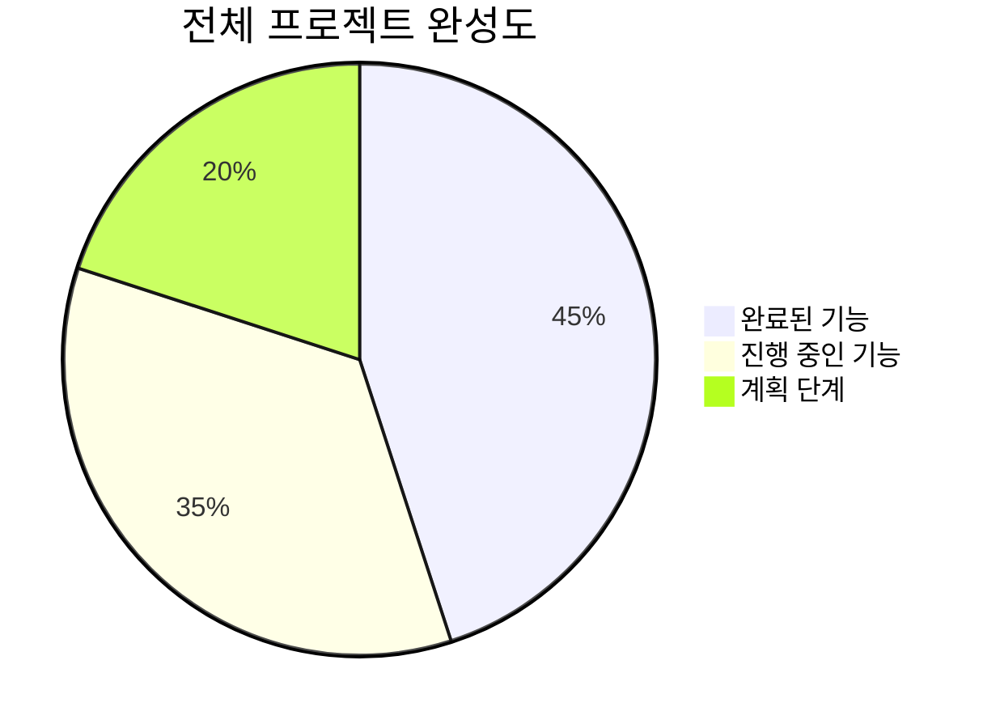
```mermaid
pie title 전체 프로젝트 완성도
    "완료된 기능" : 45
    "진행 중인 기능" : 35
    "계획 단계" : 20
```

**🎯 주요 성과:**

- ✅ **Auth-Economy SDK 완전 통합**: 인증 및 경제 시스템 연동 완료
- ✅ **React Native 기반 구조**: 모바일 네이티브 앱 기반 마련
- ✅ **Monorepo 통합**: 효율적인 개발 환경 구축
- ✅ **타입 안전성**: TypeScript 기반 안전한 개발

**⚠️ 개선 필요 영역:**

1. **테스트 커버리지 0%**: 즉시 테스트 코드 작성 필요
2. **핵심 학습 기능 부족**: 문제 풀이, 진도 관리 시스템 구현 필요
3. **UI/UX 완성도 부족**: React Native 네이티브 컴포넌트 활용 필요
4. **오프라인 지원 없음**: 모바일 앱 필수 기능 구현 필요

### 즉시 실행 권장사항

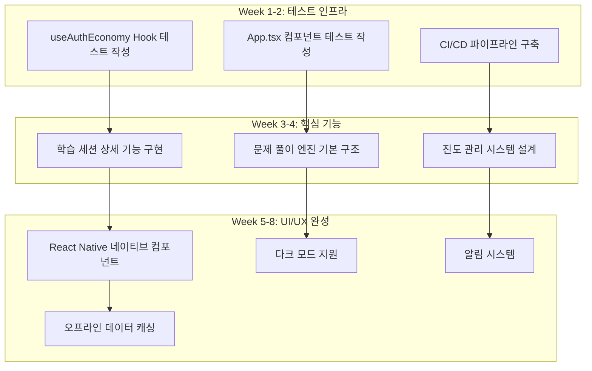
```mermaid
graph TD
    subgraph "Week 1-2: 테스트 인프라"
        T1[useAuthEconomy Hook 테스트 작성]
        T2[App.tsx 컴포넌트 테스트 작성]
        T3[CI/CD 파이프라인 구축]
    end

    subgraph "Week 3-4: 핵심 기능"
        F1[학습 세션 상세 기능 구현]
        F2[문제 풀이 엔진 기본 구조]
        F3[진도 관리 시스템 설계]
    end

    subgraph "Week 5-8: UI/UX 완성"
        U1[React Native 네이티브 컴포넌트]
        U2[다크 모드 지원]
        U3[알림 시스템]
        U4[오프라인 데이터 캐싱]
    end

    T1 --> F1
    T2 --> F2
    T3 --> F3
    F1 --> U1
    F2 --> U2
    F3 --> U3
    U1 --> U4

```

Study-Cycle 프로젝트는 **견고한 기반**이 마련되어 있어, 체계적인 개발 계획 실행을 통해 단기간 내 완성도 높은 학습 앱으로 발전할 수 있는 잠재력을 보유하고 있습니다.

---

_본 보고서는 2025년 7월 8일 현재 코드베이스 및 데이터베이스 상태를 기준으로 작성되었습니다._
