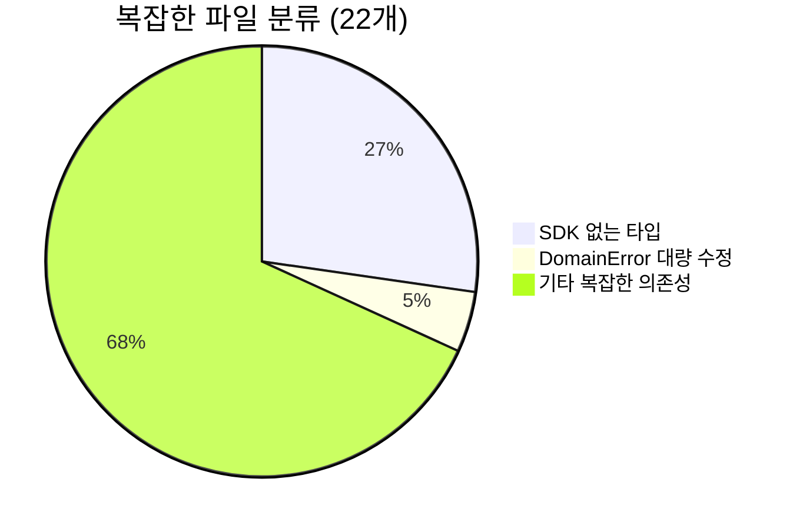
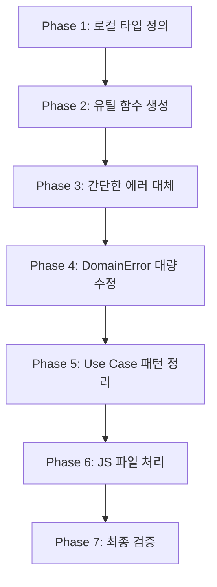

# 복잡한 파일 마이그레이션 전략서

> **작성일**: 2025-07-07  
> **담당자**: AI Agent (현임)  
> **목적**: 남은 22개 복잡한 파일들의 체계적 마이그레이션

## 🎯 현황 분석

### 📊 복잡도별 분류



## 🔧 패턴별 해결 전략

### 1. SDK에 없는 타입들

#### A. Timestamps 인터페이스 (3개 파일)
**영향 파일**:
- `prediction-game.aggregate.ts`
- `prediction.entity.ts`
- `supabase-prediction-game.repository.ts`

**해결 방안**:
```typescript
// 각 Bounded Context에 로컬 타입 정의
interface Timestamps {
  createdAt: Date;
  updatedAt: Date;
}
```

#### B. createPredictionId / createPredictionGameId (2개 파일)
**영향 파일**:
- `prediction.entity.ts`
- `prediction-game.aggregate.ts`

**해결 방안**:
```typescript
// 로컬 유틸 함수로 대체
const createPredictionId = (value: string): PredictionId => 
  value as PredictionId;
const createPredictionGameId = (value: string): PredictionGameId => 
  value as PredictionGameId;
```

#### C. ExternalServiceError (1개 파일)
**영향 파일**:
- `supabase-user.repository.ts`

**해결 방안**:
```typescript
// SDK의 적절한 에러로 대체
import { InfrastructureError } from "@posmul/auth-economy-sdk";
// 또는 로컬 에러 클래스 생성
```

### 2. DomainError 생성자 차이

#### money-wave3.aggregate.ts (27개+ 수정 필요)
**문제점**:
- 기존: `new DomainError("CODE", "message")`
- SDK: `new DomainError("message", { code: "CODE" })`

**해결 방안**:
1. 정규식을 이용한 일괄 변환 스크립트 작성
2. 수동으로 하나씩 신중하게 변경
3. 변경 후 각 메서드별 단위 테스트 실행

### 3. 기타 복잡한 의존성

#### Use Case 파일들
- Result 패턴 차이 처리
- isFailure 타입 가드 적용

#### Repository 파일들
- 인프라 관련 에러 타입 정리
- SDK 호환 에러로 대체

#### 컴파일된 JS 파일들
- TypeScript 소스 파일 마이그레이션 후 재컴파일
- 또는 JS 파일 직접 수정

## 📋 실행 순서



## 🚀 다음 단계

1. **즉시 실행 가능**: Timestamps, 유틸 함수 로컬 정의
2. **신중한 접근 필요**: DomainError 27개 수정
3. **단계별 진행**: Use Case, Repository 파일들

## ⚠️ 주의사항

- 각 변경 후 `npx tsc --noEmit` 실행
- 빌드 실패 시 즉시 복원
- 복잡한 파일은 하나씩 처리
- 테스트 파일이 있다면 함께 실행 