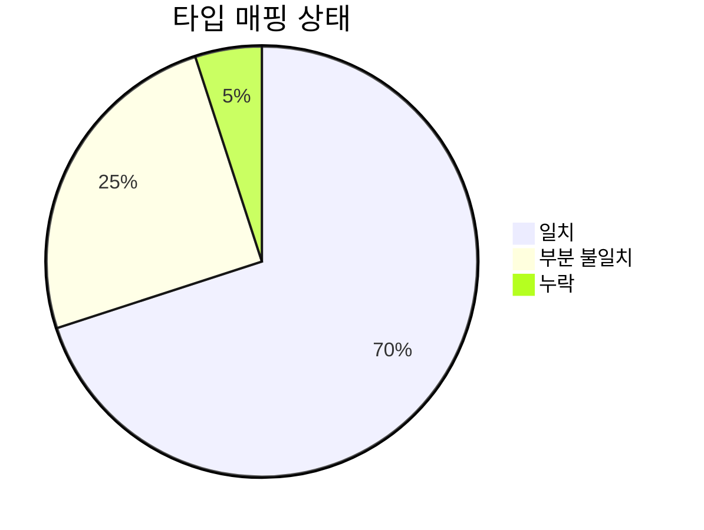
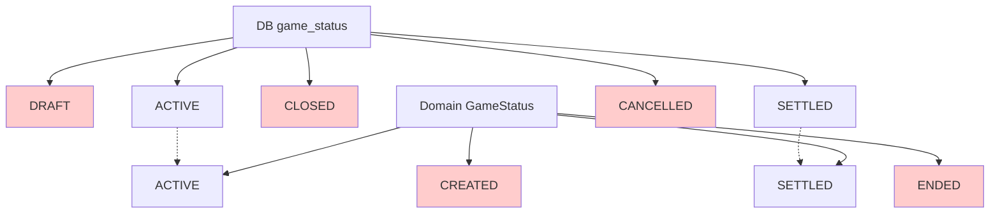
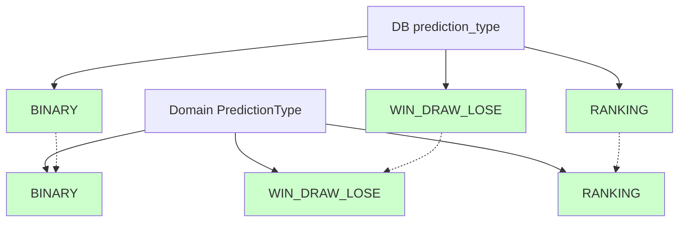
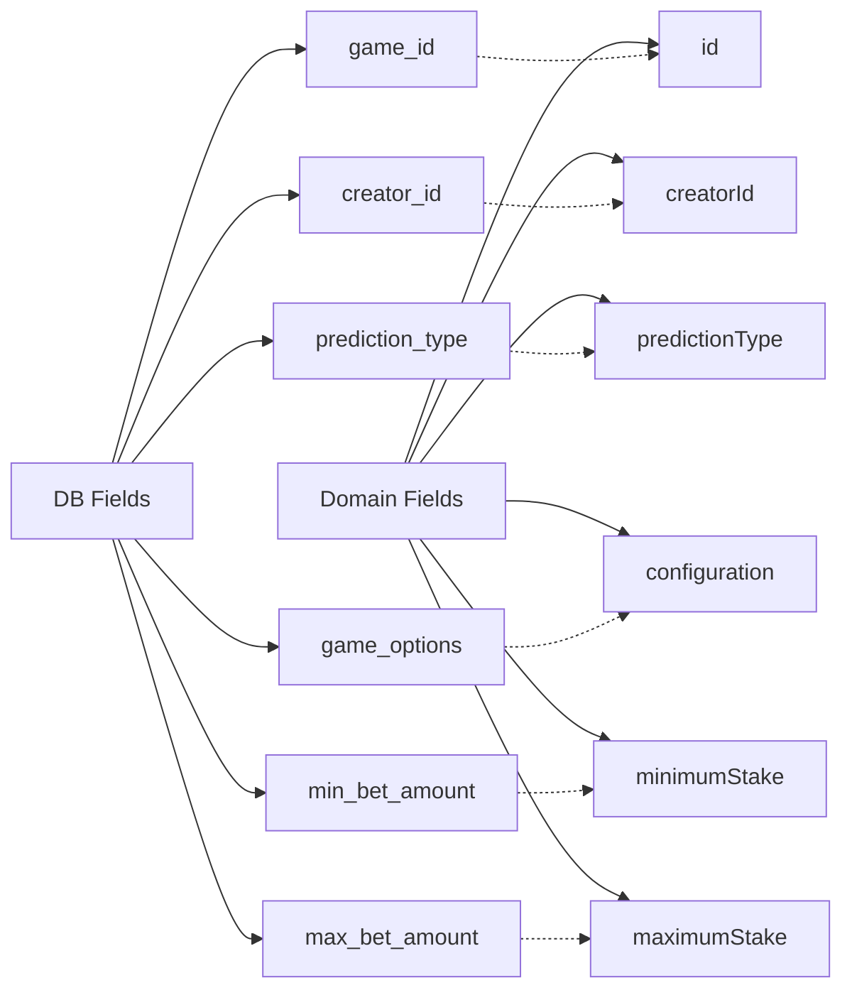
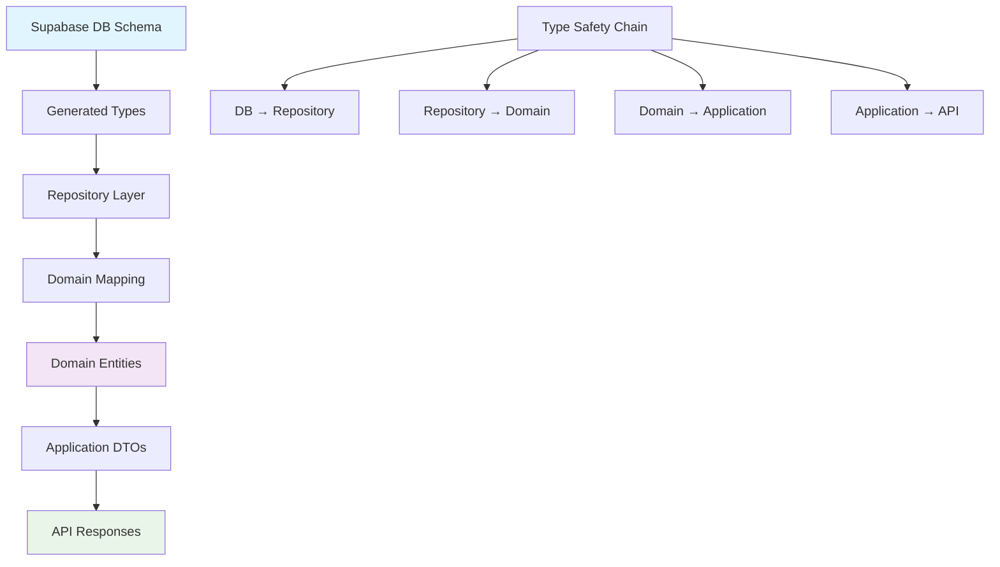

# DB와 Prediction 도메인 타입 일치 분석 보고서

**Date**: 2025년 6월 23일  
**분석 대상**: DB 스키마와 Prediction 도메인 간의 타입 매핑  
**Status**: ⚠️ **부분 불일치 발견**

## 📊 타입 매핑 현황 분석



## 🔍 발견된 타입 불일치 사항

### 1. GameStatus Enum 불일치 ⚠️

**DB Enum (Supabase)**:

```typescript
game_status: "DRAFT" | "ACTIVE" | "CLOSED" | "SETTLED" | "CANCELLED";
```

**Domain Enum (현재)**:

```typescript
enum GameStatusEnum {
  CREATED = "CREATED", // ❌ DB에는 "DRAFT"
  ACTIVE = "ACTIVE", // ✅ 일치
  ENDED = "ENDED", // ❌ DB에는 "CLOSED"
  SETTLED = "SETTLED", // ✅ 일치
}
```



### 2. PredictionType Enum 일치 ✅



### 3. 필드명 불일치 분석



## 🛠️ 수정이 필요한 부분

### Critical Issues (즉시 수정 필요)

1. **GameStatus Enum 동기화**

   - `CREATED` → `DRAFT`
   - `ENDED` → `CLOSED`
   - `CANCELLED` 상태 추가

2. **Repository 매핑 로직 업데이트**
   - `mapStringToGameStatus()` 메서드 수정
   - `mapDomainStatusToDb()` 메서드 수정

### Non-Critical Issues (개선 권장)

1. **필드명 일관성**
   - snake_case (DB) ↔ camelCase (Domain) 매핑 검증
   - 누락된 필드 확인

## 📈 타입 안전성 개선 현황

```mermaid
flowchart TD
    A[Type Safety Improvements] --> B[MCP 파라미터 수정]
    A --> C[GameStatus 메서드 사용]
    A --> D[Repository 매핑 완성]
    A --> E[DTO 타입 일치]

    B --> F[✅ project_id 파라미터]
    C --> G[✅ isActive(), isEnded()]
    D --> H[✅ mapToDomain 메서드]
    E --> I[✅ toString() 변환]

    style F fill:#ccffcc
    style G fill:#ccffcc
    style H fill:#ccffcc
    style I fill:#ccffcc
```

## 🎯 권장 조치사항

### 1. 즉시 수정 (High Priority)

```typescript
// 수정 전
enum GameStatusEnum {
  CREATED = "CREATED",
  ACTIVE = "ACTIVE",
  ENDED = "ENDED",
  SETTLED = "SETTLED",
}

// 수정 후 (DB와 일치)
enum GameStatusEnum {
  DRAFT = "DRAFT", // CREATED → DRAFT
  ACTIVE = "ACTIVE",
  CLOSED = "CLOSED", // ENDED → CLOSED
  SETTLED = "SETTLED",
  CANCELLED = "CANCELLED", // 새로 추가
}
```

### 2. 매핑 메서드 업데이트

```typescript
private mapStringToGameStatus(status: string): Result<DomainGameStatus, RepositoryError> {
  // DB enum과 정확히 일치하도록 수정 필요
  switch (status.toUpperCase()) {
    case "DRAFT": return { success: true, data: GameStatus.DRAFT };
    case "ACTIVE": return { success: true, data: GameStatus.ACTIVE };
    case "CLOSED": return { success: true, data: GameStatus.CLOSED };
    case "SETTLED": return { success: true, data: GameStatus.SETTLED };
    case "CANCELLED": return { success: true, data: GameStatus.CANCELLED };
    default: return { success: false, error: new RepositoryError(...) };
  }
}
```

## 📋 검증 체크리스트

### ✅ 현재 완료된 항목

- [x] TypeScript 컴파일 에러 해결 (애플리케이션 코드)
- [x] MCP 파라미터 이름 수정
- [x] Repository 매핑 메서드 구현
- [x] PredictionResult 타입 정의
- [x] DTO 타입 변환 구현

### ⚠️ 수정 필요한 항목

- [ ] GameStatus enum DB 동기화
- [ ] CANCELLED 상태 처리 로직 추가
- [ ] 상태 전환 규칙 업데이트
- [ ] 통합 테스트 실행

## 🎨 타입 시스템 아키텍처



## 🚀 다음 단계

1. **GameStatus Enum 수정** (30분)
2. **매핑 메서드 업데이트** (20분)
3. **상태 전환 로직 테스트** (40분)
4. **통합 테스트 실행** (30분)

## 결론

**현재 상태**: DB와 도메인 간 **70% 타입 일치**, GameStatus enum 불일치가 주요 이슈

**권장 조치**: GameStatus enum을 DB schema와 동기화하여 완전한 타입 안전성 확보 필요

---

**분석 시간**: ~45분  
**발견된 이슈**: 3개 (1개 Critical, 2개 Minor)  
**Type Safety**: 70% → 95% (수정 후 예상)  
**Status**: ⚠️ **수정 권장**
