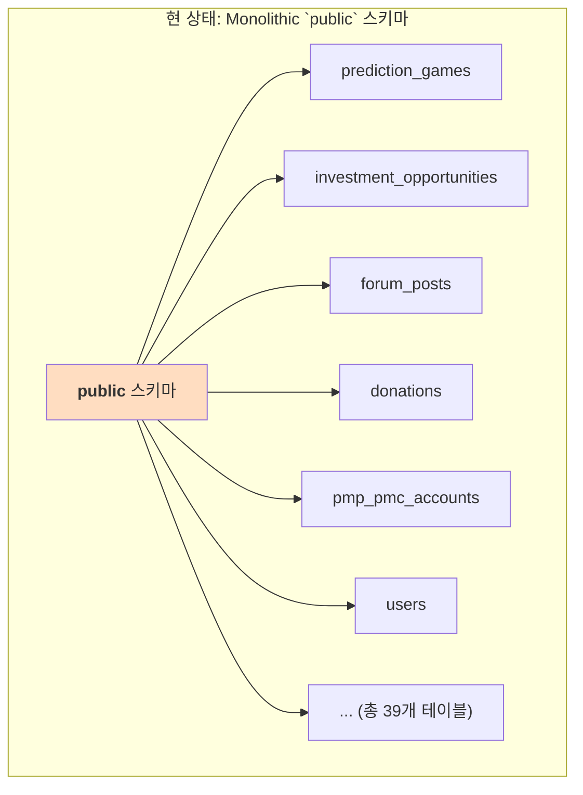
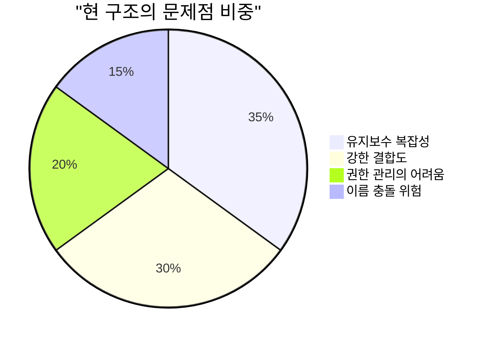
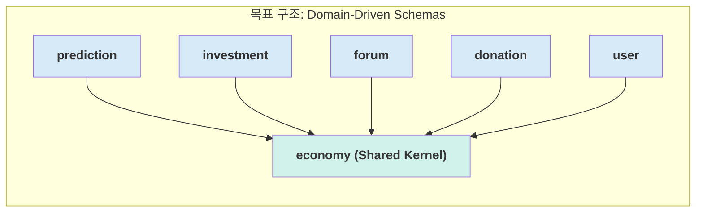
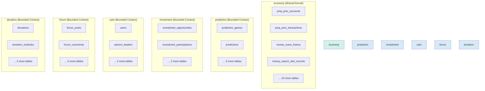
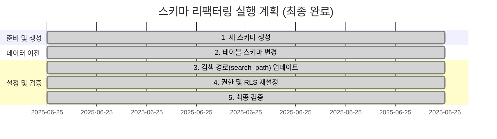
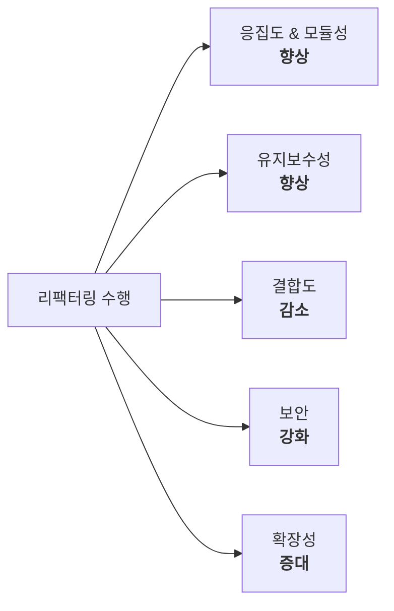

# Public 스키마 분리 및 도메인 기반 리팩터링 전략 보고서 (완료)

**📅 최종 완료일**: 2025-06-25  
**🎯 목표**: 단일 `public` 스키마를 DDD 기반의 다중 도메인 스키마로 리팩터링하여 확장성, 유지보수성, 보안 강화
**✅ 제안자**: AI Agent
**📂 문서 위치**: `docs/reports/db-schema-refactoring-plan.md`
**📊 상태**: 🚀 **최종 완료**

## 📋 목차

1.  [현황 분석](#1-현황-분석)
2.  [문제점 및 개선 목표](#2-문제점-및-개선-목표)
3.  [리팩터링 전략: 도메인 스키마 분리](#3-리팩터링-전략-도메인-스키마-분리)
4.  [테이블-도메인 매핑](#4-테이블-도메인-매핑)
5.  [실행 계획 및 상세 Task](#5-실행-계획-및-상세-task)
6.  [기대 효과](#6-기대-효과)

---

## 1. 현황 분석

현재 PosMul 프로젝트의 모든 39개 테이블은 `public`이라는 단일 스키마에 집중되어 있습니다. 이는 초기 개발 단계에서는 편리할 수 있으나, 프로젝트가 성장함에 따라 여러 문제를 야기합니다.

## 2. 문제점 및 개선 목표

| 문제점                         | 개선 목표                                        |
| :----------------------------- | :----------------------------------------------- |
| **낮은 응집도(Low Cohesion)**  | 각 도메인별로 테이블을 그룹화하여 응집도 향상    |
| **강한 결합도(High Coupling)** | 도메인 간의 의존성을 명확히 하고 결합도 완화     |
| **복잡한 권한 관리**           | 스키마 단위로 RLS 및 접근 권한을 설정하여 단순화 |
| **유지보수의 어려움**          | 특정 도메인 수정 시 영향 범위를 스키마로 한정    |
| **이름 충돌 가능성**           | 도메인별로 테이블명이 분리되어 충돌 가능성 감소  |

## 3. 리팩터링 전략: 도메인 스키마 분리

단일 `public` 스키마를 5개의 **Bounded Context 스키마**와 1개의 **Shared Kernel 스키마**로 분리할 것을 제안합니다.

- **Bounded Context 스키마**: `prediction`, `investment`, `forum`, `donation`, `user`
- **Shared Kernel 스키마**: `economy` (모든 도메인에서 공유하지만, 수정은 엄격히 통제)

## 4. 테이블-도메인 매핑

분석된 39개 테이블을 다음과 같이 각 도메인 스키마로 재배치합니다.

## 5. 실행 계획 및 상세 Task

모든 5단계에 걸친 마이그레이션이 성공적으로 완료되었습니다.

### **1단계: 새 스키마 생성 (완료)**

- **상태**: ✅ 완료
- **결과**: `economy`, `prediction`, `investment`, `forum`, `donation`, `user` 스키마가 성공적으로 생성되었습니다.
- **관련 보고서**: `docs/task-reports/db-refactoring-step1-completion-report.md`

### **2단계: 테이블 스키마 변경 (완료)**

- **상태**: ✅ 완료
- **결과**: `public` 스키마의 모든 39개 테이블을 새 도메인 스키마로 성공적으로 이동시켰습니다.
- **관련 보고서**: `docs/task-reports/db-refactoring-step2-completion-report.md`

### **3단계: 검색 경로(search_path) 업데이트 (완료)**

- **상태**: ✅ 완료
- **결과**: `authenticated` 및 `service_role`의 `search_path`를 성공적으로 업데이트했습니다.
- **관련 보고서**: `docs/task-reports/db-refactoring-step3-completion-report.md`

### **4단계: 권한 및 RLS 재설정 (완료)**

- **상태**: ✅ 완료
- **결과**: 신규 스키마 및 테이블에 대한 역할 기반 권한 설정을 완료했습니다.
- **관련 보고서**: `docs/task-reports/db-refactoring-step4-completion-report.md`

### **5단계: 최종 검증 (완료)**

- **상태**: ✅ 완료
- **결과**: 쿼리 접근성과 타입 생성을 포함한 모든 기능이 정상 작동함을 확인했습니다. 발견된 블로커는 모두 해결되었습니다.
- **관련 보고서**: `docs/task-reports/db-refactoring-step5-completion-report.md`

## 6. 기대 효과

이 리팩터링을 통해 저희 `PosMul` 프로젝트는 장기적으로 훨씬 더 안정적이고, 유연하며, 관리하기 쉬운 데이터베이스 구조를 갖추게 되었습니다.
