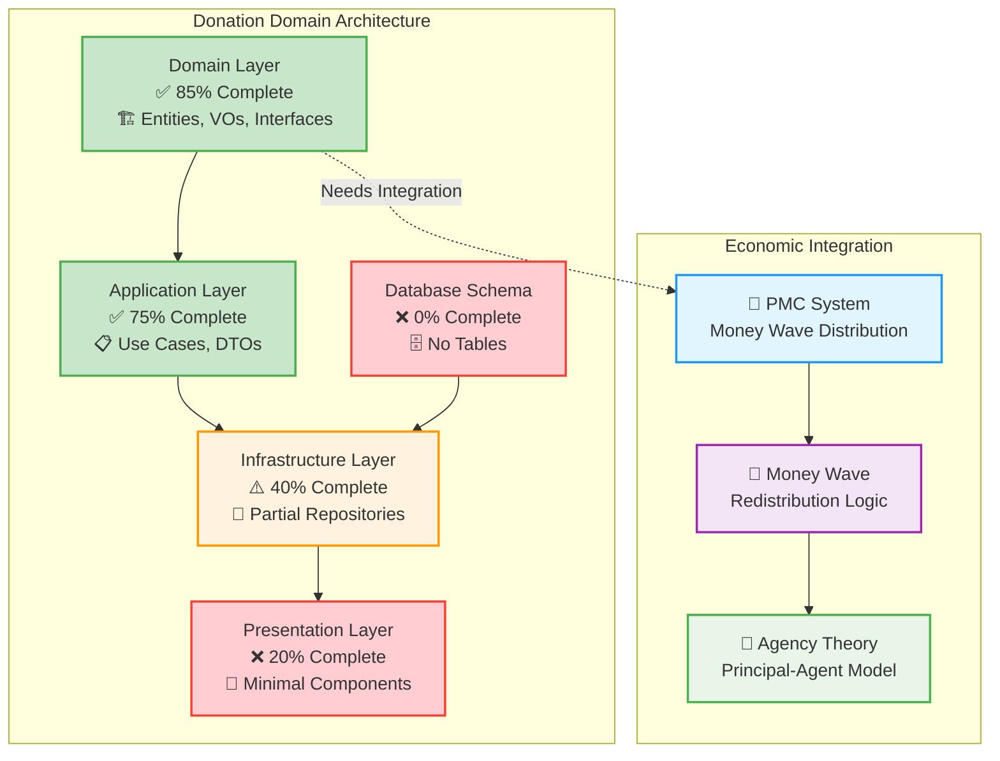
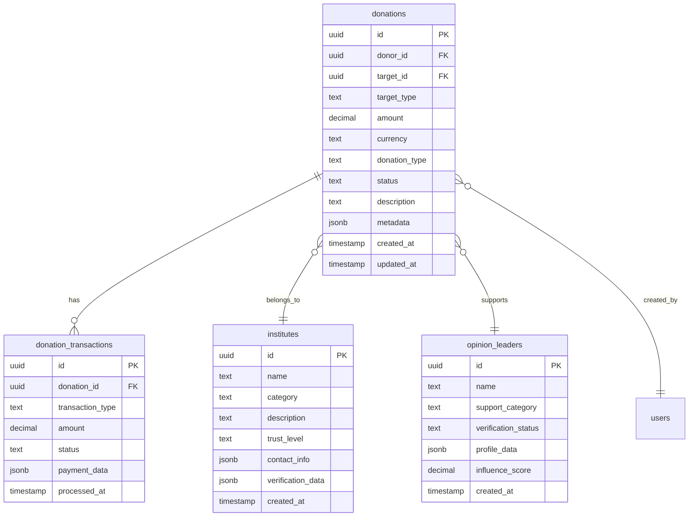
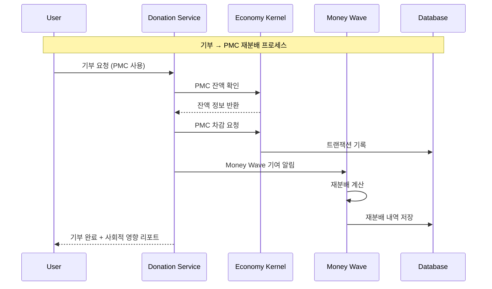
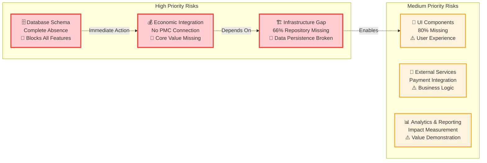

# Donation 도메인 구현 현황 분석 보고서

> **AI 시대 직접민주주의 플랫폼의 사회적 가치 창출 엔진 분석**  
> **Money Wave 시스템을 통한 PMC 재분배 메커니즘 구현 현황**

## 📋 분석 개요

**분석 목적**: Donation 도메인의 현재 구현 상태를 평가하고 향후 개발 계획 수립을 위한 기초 자료 제공

**분석 범위**:

- Domain Layer (엔티티, Value Objects, Repository 인터페이스, Domain Service)
- Application Layer (Use Cases, DTOs, Event Handlers)
- Infrastructure Layer (Repository 구현체, External Services)
- Presentation Layer (UI 컴포넌트, Hooks)
- Database Schema (Supabase 테이블 구조)

**분석 방법**:

- 코드베이스 정적 분석
- Supabase MCP 도구를 통한 DB 현황 조사
- DDD 아키텍처 준수도 평가
- 경제 시스템 통합도 검증

## 🎯 전체 완성도 요약

| 계층                     | 완성도  | 상태    | 주요 특징                                                             |
| ------------------------ | ------- | ------- | --------------------------------------------------------------------- |
| **Domain Layer**         | **85%** | ✅ 우수 | 엔티티, Value Objects, Repository 인터페이스, Domain Service 완성     |
| **Application Layer**    | **75%** | ✅ 양호 | Use Cases, DTOs 완성, Event Handlers 부분 구현                        |
| **Infrastructure Layer** | **40%** | ⚠️ 부족 | Donation Repository만 구현, Institute/OpinionLeader Repository 미구현 |
| **Presentation Layer**   | **20%** | ❌ 미흡 | 기본 컴포넌트 1개만 구현, 나머지 미구현                               |
| **Database Schema**      | **0%**  | ❌ 없음 | 모든 Donation 관련 테이블 부재                                        |

**전체 완성도**: **44%** (5개 계층 평균)

### 📊 구현 현황 시각화



## 🔍 계층별 상세 분석

### 1. Domain Layer (85% 완성) ✅

**완료된 구현:**

#### 핵심 엔티티

- **Donation**: 기부 핵심 로직, 상태 관리, 유효성 검증
- **Institute**: 기관 정보, 신뢰도 관리, 카테고리 분류
- **OpinionLeader**: 오피니언 리더 검증, 지지 카테고리, 영향력 평가

#### Value Objects 구조

```typescript
// 주요 Value Objects
-DonationId,
  DonationAmount,
  DonationDescription - DonationType,
  DonationCategory,
  DonationFrequency,
  DonationStatus - InstituteId,
  InstituteCategory,
  TrustLevel - OpinionLeaderId,
  SupportCategory,
  VerificationStatus - DonorTier,
  DonorRating - BeneficiaryInfo,
  ContactInfo;
```

#### Repository 인터페이스

- `IDonationRepository`: 기부 데이터 영속성 추상화
- `IInstituteRepository`: 기관 데이터 관리 인터페이스
- `IOpinionLeaderRepository`: 오피니언 리더 데이터 인터페이스

#### Domain Service

- **DonationDomainService**: 복잡한 기부 규칙, 검증 로직, 비즈니스 규칙 구현

**미완성 부분:**

- Economic Integration Service (PMC/Money Wave 연동)
- Event Publishing 메커니즘

### 2. Application Layer (75% 완성) ✅

**완료된 구현:**

#### Use Cases

- **CreateDonationUseCase**: 기부 생성 로직, 유효성 검증, 상태 관리

#### DTOs

- **DonationDto**: 완전한 데이터 전송 객체 구조

**미완성 부분:**

- Institute 관련 Use Cases
- OpinionLeader 관련 Use Cases
- Event Handlers (Economic System 연동)
- Batch Processing Use Cases

### 3. Infrastructure Layer (40% 완성) ⚠️

**완료된 구현:**

- **SupabaseDonationRepository**: MCP 기반 Donation 데이터 영속성

**심각한 미완성:**

- SupbaseInstituteRepository: 완전 부재
- SupbaseOpinionLeaderRepository: 완전 부재
- External Service 연동 (결제, 알림, 외부 API)
- Event Publishing Infrastructure

### 4. Presentation Layer (20% 완성) ❌

**완료된 구현:**

- **DonationActivityPanel**: 기본 활동 패널 컴포넌트

**심각한 미완성:**

- DonationForm: 기부 양식 컴포넌트
- DonationList: 기부 목록 컴포넌트
- InstituteSelector: 기관 선택 컴포넌트
- OpinionLeaderCard: 오피니언 리더 카드
- PaymentIntegration: 결제 시스템 연동
- React Hooks: 상태 관리 및 API 연동

### 5. Database Schema (0% 완성) ❌

**Supabase MCP 조사 결과**: Donation 관련 테이블이 **완전히 부재**

**필요한 테이블 구조:**



## 💰 경제 시스템 통합 현황

### Money Wave 시스템 연동 부재

**현재 상태**: Donation 도메인이 경제 시스템과 **완전히 분리**되어 있음

**필요한 통합 요소:**



### 필요한 경제 통합 컴포넌트

1. **DonationEconomicService**: PMC 사용 및 Money Wave 기여
2. **MoneyWaveCalculator**: 기부금 재분배 로직
3. **SocialImpactTracker**: 사회적 영향 측정
4. **EconomicEventHandler**: 경제 시스템 이벤트 처리

## 📈 개발 일정 제안

### 🗓️ 주차별 개발 계획

#### 🔥 **1주차 (긴급)**

- **Database Schema 생성** (2일) - MCP 도구 활용
- **Repository 구현체 완성** (3일) - Institute, OpinionLeader
- **경제 시스템 연동 설계** (2일) - Money Wave 통합

#### ⚡ **2-3주차 (높음)**

- **Repository 완성 및 테스트** (4일)
- **기본 UI 컴포넌트 개발** (5일) - Form, List, Card
- **Event System 구현** (3일) - Economic Integration

#### 🎯 **4-5주차 (중간)**

- **고급 UI 기능 개발** (7일) - Payment, Analytics
- **외부 서비스 연동** (5일) - 결제, 알림
- **성능 최적화** (3일) - 캐싱, 쿼리 최적화

#### 🔮 **6주차+ (낮음)**

- **고급 분석 기능** (7일) - AI 기반 영향 분석
- **모바일 최적화** (5일) - 반응형 디자인
- **다국어 지원** (3일) - i18n 구현

## ⚠️ 위험 요소 및 대응 전략

### 🔴 **Critical Risks**



### 🛡️ **대응 전략**

#### 1단계: 기반 인프라 구축 (1-2주)

- **즉시 실행**: Supabase MCP로 테이블 스키마 생성
- **병렬 진행**: Repository 구현체 개발
- **설계 완료**: Economic Integration 아키텍처

#### 2단계: 핵심 기능 구현 (2-4주)

- **우선순위**: 기본 UI 컴포넌트 개발
- **통합 테스트**: Economic System 연동 검증
- **사용자 테스트**: 핵심 플로우 검증

#### 3단계: 고급 기능 및 최적화 (4-8주)

- **성능 개선**: 쿼리 최적화, 캐싱
- **사용자 경험**: 고급 UI/UX 기능
- **분석 및 리포팅**: 사회적 영향 측정

## 🎯 성공 지표 및 KPI

### 📊 기술적 지표

| 지표                      | 현재 값 | 목표 값 | 측정 방법           |
| ------------------------- | ------- | ------- | ------------------- |
| **Domain Layer 완성도**   | 85%     | 95%     | 코드 커버리지       |
| **Infrastructure 완성도** | 40%     | 90%     | Repository 구현율   |
| **Database Schema**       | 0%      | 100%    | 테이블 생성 완료    |
| **UI Component 완성도**   | 20%     | 80%     | 컴포넌트 개수       |
| **Economic Integration**  | 0%      | 100%    | PMC/Money Wave 연동 |

### 💎 비즈니스 지표

| 지표                  | 현재 값 | 목표 값 | 측정 방법     |
| --------------------- | ------- | ------- | ------------- |
| **기부 처리 시간**    | N/A     | <3초    | 응답 시간     |
| **PMC 재분배 정확도** | N/A     | 99.9%   | 트랜잭션 검증 |
| **사용자 만족도**     | N/A     | >4.5/5  | 사용자 피드백 |
| **사회적 영향 측정**  | N/A     | 실시간  | 대시보드 구현 |

## 📋 즉시 실행 과제

### 🔥 **긴급 (이번 주 내)**

1. **Supabase Schema 생성** - MCP 도구 활용
2. **Institute Repository 구현** - 기관 데이터 관리
3. **OpinionLeader Repository 구현** - 오피니언 리더 관리
4. **Economic Service 설계** - PMC/Money Wave 통합 계획

### ⚡ **높음 (2주 내)**

5. **DonationForm 컴포넌트** - 사용자 기부 인터페이스
6. **PaymentIntegration** - 결제 시스템 연동
7. **Event System 구현** - 도메인 이벤트 처리
8. **Basic Analytics** - 기부 현황 대시보드

### 🎯 **중간 (1개월 내)**

9. **Advanced UI Components** - 고급 사용자 인터페이스
10. **Social Impact Tracker** - 사회적 영향 측정
11. **Mobile Optimization** - 모바일 반응형 디자인
12. **Performance Optimization** - 성능 최적화

## 💡 권장사항

### 🚀 **즉시 시작해야 할 작업**

1. **Database Schema 우선 구현**: 모든 기능의 기반
2. **Economic Integration 설계**: 핵심 가치 제안 구현
3. **Repository Pattern 완성**: 데이터 계층 안정화

### 📈 **장기적 개선 방향**

1. **AI 기반 영향 분석**: 기부 효과 예측 및 측정
2. **블록체인 통합**: 투명성 및 신뢰성 강화
3. **글로벌 확장**: 다국가 기부 시스템 지원

### 🔧 **기술적 개선 사항**

1. **마이크로서비스 아키텍처**: 확장성 개선
2. **실시간 알림 시스템**: 사용자 경험 향상
3. **고급 보안 기능**: 데이터 보호 강화

---

**결론**: Donation 도메인은 **탄탄한 Domain Layer 설계**를 바탕으로 하고 있으나, **Database Schema 부재**와 **Economic System 분리**가 가장 큰 걸림돌입니다. 즉시 인프라 구축에 집중하고, 경제 시스템 통합을 통해 PosMul 플랫폼의 핵심 가치인 **사회적 영향 창출**을 실현해야 합니다.
