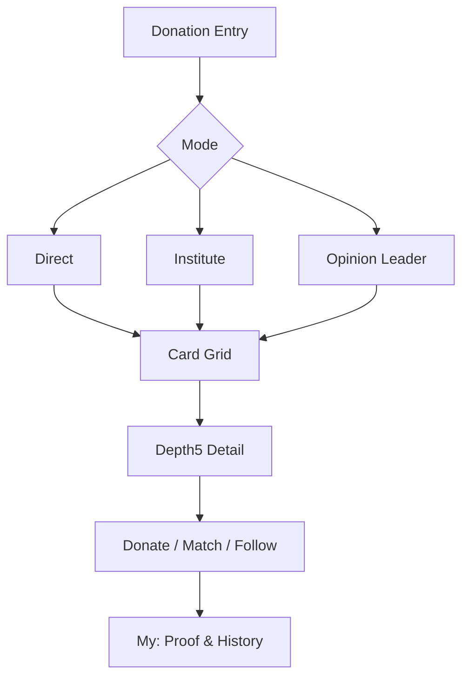
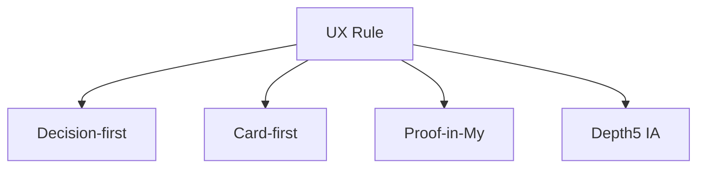
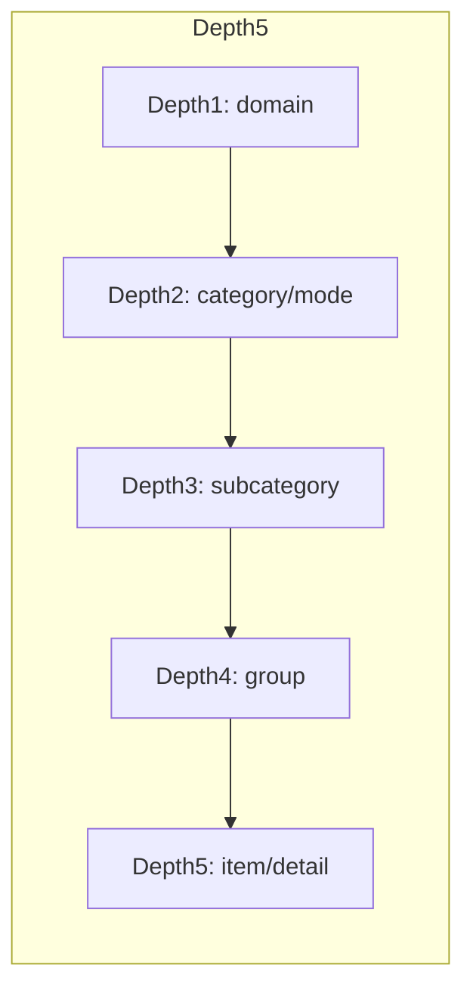
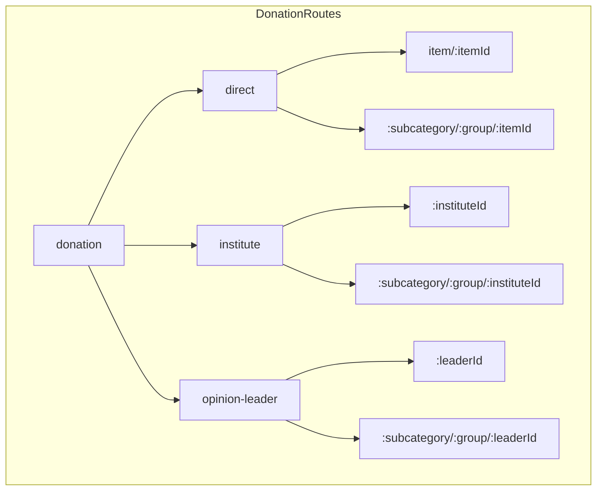
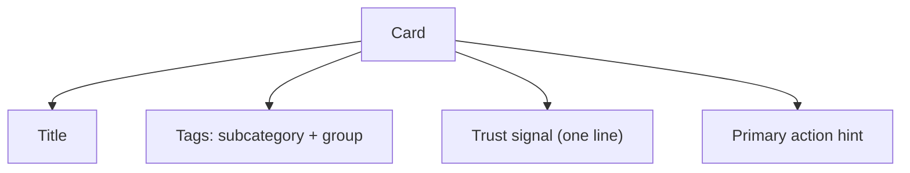
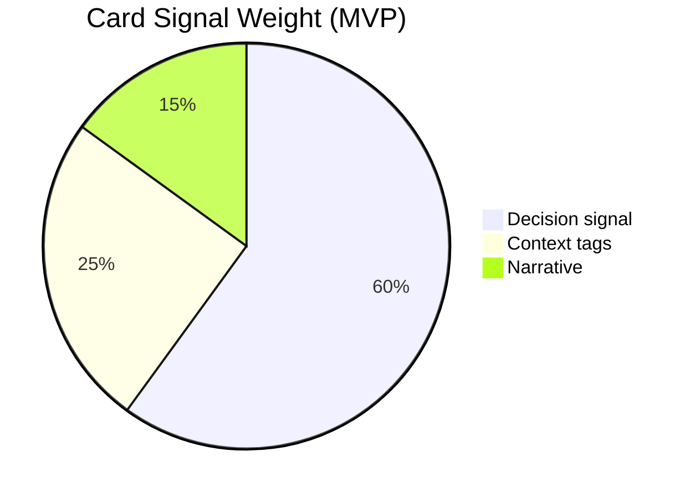
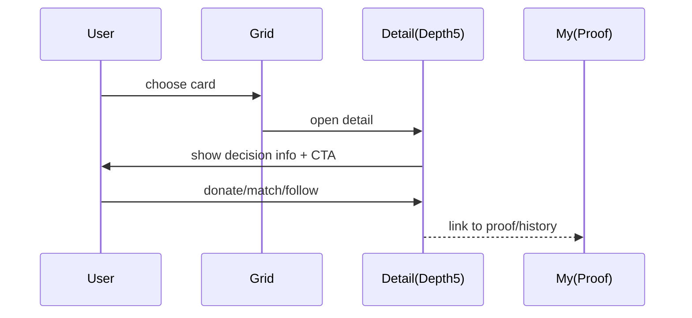
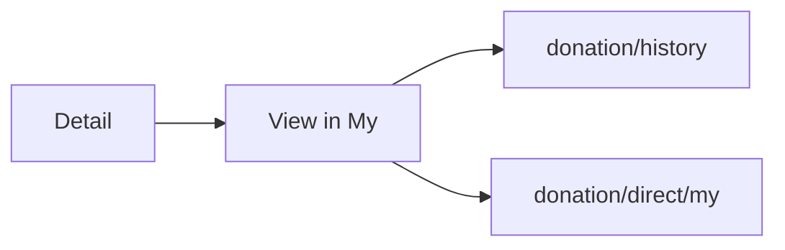
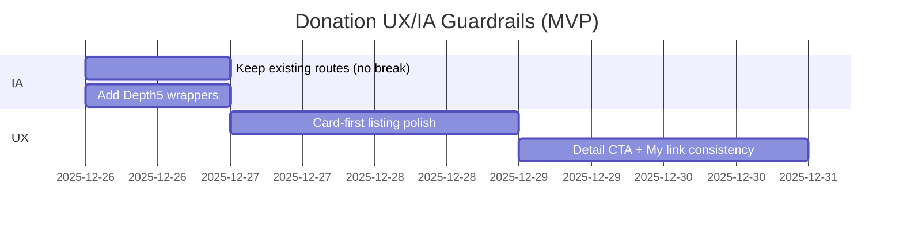

# Donation 도메인 UX/IA 기획 보고서 (PosMul)

> 작성일: 2025-12-26 (업데이트)
>
> 핵심 목표: Donation은 “투명성 컨텐츠를 길게 보여주는 곳”이 아니라,
> 1) **Prediction과 동일한 Depth5 정보구조(IA)**
> 2) **카드형 의사결정 공간(재미 + 빠른 선택)**
> 3) **투명성/증빙은 My(내 정보)에서 확인**
> 을 고정 규칙으로 삼아, 후임자도 흔들리지 않게 개발할 수 있는 기준을 문서로 남긴다.

---

## 0) 한 줄 요약 (Executive Summary)

- Donation의 메인 UX는 “설명/증빙 열람”이 아니라 **카드로 선택(Decision-first)** 이다.
- Depth5는 “URL 깊이”가 아니라 **의사결정 맥락(모드→주제→그룹→개별카드)** 을 담는 구조다.
- 증빙/영수증/내역은 Donation 상세에 과적재하지 않고, **My에서 표준화된 증빙 뷰**로 제공한다.

---

## 1) 기준(Non-negotiables)

### 1.1 UX 기준

- **카드가 1차 정보**: 리스트/그리드에서 “결정에 필요한 최소 신호”만 준다.
- **상세는 결정 보조**: 상세는 “설명서”가 아니라 “결정 확신 + 다음 행동(CTA)”에 집중한다.
- **투명성은 My로 분리**: 상세는 링크만 제공하고, 증빙/내역/영수증/다운로드는 My에서 일관되게 보여준다.

### 1.2 IA 기준: Donation도 Prediction과 동일한 Depth5

Prediction의 실제 기준(예):
- `prediction/sports/[subcategory]/[league]/[slug]`

Donation도 동일한 패턴을 따른다(예):
- `donation/direct/[subcategory]/[group]/[itemId]`
- `donation/institute/[subcategory]/[group]/[instituteId]`
- `donation/opinion-leader/[subcategory]/[group]/[leaderId]`

---

## 2) 현재 구현 상태(코드 기준)와 Depth5 매핑

> “이미 있는 라우트”는 유지하면서, Depth5 표준 라우트를 추가로 제공해 점진적으로 전환한다.

### 2.1 이미 존재하던 상세 라우트(깊이 부족)

- Direct Item: `/donation/direct/item/[itemId]` (Depth4)
- Institute: `/donation/institute/[instituteId]` (Depth3)
- Opinion Leader: `/donation/opinion-leader/[leaderId]` (Depth3)

### 2.2 새로 추가한 Depth5 표준 라우트(화면 재사용 래퍼)

- Direct Item (Depth5): `/donation/direct/[subcategory]/[group]/[itemId]`
- Institute (Depth5): `/donation/institute/[subcategory]/[group]/[instituteId]`
- Opinion Leader (Depth5): `/donation/opinion-leader/[subcategory]/[group]/[leaderId]`

---

## 3) 카드형 의사결정 공간 설계(모드 공통)

### 3.1 카드에 “반드시” 들어갈 것(결정 신호)

- **Title**: 무엇에 기부하는가
- **Context Tags**: subcategory / group (Depth3/Depth4)
- **Trust Signal (1줄)**: 인증/검증/투명성 요약 중 하나(과다 금지)
- **Action Hint**: Donate/Match/Follow 중 다음 행동을 암시

### 3.2 모드별 카드 포커스(텍스트가 아니라 ‘신호’)

- Direct: **긴급도/지역/상태(available/reserved/...)**
- Institute: **신뢰 점수/인증/최근 보고서 존재 여부**
- Opinion Leader: **팔로워/검증/추천 기관 수(또는 대표 추천 1개)**

---

## 4) Depth5 상세 페이지 템플릿(결정 보조)

상세 페이지의 역할은 “다 읽게 하기”가 아니라,
1) 카드에서 부족했던 정보를 **짧게 보강**하고
2) **한 번의 CTA**로 행동을 완료시키며
3) 증빙은 My로 보내는 것이다.

권장 구성(공통):
- 상단: Title + 핵심 태그(subcategory/group) + 1줄 Trust
- 중단: 사진/요약/핵심 수치
- 하단: CTA(1개) + “내 정보에서 확인” 링크

---

## 5) 투명성은 My에서: 표준화된 증빙/내역 허브

Donation 메인/상세에서 투명성 블록을 과하게 키우면 “선택이 느려진다”.
따라서 증빙은 My에 모으고, 상세에서는 **일관된 링크**만 제공한다.

현재 존재하는 후보 경로(코드 기준):
- `/donation/history`
- `/donation/direct/my`

My에서 제공해야 할 것(MVP 체크리스트):
- 기부 내역(일시/금액/대상/상태)
- 증빙 링크(가능 범위)
- 다운로드/영수증(가능 범위)
- 상태 변화 타임라인(가능 범위)

---

## 6) 실행 체크포인트(후임자용)

성공 기준(정성/정량 혼합):
- Donation 3모드 모두 “그리드→상세→CTA→My” 흐름이 끊기지 않는다.
- Depth5 URL로도 동일한 상세 화면이 열린다(라우트 표준화).
- 투명성/증빙은 My에서만 ‘깊게’ 보여준다.

---

## 부록 A) 참고 링크

- Donation 도메인 개요: [../domain_architecture_overview.md](../domain_architecture_overview.md)
- Economy/PMC 구조: [../init/economic_system_architecture.md](../init/economic_system_architecture.md)
- Donation 구현/작업 목록: [../tasks/prediction-donation-integration-tasks.md](../tasks/prediction-donation-integration-tasks.md)

## 부록 B) 참고한 외부 패턴(요약)

- charity:water: “donation tracking + proof”를 핵심 가치로 전면화
- DonorsChoose: 프로젝트 단위로 긴급성/지역성/매칭, 그리고 재무 투명성 메시지 강화
- GiveDirectly: 전달비율(예: 80%+) 같은 **원칙 수치**를 명확히 제시
- Open Collective: 예산과 거래를 공개하는 “full transparency” 자체가 제품
