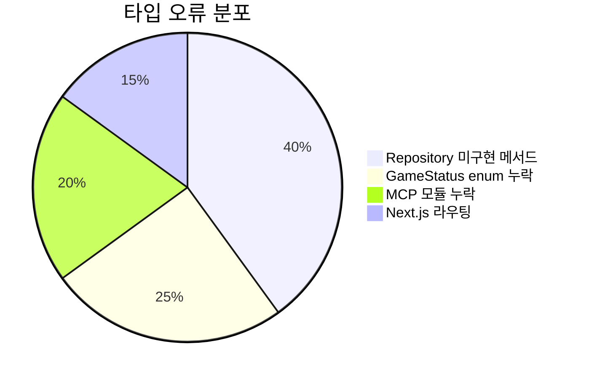
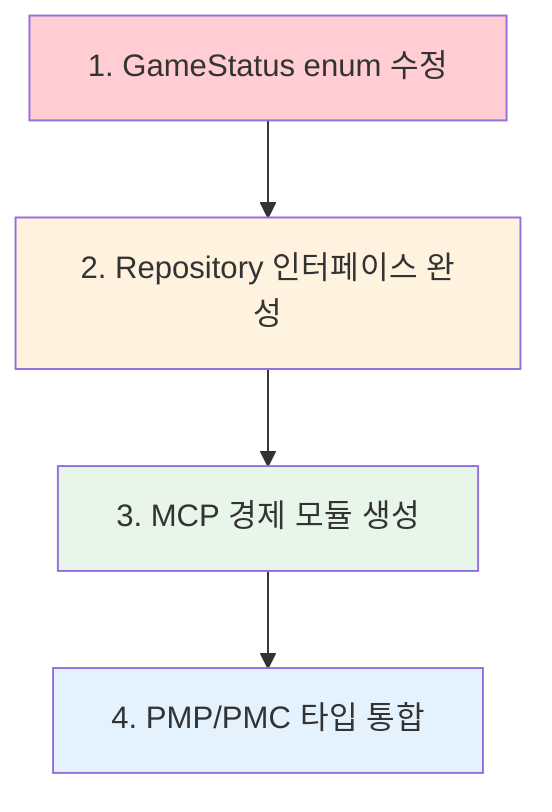
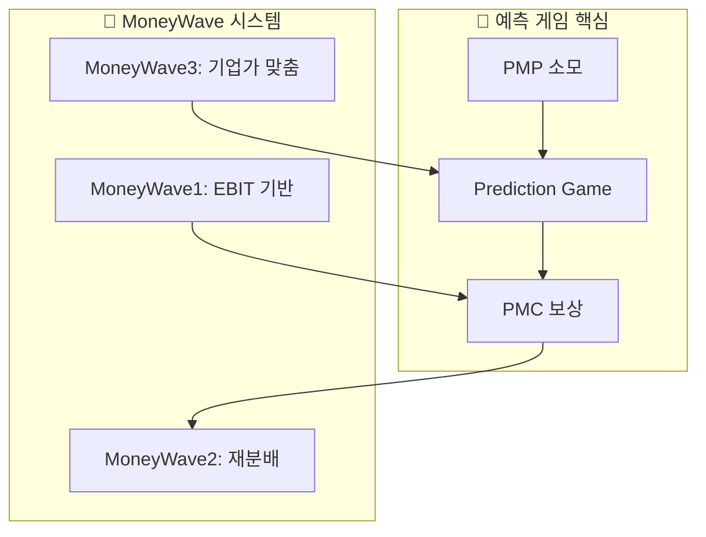
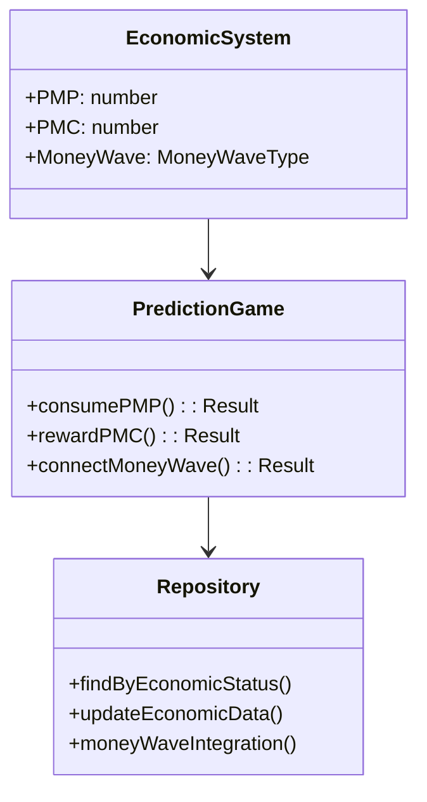
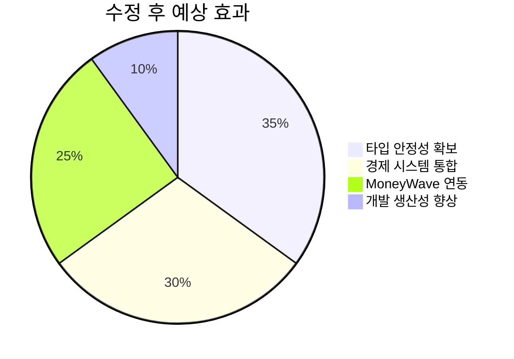

# PosMul 경제 시스템 통합 수정 보고서

## 📊 현재 오류 현황 분석

## 🎯 PosMul 경제 시스템 연관 우선순위

## 🔮 예측 게임 MoneyWave 연동 구조

## 📈 경제 통합 타입 구조

## 🔧 수정 계획

### 1단계: GameStatus enum 통합

- shared에서 제거된 GameStatus 참조 수정
- prediction domain의 GameStatus로 통일

### 2단계: Repository 경제 연동 메서드 추가

- MoneyWave 연동 메서드 구현
- PMP/PMC 잔액 확인 메서드 추가
- 경제 시스템 업데이트 메서드 구현

### 3단계: MCP 경제 모듈 생성

- `@/shared/mcp/mcp-errors` 생성
- `@/shared/mcp/supabase-client` 생성
- 경제 시스템 MCP 통합 구현

## 🎯 예상 효과

---

_생성 시간: ${new Date().toISOString()}_
_프로젝트: PosMul Platform Economic Integration_
