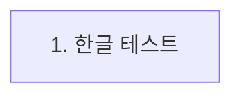
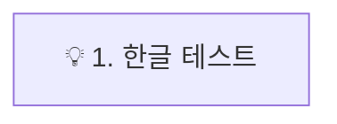
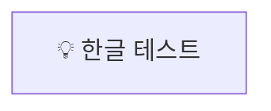
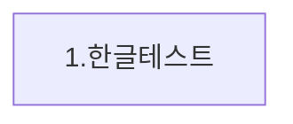
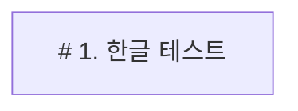
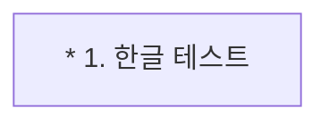
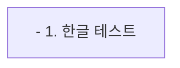
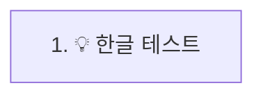
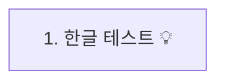

# Mermaid 구문 조합별 렌더링 테스트

이 문서는 다양한 구문 조합의 렌더링 결과를 직접 확인하고, 안정적인 패턴을 확립하기 위해 작성되었습니다. 각 섹션의 Mermaid 코드가 어떻게 렌더링되는지 확인해주십시오.

---

## 테스트 1: 따옴표를 사용한 조합

### Case 1-1: 숫자 + 점 + 한글



### Case 1-2: 이모지 + 숫자 + 점 + 한글



### Case 1-3: 이모지 + 한글



---

## 테스트 2: 따옴표를 사용하지 않은 조합

### Case 2-1: 숫자 + 점 + 한글 (공백 포함)


### Case 2-2: 숫자 + 점 + 한글 (공백 없음)



### Case 2-3: 이모지 + 숫자 + 점 + 한글


### Case 2-4: 이모지 + 한글


---

## 가설 확장 및 추가 테스트

이전 테스트 결과를 통해 새로운 가설이 수립되었습니다. 이 가설을 검증하기 위해 추가 테스트를 진행합니다.

### 🎯 새로운 가설: Emoji가 Parser의 동작을 바꾼다

이전 테스트 결과를 통해 수립된 **"Emoji가 특정 파싱 오류를 방지한다"** 는 핵심 가설과, 따옴표 및 공백 사용에 따른 분기점을 종합하여 아래와 같이 상세 흐름도로 시각화하고 검증합니다.

```mermaid
graph TD
    Start("Mermaid 패턴 분석") --> C1{"따옴표를 사용하는가?"};
    
    C1 -- "Yes" --> Q_QUOTED;
    C1 -- "No" --> Q_UNQUOTED;
    
    subgraph "따옴표 사용 패턴 `\"...\"`"
        Q_QUOTED["`\"...\"`"] --> C2{"`숫자. 공백` 패턴 포함?"};
        C2 -- "아니오" --> S1["✅ 성공 (일반 텍스트)"];
        C2 -- "예" --> C3{"💡 Emoji 접두사 존재?"};
        C3 -- "예" --> S2["✅ 성공 (💡 1. 텍스트)"];
        C3 -- "아니오" --> F1["❌ 실패 (1. 텍스트)"];
    end
    
    subgraph "따옴표 미사용 패턴 `...`"
        Q_UNQUOTED["`...`"] --> C4{"텍스트 내 공백 포함?"};
        C4 -- "아니오" --> S3["✅ 성공 (1.텍스트)"];
        C4 -- "예" --> F2["❌ 실패 (1. 텍스트)"];
    end

    subgraph "최종 결론"
        FinalConclusion("💡 Emoji는 '숫자. 공백' 패턴의<br>파싱 오류를 막는 특효약이다")
        style FinalConclusion fill:#e3f2fd,stroke:#0d47a1
    end

    S2 --> FinalConclusion;
    F1 --> FinalConclusion;

    style S1 fill:#c8e6c9,stroke:#2e7d32
    style S2 fill:#c8e6c9,stroke:#2e7d32
    style S3 fill:#c8e6c9,stroke:#2e7d32
    style F1 fill:#ffcdd2,stroke:#c62828
    style F2 fill:#ffcdd2,stroke:#c62828
end
```

### 추가 검증 테스트

위 가설이 맞는지, 그리고 다른 특수문자도 동일한 효과를 내는지 확인하기 위한 추가 테스트 케이스입니다.

#### 테스트 3: 특수문자 접두사 테스트 (따옴표 사용)

##### Case 3-1: 특수문자(#) + 숫자 + 점 + 한글


##### Case 3-2: 특수문자(*) + 숫자 + 점 + 한글


##### Case 3-3: 특수문자(-) + 숫자 + 점 + 한글


#### 테스트 4: 이모지 위치 테스트

##### Case 4-1: 숫자 + 점 + 이모지 + 한글


##### Case 4-2: 숫자 + 점 + 한글 + 이모지


---

