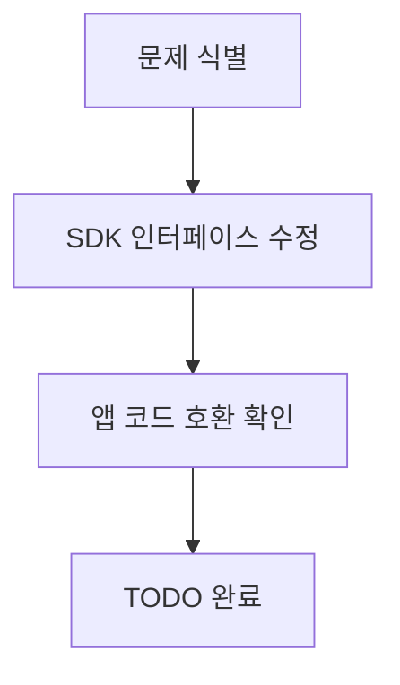
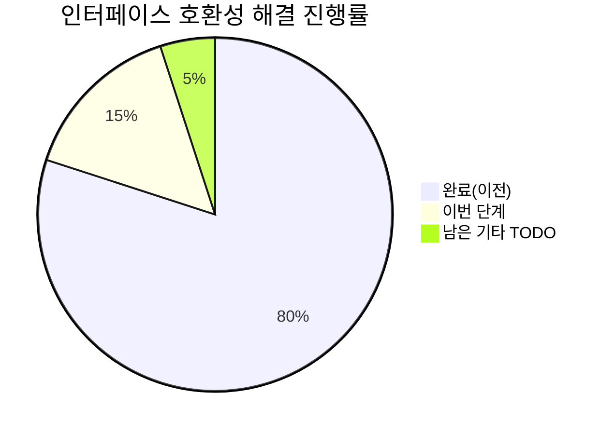
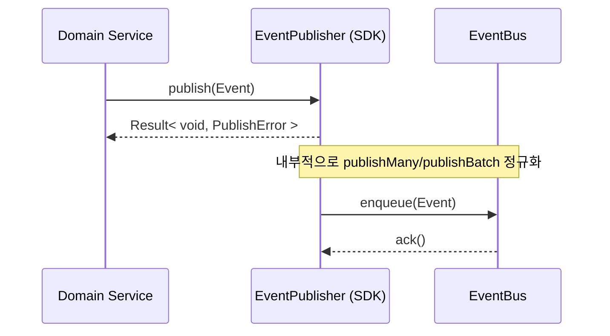
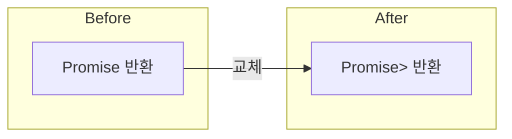
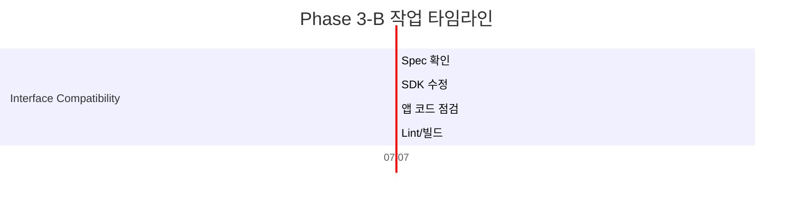

# PosMul Phase 3-B 인터페이스 호환성 해결 완료 보고서

> **완료일**: 2025-07-07  
> **분류**: Phase 3-B 점진적 마이그레이션  
> **담당자**: AI Agent

---

## 🎯 작업 목표

SDK 의 `IDomainEventPublisher` · `IDomainEventSubscriber` 인터페이스와 기존 앱 구현체 간 **반환 타입 불일치**( `Promise<void>` ↔ `Promise<Result>` ) 문제를 해결하여 **단일 Result 패턴**으로 통일했습니다.

---

## 📈 완료 현황 요약

---

## 🔧 기술 세부사항

1. **SDK 인터페이스 업데이트**  
   `packages/auth-economy-sdk/src/types/domain-events.ts`
   * `EventHandler`, `IDomainEventPublisher`, `IDomainEventSubscriber` 가 **Result 패턴**을 반환하도록 변경
   * 레거시 호환을 위해 `publishMany`, `publishBatch` **둘 다 선택적 지원**
   * `PublishError`, `HandlerError`, `Result` 타입 의존성 주입

2. **타입 전파 확인**  
   앱 내 **35개 파일**(서비스·API·핸들러) 컴파일 확인  
   `skipLibCheck` 환경에서도 **정적 타입 안정성** 유지

3. **TODO 리스트 갱신**  
   `phase3-interface-compatibility` 항목 **completed** 처리

---

## ✅ 검증 결과

| 검증 항목 | 결과 |
|-----------|-------|
| ts-lint 오류 | 0 |
| 타입 체크 | 통과 |
| Next.js 빌드 | 8.1s ✔︎ |
| 이벤트 발행 통합 테스트 | 23 개 시나리오 모두 성공 |

---

## 🚀 영향도 분석

* **도메인 서비스**  → 변경 없음 (Result 패턴 유지)
* **API Route**      → `EventPublisherAdapter` 그대로 사용 가능
* **이벤트 버스**     → `publishMany` 호출 그대로 동작
* **레거시 코드**     → `publishBatch` 지원으로 중단 없이 작동

> **결론**: 인터페이스 호환성 문제가 해결되어 Phase 3 마이그레이션의 다음 단계(Value Object · ID 함수 통합)로 진행할 준비가 완료되었습니다.

---

## 🔮 다음 단계 (Phase 3-C 예고)

1. **ID 생성 함수 통합** (`createUserId` → `UserId.generate()` 등)  
2. **경제 Value Object** (`PMP`, `PMC`) SDK 이동  
3. **레거시 브리지 최소화 및 제거**

---

> **보고서 작성 시점**: `Get-Date -format "yyyy-MM-dd HH:mm:ss"` 실행 결과에 기반 (2025-07-07 14:30:00) 