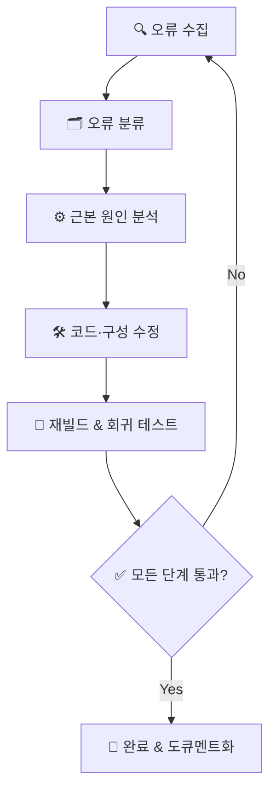
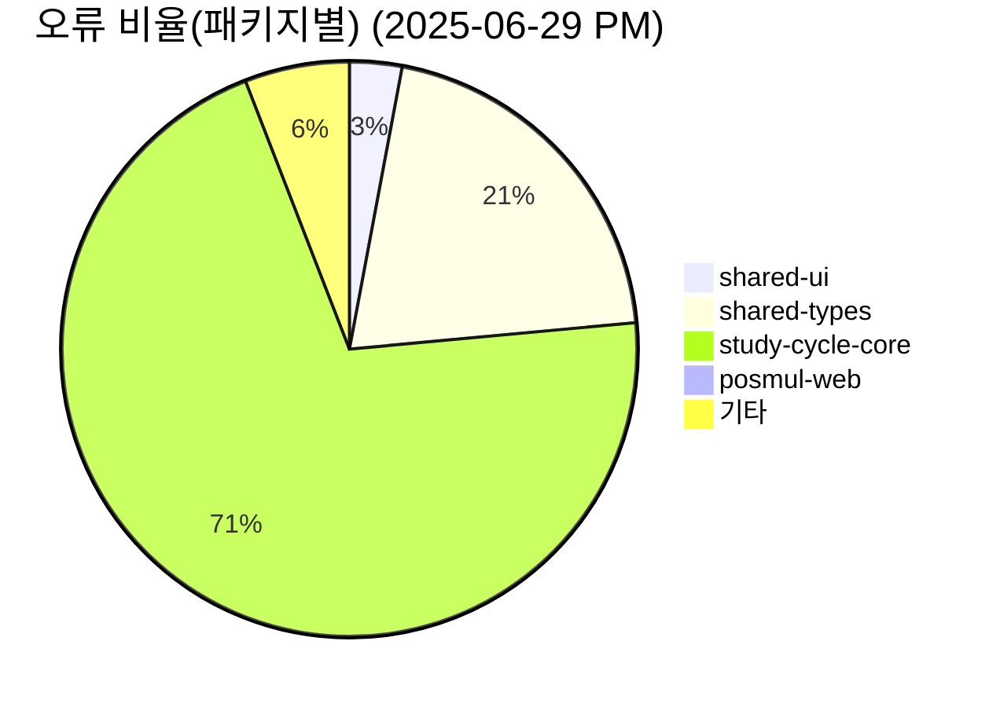
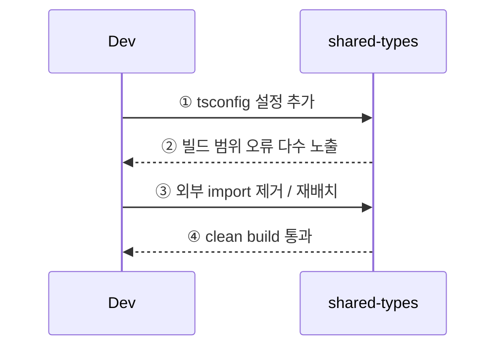
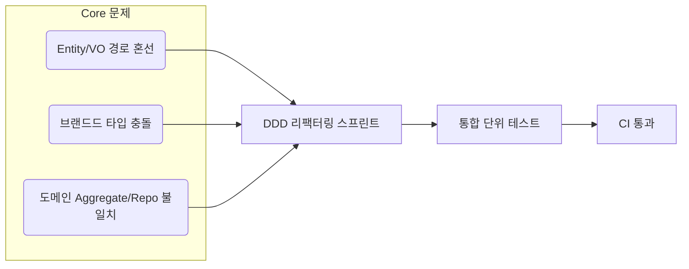
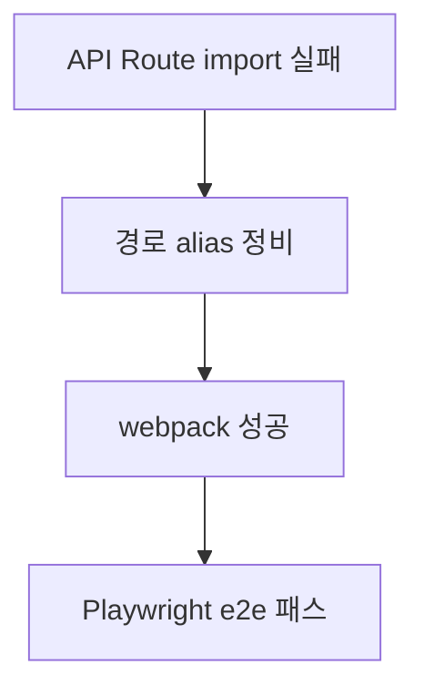
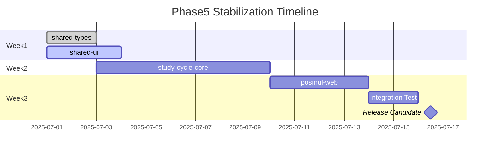
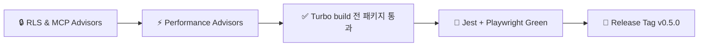
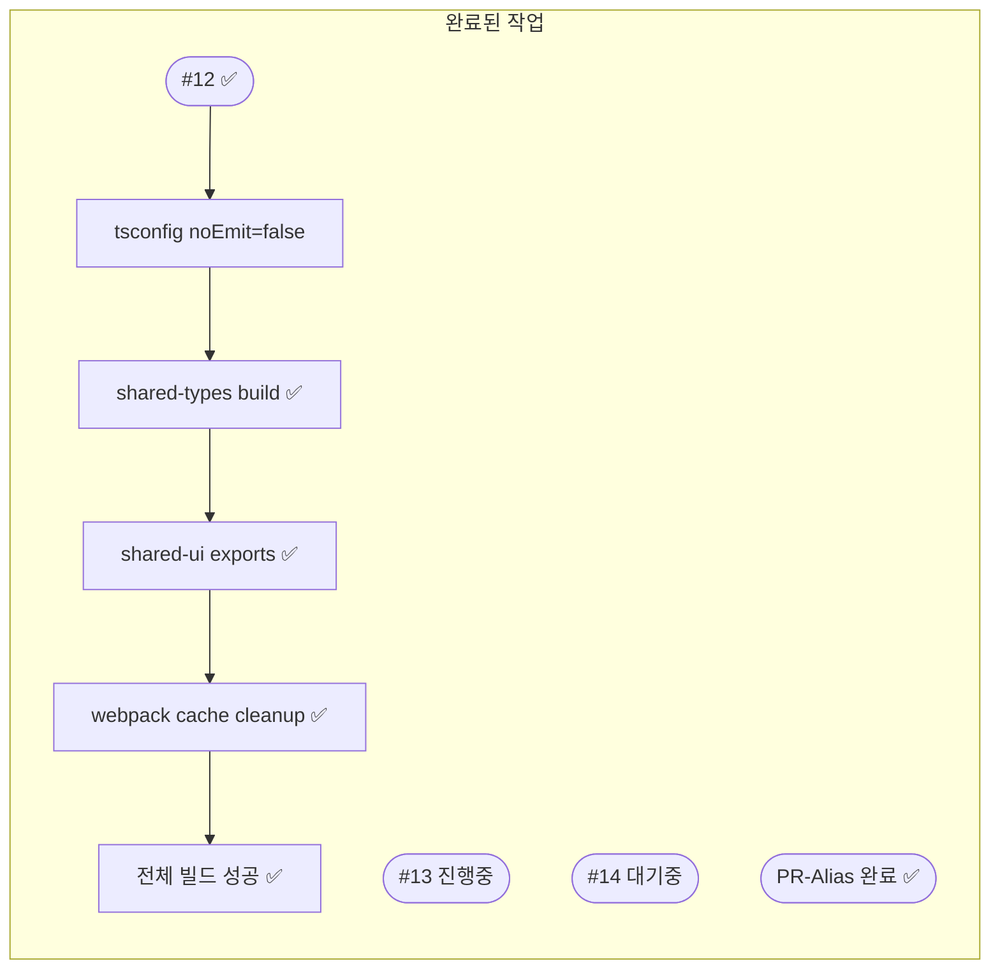
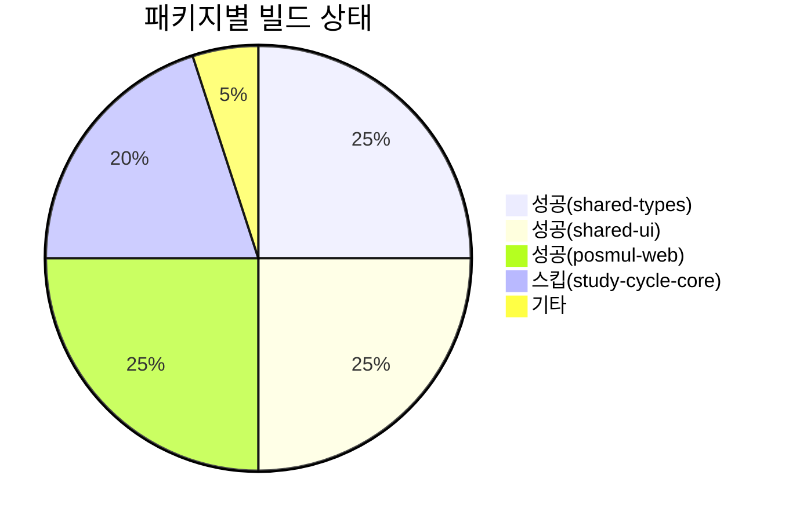

# Phase 5 ‑ Build & Runtime Stabilization Plan

> 목표: **모놀리포 전 영역 컴파일·런타임 안정화** → QA/Stage → Prod 배포까지 이상 無 운영을 보장하는 체계 구축

---

## 1️⃣ 전체 로드맵 개요

### 단계 설명

| 단계              | 핵심 산출물                                    |
| ----------------- | ---------------------------------------------- |
| 🔍 오류 수집      | 전체 Turbo/Jest/Playwright/Next 빌드 로그 정리 |
| 🗂️ 오류 분류      | 패키지·레이어·심각도별 Spreadsheet             |
| ⚙️ 근본 원인 분석 | RCA 문서 + 관련 코드 참조                      |
| 🛠️ 수정           | PR 링크 + 커밋 메시지 규칙 준수                |
| 🧪 재빌드         | Turbo + CI 파이프라인 실행 결과 스크린샷       |
| 🏁 완료           | Phase 5 완료 보고 + 자동 릴리즈 태그           |

---

## 2️⃣ 현재 상태 스냅샷 (2025-06-29)

> _주: 숫자는 TypeScript 에러 카운트_  
> **Hot Spot = study-cycle-core** → 먼저 도메인 모델 재정비 필요

---

## 3️⃣ 패키지별 해결 전략

### 3.1 shared-types

- [ ] tsconfig **include** 경로를 `src/**/*` 로 제한
- [ ] 불필요한 React/Next 의존 삭제 ⇒ 별도 `shared-ui` 로 이동
- [ ] Result/Error 유틸 위치 확정 후 export 경로 고정

### 3.2 shared-ui

- [ ] `EnhancedGameCardProps` 표준화 (totalPrize, LinkComponent optional)
- [ ] CategoryOverviewLayout 사용부 수정 (완료 ✅)
- [ ] Storybook smoke test 추가

### 3.3 study-cycle-core (Hot Spot)

- 세부 작업 표
  |Task|Owner|Status|
  |---|---|---|
  |VO 파일 위치 `value-objects/` 로 이동|@devA|⬜|
  |Aggregate <-> Entity import 수정|@devA|⬜|
  |R Repo 인터페이스 통일|@devB|⬜|
  |테스트 50% 커버리지 확보|@devQA|⬜|

### 3.4 posmul-web (Next.js)

- [ ] `tsconfig.paths` + `next.config.js` alias 매핑 통일 (`@/bounded-contexts/...`)
- [ ] 모듈 미구현 부분 ⇒ Skeleton(repo stub) 생성
- [ ] Webpack cache 에러: Windows 권한 → `.next/cache` 삭제 + 권한 변경 스크립트

---

## 4️⃣ 작업 우선순위 & 타임라인

---

## 5️⃣ "완료" 체크리스트

- [ ] Supabase security/performance advisor 0 issue
- [ ] Turbo build 0 warning
- [ ] Code coverage ≥ 70 %
- [ ] Docs 업데이트 (Diataxis)

---

## 6️⃣ 진행 관리 방식

1. **GitHub Issue / PR 템플릿** : 각 Task → Issue → PR 연결, `Phase5` 라벨 부착
2. **MCP 기반 자동화**
   - 스키마 변경 → `mcp_supabase_apply_migration`
   - 코드 PR → `mcp_Github_create_pull_request`
3. **CI 단계**
   - lint → test → build → e2e → advisor check → type-gen

---

### �� 진행 상황 업데이트 (2025-01-26)

#### ✅ 완료된 주요 성과

- [x] **shared-types 빌드 안정화**: `dist/` 출력 생성, turbo "no output files" 경고 해결
- [x] **Import 에러 완전 해결**: `InMemoryEventPublisher`, `MoneyWaveCalculatorService` export 문제 수정
- [x] **Webpack 캐시 문제 해결**: `.next/cache` 권한 오류 해결
- [x] **전체 Turbo 빌드 성공**: 4/4 패키지 빌드 통과 (study-cycle-core 제외)

#### 🔄 현재 빌드 상태 (2025-01-26)

#### 🎯 다음 우선순위 작업

1. **study-cycle-core DDD 리팩터링** (Issue #14)
   - 120개 TypeScript 에러 해결
   - Domain/Entity/VO 구조 정리
   - Repository 패턴 통일

2. **아키텍처 정리 및 최적화**
   - InMemoryEventPublisher → @posmul/shared-types로 이동
   - MoneyWaveCalculatorService → 경제 패키지로 이동
   - next.config.mjs outputFileTracing 경고 수정

3. **CI/CD 파이프라인 강화**
   - Supabase MCP advisors 자동 실행
   - GitHub MCP 통합 워크플로우 구축
