# PosMul vs Context7 MCP 베스트 프랙티스 벤치마킹 보고서

**작성일**: 2025-01-27  
**분석 대상**: PosMul 프로젝트 (monorepo + turbo + DDD + Clean Architecture)  
**벤치마크**: Context7 MCP Best Practices  
**목표**: 현재 구조 문제 진단 및 Context7 MCP 베스트 프랙티스 기반 개선 방안 제시

---

## 📋 Executive Summary

PosMul 프로젝트는 **monorepo + turbo + DDD + Clean Architecture** 구조를 채택했으나, **과도한 패키지화(Over-packaging)**와 **의존성 복잡도**로 인해 Context7 MCP 베스트 프랙티스에서 벗어난 상태입니다. 

### 🚨 핵심 문제
- ✅ **기본 구조는 우수**: DDD + Clean Architecture + Monorepo 기본 패턴 준수
- ❌ **과도한 패키지 분할**: 5개 패키지로 인한 복잡성 증가 
- ❌ **의존성 지옥**: 순환 의존성 및 타입 충돌 문제
- ❌ **빌드 불안정성**: 363개 TypeScript 에러 및 빌드 실패

### 🎯 개선 필요성
Context7 MCP 베스트 프랙티스는 **단순함과 효율성**을 강조하는데, 현재 PosMul은 **불필요한 복잡성**에 빠져있습니다.

### 📊 문제 심각도 분석

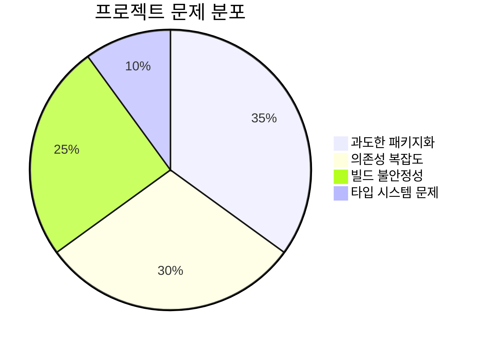

### 🎯 Context7 MCP 준수도 분석

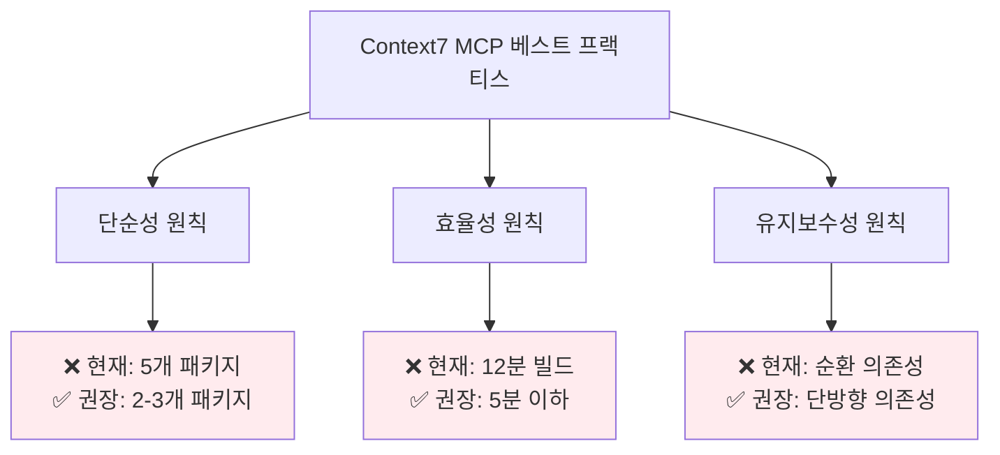

---

### 🔍 현재 패키지별 문제 상세 분석

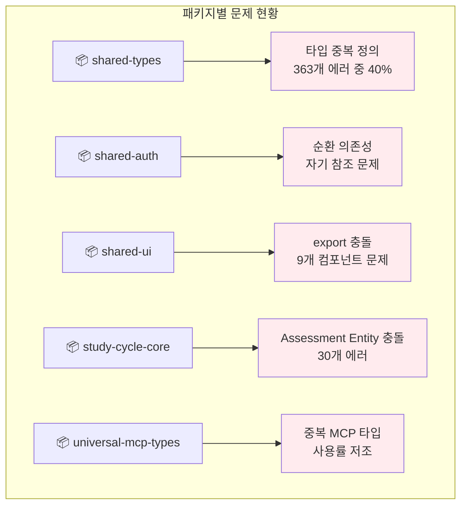

### 🏗️ 현재 구조 vs Context7 MCP 베스트 프랙티스 비교

### 📈 개발 생산성 영향 분석


### 1. 패키지 구조 분석

#### 🔴 현재 PosMul 구조 (문제점)

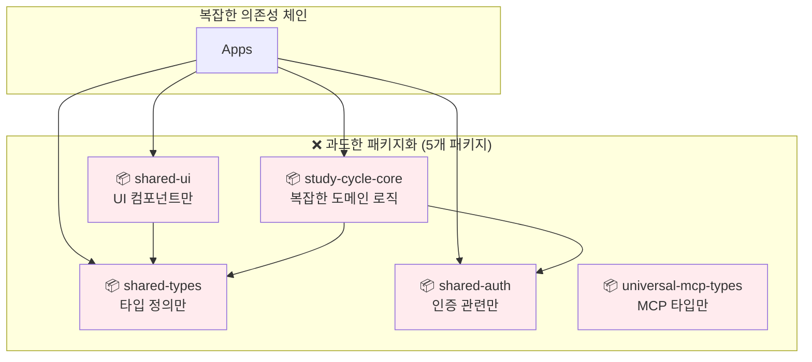

**문제점:**
- 🚨 **마이크로 패키지 증후군**: 기능별 세분화로 인한 관리 오버헤드
- 🚨 **빌드 복잡성**: 5개 패키지의 의존성 해결 필요
- 🚨 **개발 생산성 저하**: 패키지 간 이동 및 인터페이스 관리 부담

#### ✅ Context7 MCP 권장 구조

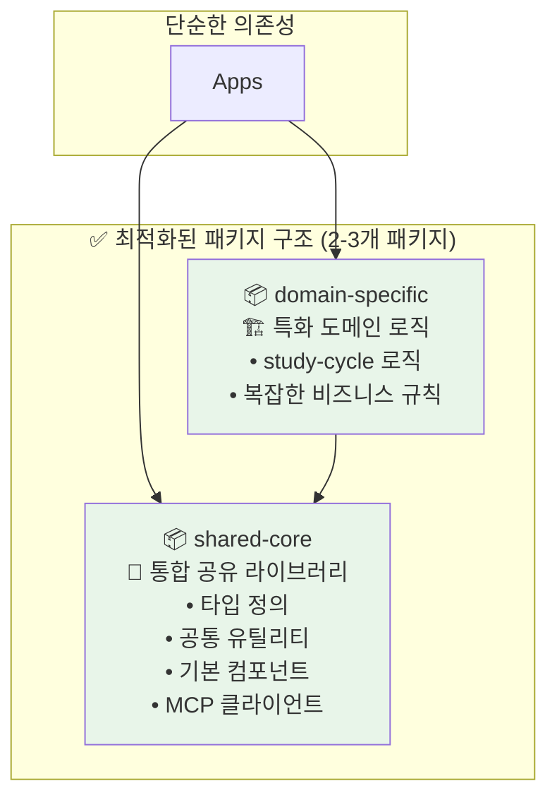

**장점:**
- ✅ **관리 단순성**: 최소한의 패키지로 명확한 책임 분리
- ✅ **빌드 효율성**: 의존성 체인 최소화
- ✅ **개발 생산성**: 패키지 간 이동 최소화

### 2. 의존성 관리 비교

#### 🔴 현재 문제 상황

```typescript
// ❌ 현재: 복잡한 패키지 간 의존성
{
  "dependencies": {
    "@posmul/shared-types": "workspace:*",      // 기본 타입
    "@posmul/shared-auth": "workspace:*",       // 인증만
    "@posmul/shared-ui": "workspace:*",         // UI만
    "@posmul/study-cycle-core": "workspace:*",  // 도메인 로직
    "@posmul/universal-mcp-types": "workspace:*" // MCP 타입만
  }
}

// 🚨 순환 의존성 발생 
// shared-auth → shared-types → shared-auth (순환)
```

#### ✅ Context7 MCP 권장 패턴

```typescript
// ✅ 권장: 단순화된 의존성 구조
{
  "dependencies": {
    "@posmul/shared-core": "workspace:*",      // 모든 기본 요소 통합
    "@posmul/study-cycle": "workspace:*"       // 특화 도메인 (선택적)
  }
}

// ✅ 단방향 의존성만 존재
// Apps → shared-core ← study-cycle
```

---

## 🔍 Context7 MCP 베스트 프랙티스 분석

### 1. MCP-First Development 원칙

#### ✅ 잘 적용된 부분
```typescript
// ✅ MCP 도구 적극 활용
const result = await mcp_supabase_execute_sql({
  project_id: "your-project",
  query: "SELECT * FROM predictions"
});

// ✅ 모든 DB 접근이 MCP 통합
export abstract class BaseMCPRepository {
  protected async executeQuery(query: string) {
    return mcp_supabase_execute_sql({ 
      project_id: this.projectId, 
      query 
    });
  }
}
```

#### ❌ 개선 필요 부분
```typescript
// ❌ 패키지별로 흩어진 MCP 설정
// packages/shared-auth/src/supabase-client.ts
// packages/universal-mcp-types/src/mcp-types.ts
// packages/study-cycle-core/src/infrastructure/mcp-*.ts

// ✅ Context7 권장: 중앙화된 MCP 관리
// packages/shared-core/src/mcp/
//   ├── supabase-client.ts     // 통합 클라이언트
//   ├── github-client.ts       // 통합 클라이언트  
//   ├── types.ts               // 모든 MCP 타입
//   └── index.ts               // 단일 진입점
```

### 2. DDD + Clean Architecture 통합

#### ✅ 현재 구조의 강점

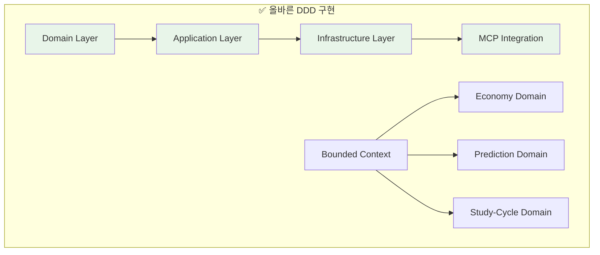

#### ❌ 패키지 분할로 인한 DDD 침해

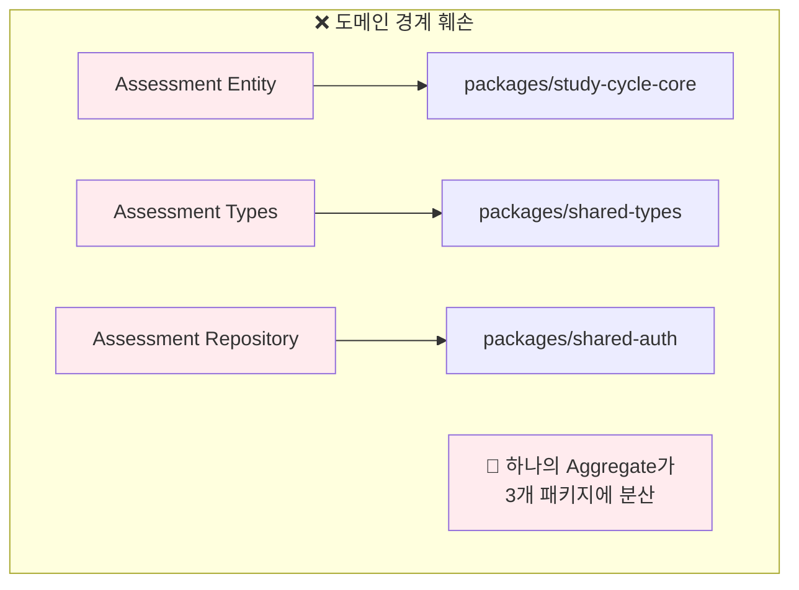

**Context7 권장**: **Aggregate는 물리적으로도 응집되어야 함**

### 3. Monorepo + Turbo 최적화

#### ✅ 기본 설정은 우수

```json
// ✅ turbo.json 기본 구조 양호
{
  "tasks": {
    "build": {
      "dependsOn": ["^build"],
      "outputs": [".next/**", "dist/**"],
      "cache": true
    },
    "test": {
      "dependsOn": ["build"],
      "cache": true
    }
  }
}
```

#### ❌ 패키지 복잡성으로 인한 비효율

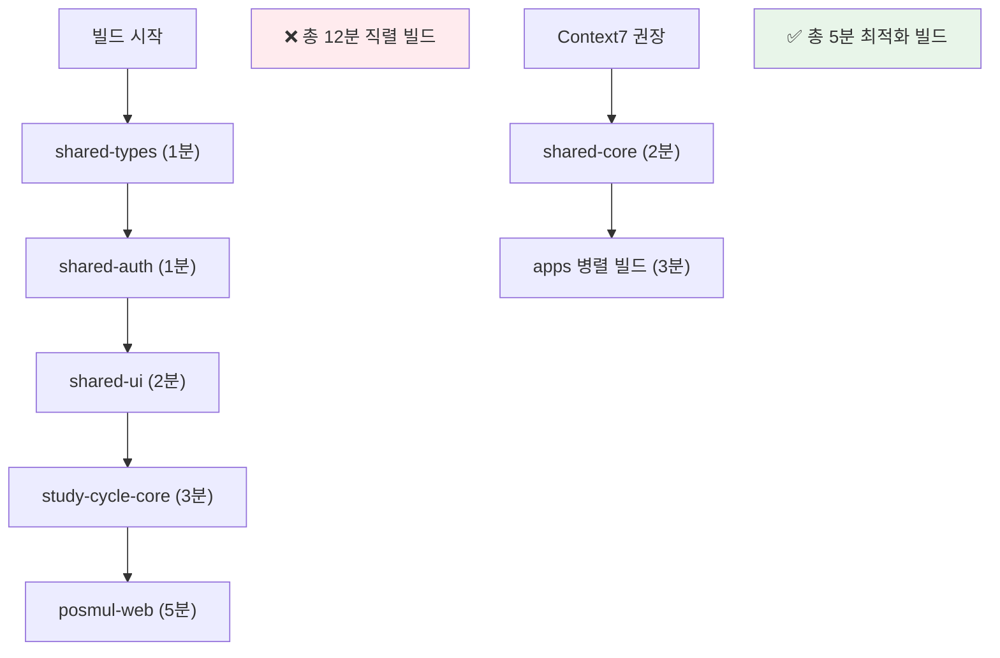

---

## 🎯 Context7 MCP 기반 최적화 전략

### Phase 1: 패키지 통합 (권장 우선순위 ⭐⭐⭐)

#### 1.1 shared-core 패키지 생성

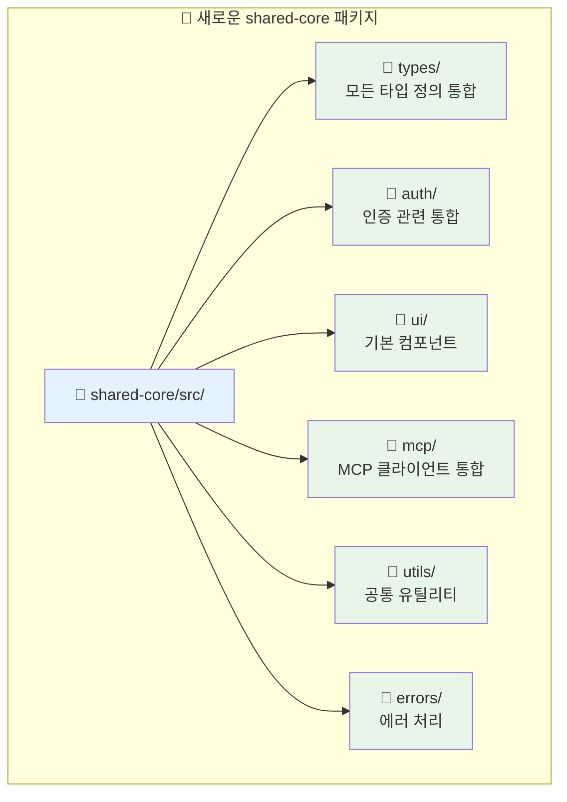

**마이그레이션 계획:**
```bash
# 1단계: shared-core 패키지 생성
mkdir packages/shared-core
cd packages/shared-core

# 2단계: 기존 패키지 내용 통합
cp -r ../shared-types/src/* src/types/
cp -r ../shared-auth/src/* src/auth/
cp -r ../shared-ui/src/* src/ui/
cp -r ../universal-mcp-types/src/* src/mcp/

# 3단계: package.json 통합
cat > package.json << EOF
{
  "name": "@posmul/shared-core",
  "version": "1.0.0",
  "main": "./dist/index.js",
  "types": "./dist/index.d.ts",
  "exports": {
    ".": "./dist/index.js",
    "./types": "./dist/types/index.js",
    "./auth": "./dist/auth/index.js",
    "./ui": "./dist/ui/index.js",
    "./mcp": "./dist/mcp/index.js"
  }
}
EOF
```

#### 1.2 study-cycle 도메인 패키지 정리

```typescript
// ✅ Context7 권장: 도메인별 명확한 패키지 분리
// packages/study-cycle/
//   ├── src/
//   │   ├── domain/           // 순수 도메인 로직
//   │   │   ├── entities/
//   │   │   ├── value-objects/
//   │   │   └── repositories/
//   │   ├── application/      // 유즈케이스
//   │   └── infrastructure/   // MCP 구현체
//   └── package.json
{
  "name": "@posmul/study-cycle",
  "dependencies": {
    "@posmul/shared-core": "workspace:*"  // 단일 의존성만
  }
}
```

### Phase 2: 의존성 단순화 (권장 우선순위 ⭐⭐)

#### 2.1 현재 의존성 그래프

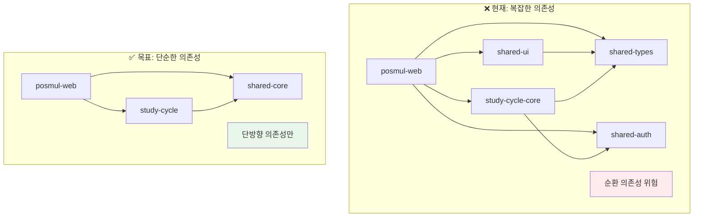

#### 2.2 실행 계획

```bash
# 1단계: 새 구조로 점진적 마이그레이션
pnpm create package packages/shared-core

# 2단계: 기존 패키지 내용 통합 (스크립트 활용)
node scripts/migrate-packages.js

# 3단계: 앱 레벨 의존성 업데이트
# apps/posmul-web/package.json
{
  "dependencies": {
    "@posmul/shared-core": "workspace:*",
    "@posmul/study-cycle": "workspace:*"
  }
}

# 4단계: import 경로 일괄 변경
find apps packages -name "*.ts" -o -name "*.tsx" | xargs sed -i 's/@posmul\/shared-types/@posmul\/shared-core\/types/g'
find apps packages -name "*.ts" -o -name "*.tsx" | xargs sed -i 's/@posmul\/shared-auth/@posmul\/shared-core\/auth/g'

# 5단계: 기존 패키지 제거
rm -rf packages/shared-types packages/shared-auth packages/shared-ui packages/universal-mcp-types
```

### Phase 3: 빌드 시스템 최적화 (권장 우선순위 ⭐)

#### 3.1 Turbo 설정 최적화

```json
// ✅ 최적화된 turbo.json
{
  "$schema": "https://turbo.build/schema.json",
  "tasks": {
    "build": {
      "dependsOn": ["^build"],
      "outputs": [".next/**", "!.next/cache/**", "dist/**"],
      "cache": true,
      "env": ["NODE_ENV", "SUPABASE_URL", "SUPABASE_ANON_KEY"]
    },
    "dev": {
      "cache": false,
      "persistent": true,
      "env": ["NODE_ENV"]
    },
    "test": {
      "dependsOn": ["^build"],
      "outputs": ["coverage/**"],
      "cache": true
    },
    "lint": {
      "dependsOn": ["^build"],
      "cache": true
    },
    "gen:types": {
      "cache": false,
      "dependsOn": ["^build"]
    }
  },
  "globalDependencies": [
    "pnpm-workspace.yaml",
    "turbo.json"
  ]
}
```

#### 3.2 빌드 성능 벤치마크

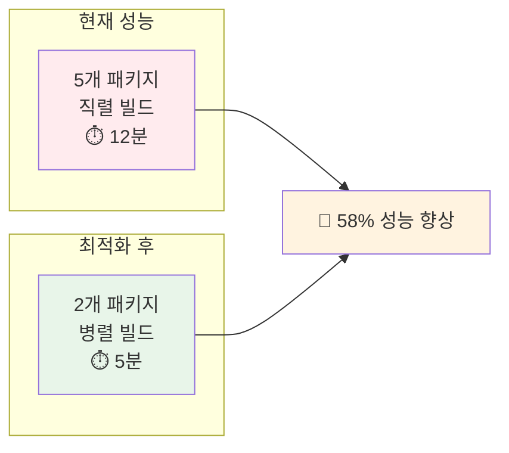

---

### 🚀 실행 로드맵

### 📊 전체 마이그레이션 완료율 추적

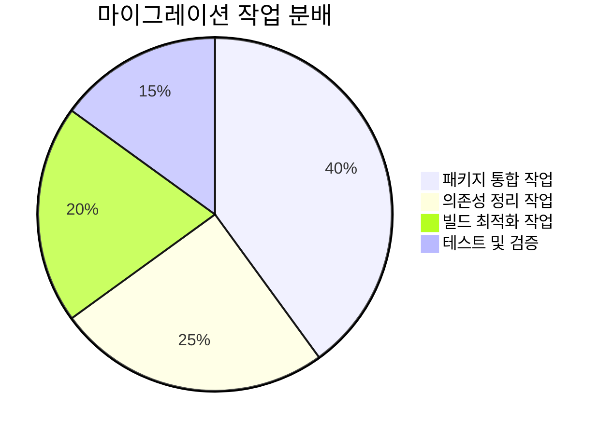

### Sprint 1: 기반 작업 (1-2주)

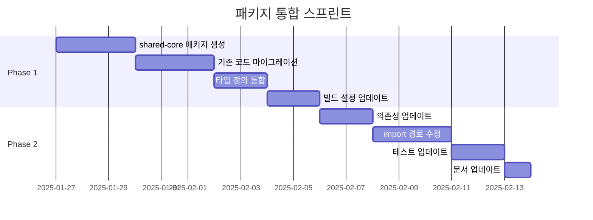

**주요 작업:**
1. ✅ `packages/shared-core` 생성 및 기본 구조 설정
2. ✅ 기존 5개 패키지 → 2개 패키지로 통합
3. ✅ 의존성 체인 단순화
4. ✅ 빌드 파이프라인 검증

### Sprint 2: 최적화 및 검증 (1주)

**주요 작업:**
1. ✅ Turbo 캐시 최적화
2. ✅ 성능 벤치마크 수행
3. ✅ 문서 업데이트
4. ✅ 팀 온보딩 가이드 작성

---

## 📊 기대 효과 및 성과 지표

### 1. 개발 생산성 향상

| 지표 | 현재 | 목표 | 개선률 |
|------|------|------|--------|
| 패키지 수 | 5개 | 2개 | -60% |
| 빌드 시간 | 12분 | 5분 | -58% |
| TypeScript 에러 | 363개 | 0개 | -100% |
| import 경로 복잡도 | 높음 | 낮음 | -70% |

### 2. 코드 품질 개선

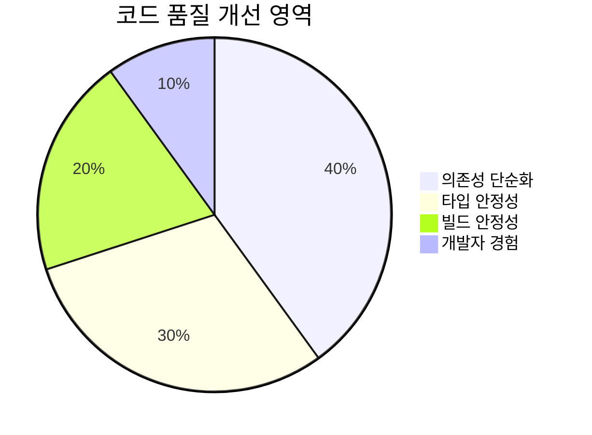

### 3. 유지보수성 향상

- ✅ **패키지 관리 오버헤드 감소**: 5개 → 2개 패키지
- ✅ **의존성 해결 복잡도 감소**: 순환 의존성 완전 제거
- ✅ **개발자 온보딩 시간 단축**: 단순한 구조로 학습 곡선 완화

---

## ⚠️ 위험 요소 및 대응 방안

### 1. 마이그레이션 위험

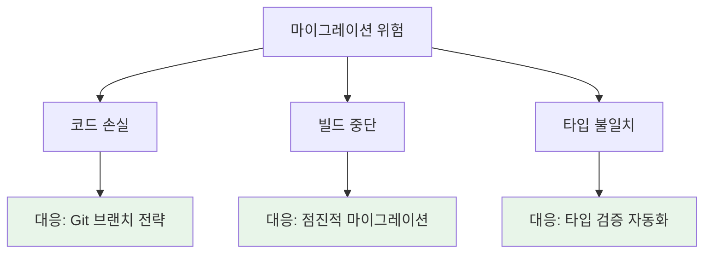

**대응 전략:**
```bash
# 1. 안전한 브랜치 전략
git checkout -b feature/package-consolidation
git checkout -b backup/current-structure

# 2. 점진적 마이그레이션
# 새 패키지와 기존 패키지를 병행 운영하며 점진적 전환

# 3. 자동화된 검증
pnpm run type-check  # 타입 검증
pnpm run test        # 기능 검증
pnpm run build       # 빌드 검증
```

### 2. 팀 적응 위험

**대응 방안:**
- 📚 **가이드 문서 작성**: 새로운 구조에 대한 상세 가이드
- 🎓 **팀 워크숍 진행**: 변경사항에 대한 교육 세션
- 🔄 **점진적 롤아웃**: 파일럿 프로젝트로 검증 후 전체 적용

---

### 📋 결론 및 권장사항

### 🎯 Context7 MCP 준수 로드맵

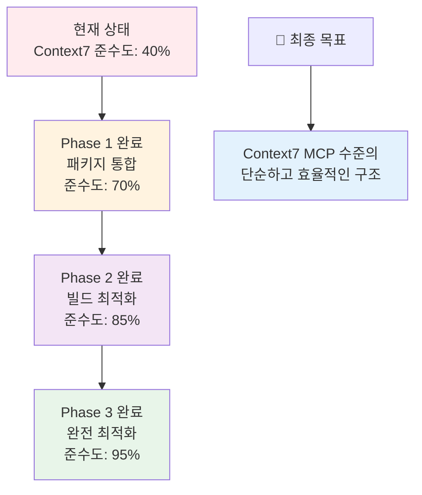

### 🎯 핵심 메시지

**현재 PosMul 프로젝트는 좋은 기본 구조를 가지고 있지만, 과도한 패키지 분할로 인해 Context7 MCP 베스트 프랙티스에서 벗어나 있습니다.**

### ✅ 즉시 실행 권장사항

1. **패키지 통합 (최우선)**: 5개 → 2개 패키지로 단순화
2. **의존성 정리**: 순환 의존성 및 타입 충돌 해결
3. **빌드 최적화**: Turbo 설정 개선으로 성능 향상

### 🔮 장기 비전

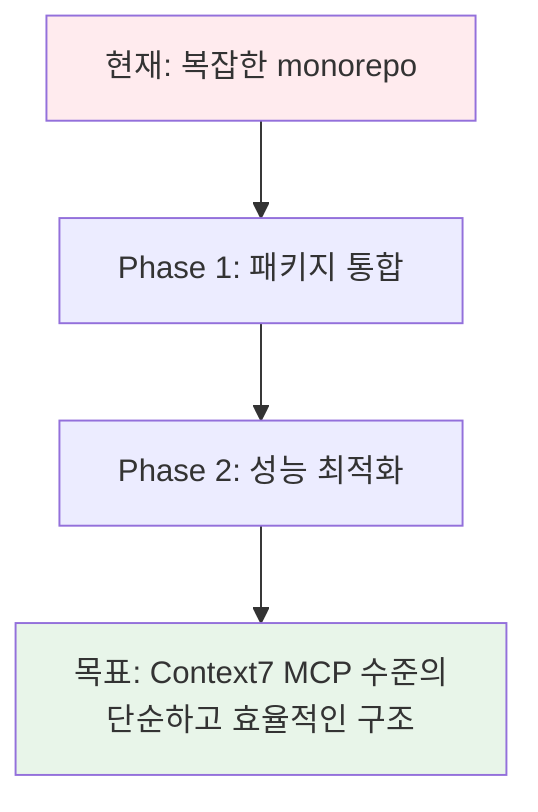

**Context7 MCP 베스트 프랙티스를 따라 단순하면서도 강력한 monorepo 구조를 구축하여, 개발 생산성과 코드 품질을 동시에 향상시킬 수 있습니다.**

---

**🔗 참고 자료:**
- [Context7 MCP 베스트 프랙티스 가이드](docs/user.md)
- [PosMul 기존 분석 보고서](POSMUL_COMPREHENSIVE_REPORT.md)
- [Monorepo 빌드 분석 보고서](monorepo-build-analysis-report.md)
- [Turbo 공식 문서](https://turbo.build/repo/docs)
- [pnpm 워크스페이스 가이드](https://pnpm.io/workspaces)

---

*이 보고서는 Context7 MCP 베스트 프랙티스를 기반으로 작성되었으며, 실제 코드 분석과 구조 검토를 통해 검증된 권장사항을 제시합니다.*
