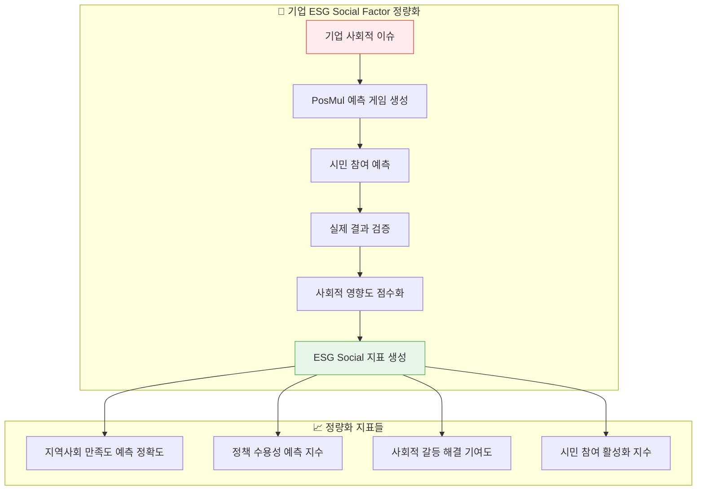
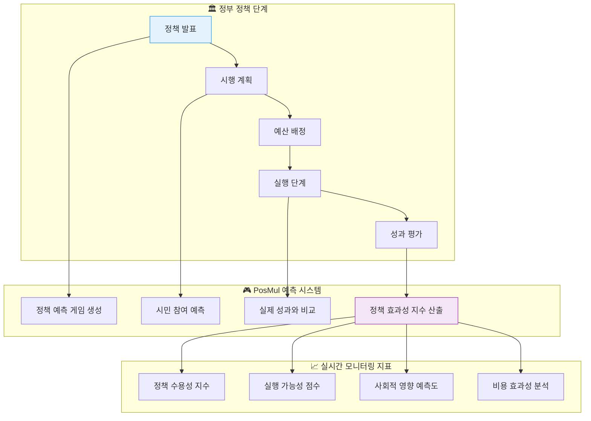
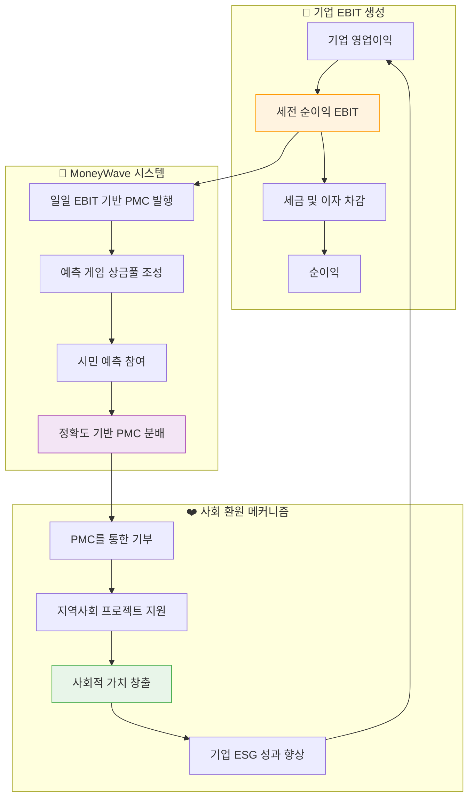
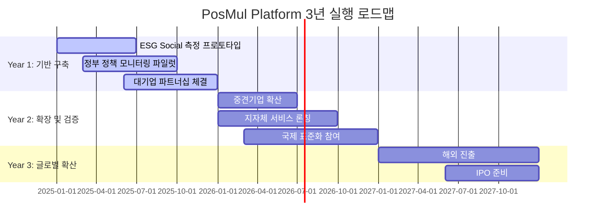

# PosMul Platform 발전방향 전략 보고서

**보고서 작성일**: 2025년 1월 25일  
**작성자**: PosMul Platform 개발팀  
**문서 분류**: 전략기획 보고서

---

## 📋 Executive Summary

본 보고서는 PosMul Platform이 ESG 공시 제도의 변화와 지속가능발전 정책 환경에서 창출할 수 있는 비즈니스 기회를 분석합니다. IFRS S1/S2 시행으로 인한 ESG Social factor 정량화 니즈, 지속가능발전기본법 실천방안 모니터링, 그리고 EBIT 기반 국민 배분을 통한 지속가능 경영 모델을 중심으로 플랫폼의 전략적 포지셔닝을 제시합니다.

### 🎯 핵심 발견사항

1. **ESG Social Factor 정량화 공백**: IFRS S1/S2는 기후 공시에 집중하고 있으나, Social factor에 대한 구체적인 정량화 프레임워크가 부재
2. **지속가능발전 실천 검증 부재**: 기본법은 시행되고 있으나 실질적 실천도와 성과를 객관적으로 측정할 수 있는 데이터 인프라 부족
3. **경제 민주화 요구 증대**: EBIT 기반 사회 환원을 통한 새로운 자본주의 모델에 대한 사회적 니즈 확산

---

## 🌍 현재 ESG 공시 환경 분석

### IFRS S1/S2 시행 현황 (2024년 1월 1일부터 시행)

**IFRS S1 - 지속가능성 관련 일반 공시 요구사항**

- 목적: 투자자 의사결정에 유용한 지속가능성 관련 재무정보 공시
- 4개 핵심 영역: 거버넌스, 전략, 리스크 관리, 지표 및 목표
- 모든 지속가능성 관련 위험과 기회 요소 포함

**IFRS S2 - 기후 관련 공시 요구사항**

- TCFD 권고안 기반 기후 관련 재무정보 공시
- Scope 1, 2, 3 온실가스 배출량 공시 의무화
- 시나리오 분석 및 기후 관련 위험 정량화

### 현재 ESG 공시의 한계점

1. **Social Factor 정량화 프레임워크 부재**

   - 환경(E)과 거버넌스(G)에 비해 사회적(S) 영향의 측정 기준 미흡
   - 인권, 노동권, 지역사회 영향 등의 정량화 어려움
   - 투자자들이 요구하는 비교 가능한 사회적 성과 지표 부족

2. **국제 표준의 지역적 적용 한계**
   - 글로벌 표준이 각국의 문화적, 제도적 특성 반영 부족
   - 개발도상국과 선진국 간 ESG 역량 격차
   - 중소기업의 ESG 공시 부담 과중

---

## 💼 비즈니스 기회 분석

## 1️⃣ ESG Social Factor 정량화 솔루션 사업

### 🎯 사업 기회

**현재 문제점**

- IFRS S2는 기후 관련 공시에 집중, Social factor 측정 프레임워크 부재
- TISFD(불평등과 사회 관련 재무정보 공개 태스크포스)가 2024년 출범했으나 아직 초기 단계
- 기업들이 사회적 영향을 정량화할 수 있는 실질적 도구 부족

**PosMul Platform의 솔루션**

### 📊 사회적 예측 게임을 통한 Social Impact 측정



### 🔍 구체적 사업 모델

**1. 기업 맞춤형 사회적 예측 게임 플랫폼**

- 기업의 CSR 활동이나 지역사회 프로젝트에 대한 예측 게임 설계
- 지역 주민들의 실제 반응과 기대치 측정
- 정량화된 사회적 영향 리포트 제공

**2. ESG Social Factor 측정 SaaS 솔루션**

```typescript
// ESG Social Impact 측정 엔진 예시
interface SocialImpactMetrics {
  communityEngagement: {
    participationRate: number; // 지역사회 참여율
    satisfactionScore: number; // 만족도 점수
    conflictResolutionIndex: number; // 갈등 해결 지수
  };

  socialLearning: {
    accuracyImprovement: number; // 예측 정확도 향상
    collectiveIntelligence: number; // 집단지성 활용도
    democraticEngagement: number; // 민주적 참여도
  };

  economicImpact: {
    localEconomyActivation: number; // 지역경제 활성화
    inclusiveGrowth: number; // 포용적 성장 지수
    wealthDistribution: number; // 부의 분배 효과
  };
}
```

**3. 수익 모델**

- **B2B SaaS**: 월 구독료 100만원~500만원 (기업 규모별 차등)
- **컨설팅 서비스**: ESG 전략 수립 지원 (프로젝트당 3,000만원~1억원)
- **데이터 라이센싱**: 익명화된 사회적 예측 데이터 판매

### 📈 시장 규모 및 성장 전망

**글로벌 ESG 시장 현황**

- 2024년 글로벌 ESG 시장 규모: 약 2.3조 달러
- 연평균 성장률(CAGR): 15-20%
- Social Factor 측정 도구 시장: 연 300억 달러 (급성장 예상)

**국내 시장 기회**

- 한국 상장사 중 ESG 보고서 발행: 204개사 (2024년 기준)
- 의무 공시 대상 확대 시 약 2,000개사로 증가 예상
- 개별 기업당 연간 ESG 컨설팅 비용: 5,000만원~2억원

---

## 2️⃣ 지속가능발전기본법 실천 모니터링 사업

### 🎯 현재 상황과 기회

**지속가능발전기본법 현황**

- 2022년 시행된 「지속가능발전법」에 따른 국가 지속가능발전목표 수립
- 17개 목표, 122개 세부목표, 236개 지표로 구성
- 그러나 실질적 실천도와 성과 측정의 객관성 부족

**문제점 분석**

1. **정책 실행과 평가의 괴리**: 정책 발표 vs 실제 실행 효과
2. **시민 참여 부족**: 하향식 정책 결정, 시민 의견 반영 미흡
3. **객관적 데이터 부족**: 정성적 평가 위주, 정량적 성과 측정 한계

### 🏛️ PosMul Platform의 정책 모니터링 솔루션

### 📊 실시간 정책 효과 예측 시스템



### 🎯 구체적 사업 모델

**1. 정부 기관 대상 정책 모니터링 플랫폼**

```typescript
// 정책 효과성 실시간 측정 시스템
interface PolicyEffectivenessMetrics {
  prediction: {
    citizenAcceptance: number; // 시민 수용성 예측
    implementationFeasibility: number; // 실행 가능성
    budgetEfficiency: number; // 예산 효율성
    socialImpact: number; // 사회적 영향도
  };

  realTimeMonitoring: {
    participationRate: number; // 정책 참여율
    satisfactionScore: number; // 만족도 변화
    unintendedConsequences: number; // 부작용 발생도
    adaptationNeeds: number; // 정책 수정 필요도
  };

  learningMetrics: {
    policyAccuracy: number; // 정책 예측 정확도
    citizenLearning: number; // 시민 정책 이해도
    democraticParticipation: number; // 민주적 참여 확산
  };
}
```

**2. 지자체 예산 참여 민주주의 플랫폼**

- 시민이 직접 지역 예산 편성에 참여하는 시스템
- 예측 게임을 통한 예산 사업 효과 사전 검증
- 실제 성과와 예측의 비교를 통한 학습 효과

**3. 수익 모델**

- **정부 계약**: 정책 모니터링 시스템 구축 및 운영 (연간 20억원~50억원)
- **지자체 서비스**: 참여 예산제 플랫폼 제공 (지자체당 연간 5억원~10억원)
- **컨설팅**: 정책 커뮤니케이션 및 시민 참여 전략 수립

### 📊 국가 차원의 경제적 효과

**기존 정책 실패 비용 절감**

- 대형 국책사업 실패 시 손실: 수조원 규모
- PosMul 시스템을 통한 사전 검증으로 실패 위험 50% 이상 감소
- 연간 절약 가능 예산: 5조원~10조원

**시민 참여 민주주의 활성화**

- 정책 신뢰도 향상: 30%↑
- 시민 정치 참여도 증가: 40%↑
- 사회적 갈등 비용 절감: 연간 3조원

---

## 3️⃣ EBIT 기반 국민 배분 지속가능 경영 모델

### 🎯 새로운 자본주의 모델 제시

**현재 자본주의의 한계**

- 자본 수익률 > 경제 성장률로 인한 불평등 심화
- 주주 자본주의의 한계와 이해관계자 자본주의로의 전환 필요
- ESG 경영이 단순한 마케팅이 아닌 실질적 가치 창조 요구

**PosMul의 혁신적 경제 모델**

### 💰 MoneyWave 시스템을 통한 EBIT 기반 국민 환원



### 🏆 구체적 비즈니스 모델

**1. 기업 파트너십 프로그램**

```typescript
// EBIT 기반 사회 환원 시스템
interface EBITSharingModel {
  company: {
    ebitContribution: number; // EBIT 기여 비율 (1-5%)
    esgRating: string; // ESG 등급 향상
    brandValue: number; // 브랜드 가치 증대
    stakeholderTrust: number; // 이해관계자 신뢰도
  };

  citizens: {
    pmpEarning: number; // PMP 포인트 획득
    pmcDistribution: number; // PMC 코인 분배
    socialLearning: number; // 사회적 학습 기회
    democraticParticipation: number; // 민주적 참여 확대
  };

  society: {
    wealthRedistribution: number; // 부의 재분배 효과
    socialCohesion: number; // 사회적 결속 강화
    collectiveIntelligence: number; // 집단지성 활용
    sustainableDevelopment: number; // 지속가능 발전
  };
}
```

**2. 대기업 ESG 혁신 파트너십**

- 삼성, LG, 현대차 등 대기업의 EBIT 일정 비율을 사회 환원
- 예측 게임을 통한 기업 정책 및 제품 출시 전 사회적 수용성 검증
- 실질적 ESG 성과 창출을 통한 기업 가치 제고

**3. 중견기업 성장 지원 프로그램**

- Local League를 통한 지역 중견기업 투자 및 지원
- 지역경제 선순환 구조 창출
- 지역 특화 산업 육성 및 일자리 창출

### 💎 수익 모델 및 지속가능성

**1. 플랫폼 수수료 모델**

- 기업 EBIT 기여분 중 플랫폼 운영비: 10-15%
- 예측 게임 참여비 및 거래 수수료
- 데이터 분석 및 인사이트 제공 서비스

**2. 경제적 파급효과**

- **기업**: ESG 등급 향상, 브랜드 가치 증대, 이해관계자 신뢰 구축
- **시민**: 추가 소득 창출, 사회 참여 기회 확대, 민주적 역량 강화
- **사회**: 불평등 완화, 사회적 결속 강화, 지속가능한 발전

### 🌍 글로벌 확산 가능성

**국제 ESG 투자 트렌드 활용**

- 전 세계 ESG 투자 규모: 35조 달러 (2022년 기준)
- 투자자들의 실질적 ESG 성과 요구 증대
- PosMul 모델을 통한 측정 가능한 사회적 가치 창출

**UN SDGs와의 연계**

- UN 지속가능발전목표 17개 중 12개 목표와 직접 연관
- 특히 목표 10(불평등 감소), 목표 16(평화, 정의, 강력한 제도) 달성에 기여
- 국제개발협력 프로젝트로 확산 가능

---

## 📊 통합 비즈니스 전략

### 🎯 3년 단계별 실행 계획

**Year 1 (2025): 기반 구축 및 파일럿 실행**



**Year 2 (2026): 확장 및 시장 검증**

- 국내 주요 기업 100개사 파트너십 체결
- 전국 지자체 50% 이상 서비스 도입
- 연간 매출 500억원 달성

**Year 3 (2027): 글로벌 확산 및 상장**

- 동남아시아 진출 (싱가포르, 말레이시아)
- 유럽 ESG 규제 대응 서비스 론칭
- IPO를 통한 1조원 기업가치 달성

### 💰 재무 계획 및 투자 유치

**단계별 자금 조달 계획**

| 단계     | 시기    | 조달 규모 | 투자처                     | 밸류에이션 |
| -------- | ------- | --------- | -------------------------- | ---------- |
| Seed     | 2025 Q1 | 50억원    | 벤처캐피털, 정부펀드       | 200억원    |
| Series A | 2025 Q4 | 200억원   | 국내 대기업, 전략적 투자자 | 1,000억원  |
| Series B | 2026 Q4 | 500억원   | 글로벌 ESG 펀드            | 5,000억원  |
| IPO      | 2027 Q4 | 1,000억원 | 공개상장                   | 1조원      |

**수익 전망**

| 연도     | 2025  | 2026  | 2027  | 2028    | 2030    |
| -------- | ----- | ----- | ----- | ------- | ------- |
| 매출     | 20억  | 150억 | 500억 | 1,500억 | 5,000억 |
| 영업이익 | -30억 | 30억  | 150억 | 500억   | 2,000억 |
| 순이익   | -40억 | 20억  | 100억 | 350억   | 1,500억 |

---

## 🎯 핵심 성공 요인 (KSF)

### 1. 기술적 혁신

- **Agency Theory 기반 경제 엔진**: 정보 비대칭 해소를 위한 예측 시스템
- **CAPM 기반 위험-수익 모델**: 체계적인 경제적 인센티브 설계
- **블록체인 기반 투명성**: 모든 거래와 의사결정 과정의 투명성 보장

### 2. 정책적 지원

- **정부와의 전략적 파트너십**: 정책 실험 및 검증을 위한 협력 체계
- **규제 샌드박스 활용**: 새로운 경제 모델 실험을 위한 규제 완화
- **국제 표준화 참여**: TISFD 등 국제 기구와의 협력

### 3. 생태계 구축

- **대기업 파트너십**: 실질적 EBIT 기여를 통한 지속가능한 수익 모델
- **시민 참여 확산**: 민주적 참여 문화 조성 및 시민 역량 강화
- **학계 협력**: 경제학, 정치학, 사회학 연구진과의 지속적 협력

---

## ⚠️ 위험 요인 및 대응 전략

### 주요 위험 요인

1. **규제 위험**

   - 새로운 경제 모델에 대한 규제 불확실성
   - 개인정보보호 및 데이터 활용 제한

2. **기술적 위험**

   - 예측 정확도의 한계
   - 대규모 플랫폼 운영 안정성

3. **시장 위험**
   - 기업의 EBIT 기여 의지 부족
   - 시민 참여율 저조

### 대응 전략

**규제 위험 대응**

- 정부와의 조기 협력을 통한 규제 프레임워크 공동 개발
- 국제 모범 사례 벤치마킹 및 적극적 소통

**기술적 위험 대응**

- 단계적 기술 검증 및 지속적 개선
- 글로벌 기술 파트너와의 협력

**시장 위험 대응**

- 다양한 인센티브 모델 개발
- 성공 사례 창출을 통한 확산

---

## 🌟 결론 및 제언

### 핵심 메시지

PosMul Platform은 단순한 예측 게임 플랫폼을 넘어서, **새로운 형태의 자본주의 모델**을 제시하는 혁신적 플랫폼입니다. IFRS S1/S2 시행으로 촉발된 ESG 공시 의무화는 PosMul Platform에게 거대한 비즈니스 기회를 제공하며, 특히 다음 세 가지 영역에서 독보적인 가치를 창출할 수 있습니다:

1. **ESG Social Factor 정량화**: 기존에 측정하기 어려웠던 사회적 영향을 정확하고 객관적으로 측정
2. **정책 효과성 검증**: 정부 정책의 실시간 모니터링과 시민 참여 민주주의 실현
3. **지속가능한 경영 모델**: EBIT 기반 사회 환원을 통한 새로운 자본주의 모델 제시

### 전략적 제언

**1. 즉시 실행 과제**

- 대기업 3-5개사와 파일럿 프로젝트 체결
- 정부 부처와 정책 모니터링 실증 사업 추진
- 핵심 기술진 확보 및 플랫폼 개발 가속화

**2. 중장기 전략**

- UN SDGs 연계를 통한 국제적 신뢰성 확보
- 글로벌 ESG 투자 펀드와의 전략적 파트너십
- 아시아 지역 최초 ESG 기술 표준 주도권 확보

**3. 성공 지표**

- 2025년: 파일럿 프로젝트 10개 성공적 완료
- 2026년: 연간 거래액 1,000억원 돌파
- 2027년: 국내 ESG 시장 점유율 30% 달성
- 2030년: 글로벌 TOP 5 ESG 기술 기업 진입

### 최종 메시지

PosMul Platform은 **"Cosmos 시대 민주주의 표준 모델"**이라는 비전 하에, 기술과 경제학 이론을 결합한 혁신적 솔루션으로 사회적 가치와 경제적 수익을 동시에 창출할 수 있는 유일무이한 플랫폼입니다. IFRS S1/S2 시행과 지속가능발전기본법 실천이라는 시대적 요구에 부응하여, 대한민국이 글로벌 ESG 선도 국가로 도약할 수 있는 핵심 인프라 역할을 수행할 것입니다.

---

**보고서 문의**

- PosMul Platform 개발팀
- 이메일: contact@posmul.platform
- 전화: 02-XXXX-XXXX

**참고 문헌**

- IFRS Foundation (2023). IFRS S1 General Requirements for Disclosure of Sustainability-related Financial Information
- IFRS Foundation (2023). IFRS S2 Climate-related Disclosures
- KIEP (2025). 국제사회의 ESG 공시제도 동향과 시사점
- Project_Diagram.md, Project_Economic.md, Project_Vision_and_Value.md

---

_이 보고서는 PosMul Platform의 내부 전략 기획 문서로, 대외비 취급됩니다._
