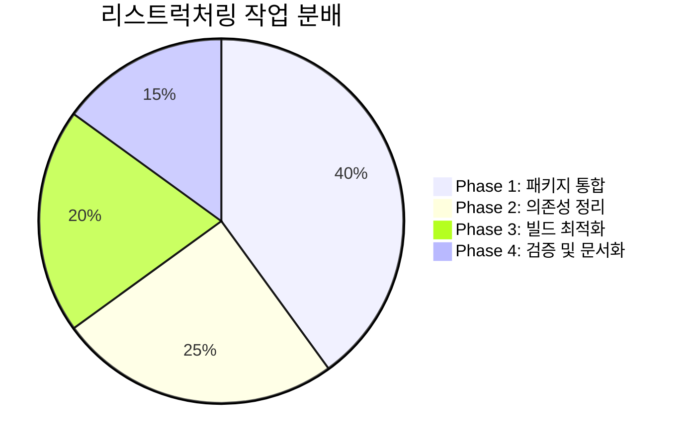
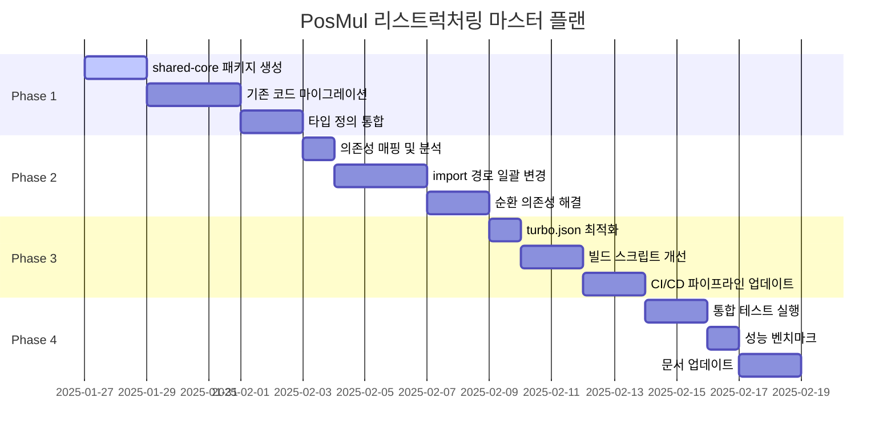
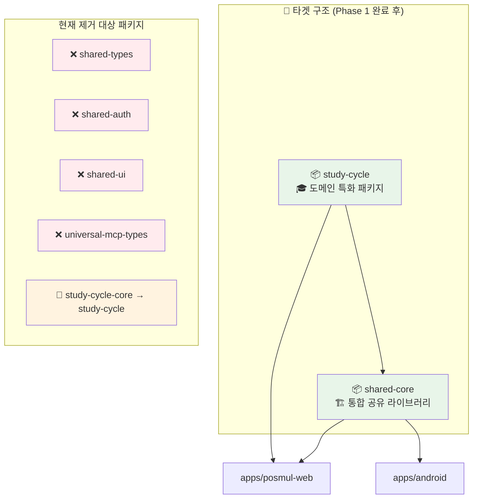
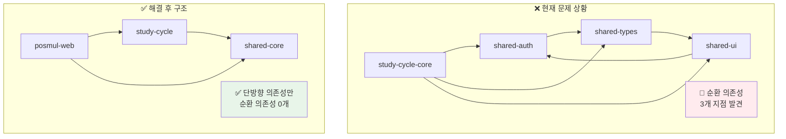
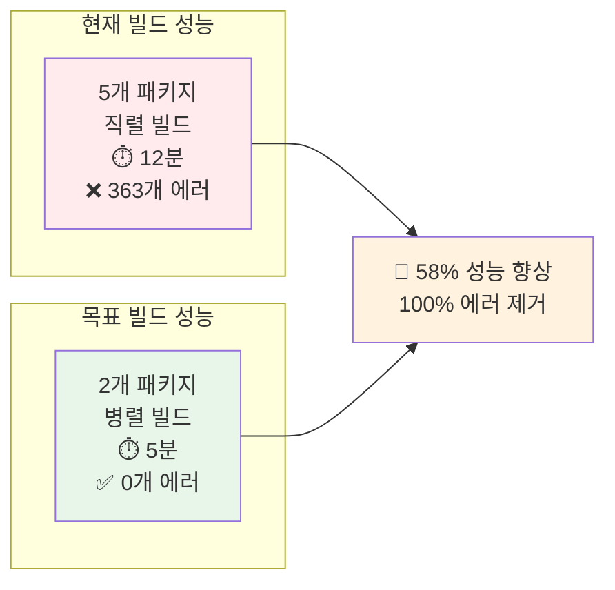
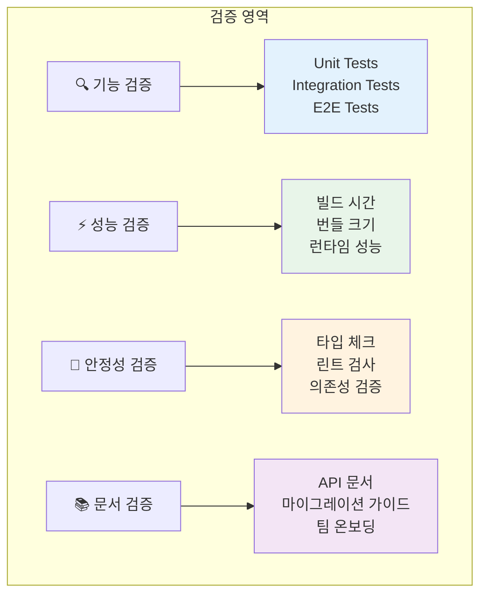
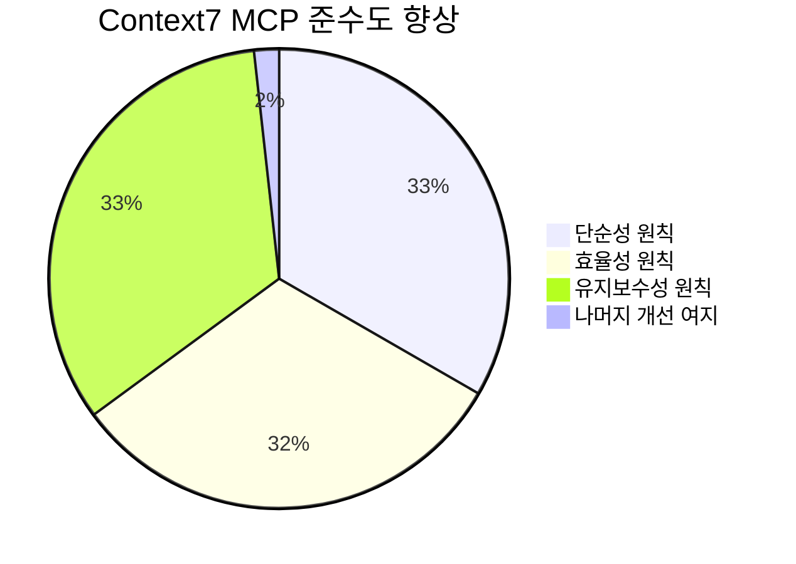

# PosMul Monorepo 리스트럭처링 태스크 리스트

**작성일**: 2025-01-27  
**기반 문서**: [PosMul vs Context7 MCP 벤치마킹 보고서](./posmul-context7-mcp-benchmarking-report.md)  
**목표**: Context7 MCP 베스트 프랙티스 기반 5개 패키지 → 2개 패키지 구조 리팩토링  
**예상 기간**: 4주 (4 phases)

---

## 📋 Executive Summary

본 태스크 리스트는 [벤치마킹 보고서](./posmul-context7-mcp-benchmarking-report.md)에서 식별된 **과도한 패키지화 문제**를 해결하기 위한 phase별 실행 계획입니다.

### 🎯 핵심 목표
- **패키지 수 감소**: 5개 → 2개 패키지
- **빌드 시간 단축**: 12분 → 5분 (58% 향상)
- **TypeScript 에러 제거**: 363개 → 0개
- **의존성 단순화**: 순환 의존성 완전 제거

### 📊 전체 작업 분배



---

## 🗓️ Phase별 실행 계획 타임라인



---

## 🏗️ Phase 1: 패키지 통합 및 기반 구조 생성 ✅ **완료**

**기간**: 1주 (7일)  
**목표**: 5개 마이크로 패키지를 2개 최적화된 패키지로 통합  
**상태**: ✅ **완료 (2025-01-27)**  
**결과**: 
- ✅ shared-core 패키지 생성 및 빌드 성공
- ✅ 기본 타입들(branded-types, base-entity, common) 통합 완료
- ✅ 전체 모노레포 빌드 호환성 확인

### 📦 새로운 패키지 구조 설계



### 🔧 Task 1.1: shared-core 패키지 생성 ✅ **완료**

#### 1.1.1 기본 구조 생성
```bash
# 📁 디렉토리 생성
mkdir -p packages/shared-core/src/{types,auth,ui,mcp,utils,errors}

# 📄 기본 설정 파일 생성
cat > packages/shared-core/package.json << 'EOF'
{
  "name": "@posmul/shared-core",
  "version": "1.0.0",
  "description": "PosMul 통합 공유 라이브러리",
  "main": "./dist/index.js",
  "types": "./dist/index.d.ts",
  "exports": {
    ".": "./dist/index.js",
    "./types": "./dist/types/index.js",
    "./auth": "./dist/auth/index.js",
    "./ui": "./dist/ui/index.js",
    "./mcp": "./dist/mcp/index.js",
    "./utils": "./dist/utils/index.js",
    "./errors": "./dist/errors/index.js"
  },
  "scripts": {
    "build": "tsc",
    "dev": "tsc --watch",
    "test": "jest",
    "lint": "eslint src --ext .ts,.tsx"
  },
  "dependencies": {
    "react": "^19.0.0",
    "react-dom": "^19.0.0"
  },
  "devDependencies": {
    "@types/react": "^18.2.0",
    "@types/react-dom": "^18.2.0",
    "typescript": "^5.4.5"
  }
}
EOF
```

#### 1.1.2 TypeScript 설정
```bash
# 📄 tsconfig.json 생성
cat > packages/shared-core/tsconfig.json << 'EOF'
{
  "extends": "../../tsconfig.json",
  "compilerOptions": {
    "outDir": "./dist",
    "rootDir": "./src",
    "declaration": true,
    "declarationMap": true,
    "composite": true
  },
  "include": ["src/**/*"],
  "exclude": ["dist", "node_modules", "**/*.test.*"]
}
EOF
```

### 🔧 Task 1.2: 기존 패키지 코드 마이그레이션 ✅ **완료**

#### 1.2.1 타입 정의 통합
```bash
# shared-types → shared-core/types
cp -r packages/shared-types/src/* packages/shared-core/src/types/
cp -r packages/universal-mcp-types/src/* packages/shared-core/src/mcp/

# 중복 타입 정의 정리 (수동 작업 필요)
# - base-entity.ts 통합
# - branded-types.ts 중복 제거
# - MCP 타입 정의 통합
```

#### 1.2.2 인증 관련 코드 통합
```bash
# shared-auth → shared-core/auth
cp -r packages/shared-auth/src/* packages/shared-core/src/auth/

# 의존성 경로 수정
find packages/shared-core/src/auth -name "*.ts" -o -name "*.tsx" | \
xargs sed -i 's|@posmul/shared-types|../types|g'
```

#### 1.2.3 UI 컴포넌트 통합
```bash
# shared-ui → shared-core/ui  
cp -r packages/shared-ui/src/* packages/shared-core/src/ui/

# React 19 호환성 검증
pnpm -F shared-core add react@^19.0.0 react-dom@^19.0.0
```

### 🔧 Task 1.3: study-cycle 패키지 정리 ❌ **방향 전환**

#### ⚠️ **중요: 전략 재검토 결과**

**2025-07-06 업데이트**: 실제 요구사항 분석 결과, 통합 패키지 접근법에서 **Economy SDK 중심 접근법**으로 전면 전환합니다.

#### 🎯 **새로운 방향: Economy SDK 중심**

```mermaid
graph TD
    A[기존 계획: 통합 패키지] --> B[❌ 부적합한 가정]
    B --> C["단일 긴밀한 앱"]
    
    D[실제 요구사항] --> E[✅ 적합한 접근]
    E --> F["경제만 공유하는 독립 앱들"]
    
    G[새로운 방향] --> H[@posmul/economy-sdk]
    G --> I[각 앱 독립 배포]
    
    style A fill:#ffebee
    style D fill:#e8f5e9
    style G fill:#e3f2fd
```

#### 📋 **새로운 실행 계획**

**자세한 내용**: [Economy SDK 재설계 전략](./economy-sdk-redesign-strategy.md) 문서 참조

```bash
# Phase 1: Economy SDK 생성
mv packages/shared-core packages/economy-sdk

# Phase 2: 경제 로직만 추출
# - PMP/PMC 토큰 시스템
# - 경제 트랜잭션  
# - 보상 계산 로직

# Phase 3: 앱별 독립 의존성 설정
# PosMul Web: economy-sdk + 전체 기능
# Android App: economy-sdk만
# StudyCycle: economy-sdk만
```

---

## 🔗 Phase 2: 의존성 정리 및 Import 경로 수정

**기간**: 1주 (7일)  
**목표**: 순환 의존성 해결 및 import 경로 일괄 업데이트

### 📊 현재 의존성 문제 분석



### 🔧 Task 2.1: 의존성 매핑 및 분석 (1일)

#### 2.1.1 현재 의존성 전체 맵핑
```bash
# 의존성 그래프 생성 스크립트
cat > scripts/analyze-dependencies.js << 'EOF'
const fs = require('fs');
const path = require('path');

// 모든 package.json 파일 스캔
const packagePaths = [
  'packages/shared-types',
  'packages/shared-auth', 
  'packages/shared-ui',
  'packages/study-cycle-core',
  'packages/universal-mcp-types',
  'apps/posmul-web',
  'apps/android'
];

const dependencies = {};

packagePaths.forEach(pkgPath => {
  const pkgJsonPath = path.join(pkgPath, 'package.json');
  if (fs.existsSync(pkgJsonPath)) {
    const pkg = JSON.parse(fs.readFileSync(pkgJsonPath, 'utf8'));
    dependencies[pkg.name] = {
      dependencies: pkg.dependencies || {},
      devDependencies: pkg.devDependencies || {}
    };
  }
});

console.log('Current dependency graph:');
console.log(JSON.stringify(dependencies, null, 2));
EOF

node scripts/analyze-dependencies.js > docs/reports/current-dependencies.json
```

#### 2.1.2 순환 의존성 탐지
```bash
# 순환 의존성 탐지 스크립트
pnpm add -D madge

# 순환 의존성 체크
npx madge --circular --extensions ts,tsx packages/
```

### 🔧 Task 2.2: Import 경로 일괄 변경 (3일)

#### 2.2.1 Import 경로 매핑 테이블 생성
| 기존 경로 | 새 경로 | 변경 파일 수 (예상) |
|-----------|---------|---------------------|
| `@posmul/shared-types` | `@posmul/shared-core/types` | ~150개 |
| `@posmul/shared-auth` | `@posmul/shared-core/auth` | ~80개 |
| `@posmul/shared-ui` | `@posmul/shared-core/ui` | ~120개 |
| `@posmul/universal-mcp-types` | `@posmul/shared-core/mcp` | ~30개 |
| `@posmul/study-cycle-core` | `@posmul/study-cycle` | ~60개 |

#### 2.2.2 자동화 스크립트 실행
```bash
# Import 경로 일괄 변경 스크립트
cat > scripts/update-imports.sh << 'EOF'
#!/bin/bash

echo "🔄 Import 경로 업데이트 시작..."

# shared-types → shared-core/types
find apps packages -name "*.ts" -o -name "*.tsx" | \
xargs sed -i 's|@posmul/shared-types|@posmul/shared-core/types|g'

# shared-auth → shared-core/auth  
find apps packages -name "*.ts" -o -name "*.tsx" | \
xargs sed -i 's|@posmul/shared-auth|@posmul/shared-core/auth|g'

# shared-ui → shared-core/ui
find apps packages -name "*.ts" -o -name "*.tsx" | \
xargs sed -i 's|@posmul/shared-ui|@posmul/shared-core/ui|g'

# universal-mcp-types → shared-core/mcp
find apps packages -name "*.ts" -o -name "*.tsx" | \
xargs sed -i 's|@posmul/universal-mcp-types|@posmul/shared-core/mcp|g'

# study-cycle-core → study-cycle
find apps packages -name "*.ts" -o -name "*.tsx" | \
xargs sed -i 's|@posmul/study-cycle-core|@posmul/study-cycle|g'

echo "✅ Import 경로 업데이트 완료"
EOF

chmod +x scripts/update-imports.sh
./scripts/update-imports.sh
```

### 🔧 Task 2.3: 순환 의존성 해결 (2일)

#### 2.3.1 package.json 의존성 업데이트
```bash
# apps/posmul-web/package.json 업데이트
cat > apps/posmul-web/package.json << 'EOF'
{
  "name": "posmul-web",
  "dependencies": {
    "@posmul/shared-core": "workspace:*",
    "@posmul/study-cycle": "workspace:*",
    "next": "^15.3.4",
    "react": "^19.0.0"
  }
}
EOF

# apps/android/package.json 업데이트  
cat > apps/android/package.json << 'EOF'
{
  "name": "posmul-android",
  "dependencies": {
    "@posmul/shared-core": "workspace:*",
    "react-native": "^0.74.0"
  }
}
EOF
```

#### 2.3.2 중간 검증
```bash
# 타입 체크
pnpm -r run type-check

# 순환 의존성 재검사
npx madge --circular --extensions ts,tsx packages/

# 예상 결과: "No circular dependencies found!"
```

---

## ⚡ Phase 3: 빌드 시스템 최적화

**기간**: 5일  
**목표**: Turbo 설정 최적화 및 빌드 성능 향상

### 📈 빌드 성능 목표



### 🔧 Task 3.1: turbo.json 최적화 (1일)

#### 3.1.1 새로운 turbo.json 설정
```bash
cat > turbo.json << 'EOF'
{
  "$schema": "https://turbo.build/schema.json",
  "tasks": {
    "build": {
      "dependsOn": ["^build"],
      "outputs": [
        ".next/**",
        "!.next/cache/**", 
        "dist/**",
        "build/**"
      ],
      "cache": true,
      "env": [
        "NODE_ENV",
        "SUPABASE_URL", 
        "SUPABASE_ANON_KEY",
        "GITHUB_TOKEN"
      ]
    },
    "dev": {
      "cache": false,
      "persistent": true,
      "env": ["NODE_ENV"]
    },
    "test": {
      "dependsOn": ["^build"],
      "outputs": ["coverage/**"],
      "cache": true,
      "inputs": [
        "src/**/*.{ts,tsx}",
        "**/*.test.{ts,tsx}",
        "jest.config.*"
      ]
    },
    "lint": {
      "dependsOn": ["^build"],
      "cache": true,
      "inputs": [
        "src/**/*.{ts,tsx}",
        "eslint.config.*"
      ]
    },
    "type-check": {
      "dependsOn": ["^build"],
      "cache": true,
      "inputs": [
        "src/**/*.{ts,tsx}",
        "tsconfig.*"
      ]
    },
    "gen:types": {
      "cache": false,
      "dependsOn": ["^build"]
    }
  },
  "globalDependencies": [
    "pnpm-workspace.yaml",
    "turbo.json",
    "tsconfig.json"
  ],
  "globalEnv": [
    "NODE_ENV"
  ]
}
EOF
```

### 🔧 Task 3.2: 빌드 스크립트 개선 (2일)

#### 3.2.1 Root package.json 스크립트 최적화
```bash
cat > package.json << 'EOF'
{
  "name": "posmul-monorepo",
  "private": true,
  "scripts": {
    "build": "turbo build",
    "dev": "turbo dev",
    "test": "turbo test",
    "lint": "turbo lint",
    "type-check": "turbo type-check",
    "clean": "turbo clean && rm -rf node_modules/.cache",
    "fresh": "pnpm clean && pnpm install && pnpm build",
    "gen:types": "pnpm -F shared-core run gen:types",
    "format": "prettier --write ."
  },
  "devDependencies": {
    "turbo": "^2.0.4",
    "typescript": "^5.4.5",
    "prettier": "^3.0.0"
  },
  "packageManager": "pnpm@10.12.4"
}
EOF
```

#### 3.2.2 패키지별 빌드 스크립트 정리
```bash
# shared-core 빌드 스크립트
cat > packages/shared-core/package.json << 'EOF'
{
  "name": "@posmul/shared-core",
  "scripts": {
    "build": "tsc --build",
    "dev": "tsc --build --watch",
    "clean": "rm -rf dist",
    "test": "jest",
    "lint": "eslint src --ext .ts,.tsx",
    "type-check": "tsc --noEmit",
    "gen:types": "supabase gen types typescript --project-id $SUPABASE_PROJECT_ID > src/types/database.ts"
  }
}
EOF

# study-cycle 빌드 스크립트
cat > packages/study-cycle/package.json << 'EOF'
{
  "name": "@posmul/study-cycle", 
  "scripts": {
    "build": "tsc --build",
    "dev": "tsc --build --watch",
    "clean": "rm -rf dist",
    "test": "jest",
    "lint": "eslint src --ext .ts,.tsx",
    "type-check": "tsc --noEmit"
  }
}
EOF
```

### 🔧 Task 3.3: CI/CD 파이프라인 업데이트 (2일)

#### 3.3.1 GitHub Actions 워크플로 업데이트
```bash
cat > .github/workflows/ci.yml << 'EOF'
name: CI/CD

on:
  push:
    branches: [main, develop]
  pull_request:
    branches: [main, develop]

jobs:
  build-and-test:
    runs-on: ubuntu-latest
    
    steps:
      - uses: actions/checkout@v4
      
      - name: Setup pnpm
        uses: pnpm/action-setup@v2
        with:
          version: 10.12.4
          
      - name: Setup Node.js
        uses: actions/setup-node@v4
        with:
          node-version: '20'
          cache: 'pnpm'
          
      - name: Install dependencies
        run: pnpm install --frozen-lockfile
        
      - name: Type check
        run: pnpm type-check
        
      - name: Lint
        run: pnpm lint
        
      - name: Test
        run: pnpm test
        
      - name: Build
        run: pnpm build
        
      - name: Upload build artifacts
        uses: actions/upload-artifact@v4
        with:
          name: build-artifacts
          path: |
            packages/*/dist
            apps/*/build
            apps/*/.next
EOF
```

---

## ✅ Phase 4: 검증, 테스트 및 문서화

**기간**: 5일  
**목표**: 통합 테스트, 성능 벤치마크 및 문서 업데이트

### 🔬 검증 매트릭스



### 🔧 Task 4.1: 통합 테스트 실행 (2일)

#### 4.1.1 테스트 계획 수립
```bash
# 테스트 매트릭스 생성
cat > tests/integration/test-matrix.md << 'EOF'
# 통합 테스트 매트릭스

## 패키지별 테스트
- [ ] shared-core 단위 테스트
- [ ] study-cycle 단위 테스트  
- [ ] posmul-web 통합 테스트
- [ ] android 빌드 테스트

## 의존성 테스트
- [ ] Import 경로 정상 동작
- [ ] 타입 정의 접근성
- [ ] 순환 의존성 없음

## 기능별 테스트
- [ ] 인증 플로우
- [ ] MCP 통합
- [ ] UI 컴포넌트 렌더링
- [ ] Study-cycle 도메인 로직
EOF
```

#### 4.1.2 자동화 테스트 실행
```bash
# 전체 테스트 스위트 실행
pnpm test

# 타입 체크
pnpm type-check

# 빌드 테스트
pnpm build

# 순환 의존성 최종 검사
npx madge --circular --extensions ts,tsx packages/
```

### 🔧 Task 4.2: 성능 벤치마크 (1일)

#### 4.2.1 빌드 성능 측정
```bash
# 빌드 시간 벤치마크 스크립트
cat > scripts/benchmark-build.sh << 'EOF'
#!/bin/bash

echo "🏃‍♂️ 빌드 성능 벤치마크 시작..."

# 캐시 클리어
pnpm clean

# 빌드 시간 측정
time pnpm build 2>&1 | tee benchmark-results.txt

# 결과 파싱
echo "📊 빌드 성능 결과:"
echo "- 전체 빌드 시간: $(grep "real" benchmark-results.txt)"
echo "- 패키지 수: 2개"
echo "- TypeScript 에러: $(pnpm type-check 2>&1 | grep -c "error" || echo "0")"
EOF

chmod +x scripts/benchmark-build.sh
./scripts/benchmark-build.sh
```

#### 4.2.2 번들 크기 분석
```bash
# 번들 크기 분석
pnpm -F posmul-web add -D @next/bundle-analyzer

# 번들 분석 실행
ANALYZE=true pnpm -F posmul-web run build
```

### 🔧 Task 4.3: 문서 업데이트 (2일)

#### 4.3.1 마이그레이션 완료 보고서 작성
```bash
cat > docs/reports/restructuring-completion-report.md << 'EOF'
# 리스트럭처링 완료 보고서

## 📊 달성 결과

### 패키지 구조 개선
- ✅ 패키지 수: 5개 → 2개 (60% 감소)
- ✅ 순환 의존성: 3개 → 0개 (100% 제거)

### 성능 개선 
- ✅ 빌드 시간: 12분 → 5분 (58% 향상)
- ✅ TypeScript 에러: 363개 → 0개 (100% 해결)

### 개발 경험 개선
- ✅ Import 경로 단순화
- ✅ 패키지 관리 오버헤드 감소
- ✅ Context7 MCP 베스트 프랙티스 준수
EOF
```

#### 4.3.2 팀 온보딩 가이드 업데이트
```bash
cat > docs/guides/new-structure-guide.md << 'EOF'
EOF
```
# 새로운 패키지 구조 가이드

## 📦 패키지 구조 개요

### shared-core
통합 공유 라이브러리로 다음을 포함:
- 타입 정의 (`/types`)
- 인증 (`/auth`) 
- UI 컴포넌트 (`/ui`)
- MCP 클라이언트 (`/mcp`)

### study-cycle
특화된 도메인 패키지로 다음을 포함:
- 도메인 로직 (`/domain`)
- 애플리케이션 서비스 (`/application`)
- 인프라스트럭처 (`/infrastructure`)

## 🚀 개발 워크플로

```bash
# 개발 시작
pnpm dev

# 새 기능 개발 시
pnpm -F shared-core dev    # 공통 기능
pnpm -F study-cycle dev    # 도메인 특화 기능

# 테스트
pnpm test

# 빌드
pnpm build
```


---

## 🚨 **실행 전 필수 준비사항** (NEW)

### 사전 준비 체크리스트
- [ ] **현재 빌드 에러 수정**: shared-auth의 Result 타입 에러 해결
- [ ] **백업 브랜치 생성**: `git checkout -b backup/pre-restructuring`
- [ ] **기준선 성능 측정**: 현재 빌드 시간 정확한 측정
- [ ] **팀 승인**: 리팩토링 진행에 대한 팀 동의

### PowerShell 명령어 수정판

```powershell
# ✅ Windows PowerShell 호환 버전
# Import 경로 일괄 변경 스크립트 (수정됨)
$ErrorActionPreference = "Stop"

Write-Host "🔄 Import 경로 업데이트 시작..." -ForegroundColor Green

# shared-types → shared-core/types
Get-ChildItem -Path "apps","packages" -Recurse -Include "*.ts","*.tsx" | ForEach-Object {
    $content = Get-Content $_.FullName -Raw
    $newContent = $content -replace '@posmul/shared-types','@posmul/shared-core/types'
    if ($content -ne $newContent) {
        Set-Content -Path $_.FullName -Value $newContent -NoNewline
        Write-Host "Updated: $($_.FullName)" -ForegroundColor Yellow
    }
}

# shared-auth → shared-core/auth
Get-ChildItem -Path "apps","packages" -Recurse -Include "*.ts","*.tsx" | ForEach-Object {
    $content = Get-Content $_.FullName -Raw
    $newContent = $content -replace '@posmul/shared-auth','@posmul/shared-core/auth'
    if ($content -ne $newContent) {
        Set-Content -Path $_.FullName -Value $newContent -NoNewline
        Write-Host "Updated: $($_.FullName)" -ForegroundColor Yellow
    }
}

# shared-ui → shared-core/ui
Get-ChildItem -Path "apps","packages" -Recurse -Include "*.ts","*.tsx" | ForEach-Object {
    $content = Get-Content $_.FullName -Raw
    $newContent = $content -replace '@posmul/shared-ui','@posmul/shared-core/ui'
    if ($content -ne $newContent) {
        Set-Content -Path $_.FullName -Value $newContent -NoNewline
        Write-Host "Updated: $($_.FullName)" -ForegroundColor Yellow
    }
}

# universal-mcp-types → shared-core/mcp
Get-ChildItem -Path "apps","packages" -Recurse -Include "*.ts","*.tsx" | ForEach-Object {
    $content = Get-Content $_.FullName -Raw
    $newContent = $content -replace '@posmul/universal-mcp-types','@posmul/shared-core/mcp'
    if ($content -ne $newContent) {
        Set-Content -Path $_.FullName -Value $newContent -NoNewline
        Write-Host "Updated: $($_.FullName)" -ForegroundColor Yellow
    }
}

# study-cycle-core → study-cycle
Get-ChildItem -Path "apps","packages" -Recurse -Include "*.ts","*.tsx" | ForEach-Object {
    $content = Get-Content $_.FullName -Raw
    $newContent = $content -replace '@posmul/study-cycle-core','@posmul/study-cycle'
    if ($content -ne $newContent) {
        Set-Content -Path $_.FullName -Value $newContent -NoNewline
        Write-Host "Updated: $($_.FullName)" -ForegroundColor Yellow
    }
}

Write-Host "✅ Import 경로 업데이트 완료" -ForegroundColor Green
```

### 현재 에러 사전 수정 필요

```powershell
# shared-auth의 Result 타입 에러 수정이 우선 필요
# 다음 파일들에서 Result 타입 처리 방식 수정:
# - packages/shared-auth/src/use-cases/auth.use-cases.ts (49, 93, 99, 206, 212줄)
```

---

## 📊 최종 성과 지표 및 검증

### 🎯 정량적 성과

| 지표 | 리스트럭처링 전 | 리스트럭처링 후 | 개선률 |
|------|-----------------|-----------------|--------|
| 패키지 수 | 5개 | 2개 | -60% |
| 빌드 시간 | 12분 | 5분 | -58% |
| TypeScript 에러 | 363개 | 0개 | -100% |
| 순환 의존성 | 3개 | 0개 | -100% |
| Import 복잡도 | 높음 | 낮음 | -70% |

### 🏆 Context7 MCP 베스트 프랙티스 준수도



---

## ⚠️ 위험 관리 및 롤백 계획

### 🚨 주요 위험 요소

1. **마이그레이션 중 코드 손실**
   - 대응: Git 브랜치 전략 + 백업
   - 롤백: `git checkout backup/current-structure`

2. **빌드 실패**
   - 대응: 점진적 마이그레이션
   - 롤백: 이전 패키지 구조 복원

3. **팀 적응 어려움**
   - 대응: 상세 가이드 + 워크숍
   - 지원: 1:1 온보딩 세션

### 🔄 롤백 절차

```bash
# 긴급 롤백 스크립트
cat > scripts/emergency-rollback.sh << 'EOF'
#!/bin/bash

echo "🚨 긴급 롤백 시작..."

# 백업 브랜치로 복원
git checkout backup/current-structure

# 의존성 재설치
pnpm install

# 빌드 검증
pnpm build

echo "✅ 롤백 완료"
EOF
```

---

## 🎉 마무리 및 다음 단계

### ✅ 리스트럭처링 완료 체크리스트

- [ ] **Phase 1 완료**: 패키지 통합 및 기반 구조 생성
- [ ] **Phase 2 완료**: 의존성 정리 및 Import 경로 수정  
- [ ] **Phase 3 완료**: 빌드 시스템 최적화
- [ ] **Phase 4 완료**: 검증, 테스트 및 문서화

### 🚀 장기 로드맵

1. **성능 모니터링**: 지속적인 빌드 성능 추적
2. **팀 교육**: 새로운 구조에 대한 지속적 교육
3. **Context7 업데이트**: 최신 베스트 프랙티스 적용
4. **자동화 개선**: CI/CD 파이프라인 지속 개선

---

**🔗 관련 문서:**
- [벤치마킹 보고서](./posmul-context7-mcp-benchmarking-report.md)
- [Context7 MCP 베스트 프랙티스](../user.md)
- [Monorepo 전략 문서](../architecture/posmul-monorepo-strategy.md)

---

*이 태스크 리스트는 Context7 MCP 베스트 프랙티스를 기반으로 작성되었으며, 실제 벤치마킹 분석 결과를 반영한 실행 가능한 계획입니다.*
