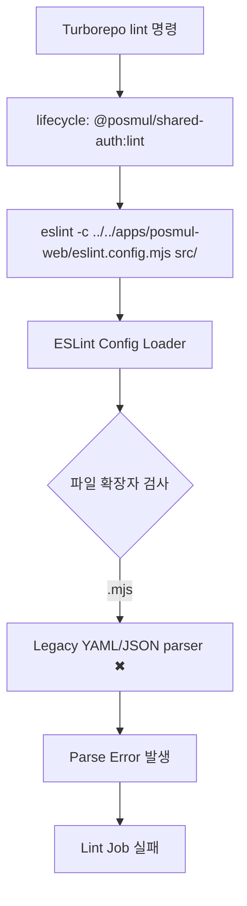
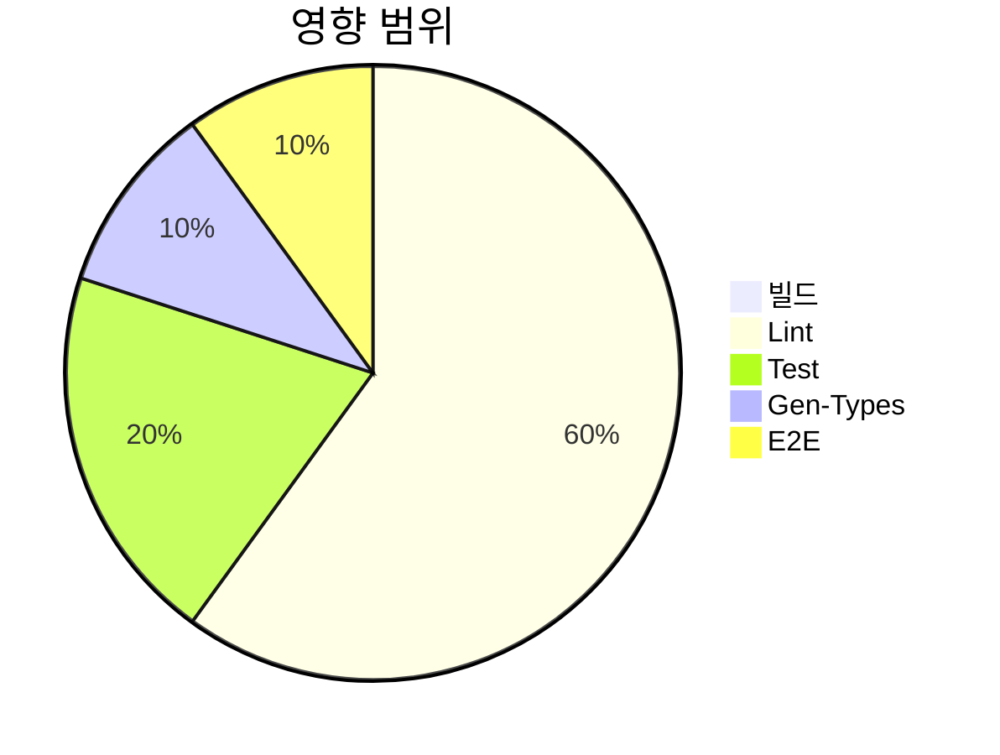
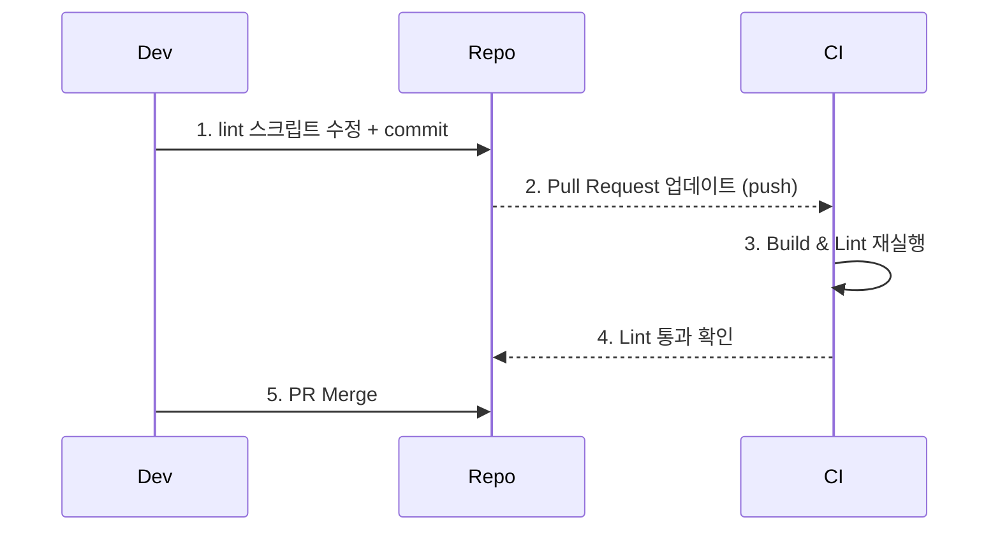
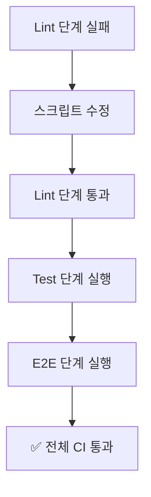

# Shared-Auth Lint Failure 분석 보고서

- **문서 버전**: 1.0
- **작성일**: 2025-07-03
- **대상 모듈**: `@posmul/shared-auth`
- **작성자**: AI Assistant

---

## 1. 문제 개요

CI 파이프라인의 **Lint 단계**에서 `@posmul/shared-auth` 패키지가 다음과 같은 오류로 실패했습니다.

```
YAMLException: Cannot read config file eslint.config.js
Error: end of the stream or a document separator is expected (3:10)
```

### 원인

1. `shared-auth` 패키지에는 **ESLint 설정 파일이 없음**.
2. `lint` 스크립트가 `-c ../../apps/posmul-web/eslint.config.mjs` 옵션으로 루트 Flat-Config를 직접 지정.
3. 그러나 **`--config-type module` 플래그**가 없어서 ESLint가 `.mjs` 파일을 **YAML**로 잘못 해석.

---

## 2. 오류 흐름 분석



---

## 3. 영향도 분석



_Lint 단계가 실패하면서 이후 **Test / E2E** 단계도 스키ップ되어 품질 검증이 중단됨_

---

## 4. 해결 전략

### 4.1 스크립트 수정

```bash
# 변경 전
eslint -c ../../apps/posmul-web/eslint.config.mjs src/ --ext .ts --max-warnings 0

# 변경 후 (Flat-Config 모듈 명시)
eslint -c ../../apps/posmul-web/eslint.config.mjs --config-type module src/ --ext .ts --max-warnings 0
```

### 4.2 대안: 로컬 ESLint 설정 파일 생성

`packages/shared-auth/eslint.config.js`

```js
export { default } from "../../apps/posmul-web/eslint.config.mjs";
```

---

## 5. 구현 단계



---

## 6. 기대 효과



- **CI 안정성 확보**
- **코드 품질 검증 프로세스 정상화**
- 이후 유사 오류 예방: Flat-Config 사용 시 `--config-type module` 명시

---

## 7. 결론

본 보고서는 `@posmul/shared-auth` 패키지의 ESLint 설정 누락 및 Flat-Config 로딩 오류를 분석하고, **스크립트 수정**을 통한 해결책을 제시했습니다. 제안한 수정안을 적용하면 Lint 단계가 정상 작동하여 전체 CI 파이프라인이 다시 건강한 상태로 돌아올 것입니다.
