# Supabase Schema 도메인 분할 작업 분석 보고서

> **문서 목적**: public schema를 domain schema로 분할하는 작업의 복잡도 및 소요 시간 분석  
> **작성일**: 2025-06-24 19:30:00  
> **대상 독자**: 개발팀, 아키텍트  
> **현재 상황**: Public schema 과부하로 인한 도메인별 분할 필요

## 📋 목차

1. [현재 상황 분석](#현재-상황-분석)
2. [작업 복잡도 평가](#작업-복잡도-평가)
3. [도메인별 분할 계획](#도메인별-분할-계획)
4. [마이그레이션 전략](#마이그레이션-전략)
5. [소요 시간 및 리소스 예측](#소요-시간-및-리소스-예측)
6. [리스크 분석](#리스크-분석)
7. [실행 계획](#실행-계획)

## 현재 상황 분석

### 🎯 문제 현황

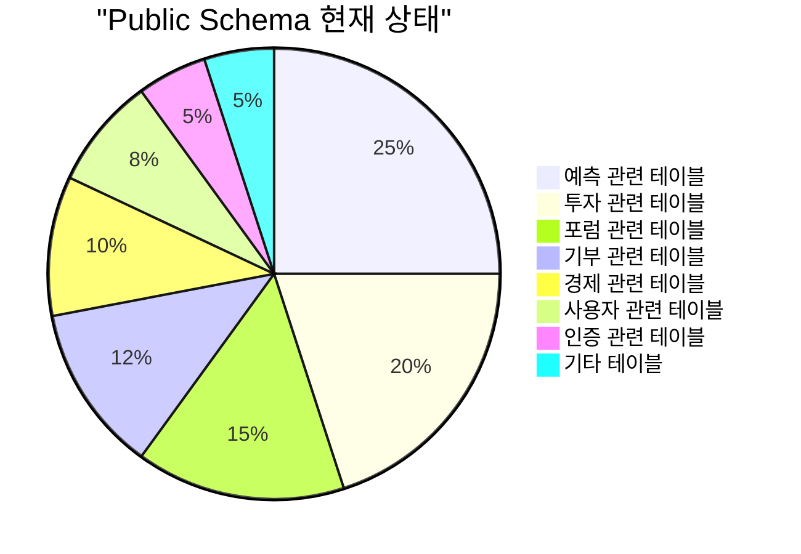

**현재 확인된 정보:**

- **총 테이블 수**: 41개 (Public Schema)
- **Auth 테이블**: 16개 (별도 Schema)
- **활성 사용자**: 6명
- **경제 거래**: 35건
- **Context 무한루프**: `list-tables` 명령 시 발생

### 📊 도메인별 테이블 분포

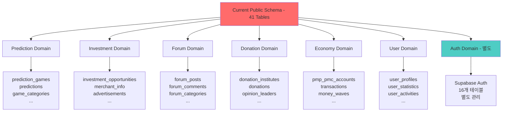

### 🔍 복잡도 요인 분석

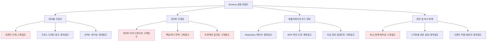

## 작업 복잡도 평가

### 🎪 복잡도 매트릭스

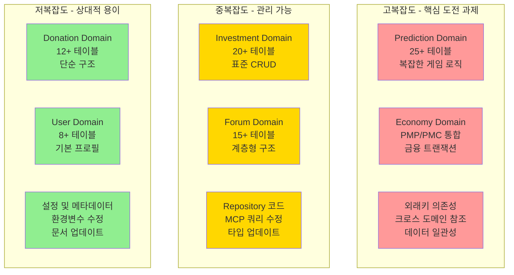

### 📈 기술적 난이도 분석

**1. 데이터베이스 레벨 (가장 복잡)**

- **외래키 재구성**: 교차 스키마 참조 처리
- **RLS 정책 재작성**: 스키마별 보안 정책
- **인덱스 최적화**: 도메인별 성능 튜닝
- **트랜잭션 경계**: 분산 트랜잭션 처리

**2. 애플리케이션 레벨 (중간 복잡도)**

- **Repository 패턴**: 스키마별 연결 관리
- **MCP 쿼리**: 프로젝트별 스키마 타겟팅
- **타입 생성**: 도메인별 TypeScript 타입

**3. 인프라 레벨 (상대적 단순)**

- **환경 변수**: 스키마별 설정
- **CI/CD 파이프라인**: 마이그레이션 자동화
- **모니터링**: 스키마별 메트릭

## 도메인별 분할 계획

### 🏗️ 목표 스키마 구조

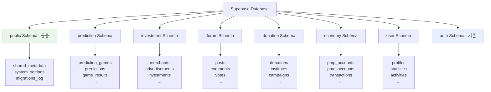

### 📊 도메인별 우선순위

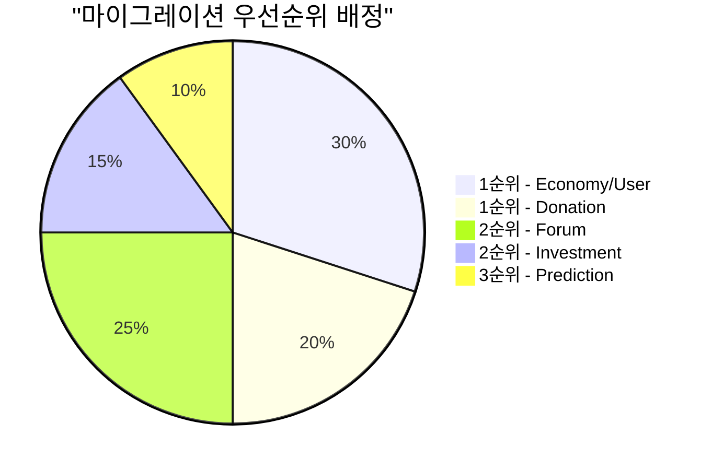

**우선순위 결정 기준:**

1. **의존성 최소화**: 다른 도메인에 덜 의존적인 순서
2. **비즈니스 영향도**: 서비스 중단 시 파급효과
3. **기술적 복잡도**: 구현 난이도 및 리스크
4. **데이터 크기**: 마이그레이션할 데이터 양

## 마이그레이션 전략

### 🔄 단계별 마이그레이션 프로세스

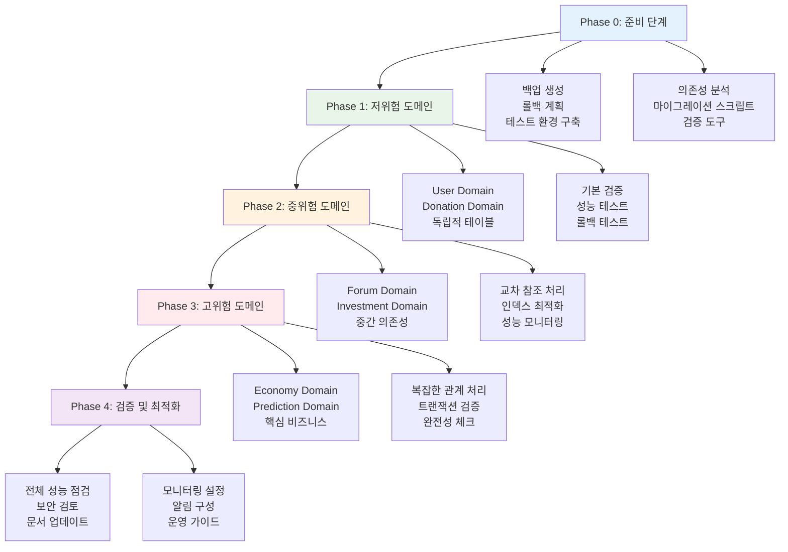

### 🛠️ 기술적 구현 방법

#### 1. 블루-그린 마이그레이션

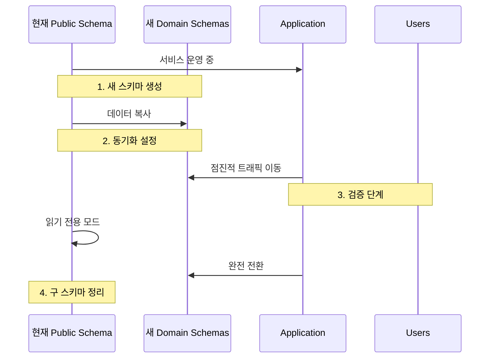

#### 2. 데이터 일관성 전략

**동시 쓰기 (Dual Write) 패턴:**

```sql
-- 트랜잭션으로 양쪽 스키마에 동시 쓰기
BEGIN;
  INSERT INTO public.predictions (...);
  INSERT INTO prediction.predictions (...);
COMMIT;
```

**이벤트 기반 동기화:**

```sql
-- 트리거를 통한 자동 동기화
CREATE OR REPLACE FUNCTION sync_to_domain_schema()
RETURNS TRIGGER AS $$
BEGIN
  INSERT INTO prediction.predictions SELECT * FROM NEW;
  RETURN NEW;
END;
$$ LANGUAGE plpgsql;
```

## 소요 시간 및 리소스 예측

### ⏰ 작업 시간 예측

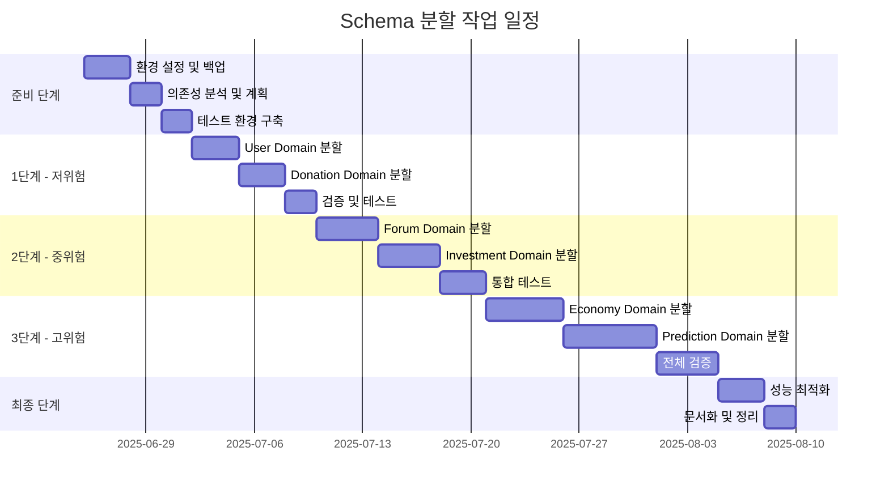

### 📊 인력 및 리소스 배정

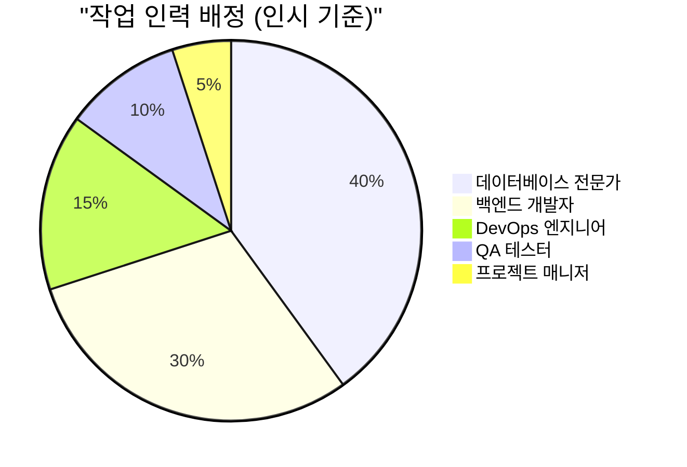

**예상 총 소요 시간:**

- **전체 기간**: 6-8주
- **실제 개발**: 28-35 작업일
- **총 인시**: 180-220 시간

**단계별 상세 예측:**

| 단계       | 기간  | 인력 | 주요 작업                | 리스크 |
| ---------- | ----- | ---- | ------------------------ | ------ |
| **준비**   | 1주   | 2명  | 분석, 설계, 환경구축     | 낮음   |
| **1단계**  | 1.5주 | 2명  | User, Donation 분할      | 낮음   |
| **2단계**  | 2주   | 3명  | Forum, Investment 분할   | 중간   |
| **3단계**  | 2.5주 | 3명  | Economy, Prediction 분할 | 높음   |
| **마무리** | 1주   | 2명  | 최적화, 문서화           | 낮음   |

## 리스크 분석

### ⚠️ 주요 리스크 요소

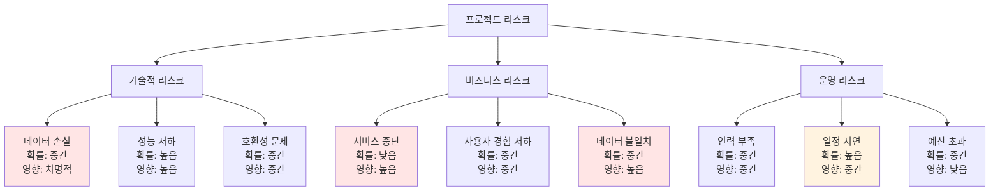

### 🛡️ 리스크 완화 전략

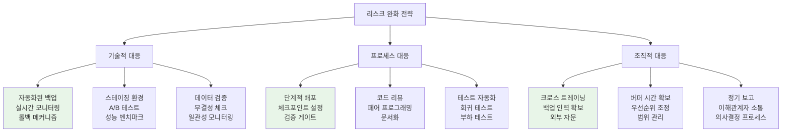

## 실행 계획

### 🚀 즉시 실행 가능한 액션 아이템

#### Week 1: 준비 단계

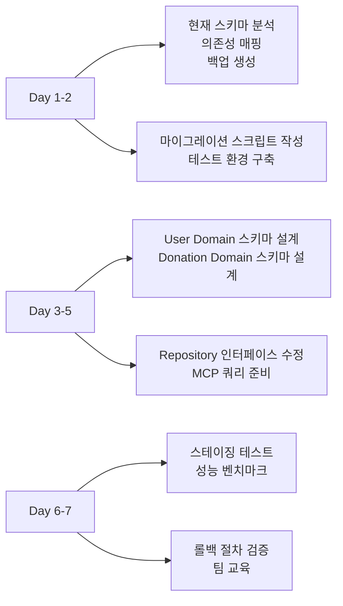

#### Week 2-3: 저위험 도메인 분할

**User Domain (3일):**

```sql
-- 1일차: 스키마 생성
CREATE SCHEMA user;

-- 2일차: 테이블 이동
CREATE TABLE user.profiles AS SELECT * FROM public.user_profiles;
CREATE TABLE user.statistics AS SELECT * FROM public.user_statistics;
CREATE TABLE user.activities AS SELECT * FROM public.user_activities;

-- 3일차: 인덱스 및 권한 설정
CREATE INDEX idx_user_profiles_user_id ON user.profiles(user_id);
-- RLS 정책 적용
```

**Donation Domain (3일):**

```sql
-- 유사한 패턴으로 진행
CREATE SCHEMA donation;
-- 6개 테이블 이동
-- 권한 및 정책 설정
```

### 📋 체크리스트

#### 마이그레이션 전 필수 점검사항

- [ ] **데이터 백업**: 전체 스키마 덤프 생성
- [ ] **의존성 분석**: 모든 외래키 관계 문서화
- [ ] **성능 기준선**: 현재 쿼리 성능 측정
- [ ] **모니터링 설정**: 실시간 알림 구성
- [ ] **롤백 계획**: 각 단계별 복구 절차
- [ ] **테스트 시나리오**: 기능 및 성능 테스트

#### 도메인별 마이그레이션 체크리스트

- [ ] **스키마 생성**: `CREATE SCHEMA domain_name`
- [ ] **테이블 이동**: 구조 + 데이터 복사
- [ ] **인덱스 재생성**: 성능 최적화
- [ ] **RLS 정책**: 보안 규칙 적용
- [ ] **외래키 수정**: 크로스 스키마 참조
- [ ] **권한 설정**: 사용자별 접근 권한
- [ ] **애플리케이션 코드**: Repository 수정
- [ ] **기능 테스트**: 모든 CRUD 작업 검증
- [ ] **성능 테스트**: 쿼리 성능 확인

### 💡 권장사항

#### 1. 점진적 접근

- **한 번에 하나씩**: 도메인별 순차 진행
- **검증 후 다음 단계**: 각 단계 완료 후 충분한 검증
- **빠른 롤백**: 문제 발생 시 즉시 이전 상태 복구

#### 2. 모니터링 강화

- **실시간 대시보드**: 마이그레이션 진행 상황 시각화
- **성능 메트릭**: 쿼리 응답시간, 처리량 모니터링
- **오류 알림**: 실시간 오류 감지 및 알림

#### 3. 팀 협업

- **데일리 스탠드업**: 매일 진행 상황 공유
- **위험 요소 공유**: 발견된 이슈 즉시 공유
- **지식 전파**: 마이그레이션 과정 문서화

---

## 🎯 결론 및 권장사항

### 📊 전체 작업 예측

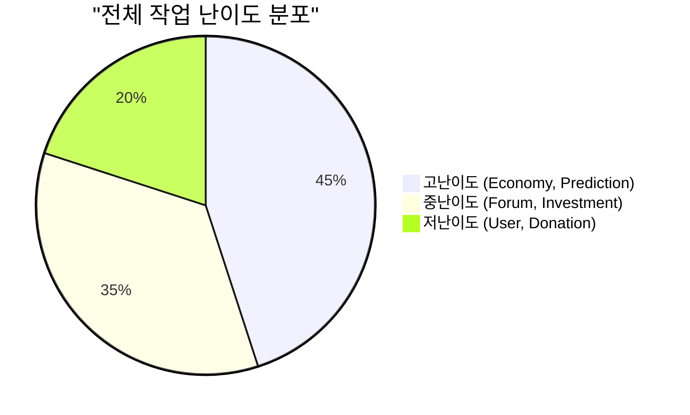

### 🏆 성공 요인

1. **충분한 준비**: 의존성 분석 및 백업 전략
2. **단계적 접근**: 위험도 기반 우선순위
3. **지속적 모니터링**: 실시간 성능 추적
4. **빠른 피드백**: 각 단계별 검증 및 조정
5. **팀 협업**: 명확한 역할 분담 및 소통

### 💰 비용 대비 효과

**투입 비용:**

- **인력**: 180-220 시간
- **인프라**: 스테이징 환경 추가 비용
- **기회비용**: 신규 기능 개발 지연

**기대 효과:**

- **성능 향상**: 도메인별 최적화로 쿼리 성능 개선
- **유지보수성**: 명확한 도메인 경계로 코드 관리 용이
- **확장성**: 도메인별 독립적 확장 가능
- **보안**: 세분화된 권한 관리

**권장 결정:** ✅ **진행 권장**

- 현재 복잡도가 임계점에 도달
- 장기적 이익이 단기 비용을 상회
- 팀의 DDD 아키텍처 역량 강화 기회

---

## 📝 문서 정보

**작성일**: 2025-06-24 19:30:00  
**버전**: 1.0  
**작성자**: AI Agent (Claude)  
**검토 필요**: 데이터베이스 아키텍트, 개발팀 리드  
**승인자**: CTO

### 📈 문서 활용도

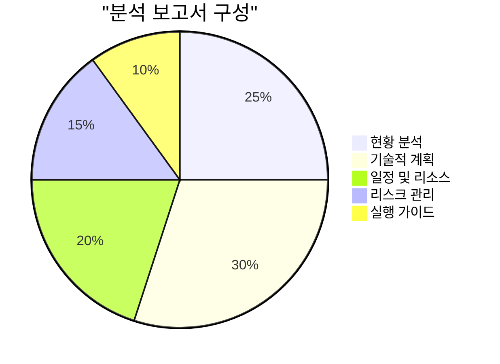

이 분석 보고서는 schema 분할 작업의 전체적인 그림을 제공하며, 실제 실행 시 세부 계획 수립의 기초 자료로 활용할 수 있습니다.
