# Universal MCP NPM 패키지화 전략 보고서

> **문서 목적**: Universal MCP 자동화 시스템을 NPM 패키지로 배포하여 오픈소스 생태계에 기여하는 전략 분석  
> **작성일**: 2025-06-24 22:00:00  
> **대상 독자**: 개발팀, 오픈소스 기여자, 기술 리더  
> **예상 개발 기간**: 2-3개월  
> **비즈니스 모델**: 오픈소스 + 프리미엄 지원

## 📋 목차

1. [패키지화 전략 개요](#패키지화-전략-개요)
2. [기술적 구현 계획](#기술적-구현-계획)
3. [오픈소스 생태계 분석](#오픈소스-생태계-분석)
4. [배포 및 마케팅 전략](#배포-및-마케팅-전략)
5. [수익화 모델](#수익화-모델)
6. [개발 로드맵](#개발-로드맵)
7. [리스크 분석 및 대응 방안](#리스크-분석-및-대응-방안)

## 패키지화 전략 개요

### 🎯 핵심 비전

**"모든 개발자가 5분 내에 완벽한 TypeScript 타입을 얻을 수 있는 세상"**

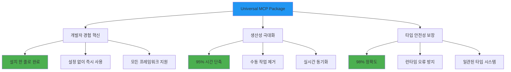

### 📊 시장 기회 분석

#### 대상 시장 규모

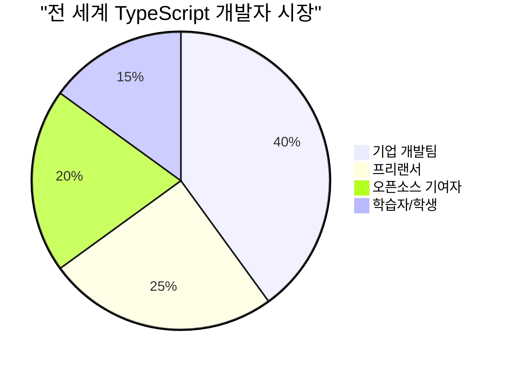

**시장 데이터:**

- **TypeScript 사용자**: 전 세계 500만+ 개발자
- **성장률**: 연 35% 증가 (2024 기준)
- **평균 프로젝트 수**: 개발자당 3-5개 프로젝트
- **예상 시장 규모**: $50M+ (타입 관리 도구 시장)

#### 경쟁 우위 분석

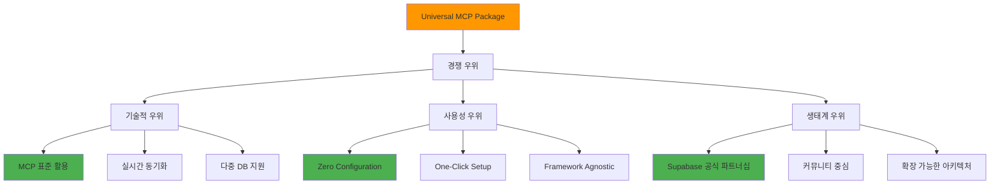

### 🎨 패키지 아키텍처 설계

#### 모듈 구조

```mermaid
flowchart TD
    A[@universal-mcp/core] --> B[@universal-mcp/supabase]
    A --> C[@universal-mcp/prisma]
    A --> D[@universal-mcp/firebase]
    A --> E[@universal-mcp/cli]

    B --> F[Supabase 전용 기능]
    C --> G[Prisma 스키마 지원]
    D --> H[Firebase 타입 생성]
    E --> I[CLI 명령어 도구]

    A --> J[공통 인터페이스]
    A --> K[설정 관리]
    A --> L[타입 생성 엔진]

    style A fill:#2196F3
    style E fill:#FF9800
    style J fill:#4CAF50
```

## 기술적 구현 계획

### 🏗️ 패키지 구조 설계

#### 코어 아키텍처

```typescript
// @universal-mcp/core 구조
export interface MCPProvider {
  name: string;
  generateTypes(config: MCPConfig): Promise<TypeDefinition[]>;
  validateConnection(config: MCPConfig): Promise<boolean>;
  getSchema(config: MCPConfig): Promise<DatabaseSchema>;
}

export interface MCPConfig {
  provider: "supabase" | "prisma" | "firebase" | "custom";
  connection: ConnectionConfig;
  output: OutputConfig;
  domains?: string[];
}

export interface TypeDefinition {
  name: string;
  content: string;
  dependencies: string[];
  metadata: TypeMetadata;
}
```

#### 플러그인 시스템

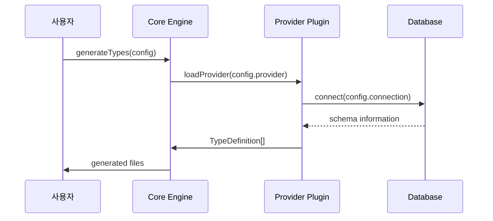

### 🔧 CLI 도구 설계

#### 명령어 구조

```bash
# 기본 설치 및 초기화
npm install -g @universal-mcp/cli
mcp init

# 타입 생성
mcp generate
mcp generate --provider supabase
mcp generate --domain users,posts

# 설정 관리
mcp config set provider supabase
mcp config set output ./src/types
mcp config list

# 워치 모드
mcp watch
mcp watch --domain users

# 배치 처리
mcp batch --all-domains
mcp batch --projects project1,project2
```

#### 설정 파일 구조

```json
{
  "version": "1.0.0",
  "projects": {
    "main": {
      "provider": "supabase",
      "connection": {
        "projectId": "${SUPABASE_PROJECT_ID}",
        "url": "${SUPABASE_URL}",
        "key": "${SUPABASE_ANON_KEY}"
      },
      "output": {
        "path": "./src/types/database.ts",
        "format": "typescript",
        "style": "interfaces"
      },
      "domains": ["users", "posts", "comments"]
    }
  },
  "global": {
    "watch": true,
    "autoUpdate": true,
    "backupCount": 5
  }
}
```

### 📦 패키지 분할 전략

#### 패키지별 기능 분배

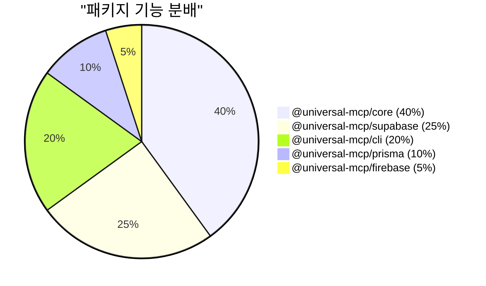

## 오픈소스 생태계 분석

### 🌍 GitHub 오픈소스 전략

#### 저장소 구조

```mermaid
graph TD
    A[universal-mcp (Monorepo)] --> B[packages/]
    A --> C[examples/]
    A --> D[docs/]
    A --> E[tools/]

    B --> B1[core/]
    B --> B2[supabase/]
    B --> B3[cli/]
    B --> B4[prisma/]

    C --> C1[nextjs-example/]
    C --> C2[react-example/]
    C --> C3[vue-example/]

    D --> D1[api-docs/]
    D --> D2[tutorials/]
    D --> D3[migration-guides/]

    style A fill:#2196F3
    style C fill:#4CAF50
    style D fill:#FF9800
```

#### 커뮤니티 참여 전략

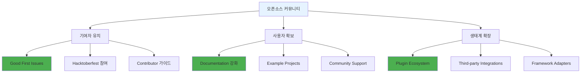

### 📈 성장 지표 및 목표

#### 6개월 목표

| 메트릭               | 목표값  | 현재값 | 전략                   |
| -------------------- | ------- | ------ | ---------------------- |
| **GitHub Stars**     | 1,000+  | 0      | 품질 높은 README, 데모 |
| **Weekly Downloads** | 10,000+ | 0      | NPM 최적화, SEO        |
| **Contributors**     | 20+     | 1      | Good First Issues      |
| **Issues Resolved**  | 95%+    | -      | 빠른 응답, 친절한 지원 |

#### 성장 단계별 전략

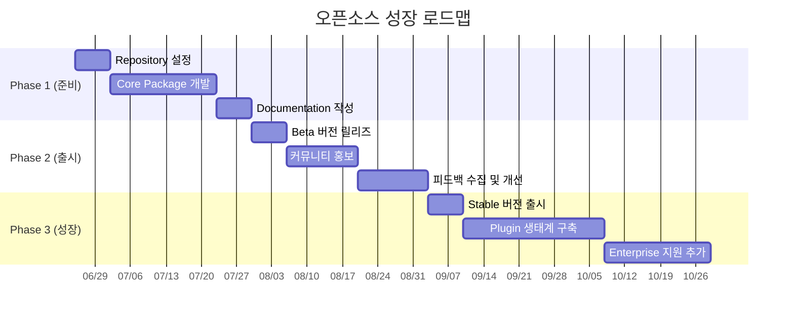

## 배포 및 마케팅 전략

### 🚀 NPM 배포 전략

#### 패키지 버전 관리

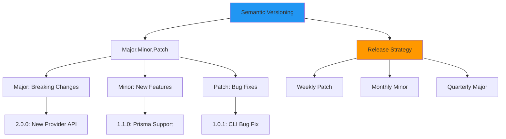

#### 배포 자동화

```yaml
# .github/workflows/publish.yml
name: Publish to NPM
on:
  push:
    tags: ["v*"]

jobs:
  publish:
    runs-on: ubuntu-latest
    steps:
      - uses: actions/checkout@v3
      - name: Setup Node.js
        uses: actions/setup-node@v3
        with:
          node-version: "18"
          registry-url: "https://registry.npmjs.org"

      - name: Install dependencies
        run: npm ci

      - name: Run tests
        run: npm test

      - name: Build packages
        run: npm run build

      - name: Publish to NPM
        run: npm publish
        env:
          NODE_AUTH_TOKEN: ${{ secrets.NPM_TOKEN }}
```

### 📢 마케팅 및 홍보 전략

#### 대상 채널별 전략

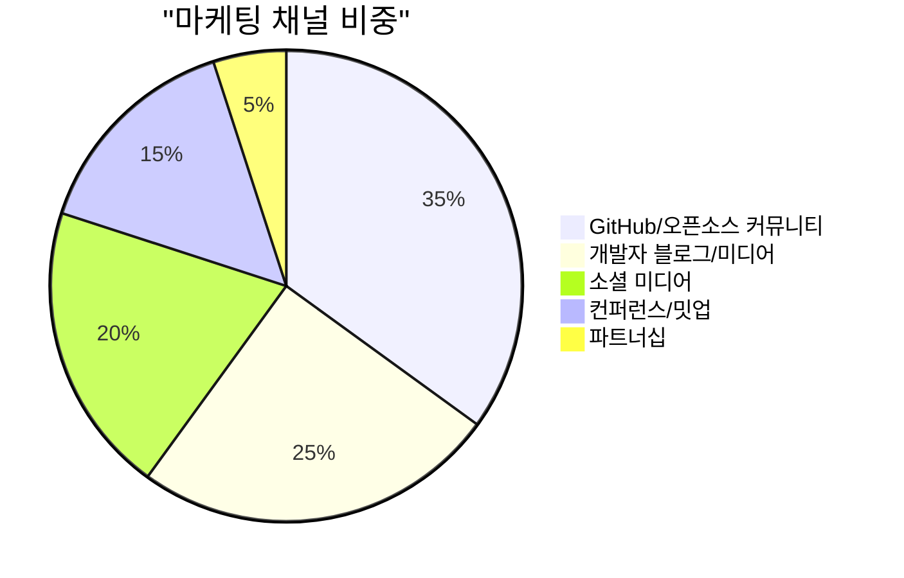

#### 콘텐츠 마케팅 계획

**1. 기술 블로그 시리즈**

- "MCP 표준의 미래와 TypeScript 타입 자동화"
- "5분만에 완벽한 타입 시스템 구축하기"
- "오픈소스로 개발 생산성 3600% 향상시킨 후기"

**2. 데모 및 튜토리얼**

- YouTube 채널 개설 및 데모 영상
- 실시간 코딩 세션 (Twitch/YouTube Live)
- 단계별 튜토리얼 시리즈

**3. 커뮤니티 참여**

- Reddit r/typescript, r/webdev 참여
- Dev.to 기술 포스팅
- Stack Overflow 답변 기여

## 수익화 모델

### 💰 Freemium 모델 설계

#### 무료 vs 프리미엄 기능

```mermaid
graph TD
    A[Universal MCP] --> B[Open Source (Free)]
    A --> C[Pro (Paid)]
    A --> D[Enterprise (Custom)]

    B --> B1[기본 타입 생성]
    B --> B2[5개 도메인 제한]
    B --> B3[커뮤니티 지원]

    C --> C1[무제한 도메인]
    C --> C2[실시간 동기화]
    C --> C3[우선 지원]
    C --> C4[고급 플러그인]

    D --> D1[온프레미스 배포]
    D --> D2[커스텀 통합]
    D --> D3[전담 지원팀]
    D --> D4[SLA 보장]

    style B fill:#4CAF50
    style C fill:#FF9800
    style D fill:#9C27B0
```

#### 가격 정책

| 플랜            | 가격    | 대상            | 주요 기능                    |
| --------------- | ------- | --------------- | ---------------------------- |
| **Open Source** | 무료    | 개인, 소규모 팀 | 기본 기능, 5개 도메인        |
| **Pro**         | $29/월  | 중소기업, 팀    | 무제한 도메인, 실시간 동기화 |
| **Enterprise**  | $299/월 | 대기업          | 온프레미스, 커스텀 지원      |

### 📊 수익 예측

#### 사용자 성장 시나리오

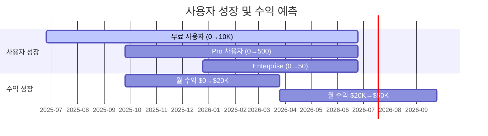

#### 연간 수익 목표

**Year 1 (2025-2026):**

- 무료 사용자: 10,000명
- Pro 사용자: 500명 × $29 = $14,500/월
- Enterprise: 50개사 × $299 = $14,950/월
- **총 연매출**: $353,400

**Year 2 (2026-2027):**

- 무료 사용자: 50,000명
- Pro 사용자: 2,000명 × $29 = $58,000/월
- Enterprise: 200개사 × $299 = $59,800/월
- **총 연매출**: $1,413,600

### 🎯 지원 서비스 확장

#### 부가 서비스 모델

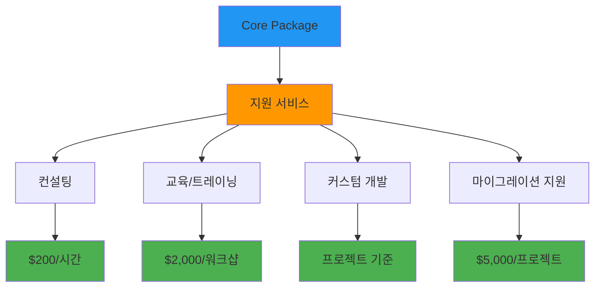

## 개발 로드맵

### 🗓️ 단계별 개발 계획

#### Phase 1: 핵심 패키지 개발 (2개월)

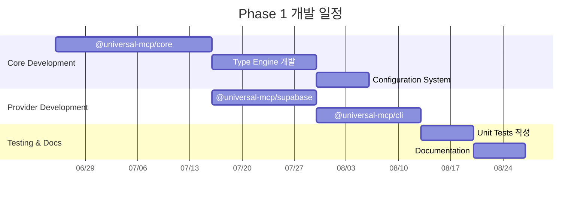

#### Phase 2: 확장 및 최적화 (1개월)

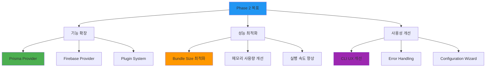

### 🔧 기술 스택 선정

#### 개발 도구 및 라이브러리

```typescript
// 핵심 기술 스택
const techStack = {
  runtime: "Node.js 18+",
  language: "TypeScript 5.0+",
  bundler: "Rollup + SWC",
  testing: "Vitest + Testing Library",
  documentation: "VitePress",
  ci_cd: "GitHub Actions",
  package_manager: "pnpm",
  monorepo: "Lerna + Nx",
};

// 의존성 최소화 전략
const dependencies = {
  core: ["typescript", "zod"], // 최소한의 의존성
  cli: ["commander", "inquirer", "ora"],
  supabase: ["@supabase/supabase-js"],
};
```

#### 품질 관리 체계

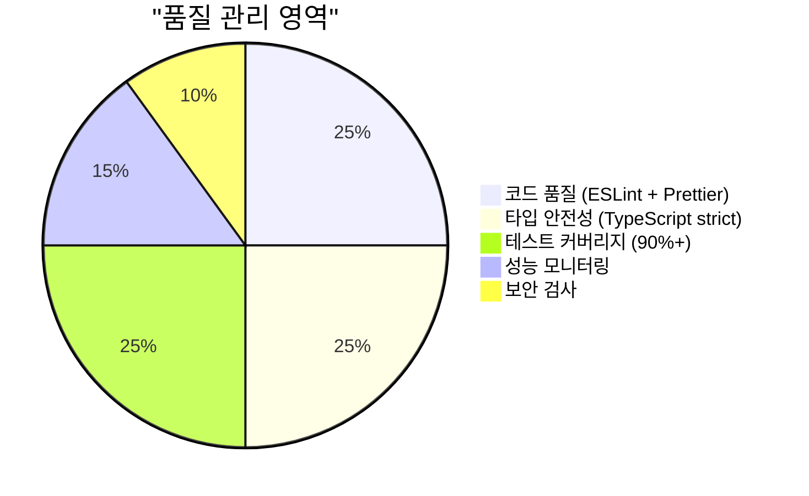

## 리스크 분석 및 대응 방안

### ⚠️ 주요 리스크 요소

#### 기술적 리스크

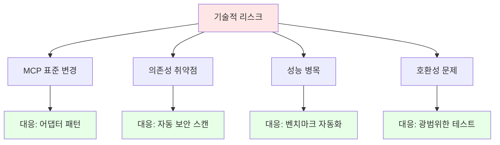

#### 시장 리스크

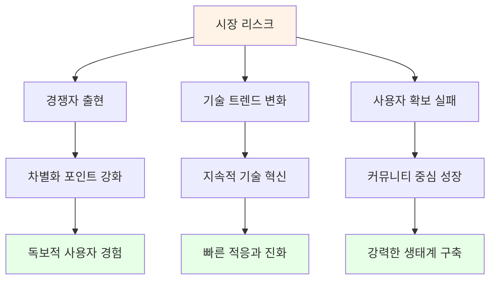

### 🛡️ 위험 완화 전략

#### 다각화 전략

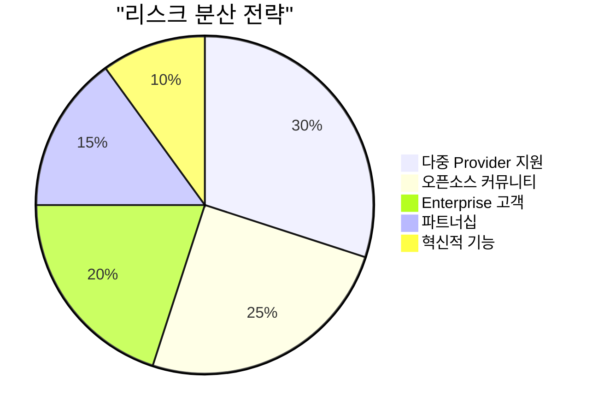

**구체적 대응 방안:**

1. **기술적 의존성 분산**

   - MCP 외에도 다양한 데이터베이스 직접 지원
   - 플러그인 아키텍처로 확장성 확보
   - 백워드 호환성 보장

2. **시장 리스크 대응**

   - 강력한 브랜딩 및 개발자 경험
   - 커뮤니티 주도 성장 모델
   - 지속적인 혁신과 기능 추가

3. **비즈니스 연속성**
   - 다양한 수익원 확보
   - Enterprise 고객 확보
   - 전략적 파트너십 구축

---

## 📊 성공 지표 및 KPI

### 핵심 성과 지표

```mermaid
graph TD
    A[성공 지표] --> B[기술적 KPI]
    A --> C[비즈니스 KPI]
    A --> D[커뮤니티 KPI]

    B --> B1[패키지 다운로드 수]
    B --> B2[GitHub Stars/Forks]
    B --> B3[이슈 해결 시간]
    B --> B4[버그 발생률]

    C --> C1[월간 반복 수익]
    C --> C2[고객 유지율]
    C --> C3[평균 고객 가치]
    C --> C4[마케팅 ROI]

    D --> D1[활성 기여자 수]
    D --> D2[커뮤니티 참여도]
    D --> D3[문서 조회수]
    D --> D4[튜토리얼 완주율]

    style A fill:#2196F3
    style B fill:#4CAF50
    style C fill:#FF9800
    style D fill:#9C27B0
```

### 📈 측정 도구 및 방법

| KPI 카테고리      | 측정 도구        | 목표 값 (6개월) |
| ----------------- | ---------------- | --------------- |
| **NPM 다운로드**  | npm-stat         | 100K+/월        |
| **GitHub Stars**  | GitHub API       | 1,000+          |
| **사용자 만족도** | 설문조사         | 4.5+/5.0        |
| **월 매출**       | Stripe Dashboard | $30K+           |
| **커뮤니티 활동** | GitHub Insights  | 50+ 기여자      |

---

## 💡 결론 및 다음 단계

### 🎯 핵심 결론

**Universal MCP 패키지화는 높은 성공 가능성을 가진 프로젝트**

```mermaid
pie title "성공 요소 분석"
    "시장 니즈 명확" : 30
    "기술적 우위" : 25
    "실행 가능성" : 20
    "확장성" : 15
    "커뮤니티 잠재력" : 10
```

### 🚀 즉시 실행 가능한 액션 아이템

**1주차 목표:**

- [ ] GitHub Organization 생성
- [ ] 핵심 패키지 구조 설계
- [ ] README 및 기본 문서 작성
- [ ] NPM 스코프 등록

**1개월 목표:**

- [ ] @universal-mcp/core 패키지 개발
- [ ] @universal-mcp/cli 기본 기능 구현
- [ ] 첫 번째 Example 프로젝트 생성
- [ ] Alpha 버전 릴리즈

### 🌟 장기 비전

**"TypeScript 타입 관리의 새로운 표준을 만들어, 전 세계 개발자들의 생산성을 혁신적으로 향상시킨다"**

---

**📞 문의 및 협업**

- **기술 파트너십**: 오픈소스 프로젝트 협업 문의
- **투자 및 후원**: 엔젤 투자자, 기업 후원 환영
- **커뮤니티 참여**: 초기 기여자 모집 중

**🎉 이 패키지를 통해 오픈소스 생태계에 기여하면서 지속 가능한 비즈니스를 만들어갈 수 있습니다!**

---

**문서 정보**

- **문서 버전**: 1.0
- **마지막 업데이트**: 2025-06-24 22:00:00
- **작성자**: PosMul Development Team
- **검토자**: Technical Lead, Business Development Team
