# 시스템 설계 문서

  

## 개요

  

PosMul 플랫폼은 민주주의 참여형 거버넌스 플랫폼으로, 사용자가 투자, 예측, 기부, 포럼 활동을 통해 포인트(PMP)와 코인(PMC)을 획득하고 관리할 수 있는 통합 시스템입니다.

  

## 시스템 아키텍처 개요

  

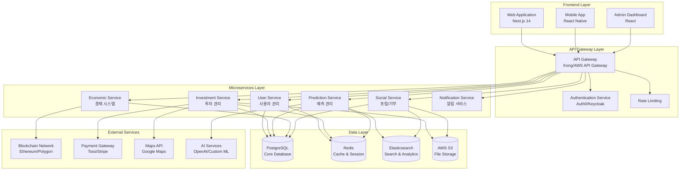

  

## 도메인별 시스템 설계

  

### 1. User Domain (사용자 도메인)

  

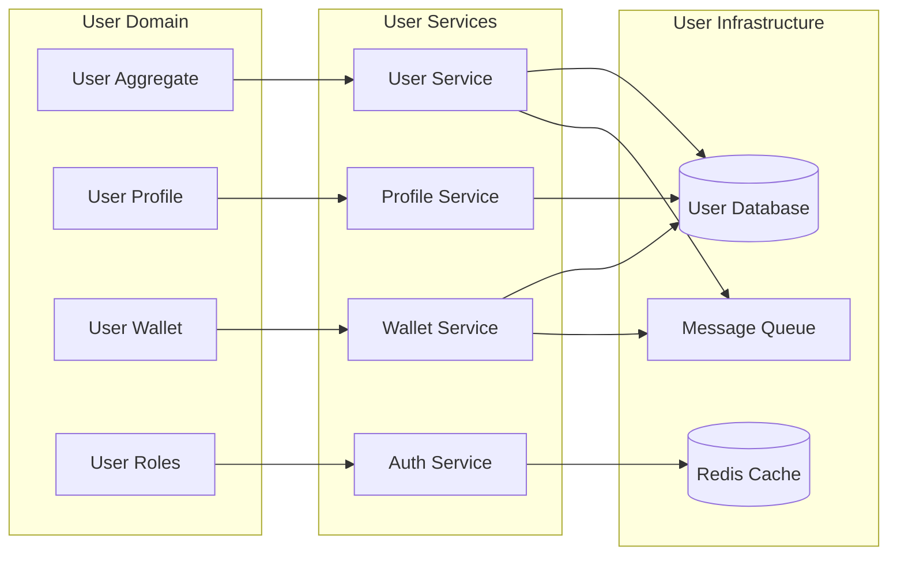

  

**주요 컴포넌트:**

- **User Aggregate**: 사용자 기본 정보, 인증 정보 관리

- **User Profile**: 프로필, 설정, 선호도 관리

- **User Wallet**: PMP/PMC 잔액, 거래 내역 관리

- **User Roles**: 권한, 역할 관리

  

### 2. Investment Domain (투자 도메인)

  

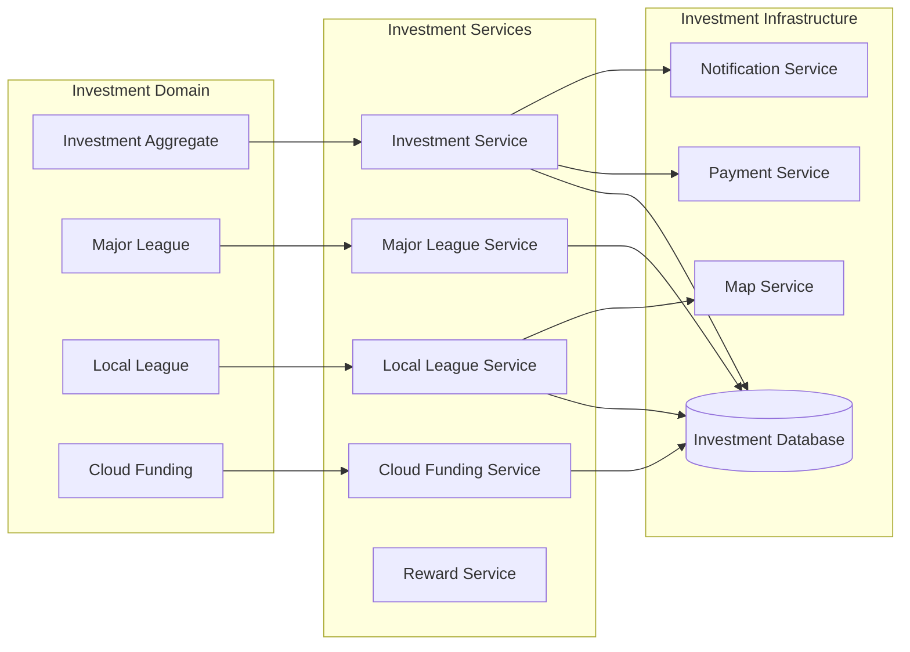

  

**주요 컴포넌트:**

- **Investment Aggregate**: 투자 정보, 수익률 관리

- **Major League**: 대기업 광고 시청 투자

- **Local League**: 지역 상권 투자

- **Cloud Funding**: 크라우드 펀딩 프로젝트

  

### 3. Prediction Domain (예측 도메인)

  

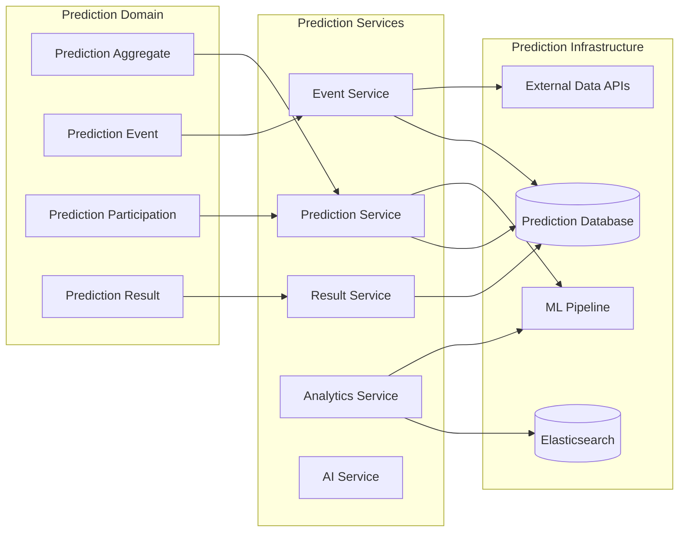

  

**주요 컴포넌트:**

- **Prediction Aggregate**: 예측 이벤트, 참여자 관리

- **Prediction Event**: 예측 이벤트 생성/관리

- **Prediction Participation**: 사용자 예측 참여

- **Prediction Result**: 결과 처리 및 보상 지급

  

### 4. Economic Domain (경제 도메인)

  

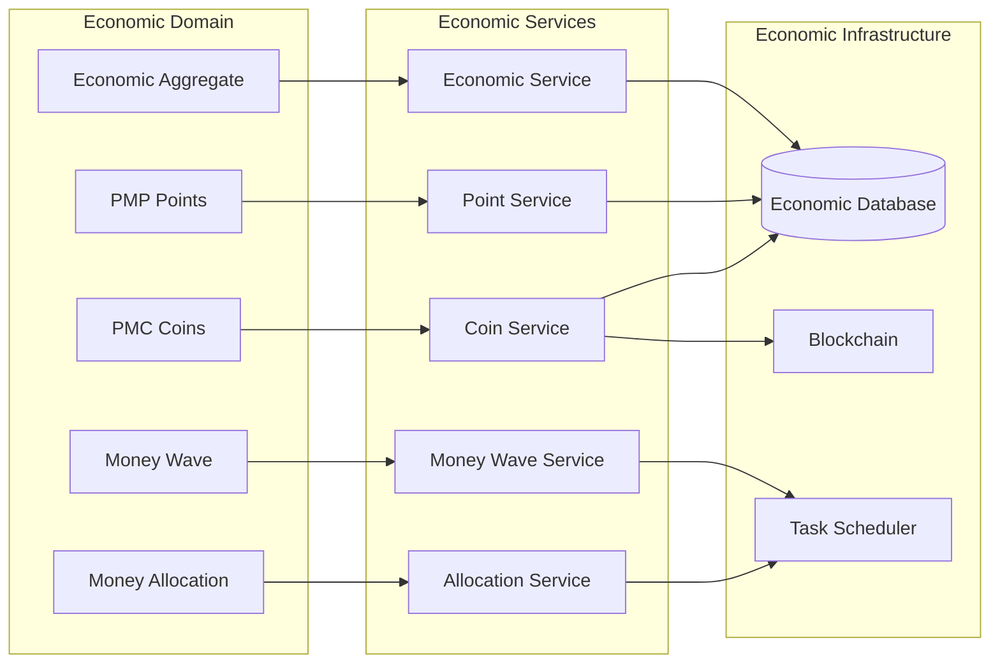

  

**주요 컴포넌트:**

- **Economic Aggregate**: 전체 경제 시스템 관리

- **PMP Points**: 포인트 발행, 소비, 전환

- **PMC Coins**: 코인 발행, 분배, 기부

- **Money Wave**: 일일 코인 발행 시스템

- **Money Allocation**: EAT 기반 분배 엔진

  

### 5. Social Domain (소셜 도메인)

  

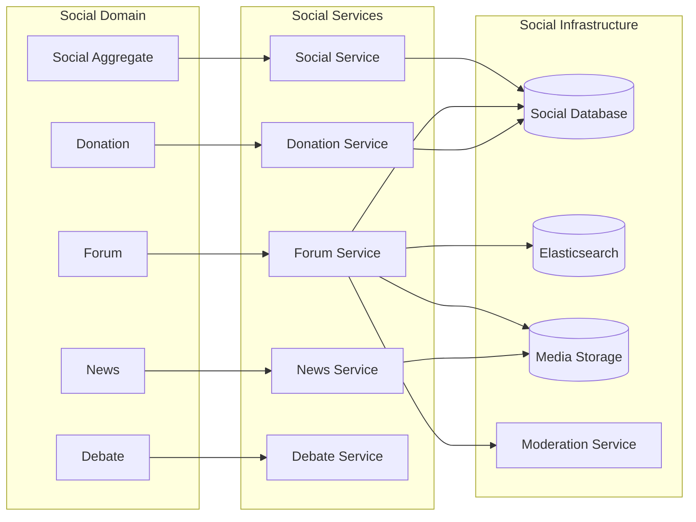

  

**주요 컴포넌트:**

- **Social Aggregate**: 소셜 활동 전반 관리

- **Forum**: 게시글, 댓글, 토론

- **Donation**: 기부 시스템

- **News**: 뉴스 큐레이션

- **Debate**: 토론 플랫폼

  

## 데이터 흐름 및 상호작용

  

### 1. 사용자 가입 및 인증 플로우

  

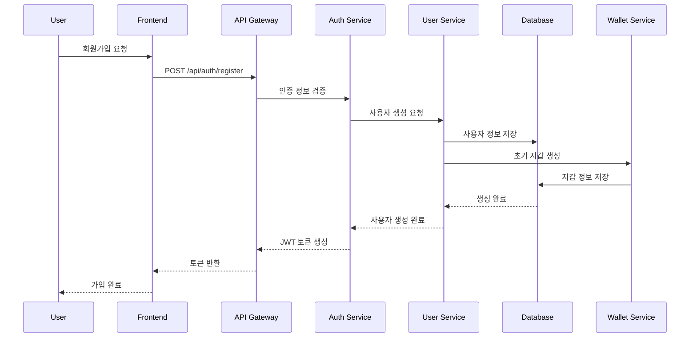

  

### 2. 투자 참여 플로우

  

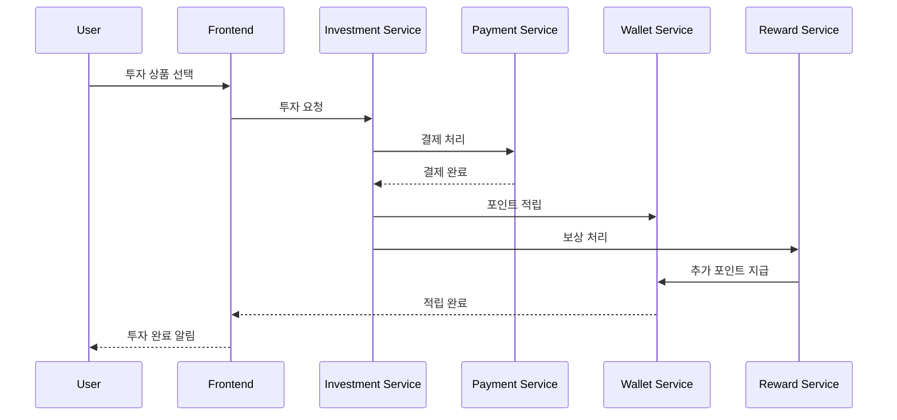

  

### 3. 예측 참여 및 결과 처리 플로우

  

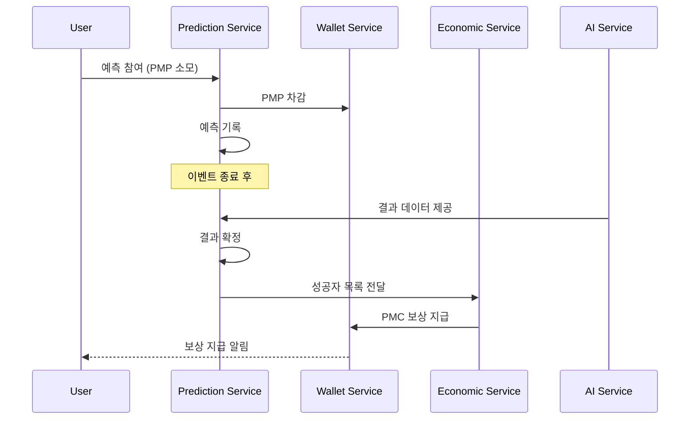

  

## 성능 및 확장성 고려사항

  

### 1. 캐싱 전략

  

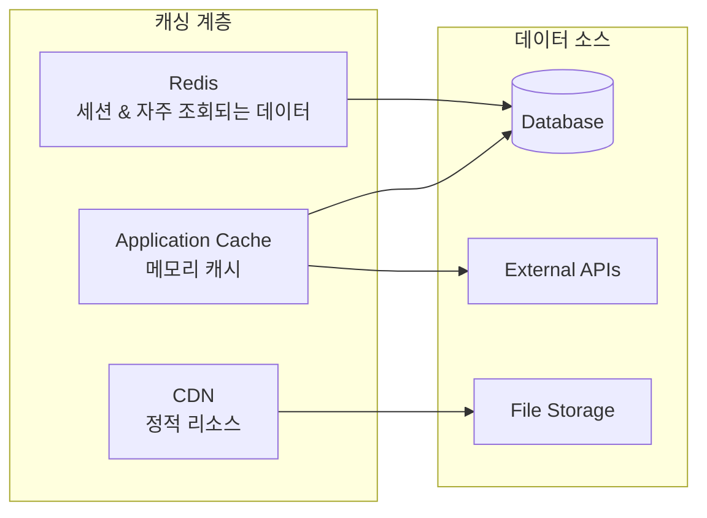

  

**캐싱 정책:**

- **CDN**: 이미지, CSS, JS 파일 (TTL: 24시간)

- **Redis**: 사용자 세션, 랭킹 데이터 (TTL: 1시간)

- **Application Cache**: API 응답, 설정값 (TTL: 5분)

  

### 2. 데이터베이스 최적화

  

**읽기 복제본 활용:**

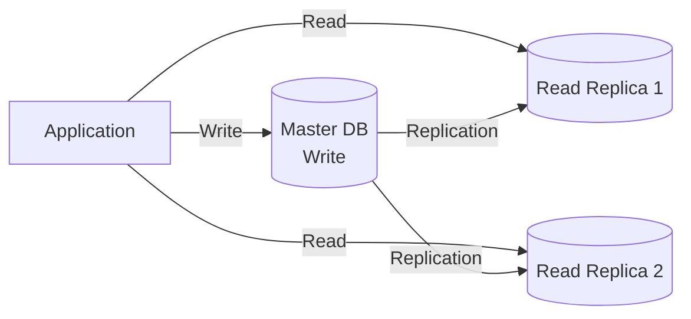

  

**샤딩 전략:**

- **User Sharding**: 사용자 ID 기반 샤딩

- **Time-based Sharding**: 거래 내역, 로그 데이터는 시간 기반 파티셔닝

  

### 3. 마이크로서비스 통신

  

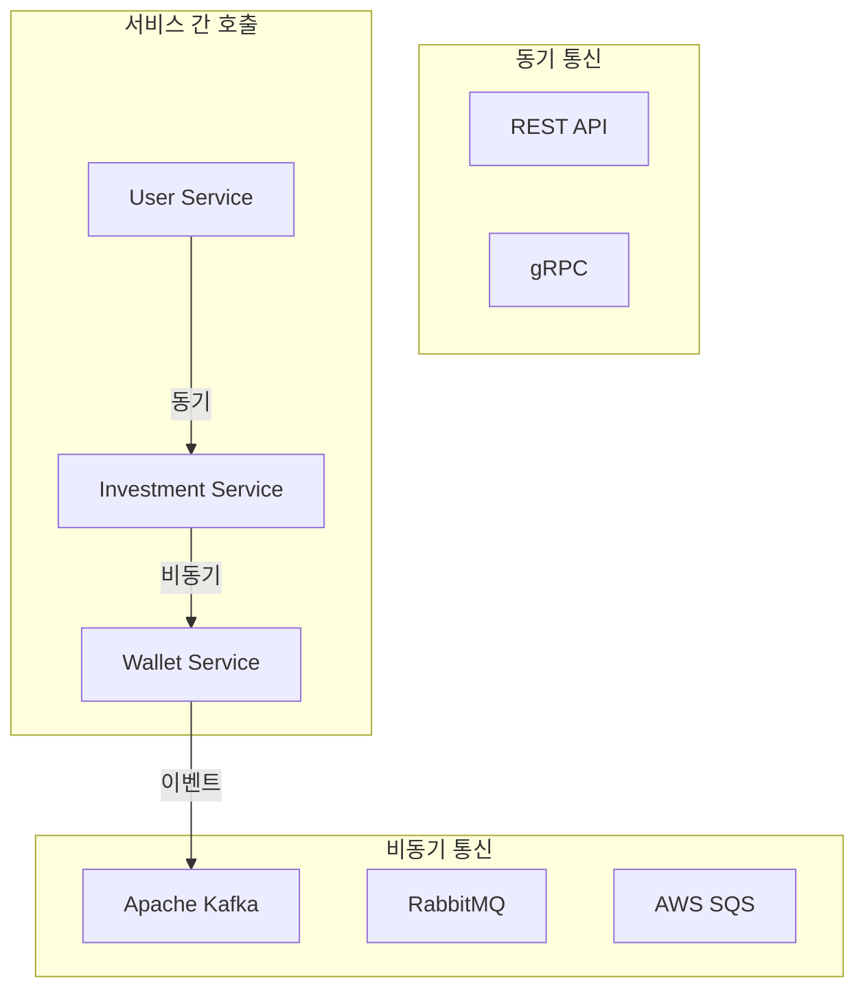

  

## 보안 아키텍처

  

### 1. 인증 및 권한 관리

  

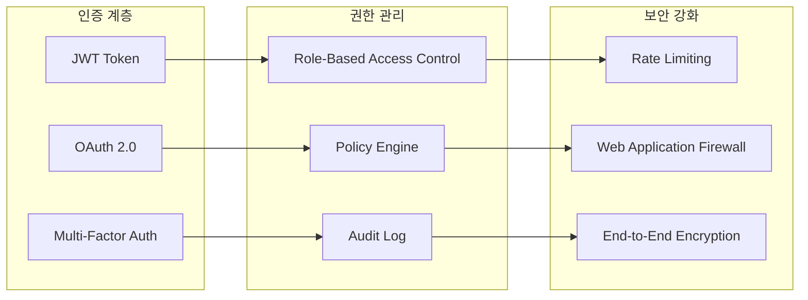

  

### 2. 데이터 보호

  

**암호화 전략:**

- **전송 중 데이터**: TLS 1.3

- **저장 데이터**: AES-256 암호화

- **민감 정보**: 개별 필드 레벨 암호화

  

**접근 제어:**

- **네트워크 레벨**: VPC, 보안 그룹

- **애플리케이션 레벨**: RBAC, 정책 기반 접근 제어

- **데이터베이스 레벨**: 행 단위 보안, 컬럼 마스킹

  

## 모니터링 및 관찰성

  

### 1. 모니터링 스택

  

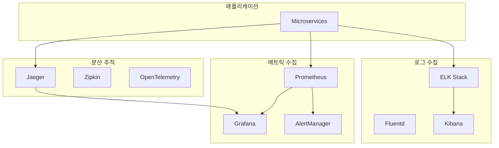

  

### 2. 핵심 모니터링 지표

  

**비즈니스 메트릭:**

- DAU (Daily Active Users)

- 투자 참여율

- 예측 정확도

- 경제 시스템 건전성

  

**기술 메트릭:**

- API 응답 시간

- 서비스 가용성

- 데이터베이스 성능

- 캐시 히트율

  

**알림 정책:**

- **Critical**: 즉시 알림 (SMS, Slack)

- **Warning**: 5분 내 알림 (이메일)

- **Info**: 일일 리포트

  

---

  

이 시스템 설계는 PosMul 플랫폼의 핵심 요구사항을 충족하며, 확장성과 안정성을 고려한 현대적인 마이크로서비스 아키텍처를 기반으로 합니다.