# 기술 아키텍처 설계 문서

## 시스템 아키텍처 개요

### 전체 시스템 구조

```mermaid
graph TB
    subgraph "Frontend Layer"
        WEB[Web Application<br/>Next.js 15 + TypeScript]
        MOBILE[모바일 최적화<br/>반응형 디자인]
        ADMIN[관리자 대시보드<br/>Admin Routes]
    end
    
    subgraph "API & Middleware Layer"
        MIDDLEWARE[Authentication Middleware<br/>Next.js Middleware]
        API[API Routes<br/>Next.js API Layer]
        AUTH_API[Auth API<br/>Supabase Auth]
    end
    
    subgraph "Business Logic Layer (DDD + Clean Architecture)"
        AUTH[Auth Domain<br/>사용자 인증 관리]
        ECONOMY[Economy Domain<br/>PMP/PMC 포인트 시스템]
        INVEST[Investment Domain<br/>Local League 투자]
        PREDICT[Prediction Domain<br/>예측 게임 시스템 ✅]
        DONATE[Donation Domain<br/>투명한 기부 플랫폼]
        FORUM[Forum Domain<br/>커뮤니티 토론]
    end
    
    subgraph "Data & Infrastructure Layer"
        SUPABASE[(Supabase<br/>PostgreSQL + Auth + Storage)]
        REALTIME[(Supabase Realtime<br/>WebSocket)]
        REDIS[(Redis Cache<br/>@upstash/redis)]
        TYPES[TypeScript Types<br/>자동 생성 시스템]
    end
    
    subgraph "Development & Automation Layer"
        MCP_TASK[Task Master MCP<br/>AI 작업 관리]
        MCP_SUPABASE[Supabase MCP<br/>DB 타입 자동화]
        MCP_DESKTOP[Desktop Commander MCP<br/>파일 자동화]
        MCP_CONTEXT[Context7 MCP<br/>문서 조사]
    end
    
    subgraph "External Services"
        MAPS[Maps API<br/>지역 투자 지도]
        AI[AI Services<br/>Perplexity/Google AI]
        PAYMENT[결제 API<br/>미래 확장]
        NEWS[실시간 데이터<br/>예측 시장용]
    end
    
    %% Frontend connections
    WEB --> MIDDLEWARE
    MOBILE --> MIDDLEWARE
    ADMIN --> MIDDLEWARE
    
    %% Middleware & API connections
    MIDDLEWARE --> AUTH_API
    MIDDLEWARE --> API
    API --> AUTH
    API --> ECONOMY
    API --> INVEST
    API --> PREDICT
    API --> DONATE
    API --> FORUM
    
    %% Domain Layer connections
    AUTH --> SUPABASE
    AUTH --> REALTIME
    ECONOMY --> SUPABASE
    ECONOMY --> REDIS
    INVEST --> SUPABASE
    INVEST --> MAPS
    PREDICT --> SUPABASE
    PREDICT --> REALTIME
    PREDICT --> NEWS
    DONATE --> SUPABASE
    FORUM --> SUPABASE
    
    %% MCP Automation connections
    MCP_SUPABASE --> TYPES
    MCP_DESKTOP --> TYPES
    MCP_CONTEXT --> AI
    MCP_TASK --> MCP_SUPABASE
    MCP_TASK --> MCP_DESKTOP
    
    %% Type system connections
    TYPES --> AUTH
    TYPES --> ECONOMY
    TYPES --> INVEST
    TYPES --> PREDICT
    TYPES --> DONATE
    TYPES --> FORUM
    
    %% External service connections
    INVEST --> MAPS
    PREDICT --> AI
    PREDICT --> NEWS
    
    %% Styling
    classDef completed fill:#a7f3d0,stroke:#059669,stroke-width:3px
    classDef inProgress fill:#fef3c7,stroke:#d97706,stroke-width:2px
    classDef planned fill:#e0e7ff,stroke:#4338ca,stroke-width:1px
    
    class PREDICT,MCP_TASK,MCP_SUPABASE,MCP_DESKTOP,MCP_CONTEXT,TYPES completed
    class WEB,MIDDLEWARE,AUTH,ECONOMY inProgress
    class INVEST,DONATE,FORUM,MOBILE,ADMIN planned
```




---

## 도메인별 아키텍처 설계

### 1. User Domain (사용자 도메인)

#### 1.1 Entity Design
```typescript
// Domain Entity
class User {
  private constructor(
    private readonly id: UserId,
    private profile: UserProfile,
    private wallet: UserWallet,
    private preferences: UserPreferences
  ) {}
  
  public updateProfile(profile: UserProfile): void {
    // 비즈니스 로직
  }
  
  public earnPoints(amount: PointAmount, source: PointSource): void {
    this.wallet.addPoints(amount, source);
  }
}

// Value Objects
class UserId {
  constructor(private readonly value: string) {
    if (!this.isValid(value)) throw new Error('Invalid User ID');
  }
}

class UserProfile {
  constructor(
    private readonly nickname: string,
    private readonly email: Email,
    private readonly avatar?: string
  ) {}
}
```

#### 1.2 Repository Pattern
```typescript
interface UserRepository {
  findById(id: UserId): Promise<User | null>;
  save(user: User): Promise<void>;
  findByEmail(email: Email): Promise<User | null>;
}

class PostgresUserRepository implements UserRepository {
  // 구현
}
```

### 2. Investment Domain (투자 도메인)

#### 2.1 Aggregate Design
```typescript
class Investment {
  private constructor(
    private readonly id: InvestmentId,
    private readonly userId: UserId,
    private type: InvestmentType,
    private amount: MoneyAmount,
    private status: InvestmentStatus,
    private rewards: InvestmentReward[]
  ) {}
  
  public calculateReward(): InvestmentReward {
    // 복잡한 보상 계산 로직
  }
}

enum InvestmentType {
  LOCAL_LEAGUE = 'local_league',
  MAJOR_LEAGUE = 'major_league',
  CLOUD_FUNDING = 'cloud_funding'
}
```

### 3. Prediction Domain (예측 도메인)

#### 3.1 Event Sourcing Pattern
```typescript
class PredictionEvent {
  constructor(
    public readonly id: string,
    public readonly aggregateId: string,
    public readonly eventType: string,
    public readonly eventData: any,
    public readonly timestamp: Date
  ) {}
}

class PredictionAggregate {
  private events: PredictionEvent[] = [];
  
  public applyEvent(event: PredictionEvent): void {
    this.events.push(event);
    this.apply(event);
  }
  
  private apply(event: PredictionEvent): void {
    switch (event.eventType) {
      case 'PredictionCreated':
        // 상태 변경
        break;
      case 'PredictionParticipated':
        // 상태 변경
        break;
    }
  }
}
```

---

## 데이터베이스 설계

### ERD (Entity Relationship Diagram)


---

## 스마트 컨트랙트 설계

### PMC 토큰 컨트랙트
```solidity
// SPDX-License-Identifier: MIT
pragma solidity ^0.8.19;

import "@openzeppelin/contracts/token/ERC20/ERC20.sol";
import "@openzeppelin/contracts/access/Ownable.sol";
import "@openzeppelin/contracts/security/Pausable.sol";

contract PMCToken is ERC20, Ownable, Pausable {
    uint256 public constant MAX_SUPPLY = 1000000000 * 10**18; // 10억 토큰
    uint256 public dailyMintAmount;
    uint256 public lastMintTimestamp;
    
    mapping(address => bool) public authorizedMinters;
    
    event DailyTokensMinted(uint256 amount, uint256 timestamp);
    event MinterAdded(address minter);
    event MinterRemoved(address minter);
    
    constructor(uint256 _dailyMintAmount) ERC20("PosMul Coins", "PMC") {
        dailyMintAmount = _dailyMintAmount;
        lastMintTimestamp = block.timestamp;
    }
    
    function dailyMint() external onlyOwner {
        require(
            block.timestamp >= lastMintTimestamp + 1 days,
            "Daily mint already executed"
        );
        require(
            totalSupply() + dailyMintAmount <= MAX_SUPPLY,
            "Exceeds maximum supply"
        );
        
        _mint(owner(), dailyMintAmount);
        lastMintTimestamp = block.timestamp;
        
        emit DailyTokensMinted(dailyMintAmount, block.timestamp);
    }
    
    function authorizedMint(address to, uint256 amount) external {
        require(authorizedMinters[msg.sender], "Not authorized minter");
        require(totalSupply() + amount <= MAX_SUPPLY, "Exceeds maximum supply");
        
        _mint(to, amount);
    }
}
```

### 예측 시장 컨트랙트
```solidity
contract PredictionMarket is Ownable, Pausable {
    struct Prediction {
        string question;
        string[] options;
        uint256 endTime;
        uint256 totalPool;
        uint8 winningOption;
        bool resolved;
        mapping(uint8 => uint256) optionPools;
        mapping(address => mapping(uint8 => uint256)) userBets;
    }
    
    mapping(uint256 => Prediction) public predictions;
    uint256 public nextPredictionId;
    
    IERC20 public pmcToken;
    
    event PredictionCreated(uint256 indexed predictionId, string question);
    event BetPlaced(uint256 indexed predictionId, address indexed user, uint8 option, uint256 amount);
    event PredictionResolved(uint256 indexed predictionId, uint8 winningOption);
    
    function createPrediction(
        string memory _question,
        string[] memory _options,
        uint256 _duration
    ) external onlyOwner returns (uint256) {
        uint256 predictionId = nextPredictionId++;
        Prediction storage pred = predictions[predictionId];
        
        pred.question = _question;
        pred.options = _options;
        pred.endTime = block.timestamp + _duration;
        
        emit PredictionCreated(predictionId, _question);
        return predictionId;
    }
    
    function placeBet(uint256 _predictionId, uint8 _option, uint256 _amount) external {
        Prediction storage pred = predictions[_predictionId];
        require(block.timestamp < pred.endTime, "Prediction ended");
        require(_option < pred.options.length, "Invalid option");
        
        pmcToken.transferFrom(msg.sender, address(this), _amount);
        
        pred.userBets[msg.sender][_option] += _amount;
        pred.optionPools[_option] += _amount;
        pred.totalPool += _amount;
        
        emit BetPlaced(_predictionId, msg.sender, _option, _amount);
    }
}
```

---

## API 설계

### RESTful API 구조
```typescript
// User API
GET    /api/v1/users/profile
PUT    /api/v1/users/profile
GET    /api/v1/users/wallet
POST   /api/v1/users/wallet/transfer

// Investment API
GET    /api/v1/investments
POST   /api/v1/investments/local-league
POST   /api/v1/investments/major-league
GET    /api/v1/investments/:id

// Prediction API
GET    /api/v1/predictions
POST   /api/v1/predictions
GET    /api/v1/predictions/:id
POST   /api/v1/predictions/:id/participate

// Donation API
GET    /api/v1/donations
POST   /api/v1/donations
GET    /api/v1/donations/:id

// Forum API
GET    /api/v1/forum/posts
POST   /api/v1/forum/posts
GET    /api/v1/forum/posts/:id
POST   /api/v1/forum/posts/:id/comments
```

### GraphQL Schema (선택적)
```graphql
type User {
  id: ID!
  nickname: String!
  email: String!
  profile: UserProfile!
  wallet: UserWallet!
  investments: [Investment!]!
  predictions: [PredictionParticipation!]!
}

type UserWallet {
  pmpBalance: BigInt!
  pmcBalance: BigInt!
  blockchainAddress: String
}

type Investment {
  id: ID!
  type: InvestmentType!
  amount: BigInt!
  status: InvestmentStatus!
  createdAt: DateTime!
}

enum InvestmentType {
  LOCAL_LEAGUE
  MAJOR_LEAGUE
  CLOUD_FUNDING
}
```

---

## 보안 아키텍처

### 1. 인증 및 권한 관리
```typescript
// JWT 토큰 구조
interface JWTPayload {
  sub: string; // 사용자 ID
  email: string;
  role: UserRole;
  iat: number;
  exp: number;
  permissions: Permission[];
}

// 권한 기반 미들웨어
class AuthorizationMiddleware {
  static requirePermission(permission: Permission) {
    return (req: AuthRequest, res: Response, next: NextFunction) => {
      if (!req.user?.permissions.includes(permission)) {
        throw new ForbiddenError('Insufficient permissions');
      }
      next();
    };
  }
}
```

### 2. 데이터 암호화
```typescript
class EncryptionService {
  private static readonly algorithm = 'aes-256-gcm';
  
  static encrypt(data: string): EncryptedData {
    const key = Buffer.from(process.env.ENCRYPTION_KEY!, 'hex');
    const iv = crypto.randomBytes(16);
    const cipher = crypto.createCipher(this.algorithm, key);
    
    // 암호화 로직
  }
  
  static decrypt(encryptedData: EncryptedData): string {
    // 복호화 로직
  }
}
```

### 3. Rate Limiting
```typescript
class RateLimitingService {
  static createLimiter(windowMs: number, max: number) {
    return rateLimit({
      windowMs,
      max,
      message: 'Too many requests from this IP',
      standardHeaders: true,
      legacyHeaders: false,
    });
  }
}

// 사용 예시
app.use('/api/v1/predictions', RateLimitingService.createLimiter(60000, 10));
```

---

## 성능 최적화

### 1. 캐싱 전략
```typescript
class CacheService {
  private redis: Redis;
  
  async get<T>(key: string): Promise<T | null> {
    const cached = await this.redis.get(key);
    return cached ? JSON.parse(cached) : null;
  }
  
  async set(key: string, value: any, ttl: number): Promise<void> {
    await this.redis.setex(key, ttl, JSON.stringify(value));
  }
  
  async invalidate(pattern: string): Promise<void> {
    const keys = await this.redis.keys(pattern);
    if (keys.length > 0) {
      await this.redis.del(...keys);
    }
  }
}
```

### 2. 데이터베이스 최적화
```sql
-- 인덱스 최적화
CREATE INDEX CONCURRENTLY idx_investments_user_type 
ON investments(user_id, type);

CREATE INDEX CONCURRENTLY idx_predictions_status_endtime 
ON predictions(status, end_time);

-- 파티셔닝 (대용량 데이터)
CREATE TABLE prediction_participations_2024 
PARTITION OF prediction_participations 
FOR VALUES FROM ('2024-01-01') TO ('2025-01-01');
```

### 3. CDN 및 정적 자산 최적화
```typescript
// Next.js 설정
const nextConfig = {
  images: {
    domains: ['cdn.posmul.com'],
    formats: ['image/webp', 'image/avif'],
  },
  compress: true,
  poweredByHeader: false,
  generateEtags: false,
  httpAgentOptions: {
    keepAlive: true,
  },
};
```

---

## 모니터링 및 로깅

### 1. 로깅 구조
```typescript
class Logger {
  private winston: winston.Logger;
  
  info(message: string, meta?: any): void {
    this.winston.info(message, {
      timestamp: new Date().toISOString(),
      service: 'posmul-api',
      ...meta
    });
  }
  
  error(message: string, error?: Error, meta?: any): void {
    this.winston.error(message, {
      timestamp: new Date().toISOString(),
      service: 'posmul-api',
      error: error?.stack,
      ...meta
    });
  }
}
```

### 2. 메트릭 수집
```typescript
class MetricsService {
  private prometheus = require('prom-client');
  
  private counters = {
    httpRequests: new this.prometheus.Counter({
      name: 'http_requests_total',
      help: 'Total number of HTTP requests',
      labelNames: ['method', 'route', 'status']
    }),
    
    predictionParticipations: new this.prometheus.Counter({
      name: 'prediction_participations_total',
      help: 'Total number of prediction participations'
    })
  };
  
  incrementHttpRequests(method: string, route: string, status: number): void {
    this.counters.httpRequests.inc({ method, route, status });
  }
}
```

---

## 배포 및 인프라

### Docker 설정
```dockerfile
# Dockerfile
FROM node:18-alpine AS builder

WORKDIR /app
COPY package*.json ./
RUN npm ci --only=production

COPY . .
RUN npm run build

FROM node:18-alpine AS runner
WORKDIR /app

COPY --from=builder /app/node_modules ./node_modules
COPY --from=builder /app/dist ./dist
COPY --from=builder /app/package.json ./package.json

EXPOSE 3000
CMD ["npm", "start"]
```

### Kubernetes 배포
```yaml
# deployment.yaml
apiVersion: apps/v1
kind: Deployment
metadata:
  name: posmul-api
spec:
  replicas: 3
  selector:
    matchLabels:
      app: posmul-api
  template:
    metadata:
      labels:
        app: posmul-api
    spec:
      containers:
      - name: api
        image: posmul/api:latest
        ports:
        - containerPort: 3000
        env:
        - name: DATABASE_URL
          valueFrom:
            secretKeyRef:
              name: posmul-secrets
              key: database-url
        - name: REDIS_URL
          valueFrom:
            secretKeyRef:
              name: posmul-secrets
              key: redis-url
```

---

이 기술 아키텍처 문서는 프로젝트의 **기술적 기반**을 제공하며, 각 버전별로 점진적으로 구현해나갈 수 있는 **확장 가능한 구조**를 제시합니다. 

다음 단계로 어떤 부분의 **상세 설계**나 **구현 코드**를 작성해드릴까요? 🚀
