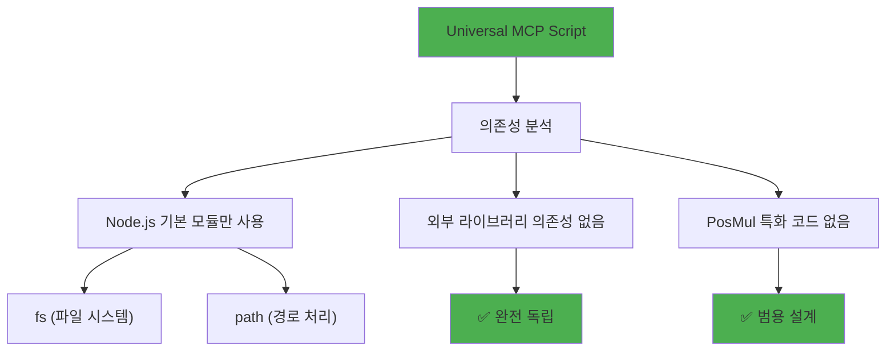

```mermaid
graph TD
    A["Universal MCP Script"] --> B["의존성 분석"]
    B --> C["Node.js 기본 모듈만 사용"]
    B --> D["외부 라이브러리 의존성 없음"]
    B --> E["PosMul 특화 코드 없음"]

    C --> C1["fs (파일 시스템)"]
    C --> C2["path (경로 처리)"]
    D --> D1["✅ 완전 독립"]
    E --> E1["✅ 범용 설계"]

    style A fill:#4CAF50
    style D1 fill:#4CAF50
    style E1 fill:#4CAF50


```

```mermaid
graph TD
    A["Universal MCP Script"] --> B["의존성 분석"]
    B --> C["Node.js 기본 모듈만 사용"]
    B --> D["외부 라이브러리 의존성 없음"]
    B --> E["PosMul 특화 코드 없음"]

    C --> C1["fs (파일 시스템)"]
    C --> C2["path (경로 처리)"]
    D --> D1["✅ 완전 독립"]
    E --> E1["✅ 범용 설계"]

    style A fill:#4CAF50
    style D1 fill:#4CAF50
    style E1 fill:#4CAF50


```
