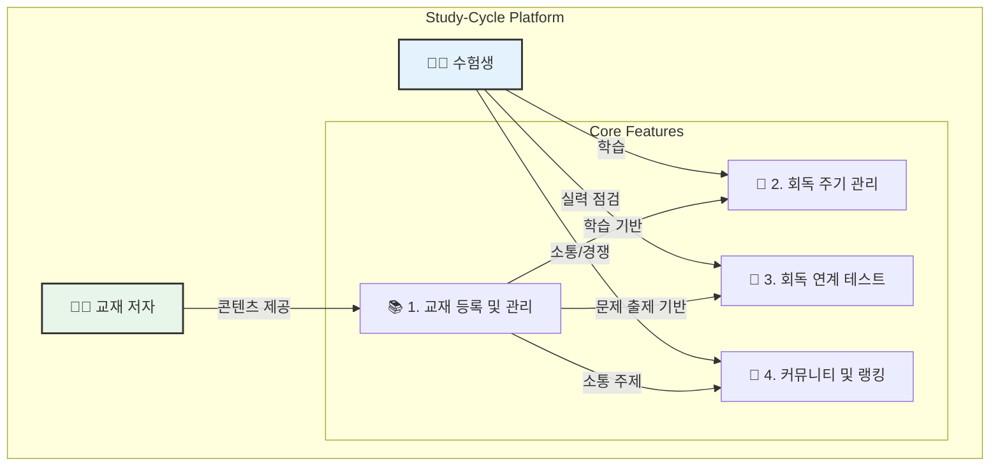
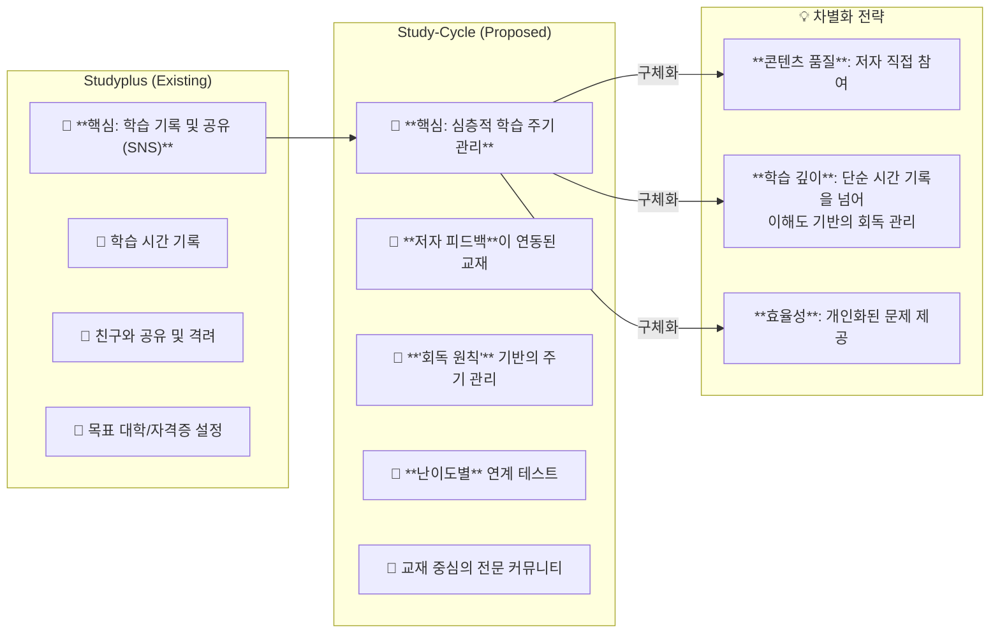
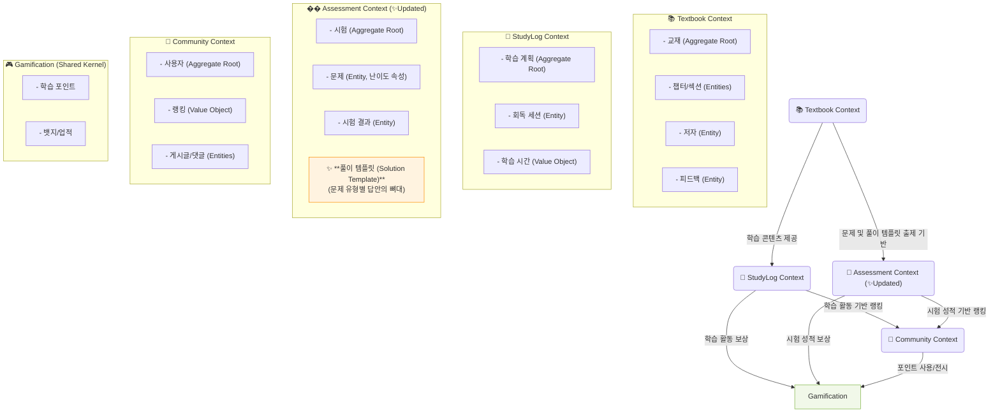
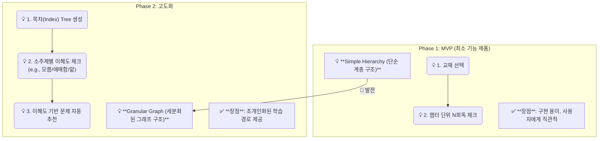
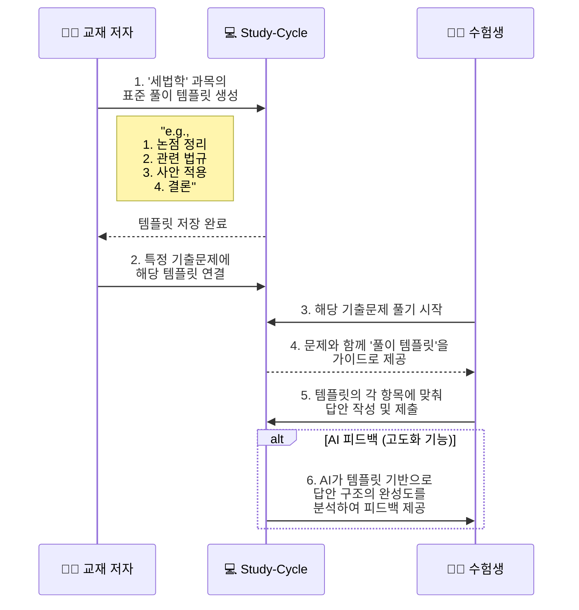
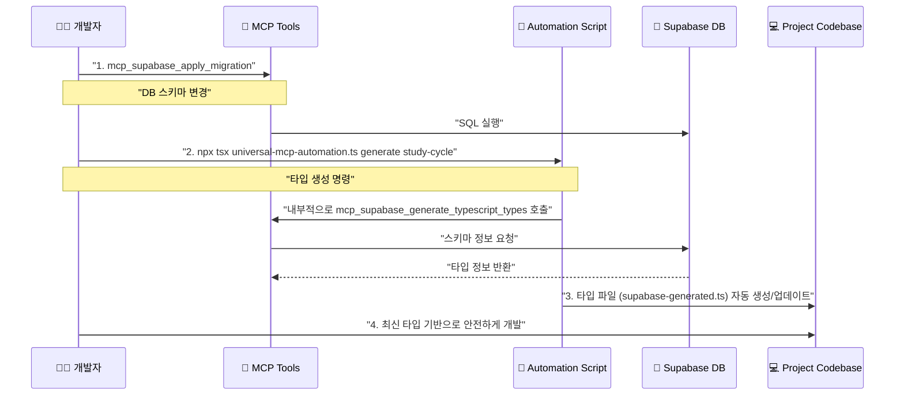
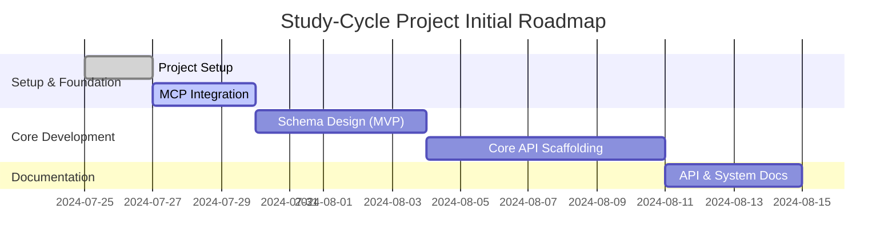

# "Study-Cycle" 신규 프로젝트 제안 및 MCP 자동화 전략

> **문서 유형**: 분석 보고서 (Analysis Report)  
> **작성 일시**: 2025-06-25  
> **작성자**: AI Assistant
> **목표**: CPA/CTA 수험생을 위한 학습 플랫폼 "Study-Cycle"의 초기 기획안을 수립하고, Universal MCP Tool을 활용한 개발 전략을 제안합니다.

---

## 📑 목차

- ["Study-Cycle" 신규 프로젝트 제안 및 MCP 자동화 전략](#study-cycle-신규-프로젝트-제안-및-mcp-자동화-전략)
  - [📑 목차](#-목차)
  - [1. 프로젝트 비전 및 핵심 기능](#1-프로젝트-비전-및-핵심-기능)
  - [2. 벤치마크 분석: Studyplus](#2-벤치마크-분석-studyplus)
  - [3. 제안 아키텍처 (DDD)](#3-제안-아키텍처-ddd)
  - [4. 핵심 개념 정의 (Core Concepts)](#4-핵심-개념-정의-core-concepts)
    - [4.1. 회독 원칙 (Hoedok Principle)](#41-회독-원칙-hoedok-principle)
    - [4.2. 풀이 템플릿 엔진 (Solution Template Engine)](#42-풀이-템플릿-엔진-solution-template-engine)
  - [5. Universal MCP 자동화 전략](#5-universal-mcp-자동화-전략)
    - [5.1. 설정 추가](#51-설정-추가)
    - [5.2. 자동화 워크플로우](#52-자동화-워크플로우)
  - [6. 초기 실행 계획 (Action Plan)](#6-초기-실행-계획-action-plan)

---

## 1. 프로젝트 비전 및 핵심 기능

"Study-Cycle"은 CPA, CTA 등 전문직 수험생의 학습 효율을 극대화하는 것을 목표로 하는 지능형 학습 관리 플랫폼입니다. 사용자가 제안한 핵심 기능은 다음과 같습니다.



---

## 2. 벤치마크 분석: Studyplus

일본의 성공적인 학습 SNS "Studyplus"를 분석하여 우리 프로젝트의 차별화 포인트를 도출합니다.



**분석 결과**: "Studyplus"가 학습의 '지속성'에 초점을 맞춘다면, "Study-Cycle"은 학습의 **'깊이'와 '효율성'** 에 초점을 맞춰 명확한 차별화를 꾀할 수 있습니다.

---

## 3. 제안 아키텍처 (DDD)

PosMul 프로젝트 경험을 바탕으로, DDD(도메인 주도 설계)와 클린 아키텍처를 적용하여 복잡성에 대응합니다.


**Shared Kernel**: 모든 도메인에서 일관된 사용자 경험을 제공하기 위해 `Gamification`을 공유 커널로 설계하여 포인트, 뱃지 등 게임화 요소를 통합 관리합니다.

**✨ 신규 추가**: `Assessment Context`에 **풀이 템플릿(Solution Template)** 개념을 도입합니다. 이는 저자가 문제 유형별 '모범 답안 구조'를 정의하고, 학생들은 이 템플릿에 맞춰 문제 풀이 훈련을 할 수 있게 하는 핵심 기능입니다.

---

## 4. 핵심 개념 정의 (Core Concepts)

### 4.1. 회독 원칙 (Hoedok Principle)

"회독(Hoedok)" 관리 방식은 서비스의 핵심 정체성입니다. 점진적인 발전 계획을 제안합니다.


**Index Depth Principle**: 초기에는 `교재 > 챕터 > 섹션`의 3-Depth를 기준으로 회독 수를 관리하고, 향후 주제별 이해도를 추적하는 방식으로 발전시키는 것을 추천합니다.

### 4.2. 풀이 템플릿 엔진 (Solution Template Engine)

세법학과 같이 정형화된 풀이법이 중요한 과목의 학습 효율을 극대화하기 위한 기능입니다.


**작동 방식**: 저자가 과목별 '모범 답안의 뼈대'를 템플릿으로 만들면, 학생들은 문제 풀이 시 해당 템플릿을 가이드 삼아 구조적인 사고와 답안 작성 능력을 기를 수 있습니다. 이는 단순 암기를 넘어선 **메타인지적 학습**을 유도합니다.

---

## 5. Universal MCP 자동화 전략

기존 `posmul` 프로젝트에서 검증된 `universal-mcp-automation.ts`를 활용하여 "Study-Cycle" 프로젝트의 타입 안전성과 개발 생산성을 극대화합니다.

### 5.1. 설정 추가

`mcp-automation/universal-mcp-automation.ts` 파일의 `PRESET_CONFIGS`에 `study-cycle` 설정을 추가합니다.

```typescript
// ... in PRESET_CONFIGS
"study-cycle": {
  projectId: "your-study-cycle-project-id", // Supabase 프로젝트 생성 후 확정
  projectName: "Study-Cycle 학습 플랫폼",
  outputPath: "src/shared/types/supabase-generated.ts",
  rootPath: "C:/G/study-cycle", // 새 프로젝트 경로
  domains: [
    "textbook", "study_log", "assessment", 
    "community", "gamification", "user"
  ],
},
```

### 5.2. 자동화 워크플로우

이 설정을 통해 아래와 같은 개발 워크플로우를 구축합니다.



---

## 6. 초기 실행 계획 (Action Plan)

프로젝트의 성공적인 시작을 위해 다음 4단계 실행 계획을 제안합니다.



| 단계 | 작업 내용 | 예상 기간 | 결과물 |
| :--- | :--- | :--- | :--- |
| **1. Project Setup** | - `C:\G\study-cycle` 디렉토리 생성<br>- GitHub 리포지토리 생성<br>- Supabase 프로젝트 생성 | 2일 | - 버전 관리 시스템<br>- 클라우드 DB 환경 |
| **2. MCP Integration** | - `universal-mcp-automation.ts`에 신규 설정 추가<br>- `projectId` 확정 및 반영 | 3일 | - 타입 자동화 워크플로우 |
| **3. Schema Design** | - `Textbook`, `User` 중심의 초기 스키마 설계<br>- `mcp_supabase_apply_migration`으로 첫 마이그레이션 | 5일 | - DB 테이블 및 관계 정의 |
| **4. API Scaffolding** | - `Textbook` 등록/조회 API 뼈대 구현<br>- 생성된 타입 활용 | 7일 | - 핵심 기능의 기본 API |

---

이 제안서를 바탕으로 프로젝트의 방향성을 확정하고, 다음 단계인 "Project Setup"을 시작하는 것을 권장합니다. 