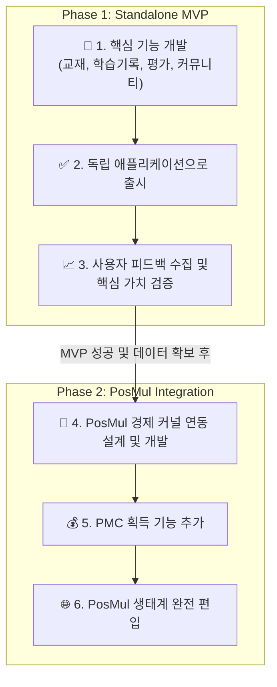
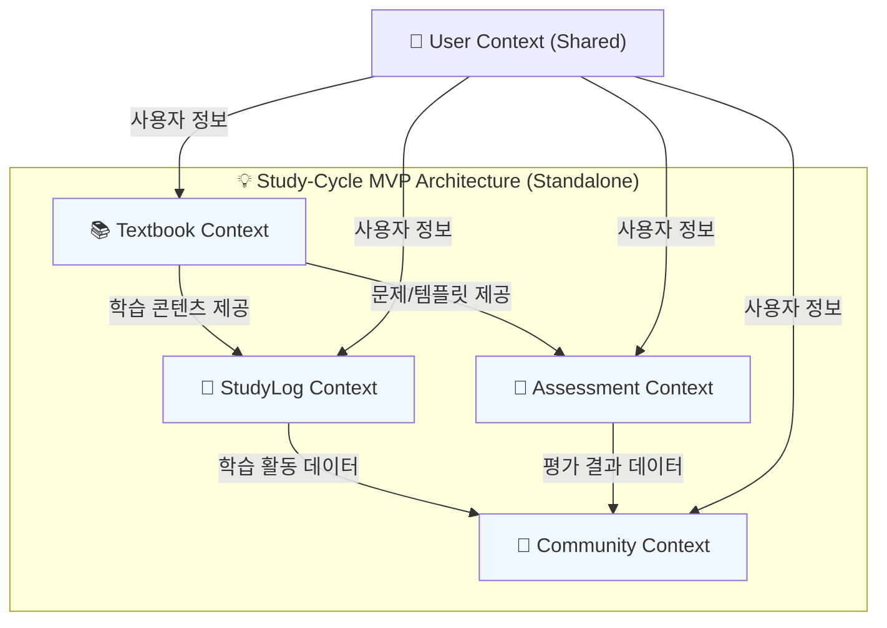
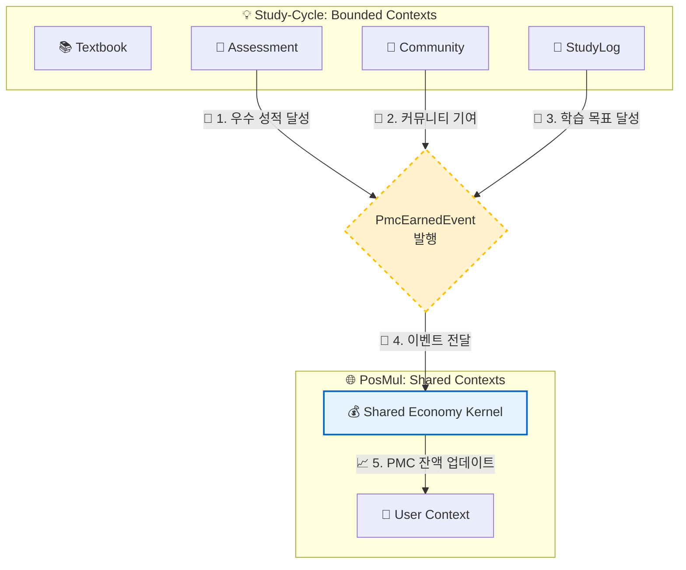

# Study-Cycle: MVP 및 PosMul 플랫폼 통합 로드맵

**문서 버전**: 1.0
**작성일**: 2025-06-24
**작성자**: PosMul Agent

## 1. 개요

이 문서는 'Study-Cycle' 프로젝트의 단계별 개발 및 확장 전략을 정의합니다. 우리는 다음의 두 가지 핵심 단계를 통해 프로젝트를 성공적으로 이끌 것입니다.

1.  **Phase 1: Standalone MVP**: 핵심 학습 기능에 집중한 독립적인 애플리케이션으로 빠르게 시장에 출시하여 사용자 기반을 확보하고 제품의 핵심 가치를 검증합니다.
2.  **Phase 2: PosMul Platform Integration**: 검증된 MVP를 PosMul 경제 생태계에 통합하여, 학습 활동을 통해 PMC(PosMul Coin)를 획득할 수 있는 강력한 시너지를 창출합니다.

이러한 단계적 접근은 초기 개발의 복잡성을 줄이고, 시장의 피드백을 바탕으로 안정적으로 플랫폼을 확장할 수 있게 합니다.

### 📊 단계별 추진 전략

## 2. Phase 1: Standalone MVP

### 2.1. 목표

-   CPA/CTA 수험생을 위한 핵심 학습 기능(교재, 회독, 풀이 템플릿)의 시장성을 검증합니다.
-   초기 사용자 기반을 확보하고, 실제 사용 데이터를 통해 개선점을 도출합니다.
-   PosMul 경제 시스템과의 연동 없이, `Study-Cycle` 자체의 독립적인 가치를 증명합니다.

### 2.2. 핵심 기능 범위

-   **Textbook Context**: 교재 등록, 목차 관리, 문제 및 '풀이 템플릿' 제공
-   **StudyLog Context**: 학습 시간, 회독 수, 진도율 등 학습 활동 기록
-   **Assessment Context**: '풀이 템플릿'을 활용한 모의고사 및 자동 채점 기능
-   **Community Context**: 학습 기록 기반의 익명 랭킹, 스터디 그룹 게시판

### 2.3. Phase 1 아키텍처

이 단계에서는 경제 시스템을 제외한 Bounded Context 간의 관계에 집중합니다. 모든 컨텍스트는 PosMul의 공유 `User Context`를 활용하여 사용자 정보를 관리합니다.

## 3. Phase 2: PosMul Platform Integration

### 3.1. 목표

-   `Study-Cycle`을 PosMul 경제 생태계의 핵심적인 **PMC 획득처**로 포지셔닝합니다.
-   학습 동기에 강력한 경제적 인센티브를 부여하여 사용자 참여를 극대화합니다.
-   PosMul 플랫폼의 다른 서비스(예: Prediction, Investment)와의 시너지를 창출합니다.

### 3.2. 연동 메커니즘: 도메인 이벤트

DDD와 클린 아키텍처 원칙에 따라, `Study-Cycle`은 PosMul의 **공유 경제 커널(Shared Economy Kernel)**과 직접적인 결합을 피하고, **도메인 이벤트(Domain Events)**를 통해 느슨하게 연결됩니다.

#### 📝 PMC 획득 시나리오
1.  **정의된 활동 완료**: 사용자가 `Study-Cycle` 내에서 PMC 획득 조건(예: 모의고사 상위 10% 달성)을 충족합니다.
2.  **도메인 이벤트 발행**: `Assessment Context`는 `PmcEarnedEvent`를 발행합니다. 이 이벤트에는 사용자 ID, 획득량, 사유 등의 정보가 포함됩니다.
3.  **경제 시스템 처리**: PosMul의 `Economy Context`가 이 이벤트를 수신하여, **Shared Economy Kernel**을 통해 해당 사용자의 PMC 잔액을 안전하게 업데이트합니다.

### 3.3. Phase 2 아키텍처

Phase 1 아키텍처에 `Shared Economy Kernel`이 추가되고, 각 Bounded Context가 도메인 이벤트를 발행하는 구조로 확장됩니다.

## 4. 결론

이러한 단계적 로드맵을 통해 우리는 `Study-Cycle` 프로젝트의 위험을 최소화하고 성공 가능성을 극대화할 수 있습니다. Phase 1에서는 제품의 핵심 가치를 증명하는 데 집중하고, Phase 2에서는 이를 PosMul의 거대한 비전과 결합하여 강력한 시너지를 만들어낼 것입니다. 