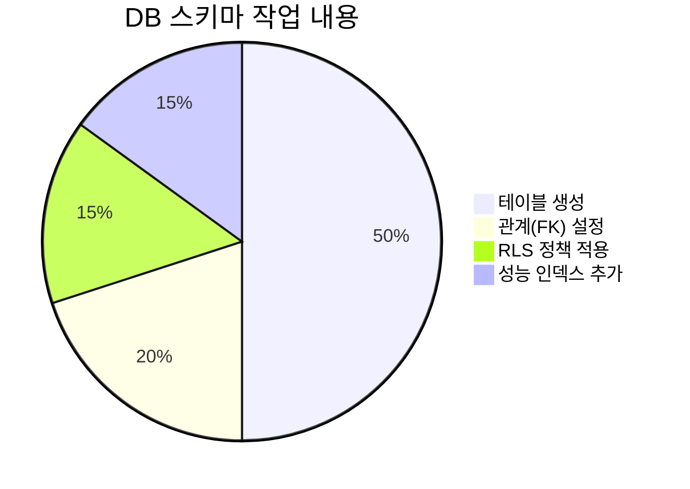
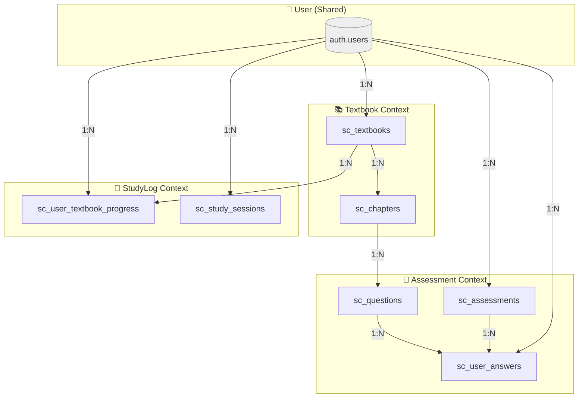

# 완료 보고서: Study-Cycle 환경 설정 2단계 - DB 스키마 정의

**문서 ID**: `SC-REPORT-002`
**작성일**: 2025-06-25
**작업 단계**: 환경 설정 2/4
**상태**: ✅ 완료

---

## 1. 작업 개요

`Study-Cycle` 신규 프로젝트의 초기 환경 설정 2단계인 **데이터베이스 스키마 정의** 작업을 성공적으로 완료했습니다. MVP의 핵심 기능(교재, 학습 기록, 평가)을 지원하기 위한 테이블, 관계, 보안 정책, 인덱스를 설계하고, `mcp_supabase_apply_migration` 도구를 통해 실제 데이터베이스에 적용했습니다.

### 📊 작업 요약 차트

## 2. 실행 내용

### 2.1. 마이그레이션 실행
- **프로젝트 ID**: `fabyagohqqnusmnwekuc`
- **마이그레이션 이름**: `create_study_cycle_mvp_schema`
- **실행 도구**: `mcp_supabase_apply_migration`
- **결과**: **성공**

### 2.2. 생성된 테이블 목록

| 테이블명 | 소속 Context | 설명 |
| :--- | :--- | :--- |
| `sc_textbooks` | 📚 Textbook | 교재 정보 |
| `sc_chapters` | 📚 Textbook | 챕터(목차) 정보 |
| `sc_questions` | 📝 Assessment | 문제 및 풀이 템플릿 |
| `sc_assessments` | 📝 Assessment | 사용자 시험지 정보 |
| `sc_user_answers` | 📝 Assessment | 사용자 답안 |
| `sc_user_textbook_progress` | 🔄 StudyLog | 교재 학습 진행률 |
| `sc_study_sessions` | 🔄 StudyLog | 개별 학습 세션 기록 |

### 2.3. 최종 ERD (Entity-Relationship Diagram)

이번에 적용된 최종 스키마의 관계도는 다음과 같습니다.

## 3. 기대 효과

- **견고한 데이터 기반**: MVP 기능 구현에 필요한 모든 데이터 구조가 마련되었습니다.
- **데이터 무결성 확보**: Foreign Key 제약 조건을 통해 테이블 간의 데이터 일관성을 유지합니다.
- **강화된 보안**: 각 테이블에 Row Level Security(RLS) 정책을 적용하여, 사용자는 자신의 데이터에만 접근할 수 있도록 제한했습니다.
- **성능 최적화**: 주요 조회 경로에 인덱스를 생성하여 향후 데이터가 증가하더라도 빠른 성능을 유지할 수 있는 기반을 마련했습니다.

## 4. 다음 단계

- **환경 설정 3단계**: GitHub 이슈를 통한 작업 관리 설정
- 관련 내용은 `env-setup-task-list.md`에서 계속 추적됩니다. 