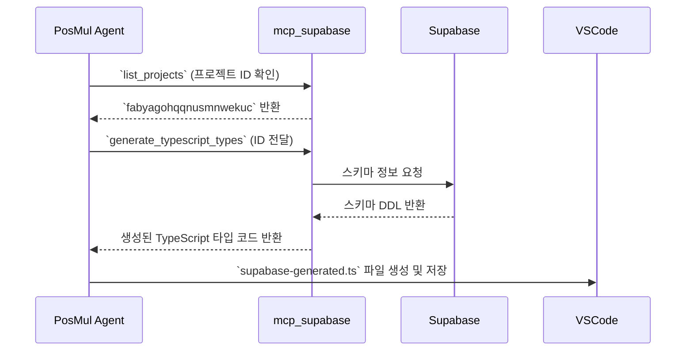

## 1. 개요 (Overview)

`Study-Cycle` Bounded Context의 초기 환경 설정 마지막 4단계, **DB 스키마 기반 타입스크립트 타입 생성**이 성공적으로 완료되었습니다. `mcp_supabase_generate_typescript_types` 도구를 사용하여 Supabase 데이터베이스 스키마로부터 TypeScript 타입을 자동으로 생성하고, 이를 `posmul/src/shared/types/supabase-generated.ts` 파일에 저장했습니다.

### 📊 전체 환경 설정 워크플로우

## 2. 작업 상세 내용 (Task Details)

`mcp_supabase_generate_typescript_types` 도구를 사용하여 Supabase 프로젝트(`fabyagohqqnusmnwekuc`)의 `public` 스키마에 정의된 모든 테이블, 함수, Enum 정보를 바탕으로 TypeScript 타입을 생성했습니다.

### ✅ 생성된 타입 파일 정보

- **파일 경로**: `posmul/src/shared/types/supabase-generated.ts`
- **주요 내용**:
    - `Database` 인터페이스 정의
    - 각 테이블(`sc_assessments`, `sc_textbooks` 등)의 `Row`, `Insert`, `Update` 타입
    - 프로젝트에 정의된 `Functions` 및 `Enums` 타입
    - 타입 안전성을 보장하기 위한 헬퍼 타입 (`Tables`, `TablesInsert` 등)

### 🔗 관련 링크
- **최종 작업 목록**: [001-env-setup-task-list.md](../task-reports/001-env-setup-task-list.md)
- **생성된 타입 파일**: `posmul/src/shared/types/supabase-generated.ts`

## 3. 사용된 MCP 도구 (MCP Tools Used)

이번 단계에서는 아래의 `mcp_supabase` 도구들을 순차적으로 활용했습니다.

### 🛠️ 도구 사용 워크플로우

- **`mcp_supabase_list_projects`**: 타입 생성을 위해 필요한 정확한 Supabase 프로젝트 ID를 확인하는 데 사용되었습니다.
- **`mcp_supabase_generate_typescript_types`**: 데이터베이스 스키마를 읽어와 TypeScript 타입 정의를 자동으로 생성하는 핵심적인 역할을 수행했습니다.

## 4. 결과 및 다음 단계 (Result and Next Steps)

### ✅ 결과
- **타입 안전성 확보**: 백엔드 데이터베이스 스키마와 프론트엔드/백엔드 코드 간의 데이터 모델이 일치하게 되어, 개발 중 발생할 수 있는 타입 관련 오류를 원천적으로 방지할 수 있게 되었습니다.
- **개발 생산성 향상**: 자동 완성(IntelliSense) 및 컴파일 타임 에러 체크를 통해 개발 속도와 코드 품질이 향상됩니다.
- **환경 설정 완료**: `Study-Cycle` 프로젝트의 모든 초기 환경 설정이 성공적으로 마무리되었습니다.

### ➡️ 다음 단계: MVP 기능 개발 시작
이제 모든 준비가 완료되었으므로, 3단계에서 생성한 **GitHub 이슈**들을 기반으로 본격적인 `Study-Cycle` MVP 기능 개발을 시작합니다.
- **시작점**: GitHub 저장소의 [Study-Cycle 이슈 목록](https://github.com/positivemultiplier/posmul/issues?q=is%3Aissue+is%3Aopen+label%3Astudy-cycle)
- **첫 번째 작업(예상)**: `[SC-Feat] 📚 Textbook Context - 교재 CRUD API 구현` (이슈 #3) 